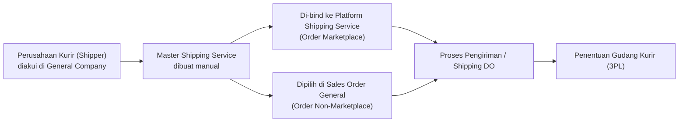
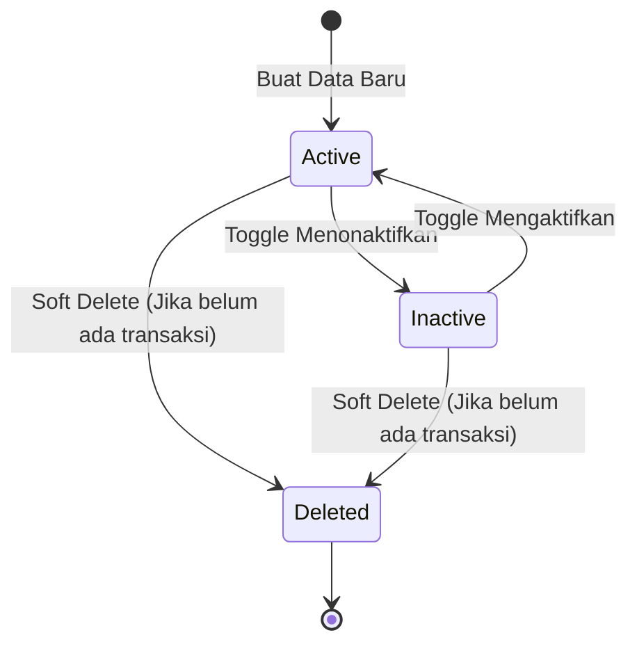
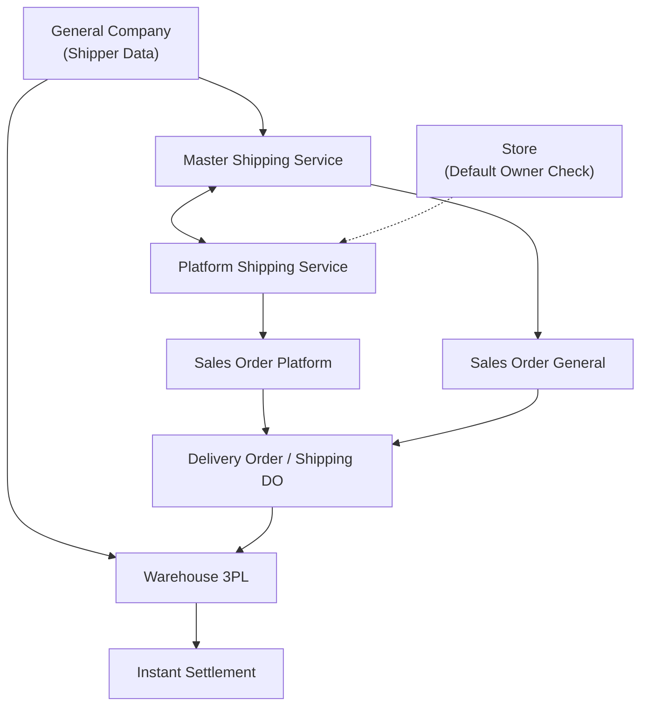

### 📦 Modul/Fitur: Master Shipping Service

**Definisi Bisnis:**
**Master Shipping Service** adalah katalog standar jasa pengiriman internal perusahaan yang dikelola secara manual oleh pengguna (bukan hasil sinkronisasi otomatis). Menu ini berfungsi sebagai acuan tunggal internal untuk menentukan perusahaan kurir (**Shipper**), jenis layanan, serta gudang kurir (**Warehouse 3PL**) yang menangani pengiriman barang.
Berbeda dengan **Platform Shipping Service** yang bersifat katalog *read-only* hasil impor otomatis dari marketplace, **Master Shipping Service** dikelola secara penuh oleh internal perusahaan. Menu ini digunakan oleh tim **Omni Channel**, **Warehouse**, dan **Finance** untuk menyambungkan (*binding*) jasa kirim marketplace ke standar internal, atau langsung dipilih sebagai opsi pengiriman pada transaksi penjualan non-marketplace (**Sales Order General**).

### 🔑 Istilah Kunci

| Istilah | Definisi Operasional |
| :---- | :---- |
| **Master Shipping Service** | Standar internal jasa pengiriman yang dibuat dan dikelola secara manual di OlshopERP. |
| **Shipper** | Perusahaan penyedia jasa kurir / logistik (merupakan data **General Company** yang telah diakui dan diaktifkan peran shipper-nya). |
| **Warehouse 3PL** | *Third-Party Logistics Warehouse*; gudang operasional milik kurir tempat barang ditampung sebelum diproses ke penerima. |
| **Binding** | Pemetaan atau penyambungan satu/beberapa baris **Platform Shipping Service** (marketplace) ke satu **Master Shipping Service** (internal). |
| **Default Shipping Service** | Jasa kirim bawaan yang otomatis terpilih saat pembuatan order untuk pertama kalinya. |
| **Show for all company** | Pengaturan visibilitas data agar dapat dilihat oleh anak perusahaan/entitas lain, namun tidak dapat diubah oleh entitas tersebut. |
| **Not Binded / Binded** | Indikator status apakah suatu jasa kirim marketplace belum / sudah terhubung ke Master Shipping Service. |

### 🎯 Kapan & Kenapa Dipakai

Menu ini digunakan dalam kondisi operasional berikut:

* **Penyiapan Jasa Kirim Baru:** Saat perusahaan mulai bekerja sama dengan ekspedisi/kurir baru dan perlu mendaftarkan layanannya ke sistem.
* **Integrasi Marketplace:** Saat menghubungkan (*binding*) jasa kirim baru dari toko marketplace agar pesanan masuk dapat dikenali oleh sistem internal.
* **Operasional Sales Order General:** Menyediakan pilihan opsi kurir resmi untuk pesanan manual / non-marketplace.
* **Troubleshooting Pengiriman:** Menganalisis dan memperbaiki masalah pesanan yang gagal diproses akibat ketidaksesuaian gudang 3PL atau pemetaan kurir.

### 📋 Prasyarat

| Prasyarat | Sumber / Referensi | Catatan Khusus |
| :---- | :---- | :---- |
| Perusahaan kurir (**Shipper**) terdaftar dan aktif | **General Company** | Pengakuan entitas sebagai shipper biasanya secara otomatis membuat gudang 3PL terkait. |
| Gudang kurir (**Warehouse 3PL**) tersedia | **General Company** / **Warehouse 3PL** | Tidak divalidasi saat menyimpan Master; baru diperiksa saat persetujuan pengiriman (Shipping DO). |
| Jenis layanan (*Pick Up* / *Drop Off*) ditentukan | - | Hanya boleh memilih satu tipe layanan dan **terkunci** setelah data disimpan. |
| Perusahaan merupakan *Default Data Owner* toko | **Store** | **Wajib** terpenuhi sebelum proses *Binding* dapat dilakukan. |

### 🔄 Posisi dalam Alur Bisnis

Diagram berikut menggambarkan kedudukan **Master Shipping Service** dalam alur operasional pengiriman barang di OlshopERP:

**Keterangan langkah:**

> 1. Perusahaan kurir diakui dan diaktifkan perannya sebagai **Shipper** pada master **General Company**.
> 2. Pengguna membuat data **Master Shipping Service** baru sesuai jenis layanan kurir.
> 3. Master dihubungkan (*binding*) ke jasa kirim marketplace, **atau** dipilih langsung saat membuat **Sales Order General**.
> 4. Saat transaksi diproses ke tahap **Delivery Order / Shipping DO**, sistem membaca data Master untuk mengarahkan alokasi barang ke **Warehouse 3PL**.

### 📍 Lokasi Menu & Workspace

Akses menu dapat dilakukan melalui navigasi berikut:

* **Navigasi:** OmniChannel → Settings → Master Shipping Service
* **Route UI:** /omni/shipping-service

🖼️ **[PLACEHOLDER GAMBAR]** — Halaman daftar Master Shipping Service, dikelompokkan per Shipper, dengan ikon peringatan pada baris tertentu.

### 🏷️ Siklus Status

Perubahan status **Master Shipping Service** digambarkan melalui diagram status berikut:

#### Tabel Rincian Status

| Status | Dapat Diedit? | Deskripsi & Perilaku Sistem |
| :---- | :---- | :---- |
| **Active** | Ya | Data aktif dan dapat digunakan untuk *binding* maupun transaksi baru. |
| **Inactive** | Ya | Data dinonaktifkan dari operasional dasar. |
| **Deleted** | Tidak | Data dihapus secara lunak (*soft delete*) dari sistem. |

⚠️ **WARNING: STATUS INACTIVE** Sistem saat ini **tidak memblokir** tindakan penonaktifkan Master yang masih terikat pada pesanan aktif, dan hubungan *binding* **tidak otomatis dibersihkan**. Menonaktifkan Master tanpa pengecekan dapat menyebabkan informasi jasa kirim pada pesanan menjadi kosong atau gagal pada tahap pengemasan.

### ⚙️ Langkah-Langkah Penggunaan

#### Task 1: Membuat Master Shipping Service Baru

> 1. Pastikan entitas kurir telah diaktifkan sebagai **Shipper** di modul **General Company**.
> 2. Buka menu **Master Shipping Service**, lalu klik **Create**.

🖼️ **[PLACEHOLDER GAMBAR]** — Form Create dengan field Code, Shipper, Service Type, Min/Max Weight, dan Dimensi.

> 3. Lengkapi field **Code**, **Shipper**, **Shipper Service**, **Service Type** (*Pick Up* / *Drop Off*), **Minimum Weight**, **Maximum Weight**, dan **Max Dimensions**.
> 4. Klik **Save**.

📌 **Note:** Field **Service Type** tidak dapat diubah kembali setelah disimpan pertama kali.

#### Task 2: Binding ke Platform Shipping Service

> 1. Buka data **Master Shipping Service** yang ingin dihubungkan.
> 2. Gulir ke section **Shipping Binding**.

🖼️ **[PLACEHOLDER GAMBAR]** — Section Shipping Binding dengan pilihan multi Platform Shipping Service.

> 3. Pilih satu atau beberapa **Platform Shipping Service** yang berstatus *Not Binded*.
> 4. Klik **Save**. Jika proses gagal, pastikan perusahaan Anda berstatus sebagai *Default Data Owner* pada **Store** terkait.

#### Task 3: Menonaktifkan atau Menghapus Master

> 1. **Menonaktifkan:** Geser *toggle* status menjadi **Inactive**. Pastikan tidak ada transaksi berjalan yang bergantung pada Master ini.
> 2. **Menghapus:** Klik tombol **Delete**. Sistem akan menolak penghapusan jika data terdeteksi pernah digunakan dalam transaksi.

### 📊 Referensi Field Lengkap

#### 9.1 Basic Information

| Field Name | Mandatory? | Data Type | Description | Constraints |
| :---- | :---- | :---- | :---- | :---- |
| **Code** | Ya | String | Kode unik pengenal master jasa kirim. | Unik di antara data yang belum dihapus. |
| **Shipper Name** | Ya | Dropdown | Perusahaan penyedia jasa kurir. | Hanya menampilkan General Company aktif bernilai Shipper. |
| **Shipper Service** | Ya | String | Nama layanan resmi dari kurir (misal: Reguler, YES). | - |
| **Service Type** | Ya | Dropdown | Tipe penyerahan barang (*Pick Up* / *Drop Off*). | Maksimal 1 pilihan; **Terkunci** setelah disimpan. |
| **Minimum Weight** | Ya | Numeric | Batas berat minimum paket dalam gram. | Nilai ≥ 0. |
| **Maximum Weight** | Ya | Numeric | Batas berat maksimum paket dalam gram. | Nilai ≥ 0. |
| **Max Dimensions** | Ya | Numeric | Dimensi maks. Paket (Panjang, Lebar, Tinggi dalam cm). | Nilai ≥ 0. |
| **Logistic Label Template** | Tidak | String | Format / template cetak label pengiriman. | ⚠️ **Non-functional:** Tampil di UI namun perubahan tidak tersimpan. |
| **Description** | Tidak | Text | Catatan tambahan mengenai layanan. | Maksimal 150 karakter. |
| **Available Insurance** | Tidak | Boolean | Penanda ketersediaan asuransi pengiriman. | Sekadar indikator informasi. |
| **Set as Default** | Tidak | Boolean | Menjadikan jasa kirim utama perusahaan. | Maksimal 1 default aktif per perusahaan. |
| **Active** | Tidak | Boolean | Status operasional data (Default: Active). | - |
| **Show for all company** | Tidak | Boolean | Pengaturan akses lintas entitas perusahaan. | *Read-only* bagi entitas lain jika diaktifkan. |

#### 9.2 Shipping Binding

| Field Name | Data Type | Description |
| :---- | :---- | :---- |
| **Shipper Service** | Read-Only | Menampilkan nama layanan Master yang sedang dibuka. |
| **Select Shipping Service** | Multi-Select Dropdown | Daftar **Platform Shipping Service** yang dapat dihubungkan ke Master ini. |

#### 9.3 Warehouse Shipper

Section ini menampilkan struktur **Warehouse 3PL** milik Shipper dalam bentuk tampilan pohon (*tree view*).
📌 **Note:** Tampilan ini bersifat *View Only*. Jika bagian ini kosong, Shipper belum memiliki gudang 3PL terhubung.

### 🛡️ Aturan Bisnis & Validasi

* **Skenario 1:** Kalau kamu memasukkan **Code** yang sudah digunakan oleh data lain, maka sistem akan menolak pendaftaran dan menampilkan pesan error duplikasi kode.
* **Skenario 2:** Kalau kamu memilih **Shipper** yang tidak terdaftar atau tidak aktif, maka sistem akan menolak proses penyimpanan.
* **Skenario 3:** Kalau kamu mengosongkan **Service Type** saat membuat data baru, maka sistem akan menolak penyimpanan karena field bersifat wajib.
* **Skenario 4:** Kalau kamu mendaftarkan kombinasi **Shipper + Shipper Service + Service Type** yang sama persis dengan data eksis, maka sistem akan menolak pendaftaran data duplikat.
* **Skenario 5:** Kalau kamu mengedit Master yang terhubung dengan **Shipper** yang sudah dinonaktifkan, maka sistem akan menolak pembaruan data hingga Shipper aktif dipilih.
* **Skenario 6:** Kalau kamu mencoba melakukan *Binding* saat perusahaan kamu belum menjadi *Default Data Owner* untuk toko terkait, maka sistem akan menolak aksi *Binding*.
* **Skenario 7:** Kalau kamu memilih **Platform Shipping Service** yang sudah terikat (*binded*) ke Master lain pada pemilik data yang sama, maka sistem akan menolak dan menampilkan kode Master pemilik *binding* tersebut.
* **Skenario 8:** Kalau kamu mencoba menghapus **Master Shipping Service** yang terdeteksi sudah pernah digunakan pada transaksi pesanan, maka sistem akan memblokir proses penghapusan.

### ⚠️ Gudang Kurir (3PL) Baru Dicek Saat Menyetujui Pengiriman

🖼️ **[PLACEHOLDER GAMBAR]** — Section Warehouse Shipper (tampilan pohon gudang 3PL) di form Master Shipping Service.
⚠️ **HARD WARNING: VALIDASI TERLAMBAT DI OPERASIONAL** Saat menyimpan data **Master Shipping Service** (*Create/Update*), sistem **TIDAK melakukan validasi** apakah Shipper yang dipilih telah memiliki **Warehouse 3PL** yang terhubung. Data Master akan tetap berhasil disimpan meskipun Shipper belum memiliki gudang 3PL.
Keberadaan **Warehouse 3PL** baru diperiksa secara penuh saat pengguna melakukan approval pengiriman (**Shipping DO / Delivery Order**). Jika Shipper belum memiliki gudang 3PL, proses **Shipping DO akan langsung GAGAL**.
**Rekomendasi Praktis:** Sebelum menggunakan Master Shipping Service di lingkungan produksi, selalu periksa section **Warehouse Shipper** pada form. Pastikan struktur gudang 3PL tidak kosong untuk mencegah kegagalan pengiriman di lapangan.

### 🔄 Keterikatan Data Shipper (Real-time)

Saat proses pengiriman diproses pada **Delivery Order (DO)**, sistem OlshopERP selalu membaca kondisi data **Master Shipping Service versi terbaru** (*real-time*), bukan versi *snapshot* saat pesanan pertama kali dibuat.

* **Dampak Operasional:** Jika nama atau parameter Shipper pada Master diubah di kemudian hari, seluruh pesanan lama yang masih berjalan (*in-progress*) akan **otomatis mengikut pada perubahan data terbaru** tersebut.

### 🛑 Batasan & Keterbatasan Sistem

> 1. **Nonaktif Tanpa Blokir:** Menonaktifkan Master yang terikat pada pesanan aktif tidak diblokir oleh sistem, dan hubungan *binding* tidak otomatis terputus.
> 2. **Celah Deteksi Transaksi Marketplace:** Pengecekan status "data sudah dipakai transaksi" saat penghapusan Master kadang tidak mendeteksi penggunaan yang berasal dari jalur pesanan marketplace (karena referensi terikat pada ID Platform). Hal ini memungkinkan data Master terhapus secara tidak sengaja.
> 3. **Inkonsistensi Kepemilikan Binding:** Sisi Master mengizinkan satu Platform di-bind oleh pemilik data berlainan. Namun, dari sisi menu **Platform Shipping Service**, aturan penguncian bersifat 1-to-1 lintas pemilik, yang berpotensi menimbulkan ketidaksesuaian status *binding*.
> 4. **Field Label Non-fungsional:** Field **Logistic Label Template** pada form Master tersedia di UI namun belum berfungsi (nilai yang dimasukkan tidak tersimpan ke database).

### 📤 Export Data

Menu ini menyediakan dua opsi *export* data ke dalam format berkas:

| Pilihan Export | Struktur Data Output |
| :---- | :---- |
| **Without Details** | Menghasilkan 1 baris data per Master Shipping Service. Kolom informasi platform marketplace dikosongkan. |
| **With Details** | Menghasilkan 1 baris data **per hubungan binding**. Jika 1 Master memiliki 3 binding platform, data akan diexport menjadi 3 baris terpisah. |

### 🔗 Hubungan Antar Menu

Keterkaitan **Master Shipping Service** dengan modul lain di OlshopERP ditunjukkan pada diagram berikut:

#### Pemetaan Peran Modul

| Nama Menu / Modul | Peran Terhadap Master Shipping Service |
| :---- | :---- |
| **General Company** | Menyediakan master data penyedia kurir (**Shipper**). |
| **Platform Shipping Service** | Katalog jasa kirim marketplace yang menjadi objek *Binding*. |
| **Sales Order Platform** | Pesanan marketplace yang penentuan kurirnya ditentukan lewat *Binding*. |
| **Sales Order General** | Pesanan manual yang menggunakan Master Shipping Service secara langsung. |
| **Delivery Order / Shipping DO** | Titik validasi utama kelengkapan gudang **Warehouse 3PL**. |
| **Store** | Memvalidasi kepemilikan *Default Data Owner* sebelum transaksi *Binding* diizinkan. |
| **Instant Settlement** | Proses penyelesaian dana yang bergantung pada status penerimaan barang di Warehouse 3PL. |

### 🛠️ Troubleshooting

| Gejala Masalah | Kemungkinan Penyebab | Solusi Perbaikan |
| :---- | :---- | :---- |
| Gagal melakukan *Binding* | Perusahaan login belum ditetapkan sebagai *Default Data Owner* di modul **Store**. | Buka menu Store, setel perusahaan sebagai *Default Data Owner* toko terkait. |
| Error *Binding*: "Sudah ter-bind" | Platform Shipping Service pilihan sudah terhubung ke Master lain. | Lepaskan (*unbind*) tautan platform dari Master lama terlebih dahulu. |
| Persetujuan **Shipping DO** Gagal: "Tidak ada gudang 3PL" | Shipper belum dikonfigurasi memiliki gudang 3PL. | Lengkapi profil Shipper dan pemetaan **Warehouse 3PL** di **General Company**. |
| Tampil ikon peringatan di tabel daftar | Batas maksimum berat/dimensi Master melampaui batas pada jasa platform. | Sesuaikan kembali nilai *Maximum Weight* / *Dimensions* agar selaras. |
| Field Shipper pada order mendadak kosong | Master Shipping Service terkait diubah statusnya menjadi **Inactive**. | Buka Master Shipping Service, ubah kembali status menjadi **Active**. |
| **Service Type** tidak bisa diganti | Karakteristik field memang terkunci (*read-only*) setelah simpan pertama. | Buat data Master Shipping Service baru dengan *Service Type* yang benar. |

### ❓ FAQ

* **Q: Mengapa nama kurir pada pesanan berjalan berubah setelah saya mengedit Master Shipping Service?**
  * **A:** Sistem OlshopERP membaca data Master secara *real-time* saat proses pengiriman berjalan, bukan menggunakan *snapshot* data pada saat order dibuat.
* **Q: Kapan indikator Default Shipping Service digunakan oleh sistem?**
  * **A:** Indikator ini hanya digunakan sebagai isian otomatis (*auto-fill*) saat pengguna membuat transaksi pesanan baru **untuk pertama kali**.
* **Q: Mengapa bagian Warehouse Shipper di form Master saya kosong?**
  * **A:** Hal ini terjadi karena Shipper yang dipilih belum memiliki gudang 3PL terhubung. Pengaturan ini harus diperbaiki dari menu **General Company**, bukan dari form Master ini.

### 📑 Lihat Juga

* **Platform Shipping Service** — Katalog jasa pengiriman otomatis berbasis sinkronisasi marketplace.
* **General Company** — Pengelolaan data mitra bisnis, penyedia kurir (Shipper), dan gudang 3PL.
* **Sales Order General** — Pencatatan transaksi penjualan internal / non-marketplace.
* **Delivery Order / Shipping DO** — Modul eksekusi dan persetujuan pengiriman barang.
