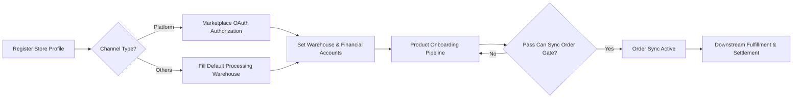
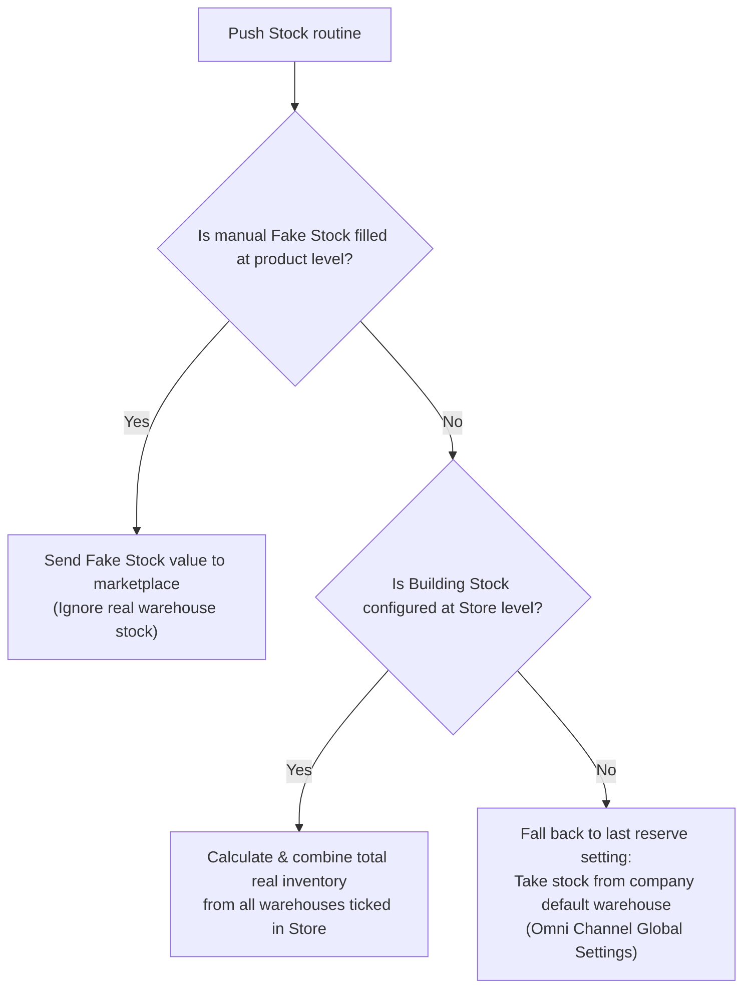
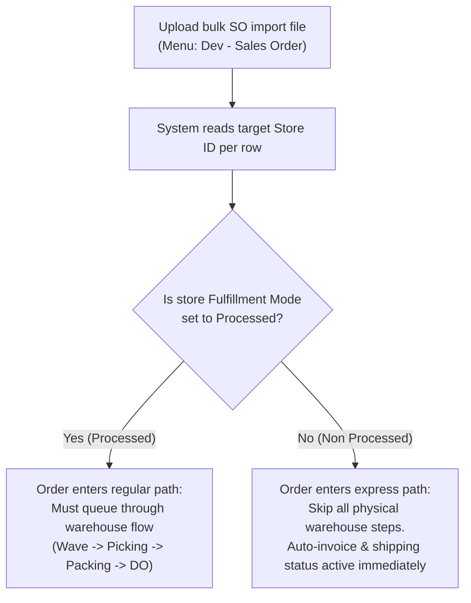
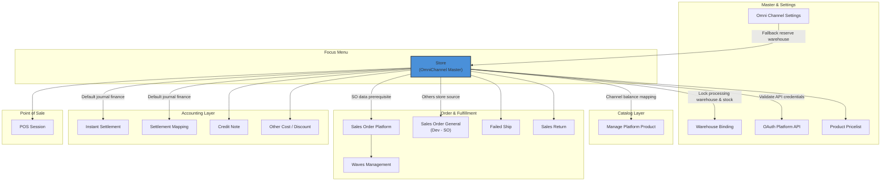

### 📦 Module/Feature: Store

**Business definition:**
**Store** is the central master-data menu in the **OmniChannel** module. It is where you register and manage store accounts to connect external sales channels into the **OlshopERP** ecosystem. This menu locks in credentials and warehouse settings before the system can sync orders, map product catalogs, run wave fulfillment, or record **Instant Settlement** finance entries.

**Target audience / who this is for:**

| Persona | Typical use / modules | Where to begin / action start |
| :---- | :---- | :---- |
| **Store onboarding admin** | Register new stores, manage marketplace API authorization, and refresh OAuth tokens on a schedule. | Create Store → OAuth authorization (Platform type only) |
| **Warehouse operations admin** | Set default warehouse mapping for order processing and combined storefront stock. | Store detail → Sales Order Default Configuration |
| **Finance team** | Configure default chart-of-account mappings for platform receivables and settlement cash receipts. | Store detail → COA mapping & Cash/Bank Receiving |

**UI & system legend:**

| Visual indicator / badge | UI color / cue | System meaning / operational state |
| :---- | :---- | :---- |
| **Authorized** | Green | OAuth API connection with the marketplace is active, valid, and legally connected. |
| **Unauthorized** | Red | Connection is missing or broken; the system blocks all data sync. |
| **Setup Incomplete** | Yellow | Store is registered/authorized but financial (COA) or warehouse settings are still empty. |
| **Store Outdated** | Red + warning symbol | Marketplace OAuth access token has expired; re-authorization is required soon. |
| **Auto Sync ON / OFF** | Toggle switch | Shows whether scheduled background product/order pull is enabled. |
| **Product Sync %** | Percentage indicator (%) | Real-time progress of the initial product catalog pull during the **Product Onboarding** queue. |
| **Can Sync Order** | Yes / No label | Whether order pull is allowed; locked to **No** until the product progress gate is passed. |

**Recommended path:**

> 1. **Register profile & authorize:** Open Store, choose channel type, fill in basic identity, and run OAuth login on the external marketplace portal (Platform type only).
> 2. **Complete internal configuration:** Open the authorized store detail to set financial COA and warehouse locations for processing.
> 3. **Catalog onboarding period:** Watch **Product Sync %** until it passes the background progress gate.
> 4. **Activate daily operations:** Turn on auto order pull to open the **Sales Order Platform** pipeline.

### 🔑 Key Terms (Glossary)

* **Store Binding / Store:** Registration of an external or internal corporate sales channel or store unit in the local system database.
* **Authorize / OAuth:** Secure digital handshake to log in and approve data access from the marketplace seller center into OlshopERP.
* **Authorization Status:** Binary API connection status — **Authorized** (connected) or **Unauthorized** (disconnected).
* **Setup Incomplete:** Safety state where the store is frozen inactive because critical settings such as receivable accounts or operational warehouses are not configured yet.
* **Store Outdated:** OAuth token from the external marketplace has expired; the operator must reconnect authorization.
* **Auto Sync Order:** Background scheduler job that periodically pulls new orders from the storefront automatically.
* **Auto Sync Product:** Background automation that periodically pulls product catalog updates from the marketplace.
* **Building Process:** Default physical warehouse where incoming orders from this store are processed and managed logistically.
* **Building Stock:** One or more warehouse references whose physical stock balances are combined by the system as the total stock sent to the store storefront.
* **Show in Store:** Top-level warehouse master switch that must be ON for a physical warehouse to appear as a **Building Stock** option.
* **Product Sync %:** Real-time percentage showing how many external storefront products have been successfully absorbed into OlshopERP.
* **Can Sync Order:** Strict automatic gate that allows or blocks incoming order pull based on initial product onboarding progress.
* **Product Onboarding:** Background queue for the first catalog pull, moving linearly through **Waiting** → **Running** → **Completed**.
* **Fulfillment Mode** 🔜 *Coming soon — not available yet*: Planned per-store setting to choose whether orders must follow conventional warehouse flow (**Processed**) or skip straight to shipping (**Non Processed**).

### 🎯 When & Why to Use It

Use the Store menu when your company expands sales by opening new marketplace stores (Shopee, Lazada, TikTok Shop) or new offline outlets (POS). Configuration here is the central point for money and logistics flow: which receivable account journals sales, which bank account receives **Instant Settlement** funds, and which warehouse supplies stock.

🛑 **HARD PREREQUISITE WARNING**
Store registration and settings must be 100% active before **Manage Platform Product** is allowed to bind SKU catalogs, because the architecture locks mapping to a valid Store ID.

### 🔄 Place in the Business Flow

#### **Business step notes:**

> 1. **Profile initiation:** Operator creates a new Store with a unique name and target sales platform type.
> 2. **Credential connection path:** Platform stores must go through external OAuth to bring back the official API token; **Others** stores skip straight to local configuration.
> 3. **Warehouse & finance consolidation:** Finance maps receivable asset accounts, cash receiving accounts, and processing warehouses to lift the store out of **Setup Incomplete**.
> 4. **Initial catalog absorption:** The **Product Onboarding** pipeline downloads items in the background and holds order sync until product percentage is safely synced.
> 5. **Active commercial operations:** External transaction notes flow into the system via **Sales Order Platform** or manual entry through **Sales Order General**.

### 🏢 Two Store Types: Platform vs Others

| Aspect | Platform | Others |
| :---- | :---- | :---- |
| **Scope definition** | Integrates external digital marketplace stores in real time via API. | Represents offline retail stores, POS sessions, or manual admin orders. |
| **Integration examples** | Shopee, Lazada, TikTok Shop. | Retail outlets, trade shows, manual wholesale, spreadsheet import orders. |
| **OAuth authorization (marketplace)** | **Yes, required.** Must log in and approve access on the external platform server. | **Not needed.** Authorization is fully local with no third-party login. |
| **Special required form fields** | **TikTok Shop only:** **Store Code** (original marketplace store ID) must be filled manually before save. | **Default Building Process** (processing warehouse) must be filled at initial registration. |
| **Data flow characteristics** | Products and orders are pulled automatically on a schedule via API scheduler pipelines. | No external sync. Used as a container for bulk import binding or POS. |

⚠️ **LEGACY PLATFORM NOTICE**
The **Tokopedia** platform option is **legacy**. It is **hidden** from the Create Store form for new stores, but the system still allows full edit access for existing Tokopedia stores.

### 📍 Menu Location & Workspace

Visual control for sales channel registration is centralized here:

* **UI navigation path:** OmniChannel → Store
* **System UI route:** /omni/store-binding

🖼️ **[IMAGE PLACEHOLDER]** — Store list page with Authorized / Unauthorized / Setup Incomplete badges.

### ⚙️ Common Usage Scenarios

#### **Scenario 1 — Register a new Platform store (marketplace)**

> 1. Go to workspace `/omni/store-binding` and click **Create**.
> 2. Open the *Basic Information* tab, choose **Select Channel** (for example Shopee or TikTok Shop).
> 3. Enter the identity name in **Store Name** (max 50 unique characters).
> 4. For **TikTok Shop**, fill **Store Code** accurately with the store ID from seller center.
> 5. Click **Save**. The system opens a new browser tab to the target marketplace's official **OAuth** page.
> 6. Log in with your seller account on that external page and approve API access. When done, the page closes and OlshopERP returns with updated status.

🖼️ **[IMAGE PLACEHOLDER]** — Create Store form with marketplace channel selection, and OAuth tab open for login & access approval.

#### **Scenario 2 — Register a new Others store (offline / POS)**

> 1. Click **Create** on the main list page.
> 2. In **Select Channel**, choose **Others**.
> 3. Fill store name, default accounting settings, and **Default Building Process** with your chosen physical warehouse.
> 4. Click **Save**. Others stores become locally active immediately without token handshake.

#### **Scenario 3 — Configure warehouse network coordinates**

> 1. Open the selected Store profile via Edit.
> 2. Go to the *Sales Order Default Configuration* block.
> 3. In **Default Building Process**, choose one warehouse as the physical processing location for order logistics.
> 4. In **Building Stock**, you may tick more than one warehouse for combined stock.

| Warehouse field element | Absolute prerequisite to appear in the list |
| :---- | :---- |
| **Default Building Process** | Extended warehouse configuration (such as *Outrack*, *Scrap*, and *Return* routes) must be 100% mapped in upstream warehouse master menus. |
| **Building Stock** | Target physical warehouse must have **Show in Store** enabled in Master Warehouse; otherwise it is hidden from Store options. |

🖼️ **[IMAGE PLACEHOLDER]** — Default Building Process and Building Stock fields in the Store form.

#### **Scenario 4 — Configure default financial accounts (COA mappings)**

> 1. In the Store edit form, scroll to the financial settings section.
> 2. Fill **Account Receivable COA** with a current-asset receivable account (used to journal platform sales transactions).
> 3. Fill **Cash/Bank Receiving** with a valid company bank account (required before **Approve Instant Settlement** can run).
> 4. Fill **Customer's Deposit COA** with the overpayment intermediary account (automatically becomes a credit note number if customer payment differs).

#### **Scenario 5 — Trigger manual sync from the store list**

> 1. Open the main list at route `/omni/store-binding`.
> 2. Find the quick-action column on the right of a store row with valid **Authorized** status.
> 3. Click the sync icon you need:
   * **Blue icon (Product Sync):** Pull product catalog instantly on demand (active only when no other product job queue is running).
   * **Orange icon (Order Sync):** Pull latest orders (button blocks if product progress has not passed the gate).
   * **Teal icon (Warehouse Sync):** Align system warehouse stock coordinates with the digital storefront.

🖼️ **[IMAGE PLACEHOLDER]** — Synchronization section with Auto Sync Product/Order toggles and Product/Order/Warehouse buttons.

### 📊 Product Sync Progress & Order Gate

When OAuth authorization succeeds for a new Platform store, the system does **not** pull sales orders immediately. The server puts the store into the background **Product Onboarding** pipeline. This gradually moves all external catalog data to protect API bandwidth, automatically passing through three phases:

**Waiting → Running → Completed**

Progress from this initial catalog pull is shown visually by **Product Sync %** (0% to 100%).

#### **Can Sync Order quality gate rules:**

The system applies a strict safety gate: order pull (scheduled auto sync **or** manual click) is **only allowed** after catalog progress passes a fixed threshold, shown automatically as **Can Sync Order = Yes**.

🛑 **HARD ARCHITECTURE RULE**
While progress is below the safe threshold, **Can Sync Order = No** stays locked and the server **rejects** all incoming order sync attempts. Operational exception: users may turn **Auto Sync Order** ON or OFF in the form anytime without this gate blocking the toggle itself, but the real scheduled pull stays fully blocked until percentage passes the gate.

### 📊 Stock Source Priority to Marketplace

When **Push Stock** sends inventory to an external digital storefront from OlshopERP, the final stock number is chosen automatically on the server using this business priority hierarchy:

### 📊 Full Field Reference

#### 1. Basic Information block

| Field label | Required? | Data type / display | Validation & system rules |
| :---- | :---- | :---- | :---- |
| **Select Channel** | Yes | Dropdown | Choose platform type (marketplace or **Others**). Tokopedia is hidden for new store creation. |
| **Store Name** | Yes | Alphanumeric text | Max 50 characters. Name must be unique within the company (duplicate names rejected). |
| **Store Code** | Required for **TikTok Shop** | Alphanumeric text | Original store ID from external marketplace seller center. Globally unique in the database. |
| **Store Platform Name** | — | Locked text | Auto-filled from marketplace server after successful OAuth. Read-only (cannot edit manually). |
| **Tagging** | No | Multi-select label | Classification labels for the store. New label text can be created directly in the form. |
| **Logo** | No | File upload (.jpg, .png) | Store visual identity file. If empty, OlshopERP default image is applied. |
| **Active** | — | Toggle switch | Platform type: locked automatically based on OAuth token validity and COA completeness. Others type: freely toggled manually. |
| **Set Default Sales Order** | **Others** only | Checkbox | If checked, makes this Others store the default container for manual or general POS sales transactions. |

#### 2. Additional Information block

| Field label | Required? | Data type / display | Validation & system rules |
| :---- | :---- | :---- | :---- |
| **Store Platform ID** | — | Locked number | External system architecture ID. Auto-filled after authorization. Read-only. |
| **Email** | No | Text string | Store contact email. Must pass standard email format validation. |
| **Nomor HP** | No | Number / text | Official operational mobile phone contact. |
| **Negara / Kota / Alamat** | No | Free text | Physical logistics address or full geographic identity of the store. |
| **Deskripsi** | No | Long text | Internal memo for extra store information (max 150 characters). |

#### 3. Default Sales Order Configuration block

| Field label | Required? | Data type / display | Validation & system rules |
| :---- | :---- | :---- | :---- |
| **Default Owner Data** | Yes | Internal dropdown | Internal company profile that legally owns the Store data. Must point to an active company entity in the system. |
| **Account Receivable COA** | Yes | Accounting dropdown | Trade receivable account. Dropdown filters to COA numbers with Asset classification only. |
| **Cash/Bank Receiving** | Yes | Financial dropdown | Active company bank account for journaling platform settlement cash inflow during **Instant Settlement** approval. |
| **Customer's Deposit COA** | Yes | Accounting dropdown | Overpayment receivable account automatically inherited from central corporate accounting settings. |
| **Default Building Process** | Yes (Others type) | Network dropdown | Main physical warehouse where incoming orders queue for logistics processing. Downstream warehouse routes must be configured upstream. |
| **Building Stock** | No | Multi-select checkbox | Tick one or many physical inventory warehouses. Only warehouses with active **Show in Store** appear. |
| **Default Warehouse Void** | No | Conditional dropdown | Automatic void warehouse allocation that appears conditionally for specific distribution logistics flows. |
| **Fulfillment Mode** | 🔜 *Not active yet* | Planned radio button | **Planned release:** Others stores may choose *Processed* or *Non Processed*. Platform stores are locked to *Processed* (other options hidden). |

#### 4. Synchronization block (Platform only)

| UI element name | Component type | Functional rules & system control |
| :---- | :---- | :---- |
| **Toggle Auto Sync Product** | Automation switch | Controls scheduled server jobs to download storefront catalog updates from outside into the system. |
| **Toggle Auto Sync Order** | Automation switch | Controls automatic periodic pull of new commercial sales orders from external portal into **Sales Order Platform** queue. |
| **Product / Order / Warehouse buttons** | Manual action buttons | Trigger instant sync on the selected store row. Shows loading disabled animation while running. |
| **Sync Percentage indicator** | Progress badge UI | Shows real-time percentage of product onboarding absorption on the background server. |
| **Can Sync Order indicator** | Binary status label | Order path authorization (**Yes** or **No**) controlled strictly by **Product Onboarding** percentage gate. |

### 🛡️ Business Rules & System Validations

* **If** you type a **Store Name** that is already used by another store (not deleted) in the same company, or the name is **longer than 50 characters**, **then** save is blocked with error **"Store name already used or format invalid"**.
* **If** you fill **Store Code** (TikTok Shop only) with an ID already used by another store profile globally, **then** the system **rejects document creation**.
* **If** you create a **TikTok Shop** profile but leave **Store Code** empty, **then** save validation **fails** because the field is required.
* **If** you fill **Email** with an invalid format, **then** the form save is **rejected**.
* **If** you trigger external **Authorize** for a store already **Authorized**, **then** the action is **blocked** because duplicate active authorization is detected.
* **If** you look for **Authorize** on an **Others** channel store, **then** the system **does not provide it** because Others stores run fully without external tokens.
* **If** you update a registered store and clear any financial mapping (**Account Receivable COA**, deposit COA, or **Cash/Bank Receiving**), **then** save **fails**.
* **If** financial COA or processing warehouse settings stay empty (or Platform store is not authorized), **then** the system freezes store activity to yellow **Setup Incomplete** until parameters are complete.
* **If** you register or update an **Others** store without **Default Building Process**, **then** the store is **locked inactive** and cannot be used for POS or order import.
* **If** you try to **Delete** or deactivate a store whose ID is actively bound in running transactions (such as **Sales Order Platform**, POS sessions) or set as default general order store, **then** deletion is **blocked** to protect upstream-downstream data integrity.
* **If** you trigger manual order sync (or scheduler run) for a Platform store whose catalog progress has not passed the **Product Sync %** gate, **then** the server **fails order pull** and keeps **Can Sync Order = No**.
* **If** you trigger **Warehouse Sync** for a store that is **Unauthorized** or disabled, **then** the command is **rejected** with a validation error requiring token re-authorization.
* 🔜 *When Fulfillment Mode is fully active in the future, if you configure it on a Platform store, then the system will hide or disable all options except **Processed** because Platform stores must go through warehouse queue.*
* 🔜 *When Fulfillment Mode is officially active, if you create a new Others store or manage existing Others data, then the default system value will be locked safely at **Processed** and cannot silently change to Non Processed without conscious user action.*
* 🔜 *When you change Fulfillment Mode on an Others store from Processed to Non Processed (or the reverse) in the future, then the change **applies only to new sales orders** created after edit time; old transactions keep the mode that existed when that SO was created.*

### 🛡️ Status & Badges

Operational Store condition is shown as scannable color badges and labels on the main list grid:

| Badge / indicator label | Operational / financial meaning | Corrective action required |
| :---- | :---- | :---- |
| **Authorized** (green badge) | OAuth API token session with external marketplace is valid, active, and legal for data exchange. | No action needed. Operations run normally. |
| **Unauthorized** (red badge) | API connection is broken or access was never established since initial profile creation. | Click the control action to trigger central **OAuth Login** again. |
| **Setup Incomplete** (yellow badge) | Store is connected externally, but transaction eligibility is frozen because COA or warehouse is not mapped. | Click Edit, complete receivable, bank receiving, and processing warehouse settings in the form. |
| **Store Outdated** (red badge + warning) | External OAuth credentials expired (periodic marketplace security policy). | Reconnect authorization today so order flow does not stall. |
| **Auto Sync ON / OFF** (toggle status) | Whether background scheduler jobs may pull product/order data periodically. | Turn toggle ON in the store edit form to enable automatic pull pipelines. |
| **Product Sync %** (green / red) | Visual initial product absorption level. Green when gate is safely passed; red while still queued. | Monitor progress. If red for a long time, check connection or server queue load. |
| **Can Sync Order** (Yes / No) | Order execution eligibility. **Yes** when catalog gate is passed; **No** while order access is strictly blocked. | Wait until **Product Onboarding** finishes base storefront product absorption in the background. |

### 🔜 Fulfillment Mode (Not Active Yet)

🛑 **ROADMAP TO-BE WARNING**
All content, logic diagrams, and operational rules below are **planned development (Roadmap TO-BE) that is NOT ACTIVE and NOT AVAILABLE** on production servers today. There is no visual column, form input, or bookkeeping functionality running for this feature now.

#### **Planned basic concept:**

**Fulfillment Mode** is designed for future use as a control parameter to set logistics handling per store in bulk, split into two option schemes:

> 1. **Processed:** Sales orders must fully queue through conventional warehouse flow (Wave creation, rack **Picking**, **Packing**, and official **Delivery Order** documents).
> 2. **Non Processed:** Planned express path **exclusive to Others stores only**. Orders may skip all physical warehouse queues and move directly to shipping status and automatic invoicing (*auto-invoice*).

#### **Planned bulk import order execution logic (Dev - Sales Order):**

**Documentation home note:** Full architectural detail for this automatic bulk import split will be documented in the main **Dev - Sales Order** module, not in this menu. This long-term plan **does not yet include** integration for conventional retail POS manual orders through the same express path.

🖼️ **[IMAGE PLACEHOLDER — not available yet, feature not active]**

### 📥 Store Has No Import — Referenced in Other Menus

🛑 **CRITICAL SYSTEM BOUNDARY**
The Store module **does NOT have Excel/CSV bulk import or export** to create, insert, or modify many stores at once. Every store profile must be created and configured one by one through the **Create** form button.

Although this menu has no bulk upload template button, active Store identity or ID **must be referenced as an important column** in bulk transaction uploads in these downstream accounting and logistics menus:

| Downstream import menu | Related Store column | Excel column business rules & limits |
| :---- | :---- | :---- |
| **Instant Settlement** | Store selection parameter before upload | Operator must manually pick Platform Store name in the UI dropdown before uploading marketplace bank mutation file, because template structure differs completely per sales channel type. |
| **Sales Order General** | **Store Name** column | **Required column.** Store name string must match master Store data exactly (case-sensitive). **Only active Others stores are allowed.** Strictly one store name per transaction row. |
| **Other Cost** | **Applied Store** column | Column to charge external operational cost. Operator may type constant ALL (cost auto-distributed to all active Others stores) or specific store names separated by comma (,) or semicolon (;). Target stores must be active Others type. |
| **Other Discount** | **Applied Store** column | Follows exactly the same mechanical validation as **Other Cost** (only active Others store names or ALL keyword). |
| **Credit Note** | **Store** column | Optional column. May contain a list of active Others store names separated by comma or semicolon, with a maximum of **up to 5 store name combinations** per file. |

### 🛑 Known Limitations

The list below states current OlshopERP production functionality as-is. Treat these as operational boundaries, not software bugs:

* **Auto sync toggle visual accuracy issue:** **Auto Sync** toggle switches in the form **do not automatically freeze or turn off** when store connection is **Unauthorized**. The toggle may look ON on screen while background pull **never runs** until the operator re-authorizes the token. Do not rely on toggle appearance alone; always cross-check **Authorization Status**.
* **Real automatic sync intervals:** Background periodic pull runs on at least these intervals:
  * **New order note pull:** Server calls external API about every **5 minutes**.
  * **Order history status update:** Scheduled about every **30 minutes** during regular business hours, slowing to once per hour outside company working hours.
  * **Product catalog sync:** Runs slowly about every **1 hour**.
* **Tokopedia creation restriction:** Tokopedia integration is classified as **Legacy Platform**. The system keeps edit access for existing old Tokopedia warehouse configuration, but **completely blocks new Tokopedia store creation** from today's form screen.
* **Return warehouse field hidden:** **Building Return** allocation field is **intentionally hidden from Store detail form visualization**, although data structure exists in the database. Operational policy requires return settings for new stores to be managed centrally through **Warehouse Binding**, not configured directly inside Store form.
* **Catalog queue column visibility:** Visual **Product Onboarding Stage** column on the main store list grid is **hidden by default**. If operators need intensive queue monitoring, they must open it manually using **Column Manager** on the table corner.
* **Fulfillment Mode function limit:** This operational path control feature is still in planning and **not active in the system today** (see limitation detail in Fulfillment Mode section above).

### 🔗 Related Menus

| Related integrated menu | Operational role & data flow toward Store |
| :---- | :---- |
| **Warehouse Binding** | Central dashboard to map internal warehouse coordinates with marketplace logistics warehouses, fully relying on valid Store identity. |
| **Manage Platform Product** | SKU catalog alignment workspace. All first product pull (*Pull*) and stock push (*Push Stock*) activity is grouped exclusively per Store entity. |
| **Sales Order Platform** | Holds automatic order pull results from external API; SO approval eligibility is fully controlled by product binding status from the referenced Store. |
| **Dev - Sales Order (Sales Order General)** | Main home for manual admin transactions or spreadsheet import upload, where Others Store name must appear as a validation column. |
| **All Sales Order** | Combined visual screen for orders flowing from both digital Platform stores and general offline outlets. |
| **Waves Management** | Physical goods wave preparation document; order grid list may be filtered by Store name. |
| **Instant Settlement** | Fast marketplace settlement recording menu. System automatically pulls **Cash/Bank Receiving** mapping from the related Store when processing **Approve** action. |
| **Settlement Mapping** | Financial report column mapping configuration for reading digital financial mutation files with patterns bound uniquely per Store platform type. |
| **Other Cost / Other Discount** | External cost component import pipeline where *Applied Store* column requires valid active Others Store name reference. |
| **Omni Channel Settings** | Company-level top settings dashboard providing default corporate warehouse as last-reserve (*fallback priority*) path when Store fields are empty. |
| **Sales Return** | Digital commercial buyer return logistics recording module where note numbers are identified by originating Store parameter. |
| **Credit Note** | Accounting module for trade receivable overpayment; optionally references Others Store names on its import path. |

### 🛠️ Troubleshooting

| Field symptom | Likely root cause | Corrective action for user |
| :---- | :---- | :---- |
| **Approve Instant Settlement** action shows financial account parameter failure notification. | **Cash/Bank Receiving** on the referenced Store master is still empty. | Reopen Store, Edit the store, complete default accounting bank account choice, and Save. |
| External authorization fails with message **"Store already authorized"**. | Store profile is already valid **Authorized** in local company database. | No re-authorization needed if connection badge is green. If urgent token refresh is needed, contact IT/Development for *token refresh*. |
| Manual sync button or toggle change freezes with no system response. | Current login profile lacks exclusive **Owner** authorization over that store profile. | Log in with a corporate Owner-level account or full store data owner credentials. |
| **Product Onboarding** percentage stuck at one number or stays red for a long time. | Store API integration is **Unauthorized**, or platform onboarding queue traffic is heavy. | Check connection badge color; if red, redo OAuth login. If green, wait because server queue is processing in bulk. |
| Manual order sync button is locked (*disabled*) or shows rejection error. | Storefront product absorption percentage has not passed the safe system threshold (**Can Sync Order = No**). | Let **Product Onboarding** finish upstream catalog pull in the background until indicator changes to Yes. |
| **Product Onboarding Stage** queue column shows **"Waiting"** text for a long time. | Parallel mass queue where internal server is busy processing other stores on the same platform/marketplace type. | This is normal system queue behavior. Allow safe wait time for server to finish queues in arrival order. |
| **Auto Sync Product** toggle is OFF but onboarding queue still seems stuck. | Store profile does not yet meet base architectural eligibility for long-term automatic product pull queue. | Open Store edit form, turn **Auto Sync Product** ON, then Save. |
| Digital buyer sales orders never flow automatically into Sales Order interface. | Periodic transaction pull switch (**Auto Sync Order**) on target Store detail is OFF. | Open Store form, turn **Auto Sync Order** ON, and confirm API token connection badge is green. |
| Desired physical warehouse name never appears or disappears from **Building Stock** dropdown. | **Show in Store** option is not enabled on that warehouse profile in upstream Master Warehouse module. | Open top-level Master Warehouse settings, find target warehouse, enable **Show in Store**, and Save. |
| **Default Building Process** keeps returning empty every time the Store form is opened. | Company-level default warehouse in central Omni Channel settings is not configured at all. | Open *Omni Channel Global Settings*, complete main corporate default warehouse, or force manual entry directly in Store form. |
| Save is rejected with duplicate name failure notification. | Store name text or unique **Store Code** ID is already actively registered by another store unit in the database. | Change store name text or recheck **Store Code** accuracy using a unique distinguishing identity number. |
| All header action buttons on Store list freeze grey inactive and ignore clicks. | Operator has not selected any active store entity in the top multi-select **Filter Store** column. | Go to **Filter Store** at the top of the grid, select at least one store name, then refresh the page. |

### ❓ FAQ

* **What is the basic difference between Store and Warehouse Binding?**
  * **Store** is the master identity for sales channels, including OAuth credential authorization, default company accounting COA mapping, and main manual sync triggers. **Warehouse Binding** is purely a cross-store coordinate table linking marketplace rack warehouse codes with OlshopERP internal sub-warehouse names.
* **Do Others-type stores require external API OAuth login?**
  * No. Others stores run locally to reference offline retail POS or manual spreadsheet transactions. Operators only fill name, financial account settings, and operational physical warehouse assignment without third-party portal login.
* **Why does order pull never run even though Auto Sync Order is confirmed ON in the form?**
  * Cross-check **Can Sync Order** on the store list. It must show **Yes**, meaning initial catalog progress on **Product Sync %** passed the safe gate. Orders stay fully blocked while the indicator is still **No** to protect SKU data relationship integrity.
* **Where does OlshopERP accounting pull trade receivable account numbers when a marketplace sales note is created?**
  * The system pulls COA directly from **Account Receivable COA** configured specifically on the related Store master, not from general company-level chart settings. This helps accountants isolate receivable history per sales channel.
* **Can users select more than one physical warehouse location in Building Stock?**
  * Yes. OlshopERP allows parallel multi-warehouse selection for combined stock push (*multi-warehouse stock pool*). Real inventory balances from all ticked warehouses are automatically summed by the system before sending to the digital storefront.
* **What is the stock priority hierarchy when pushing inventory data to marketplace?**
  * Stock push engine follows three main criteria: First, manual constant **Fake Stock** at product level if filled. Second, if empty, real combined inventory from store-level **Building Stock** warehouse network. Third, if not set, fallback to corporate default warehouse in *Omni Channel Global Settings*.
* **Is there a spreadsheet Excel bulk import menu to register dozens of new stores at once in Store list?**
  * No. Store master module is strictly locked with **no import file feature**. Every sales channel unit must be created one by one through the digital creation form for credential token encryption security (see bulk import section above for downstream menus that use Store as a required reference column).
* **Why is Tokopedia platform choice hidden from the new store creation dropdown?**
  * Tokopedia API integration is classified as old system architecture (*Legacy Platform*). The company closed new Tokopedia channel registration from today's interface form, but the system still guarantees maintenance and edit access for old Tokopedia stores registered previously.
* **What is the Fulfillment Mode setting component on Store master data?**
  * Fulfillment Mode is a long-term control parameter design (*Roadmap TO-BE*) to split bulk sales order logistics handling — stores that must fully queue conventional warehouse flow (*Processed*) versus express Others stores allowed to skip rack warehouse queue and go straight to ready-to-ship status (*Non Processed*). The feature is confirmed **not active in the system today** (see Fulfillment Mode section above for full detail).

### 📑 See Also

* **Warehouse Binding** — Procedure to integrate internal sub-warehouse network coordinates across digital channels.
* **Manage Platform Product** — Tactical guide for SKU catalog binding and storefront stock push per Store.
* **Sales Order Platform** — Rules for handling incoming order files and stuck SO notes.
* **Dev - Sales Order** — Main repository module for bulk order import absorption and *Fulfillment Mode* gateway.
* **Instant Settlement** — Finance verification guide and platform receivable settlement approval based on Store cash account.
* **Waves Management** — Guide for managing physical goods fulfillment waves filtered by store.
