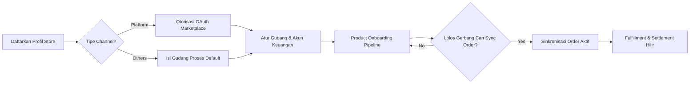
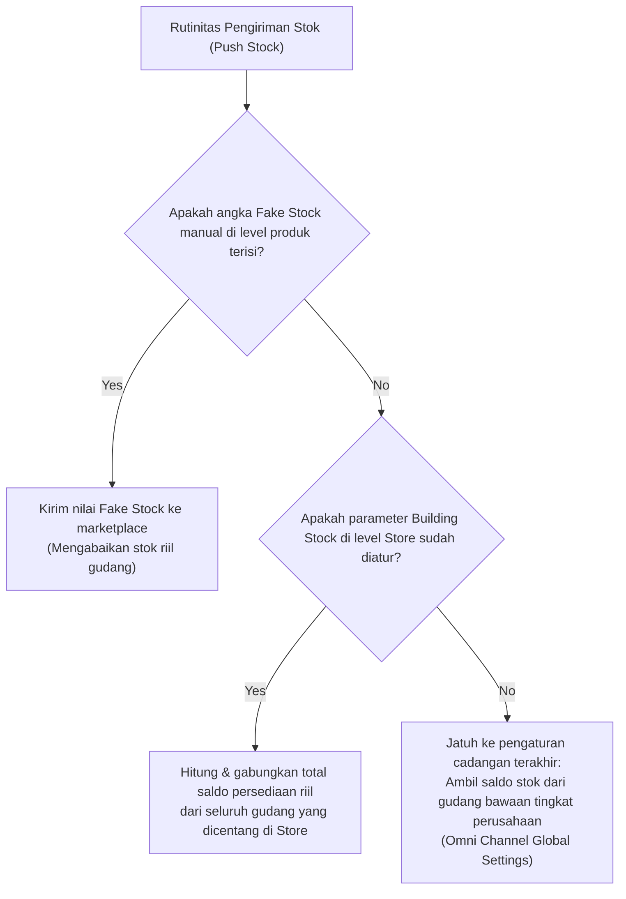
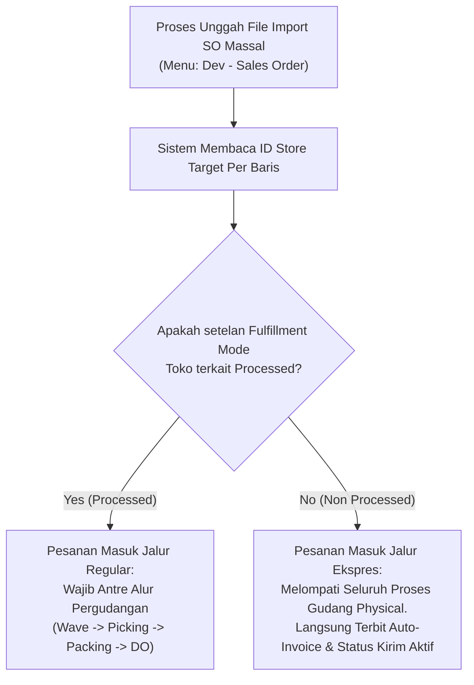
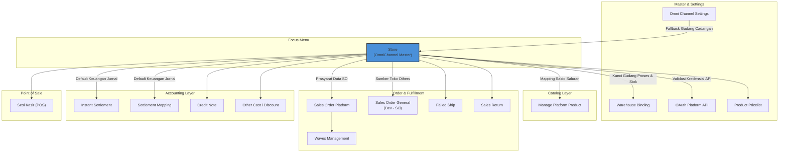

### 📦 Modul/Fitur: Store

**Definisi Bisnis:**
**Store** adalah menu master data sentral dalam modul **OmniChannel** yang berfungsi sebagai repositori registrasi dan manajemen akun toko untuk mengintegrasikan *channel* penjualan eksternal ke dalam ekosistem **OlshopERP**. Modul ini bertindak sebagai prasyarat mutlak penguncian kredensial dan konfigurasi gudang operasional sebelum sinkronisasi pesanan, pemetaan katalog produk, manajemen gelombang pemenuhan pesanan (*wave fulfillment*), serta pencatatan keuangan *Instant Settlement* dapat dieksekusi oleh sistem.
**Target Audience / Who This Is For:**

| Persona | Typical Use / Modules | Where to Begin / Action Start |
| :---- | :---- | :---- |
| **Admin Onboarding Toko** | Mendaftarkan toko baru, mengelola otorisasi API *marketplace*, dan memperbarui token *OAuth* berkala. | Create Store → Otorisasi *Jalur OAuth* (Khusus tipe Platform) |
| **Admin Operasional Gudang** | Mengatur pemetaan gudang default untuk pemrosesan order dan acuan stok gabungan etalase. | Detail Toko → Sales Order Default Configuration |
| **Tim Keuangan (Finance)** | Mengonfigurasi bagan akun akuntansi bawaan untuk piutang *platform* dan penerimaan dana pencairan. | Detail Toko → Pemetaan COA & Cash/Bank Receiving |

**UI & System Legend:**

| Visual Indicator / Badge | UI Color / Cue | System Meaning / Operational State |
| :---- | :---- | :---- |
| **Authorized** | Hijau | Koneksi API *OAuth* dengan pihak *marketplace* aktif, valid, dan legal berjalan. |
| **Unauthorized** | Merah | Koneksi belum terbentuk atau terputus; sistem memblokir seluruh sinkronisasi data. |
| **Setup Incomplete** | Kuning | Toko telah terdaftar/diotorisasi namun konfigurasi finansial (COA) atau gudang proses masih kosong. |
| **Store Outdated** | Merah + Simbol Peringatan | Token akses *OAuth* dari *marketplace* telah kedaluwarsa; membutuhkan otorisasi ulang segera. |
| **Auto Sync ON / OFF** | Toggle Switch | Indikator status penarikan produk/order otomatis terjadwal oleh sistem *scheduler background*. |
| **Product Sync %** | Indikator Angka (%) | Kemajuan real-time penarikan data katalog produk awal selama antrean *Product Onboarding*. |
| **Can Sync Order** | Label Yes / No | Hak akses eksekusi penarikan order; terkunci otomatis pada status **No** sebelum lolos gerbang kemajuan. |

**Recommended Path:**

> 1. **Registrasi Profil & Otorisasi:** Buka menu Store, pilih jenis *channel*, isi identitas dasar, dan jalankan proses login *OAuth* langsung ke portal otoritas *marketplace* luar (khusus tipe Platform).
> 2. **Kelengkapan Konfigurasi Internal:** Buka detail toko hasil otorisasi untuk menetapkan bagan akun keuangan (COA) dan jaringan lokasi gudang pemrosesan.
> 3. **Masa Onboarding Katalog:** Pantau indikator kemajuan *Product Sync %* hingga mencapai ambang gerbang batas baku di latar belakang.
> 4. **Aktivasi Rutinitas Operasional:** Aktifkan toggle otomatisasi penarikan order untuk membuka jalur otomatis pipa *Sales Order Platform*.

### 🔑 Istilah Kunci (Glosarium)

* **Store Binding / Store**: Registrasi entitas unit toko atau saluran penjualan resmi korporasi eksternal maupun internal di dalam basis data lokal sistem.
* **Authorize / OAuth**: Protokol jabat tangan digital aman untuk melakukan login dan menyetujui pemberian hak akses data dari *seller center marketplace* menuju sistem.
* **Authorization Status**: Status biner legalitas koneksi API yang menandakan apakah token integrasi berada dalam kondisi terhubung aktif (**Authorized**) atau terputus (**Unauthorized**).
* **Setup Incomplete**: Kondisi pengaman sistem di mana data toko dibekukan menjadi tidak aktif karena parameter krusial seperti akun akuntansi piutang atau gudang operasional belum dikonfigurasi.
* **Store Outdated**: Keadaan di mana masa berlaku token otorisasi API luar telah kedaluwarsa secara temporal, mewajibkan operator melakukan pembaruan otorisasi ulang (*reconnect*).
* **Auto Sync Order**: Pengaturan penjadwalan berkala latar belakang (*scheduler job*) untuk menarik pesanan baru dari etalase secara otomatis tanpa intervensi manual.
* **Auto Sync Product**: Pengaturan otomatisasi berkala sistem untuk menarik pembaruan manifes data katalog produk dari *marketplace*.
* **Building Process**: Penunjukan gudang default fisik tempat persediaan barang pesanan yang masuk dari toko terkait akan dikelola dan diproses logistiknya.
* **Building Stock**: Daftar pilihan satu atau beberapa gudang acuan yang saldo stok fisiknya akan digabungkan oleh mesin sistem sebagai basis total stok yang dikirim ke etalase toko.
* **Show in Store**: Parameter kontrol pada Master Gudang tingkat atas yang wajib dinyalakan agar gudang fisik tersebut diizinkan muncul sebagai pilihan opsi *Building Stock*.
* **Product Sync %**: Angka penunjuk persentase real-time seberapa banyak item produk etalase luar yang telah sukses terserap masuk ke dalam sistem OlshopERP.
* **Can Sync Order**: Gerbang kendali ketat otomatis sistem untuk mengizinkan atau menolak jalannya penarikan transaksi order masuk berdasarkan tingkat kemajuan serapan produk awal.
* **Product Onboarding**: Status manajemen antrean penarikan katalog awal di server latar belakang yang bergerak linear dari tahap **Menunggu** → **Sedang Berjalan** → **Selesai**.
* **Fulfillment Mode** 🔜 *Segera hadir, belum bisa dipakai saat ini*: Rencana opsi setelan operasional per toko untuk menentukan jalur pemrosesan barang, apakah wajib mengantre alur gudang konvensional (*Processed*) atau langsung melompat instan ke pengiriman (*Non Processed*).

### 🎯 Kapan & Kenapa Dipakai

Menu Store digunakan secara sadar ketika perusahaan melakukan perluasan ekspansi dagang komersial dengan membuka toko baru di *marketplace* (Shopee, Lazada, TikTok Shop) atau membuka gerai fisik *offline* baru (POS). Konfigurasi di dalam menu ini menjadi titik pusat penentu arah arus uang dan logistik barang: ia menentukan akun piutang mana yang menjurnal penjualan, rekening mana yang menampung dana *Instant Settlement*, serta gudang mana yang memegang otoritas pasokan persediaan.
🛑 **WARNING HARD PREREQUISITE**
Registrasi dan penyelesaian setelan data Store wajib berstatus aktif 100% sebelum menu Manage Platform Product diizinkan mengikat katalog SKU, karena sistem arsitektur mengunci mati hubungan pemetaan berbasis ID Store yang valid.

### 🔄 Posisi dalam Alur Bisnis

#### **Keterangan Langkah Bisnis:**

> 1. **Inisiasi Profil**: Operator membuat data Store baru dengan menentukan nama unik dan jenis platform penjualan yang dituju.
> 2. **Jalur Koneksi Kredensial**: Khusus toko tipe Platform wajib melalui rute otorisasi keluar sistem untuk membawa pulang token API resmi, sedangkan tipe Others langsung melompat ke pengisian konfigurasi lokal.
> 3. **Konsolidasi Gudang & Finansial**: Akuntan perusahaan memetakan akun Aset Piutang, Kas receiving, dan gudang pemrosesan fisik untuk mengaktifkan status toko dari pembekuan *Setup Incomplete*.
> 4. **Masa Penyerapan Katalog Awal**: Pipa mesin *Product Onboarding* mengunduh data item di latar belakang dan menahan gerbang order sampai persentase data produk aman tersinkronisasi.
> 5. **Operasional Komersial Aktif**: Nota transaksi dari luar resmi mengalir masuk ke sistem melalui engine *Sales Order Platform* atau diinput manual via *Sales Order General*.

### 🏢 Dua Tipe Toko: Platform vs Others

| Karakteristik Aspek | Platform | Others |
| :---- | :---- | :---- |
| **Definisi Ruang Lingkup** | Mengintegrasikan toko digital eksternal di *marketplace* komersial secara real-time via jalur API. | Merepresentasikan toko fisik *offline*, sesi kasir (POS), atau media pesanan manual lewat Admin. |
| **Contoh Integrasi** | Shopee, Lazada, TikTok Shop. | Gerai *Retail*, pameran penjualan, grosir manual, pesanan *import spreadsheet*. |
| **Otorisasi OAuth (Marketplace)** | **Ya, Wajib.** Harus melewati proses login persetujuan hak akses di server platform luar. | **Tidak Perlu.** Seluruh otorisasi bersifat lokal internal sistem tanpa login pihak ketiga. |
| **Field Wajib Khusus Form** | Khusus **TikTok Shop**: Kolom **Store Code** (ID Toko Marketplace asli) wajib diisi manual sebelum simpan. | Kolom **Default Building Process** (Gudang Proses) wajib diisi langsung saat pendaftaran awal. |
| **Karakteristik Aliran Data** | Data produk dan nota pesanan ditarik masuk otomatis secara berkala menggunakan pipa API *scheduler*. | Tidak memiliki fitur sinkronisasi eksternal. Digunakan untuk wadah ikatan import massal atau POS. |

⚠️ **LEGACY PLATFORM NOTICE**
Opsi pilihan platform **Tokopedia** berstatus *legacy* (warisan sistem). Pilihan ini sengaja **disembunyikan** dari formulir pembuatan toko baru (Create Store), namun sistem tetap membuka akses edit penuh untuk mengelola data toko Tokopedia lama yang sudah ada.

### 📍 Lokasi Menu & Workspace

Akses kontrol visual terhadap registrasi saluran penjualan dipusatkan pada jalur navigasi panel berikut:

* **UI Navigation Path:** OmniChannel → Store
* **System UI Route:** /omni/store-binding

🖼️ **[PLACEHOLDER GAMBAR]** — Halaman daftar Store dengan badge Authorized/Unauthorized/Setup Incomplete.

### ⚙️ Panduan Skenario Penggunaan Umum

#### **Skenario 1 — Mendaftarkan Toko Platform Baru (Marketplace)**

> 1. Masuk ke area workspace /omni/store-binding lalu klik tombol kontrol **Create**.
> 2. Buka tab *Basic Information*, tentukan pilihan jenis *Select Channel* (misal: Shopee atau TikTok Shop).
> 3. Ketik nama identitas pada kolom **Store Name** (maksimal 50 karakter unik).
> 4. Khusus platform **TikTok Shop**, operator wajib melengkapi isian kolom **Store Code** secara akurat dengan ID toko dari seller center.
> 5. Klik **Save**. Sistem secara arsitektural langsung membuka tab peramban (*browser*) baru menuju halaman *OAuth* resmi milik *marketplace* target.
> 6. Lakukan login akun penjual Anda di halaman luar tersebut dan berikan tanda centang persetujuan hak akses API. Setelah selesai, halaman otomatis tertutup dan mengembalikan kendali ke sistem OlshopERP dengan status ter-update.

🖼️ **[PLACEHOLDER GAMBAR]** — Form Create Store dengan pilihan channel marketplace, dan tab OAuth yang terbuka untuk login & menyetujui akses.

#### **Skenario 2 — Mendaftarkan Toko Others Baru (Offline / POS)**

> 1. Klik tombol **Create** pada halaman utama list.
> 2. Pada kolom *Select Channel*, pilih opsi kategori **Others**.
> 3. Lengkapi data nama toko, lengkapi setelan akuntansi default, dan isi kolom **Default Building Process** dengan gudang fisik pilihan Anda.
> 4. Klik **Save**. Toko tipe Others langsung berstatus aktif secara lokal tanpa perlu mekanisme jabat tangan token.

#### **Skenario 3 — Mengatur Koordinat Jaringan Gudang**

> 1. Buka data profil Store terpilih yang ingin disesuaikan gudangnya lewat aksi Edit.
> 2. Arahkan kursor ke area blok komponen *Sales Order Default Configuration*.
> 3. Pada field **Default Building Process**, pilih satu gudang yang berperan sebagai wilayah fisik pemrosesan pesanan logistik.
> 4. Pada field **Building Stock**, Anda diperbolehkan mencentang lebih dari satu pilihan gudang fisik gabungan stok.

| Elemen Field Gudang | Prasyarat Mutlak Kelolosan Pilihan |
| :---- | :---- |
| **Default Building Process** | Konfigurasi penunjang gudang (seperti rute *Outrack*, *Scrap*, dan gudang *Return*) wajib sudah ter-mapping 100% tuntas di menu master pergudangan hulu. |
| **Building Stock** | Gudang fisik target wajib telah dinyalakan parameter opsi **Show in Store** di dalam Master Gudang asal, jika tidak dinyalakan maka gudang otomatis disembunyikan dari daftar pilihan Store. |

🖼️ **[PLACEHOLDER GAMBAR]** — Field Default Building Process dan Building Stock di form Store.

#### **Skenario 4 — Mengatur Akun Keuangan Default (COA Mappings)**

> 1. Di dalam form pengeditan Store, gulirkan halaman menuju parameter setelan finansial.
> 2. Isi kolom **Account Receivable COA** dengan memilih akun piutang korporasi yang memiliki klasifikasi aset lancar (digunakan sebagai penampung jurnal transaksi penjualan platform).
> 3. Isi kolom **Cash/Bank Receiving** dengan menunjuk rekening bank perusahaan yang sah (wajib terisi sempurna sebagai prasyarat eksekusi pencairan dana *Approve Instant Settlement*).
> 4. Isi kolom **Customer's Deposit COA** dengan akun perantara kelebihan bayar piutang (berfungsi otomatis menjadi nomor nota kredit jika muncul selisih bayar pelanggan).

#### **Skenario 5 — Memicu Sinkronisasi Manual dari Daftar Toko**

> 1. Buka list baris data utama pada rute /omni/store-binding.
> 2. Temukan kolom aksi cepat di sebelah kanan nama toko yang berstatus valid **Authorized**.
> 3. Klik ikon kontrol sinkronisasi sesuai kebutuhan taktis operasional lapangan:
   * **Ikon Biru (Product Sync)**: Klik untuk memicu penarikan katalog barang instan secara mandiri (hanya aktif jika tidak ada antrean job produk lain yang sedang berjalan).
   * **Ikon Oranye (Order Sync)**: Klik untuk menarik pesanan terbaru (tombol otomatis memblokir perintah jika persentase kemajuan produk toko belum lolos gerbang kemajuan).
   * **Ikon Tosca (Warehouse Sync)**: Klik untuk menyelaraskan koordinat stok gudang sistem dengan etalase digital.

🖼️ **[PLACEHOLDER GAMBAR]** — Section Synchronization dengan toggle Auto Sync Product/Order dan tombol Product/Order/Warehouse.

### 📊 Progres Sinkronisasi Produk & Gerbang Order

Ketika proses otorisasi *OAuth* sebuah toko baru tipe Platform sukses diselesaikan, sistem tidak langsung melakukan penarikan pesanan penjualan. Server akan menempatkan toko tersebut ke dalam antrean pipa **Product Onboarding** di latar belakang. Proses ini bekerja memindahkan seluruh data katalog produk luar secara bertahap demi menjaga kestabilan *bandwidth* API, bergerak otomatis melewati tiga fase arsitektur:

**Menunggu → Sedang Berjalan → Selesai**
Kemajuan dari pipeline penarikan katalog awal ini direpresentasikan secara visual oleh parameter **Product Sync %** (0% hingga 100%).

#### **Aturan Gerbang Baku Kendali Mutu Pesanan (*Can Sync Order Gateway*):**

Sistem menerapkan aturan pembatasan ketat (gerbang keamanan) di mana fungsi eksekusi penarikan data transaksi order (baik penarikan terjadwal otomatis via *scheduler job* maupun perintah klik manual operator) **baru akan diizinkan terbuka** apabila angka persentase kemajuan katalog telah lolos melampaui ambang batas baku tertentu, ditandai secara otomatis oleh sistem dengan label **Can Sync Order = Yes**.
🛑 **HARD RULE AKURASI ARSITEKTUR**
Selama tingkat kemajuan berada di bawah ambang batas aman, indikator akan menetap pada status **Can Sync Order = No** dan server secara mutlak akan **menolak** seluruh percobaan eksekusi sinkronisasi transaksi order masuk. Pengecualian operasional: User diizinkan menyalakan atau mematikan toggle *Auto Sync Order* kapan saja di form tanpa dibatasi oleh gerbang ini, namun jadwal eksekusi riil penarikan datanya tetap akan diblokir total hingga nilai persentase lolos gerbang.

### 📊 Prioritas Sumber Stok ke Marketplace

Ketika rutinitas pengiriman saldo persediaan produk menuju etalase digital eksternal (*Push Stock*) dieksekusi dari sistem OlshopERP, volume angka stok akhir ditentukan secara otomatis di server belakang layar berdasarkan tingkatan prioritas hirarki aturan bisnis berikut:

### 📊 Referensi Field Lengkap

#### 1. Blok Informasi Dasar

| Label Judul Field | Wajib? | Tipe Data / Tampilan | Aturan Kerja Validasi & Batasan Sistem |
| :---- | :---- | :---- | :---- |
| **Select Channel** | Ya | Dropdown Pilihan | Wadah memilih jenis platform (*marketplace* atau opsi **Others**). Opsi Tokopedia disembunyikan untuk pembuatan data toko baru. |
| **Store Name** | Ya | Teks Alphanumeric | Batasan maksimal 50 karakter teks. Input nama wajib unik secara internal korporasi (menolak duplikasi nama kembar). |
| **Store Code** | Wajib khusus **TikTok Shop** | Teks Alphanumeric | ID identitas toko asli dari seller center marketplace luar. Bersifat unik global di basis data. |
| **Store Platform Name** | — | Teks Terkunci | Nilai otomatis terisi murni dari server *marketplace* pasca jabat tangan *OAuth* sukses. Status *Read-Only* (tidak bisa diedit manual). |
| **Tagging** | Tidak | Multi-Select Label | Tempat menyematkan kelompok label penanda klasifikasi toko. Diizinkan memproduksi teks label baru langsung dari form. |
| **Logo** | Tidak | File Upload (.jpg, .png) | Berkas gambar identitas visual toko. Jika dikosongkan, sistem otomatis menerapkan gambar bawaan standar OlshopERP. |
| **Active** | — | Toggle Switch | Untuk tipe Platform: Opsi terkunci otomatis berdasarkan validitas token *OAuth* dan kelengkapan COA. Untuk tipe Others: Bebas digeser manual. |
| **Set Default Sales Order** | Khusus **Others** | Checkbox Kontrol | Jika dicentang, menjadikan toko Others terkait sebagai wadah default utama untuk menampung transaksi penjualan manual atau POS umum. |

#### 2. Blok Informasi Tambahan

| Label Judul Field | Wajib? | Tipe Data / Tampilan | Aturan Kerja Validasi & Batasan Sistem |
| :---- | :---- | :---- | :---- |
| **Store Platform ID** | — | Angka Terkunci | Nomor ID arsitektur sistem eksternal. Terisi otomatis murni dari sistem belakang layar pasca otorisasi, berstatus *Read-Only*. |
| **Email** | Tidak | Teks String | Alamat surat elektronik kontak korespondensi toko. Wajib mematuhi validasi format penulisan email standar baku. |
| **Nomor HP** | Tidak | Angka / Teks | Nomor kontak telepon genggam resmi operasional toko. |
| **Negara / Kota / Alamat** | Tidak | Teks Bebas | Data alamat fisik logistik atau identitas geografis lengkap dari toko penjualan. |
| **Deskripsi** | Tidak | Teks Panjang | Catatan memo internal bebas untuk mendeskripsikan informasi tambahan toko (maksimal 150 karakter). |

#### 3. Blok Konfigurasi Default Sales Order

| Label Judul Field | Wajib? | Tipe Data / Tampilan | Aturan Kerja Validasi & Batasan Sistem |
| :---- | :---- | :---- | :---- |
| **Default Owner Data** | Ya | Dropdown Internal | Entitas profil perusahaan internal pemilik legal atas data Store. Wajib menunjuk badan usaha yang berstatus aktif di sistem. |
| **Account Receivable COA** | Ya | Dropdown Akuntansi | Bagan nomor akun piutang usaha. Dropdown secara cerdas menyaring dan hanya memunculkan nomor COA yang memiliki kelas klasifikasi Aset. |
| **Cash/Bank Receiving** | Ya | Dropdown Finansial | Daftar rekening bank aktif perusahaan untuk menjurnal uang masuk pelunasan tagihan platform komersial saat kelolosan *Instant Settlement*. |
| **Customer's Deposit COA** | Ya | Dropdown Akuntansi | Nomor akun penampung kelebihan bayar piutang yang secara otomatis ditarik diwarisi dari setelan sistem akuntansi pusat korporasi. |
| **Default Building Process** | Ya (Tipe Others) | Dropdown Jaringan | Lokasi gudang fisik utama tempat pesanan masuk akan mengantre proses logistiknya. Wajib terkonfigurasi rute gudang turunannya di hulu. |
| **Building Stock** | Tidak | Checkbox Multi-Select | Tempat mencentang satu atau banyak gudang persediaan fisik. Hanya menampilkan gudang yang parameter opsi *Show in Store* bernilai aktif. |
| **Default Warehouse Void** | Tidak | Dropdown Kondisional | Opsi alokasi gudang pembatalan otomatis yang muncul secara kondisional untuk kebutuhan manajemen alur distribusi logistik khusus tertentu. |
| **Fulfillment Mode** | 🔜 *Belum aktif* | Radio Button Rencana | **Rencana Rilis**: Tipe Others bebas memilih *Processed* atau *Non Processed*. Tipe Platform dikunci mati di opsi *Processed* (opsi lain disembunyikan). |

#### 4. Blok Sinkronisasi (khusus Platform)

| Nama Elemen UI | Jenis Komponen | Aturan Kerja Fungsional & Mekanisme Pengendalian Sistem |
| :---- | :---- | :---- |
| **Toggle Auto Sync Product** | Sakelar Otomatisasi | Mengontrol aktivasi penjadwalan berkala mesin server untuk mengunduh pembaruan data katalog etalase dari luar ke sistem. |
| **Toggle Auto Sync Order** | Sakelar Otomatisasi | Mengontrol rutinitas otomatis penarikan nota pesanan penjualan komersial baru dari portal eksternal menuju antrean *Sales Order Platform*. |
| **Tombol Product / Order / Warehouse** | Tombol Aksi Manual | Memicu eksekusi sinkronisasi data instan saat itu juga di baris toko pilihan. Menampilkan animasi memuat (*loading disabled*) saat berjalan. |
| **Indikator Sync Percentage** | Badge Progress UI | Menampilkan angka persentase real-time serapan riil penarikan produk onboarding di server latar belakang. |
| **Indikator Can Sync Order** | Label Biner Status | Keterangan otorisasi jalur order baku (**Yes** atau **No**) yang nilainya dikendalikan mutlak oleh gerbang persentase *Product Onboarding*. |

### 🛡️ Aturan Bisnis & Validasi Sistem

* Kalau kamu mengetik nama toko pada field **Store Name** di mana teks tersebut sudah terdaftar dipakai oleh toko lain (yang belum dihapus) di dalam payung perusahaan yang sama, atau panjang nama terdeteksi **melebihi batas maksimal 50 karakter**, maka sistem akan langsung memblokir penyimpanan dengan menerbitkan pesan error **"Nama toko sudah dipakai atau format tidak valid"**.
* Kalau kamu mengisi data kode pada field **Store Code** (khusus TikTok Shop) di mana kode ID tersebut terdeteksi telah digunakan oleh profil toko lain secara global di basis data server, maka sistem otomatis **menolak pembuatan berkas dokumen**.
* Kalau kamu membuat profil toko jenis **TikTok Shop** namun mengosongkan kolom isian **Store Code**, maka sistem secara absolut **menggagalkan proses validasi simpan** karena kolom tersebut berstatus wajib.
* Kalau kamu mengisi data pada kolom **Email** dengan struktur penulisan format teks yang tidak valid (tidak memenuhi kaidah penulisan email resmi baku), maka sistem langsung **menolak penyimpanan formulir**.
* Kalau kamu memicu perintah tombol **Authorize** keluar sistem untuk entitas akun toko yang rekam jejak status koneksinya sudah berstatus valid **Authorized**, maka sistem akan **memblokir aksi tersebut** karena mendeteksi otorisasi ganda aktif.
* Kalau kamu mencari tombol atau menu tautan **Authorize** pada data profil toko yang memiliki jenis channel tipe **Others**, maka sistem secara arsitektur **tidak menyediakan fitur tersebut** karena tipe Others beroperasi penuh tanpa token eksternal.
* Kalau kamu melakukan pengubahan data (*Update*) pada toko yang sudah terdaftar dengan mengosongkan atau menghapus salah satu komponen pemetaan finansial (**Account Receivable COA**, **deposit COA**, atau **Cash/Bank Receiving**), maka sistem akan **menggagalkan penyimpanan** dokumen.
* Kalau kamu membiarkan setelan konfigurasi finansial pembukuan (COA) atau setelan gudang pemrosesan berada dalam kondisi kosong (atau belum di-authorize untuk jenis toko Platform), maka sistem secara cerdas langsung **membekukan status keaktifan toko** ke dalam badge warna kuning **Setup Incomplete** hingga parameter dilengkapi sempurna.
* Kalau kamu mendaftarkan toko jenis **Others** baru atau memperbarui data lama namun mengosongkan field isian **Default Building Process**, maka toko tersebut otomatis **dikunci dalam status tidak aktif** dan tidak dapat digunakan untuk transaksi kasir atau import pesanan.
* Kalau kamu mencoba mengeksekusi instruksi hapus data (**Delete**) atau menonaktifkan toko yang nomor ID-nya terdeteksi telah terikat aktif di dalam data transaksi berjalan (seperti nota *Sales Order Platform*, sesi kasir POS) atau sedang ditunjuk sebagai toko default pesanan general, maka sistem otomatis **memblokir tindakan penghapusan** demi melindungi integritas data hulu ke hilir.
* Kalau kamu memicu perintah sinkronisasi transaksi order manual (atau jadwal otomatisasi *scheduler run*) untuk toko tipe Platform yang indikator kemajuan penarikan katalognya belum lolos melampaui ambang batas baku **Product Sync %**, maka mesin server secara mutlak akan **menggagalkan penarikan order** dan mempertahankan status **Can Sync Order = No**.
* Kalau kamu memicu perintah sinkronisasi data gudang (**Warehouse Sync**) untuk profil toko yang posisi status koneksinya terdeteksi berstatus **Unauthorized** atau sedang dinonaktifkan sistem, maka sistem akan **menolak perintah** dan memunculkan notifikasi error validasi perlunya otorisasi ulang token.
* 🔜 *Kalau kamu berada pada tanggal operasional di mana fitur Fulfillment Mode nanti sudah diaktifkan penuh di masa depan dan mencoba mengonfigurasinya pada toko tipe Platform, maka sistem secara otomatis akan menyembunyikan atau menonaktifkan opsi pilihan selain **Processed** karena tipe Platform mutlak wajib melewati proses antrean gudang.*
* 🔜 *Kalau kamu membuat toko tipe Others baru maupun mengelola data lama pada saat fitur Fulfillment Mode nanti sudah aktif secara resmi, maka nilai setelan awal bawaan sistem akan otomatis terkunci di posisi **Processed** secara aman dan dilarang berubah secara gaib ke opsi Non Processed tanpa interaksi sadar pengguna.*
* 🔜 *Kalau kamu melakukan pembaruan atau pengubahan jenis setelan Fulfillment Mode pada toko Others dari posisi Processed menjadi Non Processed (atau sebaliknya) di masa depan, maka aturan bisnis menetapkan bahwa perubahan tersebut **hanya diizinkan berlaku mutlak untuk transaksi pesanan penjualan baru** yang masuk pasca waktu pengeditan; sedangkan transaksi lama tetap patuh mengikuti aturan mode saat nota SO tersebut lahir.*

### 🛡️ Status & Badge

Visualisasi kondisi operasional Store disajikan secara scannable melalui badge warna dan label penanda pada grid halaman list utama berikut:

| Badge / Label Indikator | Arti Operasional / Kondisi Finansial Sistem | Tindakan Korektif yang Wajib Diambil User |
| :---- | :---- | :---- |
| **Authorized** (Badge Hijau) | Sesi integrasi token API *OAuth* dengan pihak *marketplace* luar berstatus valid, aktif, dan legal untuk dilewati pertukaran data. | Tidak perlu tindakan. Operasional berjalan normal. |
| **Unauthorized** (Badge Merah) | Jaringan koneksi API terputus atau hak akses masuk belum pernah dibangun sejak pembuatan profil toko awal. | Klik tombol kontrol aksi untuk memicu ulang rute proses *OAuth Login* pusat. |
| **Setup Incomplete** (Badge Kuning) | Profil toko telah sukses terhubung secara API luar, namun kelayakan transaksi dibekukan akibat akun akuntansi (COA) atau gudang belum dipetakan. | Klik Edit, lengkapi setelan pemetaan akun piutang usaha, bank receiving, dan gudang proses di form. |
| **Store Outdated** (Badge Merah + Warning) | Kredensial token *OAuth* dari sistem luar telah kedaluwarsa secara temporal (kebijakan keamanan berkala *marketplace*). | Jalankan prosedur otorisasi ulang koneksi (*reconnect*) hari ini juga agar aliran order tidak macet. |
| **Auto Sync ON / OFF** (Toggle Status) | Status parameter penentu apakah mesin *scheduler background job* diizinkan menarik data produk/order secara berkala otomatis. | Geser toggle ke posisi ON via form ubah data toko jika ingin mengaktifkan pipa otomatis penarikan. |
| **Product Sync %** (Warna Hijau / Merah) | Indikator visual tingkat serapan produk awal. Berwarna hijau jika sudah aman lolos gerbang, berwarna merah jika masih mengantre. | Pantau kemajuan data. Jika berwarna merah lama, periksa apakah koneksi toko terganggu atau antrean server penuh. |
| **Can Sync Order** (Yes / No) | Hak kelolosan eksekusi order. Bernilai **Yes** jika gerbang katalog terlewati, bernilai **No** jika akses order masih diblokir ketat. | Tunggu hingga pipa *Product Onboarding* menyelesaikan serapan produk dasar etalase di latar belakang. |

### 🔜 Fulfillment Mode (Belum Aktif)

🛑 **WARNING RENCANA ROADMAP TO-BE**
Seluruh muatan materi, diagram logika, dan aturan operasional di bawah ini berstatus sebagai **rencana pengembangan (Roadmap TO-BE) yang saat ini BELUM AKTIF dan belum tersedia** di server produksi. Tidak ada kolom visual, form input, atau fungsionalitas pembukuan yang berjalan terkait fitur ini pada sistem sekarang.

#### **Konsep Dasar Rencana:**

Fitur **Fulfillment Mode** dirancang di masa depan sebagai parameter kendali untuk menentukan jalur operasional logistik pengiriman barang dagang per toko secara massal, terbagi menjadi dua skema opsi:

> 1. **Processed**: Pesanan penjualan wajib masuk mengantre melalui alur pergudangan konvensional secara utuh (melewati proses pembuatan *Wave*, aktivitas *Picking* barang di rak, proses *Packing* bungkus, hingga penerbitan dokumen *Delivery Order* resmi).
> 2. **Non Processed**: Jalur ekspres otomatis yang direncanakan **eksklusif hanya untuk toko jenis Others**. Pesanan diizinkan melompati seluruh antrean gudang fisik dan langsung dinyatakan sah berpindah menuju status pengiriman serta penagihan otomatis (*auto-invoice*) instan.

#### **Alur Logika Rencana Eksekusi Import Pesanan Massal (*Dev - Sales Order*):**

**Catatan Rumah Dokumentasi**: Detail mekanis arsitektur mengenai jalur pembagian import massal otomatis ini secara operasional akan didokumentasikan secara lengkap pada modul utama **Dev - Sales Order**, bukan di dalam menu ini. Rencana jangka panjang ini secara eksplisit **belum mencakup** rencana integrasi untuk pesanan manual kasir retail (POS) konvensional lewat jalur otomatis ekspres yang sama.
🖼️ **[PLACEHOLDER GAMBAR — belum tersedia, fitur belum aktif]**

### 📥 Store Tidak Punya Import — Direferensikan di Menu Lain

🛑 **CRITICAL SYSTEM BOUNDARY**
Modul Store secara arsitektur **TIDAK memiliki fitur import atau export file Excel/CSV massal** untuk membuat, memasukkan, atau memodifikasi data toko dalam jumlah banyak sekaligus. Setiap profil toko wajib diproduksi dan dikonfigurasi satu per satu lewat interaksi form ikon tombol **Create** di layar visual.
Meskipun menu ini sendiri tidak memiliki tombol unggah dokumen template massal, nama identitas atau ID kode dari data Store yang aktif **wajib direferensikan sebagai kolom parameter penting** pada proses pengunggahan berkas transaksi massal di beberapa menu akuntansi dan logistik *hilir* berikut:

| Modul Menu Hilir Pengimpor | Nama Kolom Terkait Store | Aturan Bisnis & Batasan Validasi Kolom Excel |
| :---- | :---- | :---- |
| **Instant Settlement** | Parameter Pilihan Store Sebelum Upload | Operator wajib menunjuk nama Store Platform secara manual pada dropdown antarmuka sebelum mengunggah file laporan mutasi bank dari *marketplace*, karena struktur template pembacaan data berbeda mutlak per jenis saluran penjualan. |
| **Sales Order General** | Kolom **Store Name** | Kolom berstatus **Wajib Diisi**. String penulisan nama toko wajib cocok persis (sensitif huruf besar/kecil) dengan data master Store di sistem. **Hanya mengizinkan rujukan untuk toko yang memiliki tipe Others yang berstatus aktif**. Dibatasi ketat satu nama toko per satu baris data transaksi. |
| **Other Cost** | Kolom **Applied Store** | Kolom parameter untuk membebankan biaya operasional luar. Operator diizinkan mengetik nilai konstan ALL (berarti beban otomatis didistribusikan ke seluruh toko tipe Others yang berstatus aktif) atau mengetik nama toko spesifik yang dipisahkan oleh tanda baca koma (,) atau titik koma (;). Toko tujuan wajib bertipe Others aktif. |
| **Other Discount** | Kolom **Applied Store** | Mengikuti aturan validasi mekanis yang sama persis dengan kolom pada modul *Other Cost* (hanya mendukung nama toko Others aktif atau opsi kata kunci ALL). |
| **Credit Note** | Kolom **Store** | Opsi kolom berstatus opsional. Diizinkan memuat daftar nama toko tipe Others aktif yang dipisahkan tanda koma atau titik koma, dengan pembatasan volume kapasitas maksimal **hanya boleh memuat hingga 5 kombinasi nama toko** per berkas. |

### 🛑 Keterbatasan yang Diketahui

Daftar di bawah ini menyajikan fakta kondisi fungsionalitas sistem OlshopERP tingkat produksi saat ini apa adanya (*As-Is Condition*), wajib dipatuhi sebagai batasan operasional dan bukan dilaporkan sebagai kerusakan program (*software bug*):

* **Akurasi Visual Toggle Otomatisasi Terganggu**: Komponen tombol geser sakelar sinkronisasi otomatis (*Toggle Auto Sync*) di form **tidak otomatis terkunci membeku atau mati** ketika status jaringan koneksi toko sedang berada dalam kondisi terputus (**Unauthorized**). Toggle dapat saja terlihat menyala aktif di layar monitor secara visual, padahal secara engine belakang layar, seluruh aktivitas penarikan data secara absolut **tidak akan pernah berjalan** sampai operator melakukan otorisasi login ulang token. Jangan bersandar pada tampilan visual toggle saja; selalu lakukan audit silang pada indikator status *Authorization Status* toko.
* **Interval Riil Interval Sinkronisasi Otomatis**: Aliran penarikan data berkala latar belakang berjalan menggunakan pembagian interval antrean tersedikit berikut:
  * **Penarikan Nota Order Baru**: Server mengeksekusi panggilan API luar rata-rata setiap **5 menit**.
  * **Pembaruan Status Riwayat Order**: Berjalan terjadwal sekitar setiap **30 menit** pada jam operasional kerja reguler, dan melambat menjadi setiap jam sekali di luar jam kerja perusahaan.
  * **Sinkronisasi Data Katalog Produk**: Rutinitas berjalan lambat rata-rata setiap **1 jam** sekali.
* **Pembatasan Pembuatan Saluran Tokopedia**: Jalur integrasi untuk platform *Tokopedia* diklasifikasikan sebagai kode warisan lama (*Legacy Platform*). Sistem mempertahankan ketersediaan data untuk mengedit konfigurasi gudang toko Tokopedia lama yang sudah ada sejak dahulu, namun sistem secara sengaja **menutup total akses pembuatan baru** profil toko Tokopedia dari layar monitor formulir hari ini.
* **Penyembunyian Kolom Setelan Retur Toko**: Form isian pengalokasian gudang retur barang (**Building Return**) saat ini **sengaja disembunyikan dari visualisasi formulir detail Store**, meskipun secara teknis struktur datanya tersimpan di database. Kebijakan operasional menetapkan bahwa setelan retur untuk toko baru wajib dikelola secara terpusat melalui dashboard menu **Warehouse Binding**, bukan dikonfigurasi mandiri dari dalam form Store langsung.
* **Visibilitas Kolom Antrean Katalog**: Kolom parameter visual *Product Onboarding Stage* pada grid halaman utama list toko secara default diatur dalam kondisi **tersembunyi (Hidden)**. Jika operator membutuhkan pemantauan intensif terhadap status antrean, operator wajib membukanya secara manual memanfaatkan fitur pengelola kolom (*Column Manager*) di sudut tabel.
* **Pembatasan Fungsi Fulfillment Mode**: Fitur kendali jalur operasional ini ditegaskan masih berada dalam status perencanaan dan **belum aktif beroperasi** di sistem hari ini (baca detail batasan pada §M).

### 🔗 Hubungan Antar Menu

| Nama Menu Terkait Terintegrasi | Peran Fungsi Operasional & Aliran Data Terhadap Store |
| :---- | :---- |
| **Warehouse Binding** | Dashboard pusat untuk memetakan titik koordinat gudang internal dengan gudang logistik milik *marketplace*, beroperasi penuh bersandar pada data identitas Store yang valid. |
| **Manage Platform Product** | Workspace penyelarasan katalog SKU. Seluruh aktivitas klik penarikan produk perdana (*Pull*) dan pengiriman persediaan (*Push Stock*) dikelompokkan eksklusif per entitas Store. |
| **Sales Order Platform** | Menampung hasil tarikan pesanan otomatis dari API luar, di mana kelolosan otorisasi persetujuan nota SO dikendalikan penuh oleh status *binding* produk dari Store rujukan. |
| **Dev - Sales Order (Sales Order General)** | Menjadi rumah utama penyerapan data transaksi manual Admin atau proses upload *import spreadsheet*, di mana nama Store tipe Others wajib tertera sebagai kolom validasi. |
| **All Sales Order** | Layar visual gabungan pencatatan transaksi pesanan yang mengalir masuk baik dari jalur Store Platform digital maupun gerai *offline* general. |
| **Waves Management** | Dokumen pengelolaan gelombang penyiapan komoditas barang fisik di gudang, di mana data grid list order diizinkan disaring (*filter*) berdasarkan nama data Store. |
| **Instant Settlement** | Menu pencatatan dana pencairan cepat dari *marketplace*. Sistem secara otomatis menarik pemetaan **Cash/Bank Receiving** milik Store terkait saat memproses tombol aksi *Approve*. |
| **Settlement Mapping** | Konfigurasi pemetaan kolom laporan keuangan untuk membaca mutasi berkas keuangan digital yang polanya diikat unik per jenis platform Store penjual. |
| **Other Cost / Other Discount** | Pipa pengimporan komponen biaya luar produk, di mana kolom *Applied Store* mewajibkan rujukan nama Store tipe Others aktif yang valid. |
| **Omni Channel Settings** | Dashboard pengaturan tingkat atas perusahaan yang menyediakan data gudang default bawaan korporasi sebagai jalur pengaman terakhir (*fallback prioritas*) jika Store dikosongkan. |
| **Sales Return** | Modul pencatatan pembalikan logistik barang komplain dari pembeli komersial digital, di mana nomor nota diidentifikasi berdasarkan parameter Store asal belanja. |
| **Credit Note** | Modul keuangan akuntansi penampung kelebihan bayar piutang dagang, mereferensikan nama Store tipe Others secara opsional pada jalur impor datanya. |

### 🛠️ Troubleshooting

| Gejala Masalah Lapangan (Symptom) | Kemungkinan Besar Akar Masalahnya (Root Cause) | Langkah Tindakan Korektif untuk Pengguna (Resolution) |
| :---- | :---- | :---- |
| Tombol aksi **Approve Instant Settlement** memunculkan notifikasi kegagalan transaksi terkait parameter akun keuangan. | Kolom komponen finansial **Cash/Bank Receiving** pada data master Store rujukan terdeteksi masih berada dalam kondisi kosong. | Buka kembali menu Store, klik ikon Edit pada nama toko terkait, masuk ke setelan akuntansi default dan lengkapi pilihan nomor rekening bank perusahaan. Klik Simpan. |
| Proses otorisasi keluar sistem gagal total dan menampilkan pesan penolakan tertulis **"Toko sudah pernah diotorisasi"**. | Profil akun toko tersebut secara riil memang sudah menyandang status valid **Authorized** di basis data lokal perusahaan. | Tidak perlu di-authorize ulang jika status koneksi sudah berwarna hijau. Jika mendesak butuh pembaruan token baru, hubungi unit IT/Development untuk *refresh token*. |
| Operator memicu tombol kontrol sinkronisasi manual atau mengubah toggle sakelar, namun sistem diam membeku tanpa respon sistemik. | Hak akses profil login pengguna saat ini tidak memegang hak otorisasi eksklusif sebagai pemilik (*Owner*) atas profil toko tersebut di sistem. | Pastikan Anda masuk ke sistem menggunakan akun kredensial yang memiliki tingkatan hak akses Owner korporasi atau penanggung jawab penuh data toko terkait. |
| Angka indikator persentase **Product Onboarding** macet membeku di nominal tertentu atau berwarna merah dalam jangka waktu yang lama. | Koneksi integrasi API toko berada dalam status terputus (**Unauthorized**), atau lalu lintas volume antrean *onboarding* di server platform sedang padat. | Periksa warna badge status koneksi; jika merah segera lakukan login ulang *OAuth*. Jika status hijau aman, berikan jeda waktu karena antrean server sedang memproses massal. |
| Operator mendapati tombol eksekusi sinkronisasi transaksi order manual terkunci mati (*disabled*) atau menampilkan error penolakan. | Persentase kemajuan serapan produk etalase luar toko terkait terbukti belum mampu melolosi ambang batas aman baku sistem (**Can Sync Order = No**). | Biarkan pipa antrean *Product Onboarding* menyelesaikan tugas penarikan data katalog barang hulu hingga tuntas di latar belakang sampai indikator berganti menjadi Yes. |
| Status antrean pada kolom manajemen *Product Onboarding Stage* menampilkan keterangan teks **"Menunggu"** secara berkepanjangan. | Terjadi antrean pararel massal di mana server internal sedang sibuk memproses antrean data dari toko lain pada jenis platform/marketplace yang sama. | Kondisi ini merupakan antrean wajar sistem (*Normal Behavior*). Berikan jeda waktu aman bagi server untuk menyelesaikan antrean secara berurutan sesuai urutan masuk. |
| Toggle sakelar otomatisasi *Auto Sync Product* berada dalam posisi mati (OFF) namun operator bingung status antrean onboarding tetap tertahan. | Profil data toko terkait secara kriteria arsitektur dasar belum memenuhi syarat kelayakan masuk antrean penarikan produk otomatis jangka panjang. | Masuk ke form isian pengeditan profil Store, geser sakelar kontrol komponen *Auto Sync Product* menuju posisi hidup (ON), lalu klik tombol simpan dokumen. |
| Nota transaksi pesanan penjualan digital dari pembeli tidak kunjung mengalir masuk secara otomatis ke dalam antarmuka Sales Order. | Sakelar kontrol otomatisasi penarikan transaksi dagang berkala (**Toggle Auto Sync Order**) pada detail Store target dalam kondisi tidak aktif (OFF). | Buka form data Store, aktifkan sakelar komponen *Auto Sync Order* menjadi posisi ON, dan pastikan badge status koneksi token API berada di posisi hijau valid. |
| Pilihan nama gudang fisik yang diinginkan oleh operator tidak kunjung muncul atau hilang dari daftar dropdown form *Building Stock*. | Opsi kontrol parameter komponen **Show in Store** terbukti belum diaktifkan pada profil gudang fisik terkait di dalam modul Master Gudang hulu. | Buka menu pengaturan Master Gudang tingkat atas, cari profil gudang fisik target, berikan tanda centang aktif pada opsi *Show in Store*, lalu simpan. |
| Parameter komponen **Default Building Process** terus menerus kembali kosong secara otomatis setiap kali operator membuka formulir Store. | Pengaturan data lokasi gudang bawaan perusahaan tingkat utama terbukti belum dikonfigurasi sama sekali pada dashboard setelan Omni Channel pusat. | Akses menu *Omni Channel Global Settings*, lengkapi konfigurasi gudang bawaan utama korporasi, atau paksa ketik isi secara manual langsung pada form Store. |
| Proses penyimpanan dokumen ditolak mentah-mentah oleh sistem disertai munculnya notifikasi error tertulis kegagalan duplikasi nama. | Kode teks nama toko atau ID unik *Store Code* yang diinput oleh operator terdeteksi sudah terdaftar aktif digunakan oleh unit toko lain di basis data. | Ganti isian teks nama toko atau periksa kembali akurasi angka ID *Store Code* Anda menggunakan kombinasi penomoran identitas pembeda yang unik. |
| Seluruh tombol perintah aksi pada bilah header list Store membeku berwarna abu-abu nonaktif dan menolak merespons perintah klik operator. | Operator terbukti belum mencentang atau memilih satu pun entitas nama akun toko aktif pada kolom penyaring multi-select *Filter Store* di area atas. | Arahkan kursor monitor menuju kolom penyaring *Filter Store* di bagian paling atas grid halaman, pilih minimal satu entitas nama toko, lalu refresh layar. |

### ❓ FAQ

* **Apa perbedaan mendasar antara menu Store dengan modul Warehouse Binding?**
  * **Store** bertindak sebagai master data identitas orisinil saluran penjualan, mencakup hak otorisasi kredensial API *OAuth*, pemetaan bagan akun akuntansi default keuangan perusahaan, serta tombol pemicu utama sinkronisasi manual. Sementara **Warehouse Binding** murni berupa tabel koordinat pemetaan lintas toko untuk menghubungkan kode rak gudang versi *marketplace* dengan nama sub-gudang versi sistem internal OlshopERP.
* **Apakah profil toko yang didaftarkan menggunakan jenis tipe Others wajib melalui rute login otorisasi API luar?**
  * Tidak perlu. Toko bertipe Others didesain beroperasi secara lokal mandiri untuk mereferensikan transaksi *offline* kasir retail (POS) atau *import spreadsheet* manual, sehingga operator cukup mengisi data nama, setelan akun keuangan, serta penunjukan gudang fisik operasional tanpa perlu login portal pihak ketiga.
* **Mengapa rutinitas penarikan nota transaksi order masuk tidak kunjung berjalan, padahal sakelar Auto Sync Order sudah dipastikan menyala aktif di form?**
  * Lakukan audit silang terhadap parameter **Can Sync Order** pada daftar toko. Statusnya wajib menyandang label **Yes**, yang menandakan tingkat kemajuan serapan katalog awal pada indikator *Product Sync %* sudah lolos melampaui batas aman gerbang. Transaksi order akan tetap diblokir total selama indikator tersebut masih bernilai **No** demi menjaga keaslian relasi data SKU.
* **Dari manakah sistem akuntansi OlshopERP menarik nomor akun piutang dagang saat nota penjualan dari marketplace sukses terbit?**
  * Sistem secara cerdas menarik basis setelan nomor COA langsung dari kolom **Account Receivable COA** yang dikonfigurasi secara spesifik pada data master Store terkait, bukan bersandar pada bagan akun pengaturan perusahaan tingkat umum. Hal ini mempermudah akuntan mengisolasi histori piutang per *channel* dagang.
* **Apakah pengguna diizinkan untuk mencentang atau memilih lebih dari satu lokasi gudang fisik pada field parameter Building Stock?**
  * Sangat diperbolehkan. Arsitektur sistem OlshopERP mengizinkan pemilihan pararel banyak gudang untuk kebutuhan pengiriman stok gabungan (*multi-warehouse stock pool*). Saldo stok persediaan riil dari seluruh gudang yang dicentang secara otomatis akan dihitung akumulasi totalnya oleh mesin sistem untuk ditembakkan ke etalase toko digital.
* **Bagaimanakah urutan prioritas atau tingkatan hirarki stok yang digunakan sistem saat menjalankan push data stok persediaan menuju marketplace?**
  * Mesin pengiriman stok patuh pada tiga kriteria utama: Pertama, sistem selalu memprioritaskan nominal angka manual konstan **Fake Stock** di level produk jika kolom tersebut terisi. Kedua, jika kosong, sistem menggunakan akumulasi gabungan saldo persediaan riil dari jaringan gudang **Building Stock** level toko. Ketiga, jika belum diatur, sistem jatuh ke rute cadangan terakhir yaitu gudang bawaan korporasi pada setelan *Omni Channel Global Settings*.
* **Apakah tersedia menu atau fitur import spreadsheet Excel massal untuk mempermudah pendaftaran puluhan toko baru sekaligus ke dalam list Store?**
  * Tidak tersedia. Modul master Store dikunci ketat tanpa fitur unggah file eksternal (*Nol Fitur Import*). Setiap unit saluran penjualan wajib diproduksi secara legal satu per satu memanfaatkan form pembuatan digital demi keamanan enkripsi token kredensial (silakan rujuk bab §N untuk melihat kontras daftarnya pada modul lain yang menggunakan nama Store sebagai kolom referensi wajib pengimporan data).
* **Mengapa pilihan jenis platform Tokopedia sengaja dihilangkan atau disembunyikan dari tombol dropdown pembuatan toko baru?**
  * Jalur integrasi API untuk Tokopedia diklasifikasikan ke dalam arsitektur sistem lama (*Legacy Platform*). Korporasi memutuskan menutup akses pendaftaran saluran Tokopedia baru dari form antarmuka layar hari ini, namun mesin sistem tetap menjamin kelangsungan jalannya pemeliharaan dan pengeditan data toko Tokopedia lama yang sudah terlanjur terdaftar sejak dahulu.
* **Apakah yang dimaksud dengan komponen fungsi setelan bernama Fulfillment Mode pada master data Store?**
  * Fulfillment Mode merupakan rancangan parameter kendali jangka panjang (*Roadmap TO-BE*) yang disiapkan untuk memisahkan jalur penanganan logistik pesanan penjualan massal, membedakan antara toko yang wajib mengantre alur pergudangan konvensional secara penuh (*Processed*) dengan toko tipe Others ekspres yang diizinkan melompati antrean rak gudang langsung menuju status siap kirim (*Non Processed*). Status fitur saat ini ditegaskan **belum aktif di sistem** (baca rincian lengkapnya pada bab §M).

### 📑 Lihat Juga

* **Warehouse Binding** — Prosedur integrasi koordinat jaringan sub-gudang internal lintas saluran digital.
* **Manage Platform Product** — Panduan taktis pelaksanaan aktivitas binding katalog SKU dan push stok etalase per Store.
* **Sales Order Platform** — Tata tertib penanganan berkas transaksi pesanan masuk dan penanganan nota SO tersangkut.
* **Dev - Sales Order** — Modul repositori utama penyerapan data transaksi import pesanan massal dan gerbang *Fulfillment Mode*.
* **Instant Settlement** — Pedoman verifikasi keuangan dan persetujuan pencairan dana piutang dagang berbasis akun kas Store.
* **Waves Management** — Buku panduan tata kelola gelombang pemenuhan unit barang fisik di gudang berdasarkan penyaringan toko.
