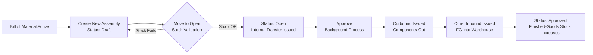
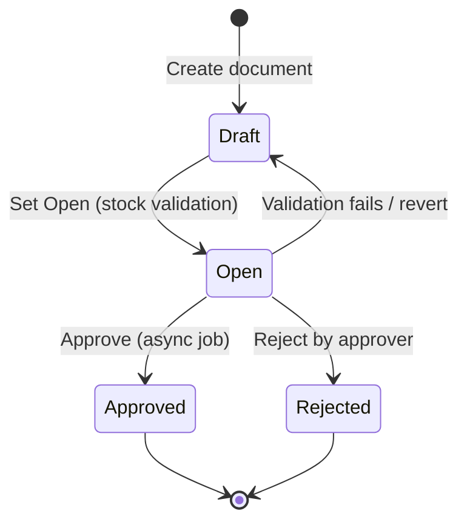
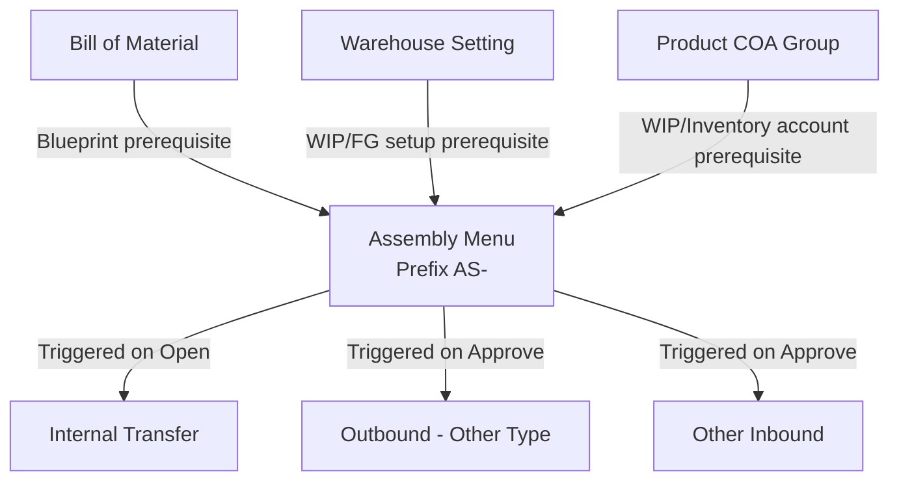

### 📦 Module/Feature: Assembly

**Business definition:**
**Assembly** is an internal production transaction in **OlshopERP** used to build **finished goods** (**Finish Goods / FG**) from several raw **components**, based on the blueprint defined in a **Bill of Material (BOM)**. It turns raw inventory value into ready-to-sell goods as an internal company process — with no vendor, no purchasing, and no sales order involved. Behind the scenes, Assembly acts as a chain generator that triggers downstream documents: **Internal Transfer**, **Outbound**, and **Other Inbound** to record the physical stock movement and the product's financial value together.

### 🔑 Key Terms (Glossary)

* **Assembly:** The internal production module that turns raw components into assembled finished goods. In the *backend*, it uses the older technical name **Work Order**.
* **Bill of Material (BOM) / Header BOM:** The composition/formula blueprint that lists the components needed to produce one finished good.
* **Finish Goods (FG):** The final assembled product, ready to distribute or sell.
* **Building Origin:** The source warehouse that stores the raw components before they move to the production area.
* **WIP Warehouse:** The *Work In Progress* warehouse — the area where components are assembled during production.
* **Finish Good Warehouse:** The destination warehouse that stores the finished goods after assembly.
* **BoM Snapshot:** The system locks a picture of the BOM composition the moment the document moves to **Open**, so future changes to the original BOM formula don't affect a transaction already in progress.
* **Max Assembly Qty:** An indicator of the maximum finished-good quantity the system can build, based on the lowest available component stock at the source warehouse.
* **Sub-Assembly / Nested BOM:** When one of the components is itself a finished good assembled from a lower-level BOM.

### 🎯 When & Why to Use

| ✅ Create an Assembly when | ❌ Don't create an Assembly when |
| :---- | :---- |
| You need to internally turn a set of raw materials/components into new finished-good units, ready to sell or use further. | The components in the **Bill of Material** are inactive, or the BOM has no component details at all. |
| The target product is properly mapped to an **Active Bill of Material** and meets the minimum composition rule. | The accounting setup (*Chart of Accounts / COA*) for the finished good or components is not complete. |
| You want to trace the audit history of goods moving warehouse-to-warehouse: source components → production area → finished-goods warehouse. | You want to create many new production documents at once via *import* from the main list page (not available yet). |

### 📋 Prerequisites

| Prerequisite | Master Data Source | Rule & Limit |
| :---- | :---- | :---- |
| **Active & Valid BOM** | Bill of Material menu | The target product must have an active BOM with a minimum composition: more than one component, OR one component with a quantity greater than 1 unit. |
| **Complete Warehouse Setting** | Warehouse Setting menu | The **WIP Warehouse** and **Finish Good Warehouse** must be set per parent warehouse (**Building**). These aren't typed into the Assembly form — they're inherited automatically from the warehouse settings. |
| **Integrated Product COA Group** | Product COA Group | The finished good and all its components must be mapped to an account group with active **Work In Progress** and **Inventory** accounts (no sub-accounts). |
| **Component Stock Availability** | Warehouse (*Building Tree*) | Physical component stock must be available in sub-warehouses under the chosen parent. The calculation excludes *In Transit* stock and virtual/WIP warehouses. |
| **Valid Fiscal Period** | Accounting Settings | The Assembly transaction date must fall in a booking month that is *open*. |

### 📍 Menu Location & Workspace

You manage internal production from this navigation path:

* **UI navigation path:** Supply Chain → Assembly
* **System UI route:** `/supplychain/assembly`

> 🖼️ **[IMAGE PLACEHOLDER]** — Supply Chain → Assembly sidebar and the list page.

### 🔄 Sub-Assembly / Nested BOM — Why It Must Be Done in Stages

If the system detects a **Sub-Assembly / Nested BOM** — where one component in the main BOM is itself a finished good assembled from a lower-level BOM — Assembly only processes the components **directly** under the parent finished good.
The system does **not** automatically break nested components down to the lowest raw material. So you need to run a separate Assembly for that sub-assembly first, to create its stock in the warehouse, before you can use it as a material in the main finished good's Assembly.

**Example:**
The main finished good **"SKU-JADI-A"** has this BOM:

* **"SKU-SUB-B"** (1 pc) — this component is itself an assembled finished good from another BOM.
* **"SKU-BAHAN-3"** (3 pcs) — a standard raw material.

**Required steps:**

> 1. Create a first Assembly to build **"SKU-SUB-B"** from its own base components until *Approved*, so **"SKU-SUB-B"** stock physically exists in the finished-goods warehouse.
> 2. Create a second Assembly to build **"SKU-JADI-A"** — the system will consume the already-produced **"SKU-SUB-B"** units as a regular component.

### 🔄 Business Process Flow

#### A. Workflow Diagram

#### B. Step Notes

> 1. **Blueprint reference:** The transaction locks the finished good's composition from the active **Bill of Material**.
> 2. **Draft the document:** Fill in the basics — operation date, source material warehouse (**Building Origin**), type, and target finished-good volume.
> 3. **Lock the composition (Open):** Moving from Draft to Open automatically triggers a **BoM Snapshot** to lock the current formula, validates physical component stock at the source, and issues an **Internal Transfer** to move raw materials to the production warehouse (**WIP**).
> 4. **Finalize production (Approve):** An approved document triggers a background chain that issues and approves the **Outbound** (component usage from the production warehouse) and the **Other Inbound** (finished goods added to the destination warehouse).

### 🛡️ Transaction Lifecycle

Assembly uses 4 main statuses to control edit rights and accounting execution:

| Status | System / Financial Meaning | Editable? | UI Buttons & Triggers |
| :---- | :---- | :---- | :---- |
| **Draft** | Early document entry, or a document fixed after a rejection. | Yes | Save, Add Line, Delete, Status Dropdown |
| **Open** | Active status that locks the detail lines. The system issues an **Internal Transfer** to move components to the work area. | No | Approve, Reject, Delete |
| **Approved** | Final stage. All physical stock conversion is done and the accounting journal is locked. | No | Print Label, Show Only |
| **Rejected** | The document was rejected by the approver, cancelling the planned goods movement. | No | Delete, Show Only |

### ⚙️ Step-by-Step Guide

#### Task 1: Create a New Header

> 1. Open `/supplychain/assembly` and start a new Assembly document.
> 2. In the **Basic Information** panel, set the **Transaction Date** (can't be later than today and must be in an open fiscal period).
> 3. Pick the **Building Origin** as the source warehouse for the raw components.
> 4. Set the **Start Date** for assembly and pick a **Type** (Production, Service, Assembly, or Other).
> 5. Add an optional **Description** (max 150 characters).

> 🖼️ **[IMAGE PLACEHOLDER]** — Create Assembly form, header section (Building Origin, Start Date, Type).

#### Task 2: Add the Finished Goods to Build

> 1. Go to the detail grid and use the manual add-product button or the **Excel Import** option.
> 2. Pick an active finished good from master data (only products with an active BOM appear).
> 3. Enter the target production volume in the **Qty** column as a **positive whole number** (the system rejects decimals from the screen).
> 4. Choose the **Unit** (the main base unit or a valid alternate unit).
> 5. Check the **Max Assembly Qty** column that appears automatically — it's the build capacity limit based on the lowest available component stock.

> 🖼️ **[IMAGE PLACEHOLDER]** — Select Product panel and the expanded row showing BoM components + stock availability.

⚠️ **IMPORTANT RULE:** The header fields **Building Origin**, **Transaction Date**, and **Start Date** lock completely once you add at least one finished-good line to the grid. Each finished good can only appear once (no duplicates) in a single Assembly document.

#### Task 3: Change the Status to Open

> 1. Go to the status radio selector in the form sidebar.
> 2. Switch the status from **Draft** to **Open**.
> 3. The system automatically validates the component balance in the background. If the quantity is enough, an **Internal Transfer** from the source to the production warehouse (WIP) is issued and the detail lines lock from manual editing.

> 🖼️ **[IMAGE PLACEHOLDER]** — Draft/Open status radio in the form sidebar.

#### Task 4: Approve & Monitor the Background Process

> 1. Make sure the document is **Open**, then click **Approve** at the top of the form.
> 2. The system runs a background chain to complete the raw-material movement and the finished-goods receipt.
> 3. Track progress via the **Progress Status** column on the list page.
> 4. If an *error* indicator appears on a line because the server queue failed, wait a moment and click **Retry** to re-run without starting over.
> 5. Once the status is fully **Approved**, use the label printing menu as needed.

### 📦 What Happens on Approve (Behind the Scenes)

When you click **Approve**, the system doesn't finish all the bookkeeping instantly. It sends the task to a background job queue that processes each finished good one at a time, in order.
**For each finished-good line, the mechanical sequence is:**

> 1. The system finalizes the **Internal Transfer** of components from the source to the production warehouse (WIP) that was planned during Open.
> 2. The system issues and auto-approves an **Outbound** (Other type) to record the raw components leaving the production warehouse (WIP). This creates the first accounting journal.
> 3. The system issues and auto-approves an **Other Inbound** to record the assembled finished goods entering the finished-goods warehouse. This creates the second accounting journal.

Track the progress percentage in the **Progress Status** column. If the queue breaks midway, the failed line is flagged with an *error* — wait a few minutes, then click **Retry** to continue the remaining lines.

> 🖼️ **[IMAGE PLACEHOLDER]** — Progress Status column on the list page, and the Retry button.

### 📊 Full Field Reference

#### 1. Header (Basic Information)

| Field | Required? | Data Type / Format | Validation & System Behavior |
| :---- | :---- | :---- | :---- |
| **Transaction Code** | — | String / Alphanumeric | Auto-generated and unique with an `AS-` prefix. Locked and unchangeable from creation. |
| **Transaction Date** | Yes | Date | The document's operation date. Can't be later than today (*future date*) and must be in an open fiscal period. |
| **Building Origin** | Yes | Dropdown | Shows the parent warehouses that supply components and already have complete WIP and Finish Good settings in Warehouse Setting. |
| **Start Date** | Yes | Date | The assembly start date. Can't be earlier than the **Transaction Date**. |
| **Type** | Yes | Dropdown | Transaction category: *Production*, *Service*, *Assembly*, or *Other*. |
| **Description** | No | Free text | Internal note (max 150 characters). |
| **Progress Status** | — | Percentage (%) | Automatic indicator of line processing progress in the *background job*. |
| **Status Radio** | — | UI Radio | User control to move the cycle from **Draft** to **Open**. |

#### 2. Detail — Finished Goods

| Field | Data Type / Format | Logic & Limits |
| :---- | :---- | :---- |
| **Select Product** | Master Dropdown | Only shows finished goods with an **Active Bill of Material** and valid components. Each product can appear only once per document. |
| **Qty** | Number | Target finished-good volume. Must be a **positive whole number** greater than 0. The system rejects decimals from the interface. |
| **Unit** | Dropdown | The item unit — main base stock unit or a product alternate unit from **Master Unit**. |
| **Max Assembly Qty** | Info (read-only) | The maximum finished good that can be built, based on the lowest remaining component stock at the source. |

### 🛡️ Business Rules & System Validation

* **If you** set the **Transaction Date** to a future date, **the system** rejects the document and shows a validation error.
* **If you** set the **Start Date** earlier than the **Transaction Date**, **the system** fails the save.
* **If you** add a finished good whose **Bill of Material** isn't *Active* or has an empty formula, **the system** blocks it from the dropdown.
* **If you** add the same finished good twice to the same detail grid, **the system** rejects the duplicate line.
* **If you** type a manual production quantity with decimals, **the system** rejects it through the interface.
* **If you** change, add, or delete a detail line after the document has left **Draft**, **the system** blocks the action.
* **If you** move to **Open** but the **Building Origin** hasn't set up its **WIP Warehouse** or **Finish Good Warehouse**, **the system** rejects it and asks you to finish **Warehouse Setting** first.
* **If you** pick **Open** but a component or finished good isn't configured with its accounts, **the system** fails the save because the **Product COA Group** is incomplete.
* **If you** move to **Open** but a component's stock at the source warehouse is insufficient, **the system** rejects the whole move and returns the document to **Draft** with an out-of-stock notice.
* **If you** pick a **Building Origin** that's the same as the destination production warehouse (**WIP Warehouse**), **the system** blocks the transaction.
* **If you** click **Approve** while the document isn't **Open**, **the system** cancels the approval.
* **If you** click **Approve** while the detail grid is empty with no items, **the system** fails the authorization.
* **If you** click **Approve** while an *error* flag from a previous queue is unresolved, **the system** rejects the execution.
* **If you** click **Approve** repeatedly while the server's *background job* is still processing, **the system** temporarily blocks it and asks you to wait for the queue to finish.
* **If you** click **Approve** while a component in the BOM formula has been set to *inactive*, **the system** fails the accounting transaction.
* **If you** try to **Delete** an Assembly that's already **Approved**, **the system** blocks the deletion (Delete is only for **Draft** or **Open**).
* **If you** add detail lines (manually or via Excel Import) beyond the system's maximum quota, **the system** rejects the whole document.

### 📥 Excel Import (Finished Goods)

The file upload speeds up adding finished-good lines to the detail grid in bulk using the system's standard template file.

> 🖼️ **[IMAGE PLACEHOLDER]** — Excel Import panel with the download-template button.

🛑 **NOTE:** Import currently **only** adds **finished-good detail lines** to **one existing Assembly voucher** that is **still in Draft**. The system does **not** yet support creating many new Assembly header documents at once via an Excel file from the main list page.

**Excel Template Columns:**

| Column | Excel Header | Required? | Data Type / Value | Rule & Validation |
| :---- | :---- | :---- | :---- | :---- |
| **A** | Product ID | Required if SKU empty | Number | The unique product ID (*System Product ID*). Either Product ID or SKU must be valid. |
| **B** | System Product SKU | Required if ID empty | String / Alphanumeric | The active finished-good SKU. Acts as a fallback if Product ID is left empty. |
| **C** | Qty | Yes | Number | The finished-good volume to produce. Must be a positive whole number greater than 0. |
| **D** | Unit | Yes | Text | The finished-good unit code. Must match the product's base or alternate unit in the system. |

**Key Import Rules:**

* Keep the header row (first row) as in the original *template* — don't move or rename it.
* The file must have at least 1 valid data row.
* Every uploaded finished good must have an active **Bill of Material**.
* No finished good may appear twice (no duplicates) in one file.
* The number of rows must not exceed the system quota (contact IT admin for the latest parameter).
* Excel import only succeeds while the transaction is still in **Draft**.

### 📊 Accounting Impact / Journal

📄 **KEY ACCOUNTING RULE:** The Assembly document **itself never posts an accounting journal** to the ledger. All journal recognition is posted automatically by **two downstream documents** created in a chain when **Approve** succeeds.
The financial value is calculated precisely from the total real cost of all raw components consumed to build the finished-good unit.

**1. First Downstream Journal — Component Usage from the Production Warehouse**
Created automatically via an **Outbound** document (*Other Outbound* type) to recognize the raw-material consumption in the assembly area:

| Journal Position | Ledger Account | Financial Note |
| :---- | :---- | :---- |
| **DEBIT** | **Work In Progress (WIP)** | The raw component value is allocated to the work-in-progress asset. |
| **CREDIT** | **Inventory** | The component inventory value decreases as it leaves the warehouse. |

**2. Second Downstream Journal — Finished-Goods Receipt into the Final Warehouse**
Created automatically via an **Other Inbound** document to recognize the newly assembled finished goods:

| Journal Position | Ledger Account | Financial Note |
| :---- | :---- | :---- |
| **DEBIT** | **Inventory** | The finished-goods inventory value increases on the balance sheet. |
| **CREDIT** | **Work In Progress (WIP)** | The work-in-progress clearing account is closed out (zeroed again). |

### 🛑 Not Yet Available / Under Development

The features below are **intentionally deferred** by the product team to keep the core system stable — **not a bug**:

* **Bulk Assembly Header creation via Import on the DataList:** You can't yet create many new Assembly documents at once from the DataList page using an Excel file. Stable bulk import is only for adding **finished-good lines (detail)** inside one document in **Draft**. Bulk creation automation is on the future *roadmap*.

### 🖨️ Export & Print

* **Collective Data Export:** Download a summary of Assembly transaction data in bulk from the main list page to an external file format.
* **Specific Label Printing:** Once the document is **Approved**, three physical logistics label options become available for identifying goods in the warehouse:
  1. **SKU Label** — the stock identity code for a single finished-good unit.
  2. **BOX Label** — the packaging/carton marker label.
  3. **SID Label** — the unique *Stock ID* code for internal tracking.

> 🖼️ **[IMAGE PLACEHOLDER]** — Print buttons for the SKU/BOX/SID labels.

### 🔗 How This Menu Connects to Others

| Related Menu | Role Toward the Assembly Module |
| :---- | :---- |
| **Bill of Material** | Provides the composition blueprint. Assembly won't work if the finished good has no valid active BOM. |
| **Warehouse Setting** | Supplies the automatic mapping of **WIP Warehouse** and **Finish Good Warehouse** per parent warehouse. |
| **Product COA Group** | The source for the **Work In Progress** and **Inventory** account mapping for ledger journals. |
| **Internal Transfer** | The logistics document issued automatically on **Open** to move materials from the source to the production warehouse. |
| **Outbound (Other Type)** | The downstream document processed automatically on **Approve** to deduct raw stock in WIP and post the *Work In Progress* debit. |
| **Other Inbound** | The downstream receiving document issued automatically on **Approve** to add the physical finished-goods balance. |
| **Master Unit** | Provides the unit conversion factors (e.g., Box to Pack) when the user changes the unit choice. |

### 🛠️ Troubleshooting

| Symptom | Likely Cause | Fix |
| :---- | :---- | :---- |
| The finished good doesn't appear in the detail grid dropdown. | The product's **Bill of Material** isn't active, the product accounts aren't complete, or the composition fails the minimum rule. | Open the **Bill of Material** master, check the active status, and make sure the components meet the minimum quantity rule. |
| The system rejects moving the status from Draft to Open. | The component stock at the source sub-warehouse isn't enough for the production target. | Audit stock availability (expand the finished-good row). Do an inbound stock movement first if the balance is empty. |
| Moving to Open fails with a message that the production/finished-goods warehouse isn't set. | The WIP/FG warehouse configuration is still empty in the master. | Open **Warehouse Setting**, find the related parent warehouse, and complete the WIP and FG warehouse coordinates. |
| Approve fails with an accounting (*COA*) error. | A finished good or component has no **Work In Progress** or **Inventory** account mapping. | Open **Product COA Group** and complete the account mapping per accounting guidance. |
| Approval is cancelled with an inactive-component message. | A component in the BOM was deactivated from the master while assembly was running. | Reactivate the component in master data, or update the formula in **Bill of Material**. |
| Progress Status looks stuck or processes for a very long time. | The background job queue for thousands of rows hit a load spike or a network issue. | Wait a few minutes, reload the page, then click **Retry** on the related line. |
| Excel import fails with a "format mismatch" message. | The header row in the Excel file was changed by accident. | Download the original *template* again from the import panel and enter data without changing the header row. |
| The **Delete** button is locked or unresponsive. | The document is already **Approved**. | The system blocks deleting accounting-valid documents. Delete is only for **Draft** or **Open**. |

### ❓ Frequently Asked Questions (FAQ)

**Q: What's the difference between the Building Origin field and the Finish Good warehouse?**
A: **Building Origin** is the source warehouse for raw components (picked manually when you build the header). The **Finish Good** warehouse is the final destination for finished goods — its location is set automatically from **Warehouse Setting**, not typed into the form.

**Q: Why must the document go to Open before Approve?**
A: The **Open** status is when the system issues the **Internal Transfer** to lock the material movement from the source to the production warehouse (WIP). Without Open, the components aren't allocated and the material consumption at **Approve** can't run properly.

**Q: Does changing the Bill of Material formula automatically fix an Assembly already in progress?**
A: BOM changes only affect an Assembly still in **Draft** or **Open**. Once **Approved**, the system already took a **BoM Snapshot**, so the old assembly record is safe from the new formula.

**Q: Can I assemble several different finished goods in one Assembly document?**
A: Yes. Add several different finished-good detail lines in one document, as long as each finished good appears only once (no duplicates).

**Q: Does Assembly get triggered automatically by a Sales Order?**
A: No. In the current version, Assembly is a standalone internal fulfillment instruction and isn't connected to any trigger from sales transactions (*Sales Order*).

**Q: Can I enter the finished-good quantity as a decimal?**
A: Not from the interface. The system requires a positive whole number on the form. The engine can calculate decimals internally during unit conversion (e.g., Box to Pack), but it always rounds down before displaying or saving.

### 📑 See Also / Related Documents

* **Bill of Material** — the composition formula blueprint (the main prerequisite).
* **Warehouse Setting** — configuration for the production (WIP) & finished-goods (FG) warehouses.
* **Product COA Group** — product financial account mapping (WIP & Inventory).
* **Internal Transfer** — the document that moves components to the production warehouse.
* **Outbound** — component release from the production warehouse (first journal).
* **Other Inbound** — receipt of the assembled finished goods (second journal).
* **Master Unit** — product unit conversion factors.
