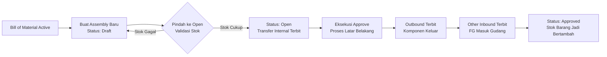
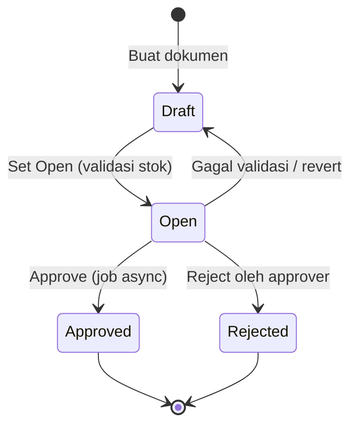
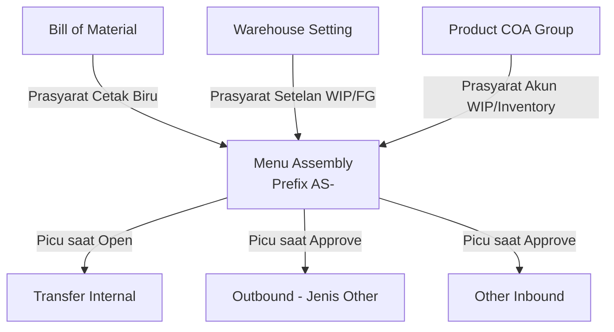

### 📦 Modul/Fitur: Assembly

**Definisi Bisnis:**
**Assembly** adalah transaksi produksi internal di **OlshopERP** untuk merakit **barang jadi** (**Finish Goods / FG**) dari beberapa **komponen** baku berdasarkan cetak biru yang didefinisikan pada **Bill of Material (BOM)**. Fitur ini mengubah nilai persediaan mentah menjadi barang siap jual sebagai proses internal perusahaan — tanpa melibatkan vendor, pembelian (*purchasing*), maupun pesanan penjualan (*sales order*). Secara arsitektur, Assembly bertindak sebagai generator berantai yang memicu dokumen hilir: **Transfer Internal**, **Outbound**, dan **Other Inbound** untuk mencatat pergerakan fisik stok sekaligus pengakuan nilai finansial produk.

### 🔑 Istilah Kunci (Glosarium)

* **Assembly:** Modul transaksi produksi internal untuk mengubah komponen baku menjadi barang jadi rakitan. Di *backend*, fitur ini memakai nama teknis lama **Work Order**.
* **Bill of Material (BOM) / Header BOM:** Cetak biru komposisi/formula yang mendaftarkan komponen penyusun untuk menghasilkan satu barang jadi.
* **Finish Goods (FG):** Barang jadi hasil akhir perakitan yang siap didistribusikan atau dijual.
* **Building Origin:** Gudang induk asal tempat penyimpanan komponen baku awal sebelum dipindahkan ke area produksi.
* **WIP Warehouse:** Gudang *Work In Progress* (barang dalam proses) — area tempat komponen dirakit selama produksi berlangsung.
* **Finish Good Warehouse:** Gudang tujuan akhir untuk menyimpan barang jadi hasil rakitan.
* **BoM Snapshot:** Sistem mengunci gambar struktur komposisi BOM secara instan saat dokumen berpindah ke status **Open**, agar perubahan formula BOM asli di masa depan tidak memengaruhi transaksi yang sedang berjalan.
* **Max Assembly Qty:** Indikator batas maksimal kuantitas barang jadi yang bisa dirakit sistem, berdasarkan ketersediaan stok komponen paling minimum di gudang asal.
* **Sub-Assembly / Nested BOM:** Kondisi di mana salah satu komponen penyusun ternyata juga barang jadi hasil rakitan dari BOM tingkat di bawahnya.

### 🎯 Kapan & Kenapa Dipakai

| ✅ Buat Assembly jika | ❌ Jangan buat Assembly jika |
| :---- | :---- |
| Ada kebutuhan internal mengubah sekumpulan material/komponen baku menjadi unit barang jadi baru yang siap dijual atau dipakai lebih lanjut. | Komponen dalam **Bill of Material** berstatus tidak aktif (*inactive*) atau BOM tidak punya rincian komponen sama sekali. |
| Produk target sudah terpetakan valid pada master **Bill of Material** berstatus **Active** dan memenuhi aturan komposisi minimum. | Pengaturan akun keuangan (*Chart of Accounts / COA*) untuk barang jadi maupun komponen belum lengkap. |
| Ingin melacak histori audit perpindahan barang antar gudang secara berantai, dari komponen asal → area produksi → gudang barang jadi. | Ingin membuat banyak dokumen produksi baru sekaligus lewat *import* file dari halaman daftar utama (belum tersedia). |

### 📋 Prasyarat Operasional

| Prasyarat | Sumber Master Data | Aturan & Batasan |
| :---- | :---- | :---- |
| **BOM Active & Valid** | Menu Bill of Material | Produk tujuan wajib punya BOM aktif dengan komposisi minimal: lebih dari satu komponen, ATAU satu komponen dengan kuantitas lebih dari 1 unit. |
| **Warehouse Setting Lengkap** | Menu Warehouse Setting | **WIP Warehouse** dan **Finish Good Warehouse** wajib disetel per gudang induk (**Building**). Nilai ini tidak diisi di form Assembly, melainkan diwarisi otomatis dari menu pengaturan gudang. |
| **Product COA Group Terintegrasi** | Product COA Group | Barang jadi dan seluruh komponennya wajib terpetakan ke kelompok akun yang punya setelan akun **Work In Progress** dan **Inventory** aktif tanpa sub-akun. |
| **Ketersediaan Stok Komponen** | Gudang (*Building Tree*) | Saldo stok fisik komponen harus tersedia di sub-gudang di bawah gudang induk terpilih. Perhitungan tidak menyertakan stok *In Transit* atau gudang virtual/WIP. |
| **Periode Fiskal Valid** | Setting Akuntansi | Tanggal transaksi Assembly harus berada di bulan pembukuan yang berstatus terbuka (*open*). |

### 📍 Lokasi Menu & Workspace

Pengelolaan modul produksi internal diakses lewat jalur navigasi berikut:

* **Jalur Navigasi UI:** Supply Chain → Assembly
* **Route UI Sistem:** `/supplychain/assembly`

> 🖼️ **[PLACEHOLDER GAMBAR]** — Sidebar navigasi Supply Chain → Assembly, dan tampilan halaman list.

### 🔄 Sub-Assembly / Nested BOM — Kenapa Harus Bertahap

Jika sistem mendeteksi struktur **Sub-Assembly / Nested BOM** — yaitu salah satu komponen di BOM utama ternyata barang jadi hasil rakitan dari BOM tingkat bawah — Assembly hanya memproses komponen yang berada **langsung** di bawah barang jadi induknya.
Sistem **tidak** otomatis membongkar komponen bertingkat sampai material dasar paling bawah. Konsekuensinya, Anda perlu mengeksekusi Assembly terpisah untuk sub-rakitan itu lebih dulu agar saldo stoknya tersedia di gudang, baru bisa dipakai sebagai bahan pada Assembly barang jadi utama.

**Contoh Kasus:**
Barang jadi utama **"SKU-JADI-A"** punya formula BOM:

* **"SKU-SUB-B"** (1 pcs) — komponen ini adalah barang jadi rakitan dari BOM lain.
* **"SKU-BAHAN-3"** (3 pcs) — material baku standar.

**Langkah yang wajib dilakukan:**

> 1. Buat dokumen Assembly pertama untuk merakit **"SKU-SUB-B"** dari komponen dasarnya hingga *Approved*, sehingga saldo **"SKU-SUB-B"** tersedia fisik di gudang barang jadi.
> 2. Terbitkan dokumen Assembly kedua untuk memproses **"SKU-JADI-A"** — sistem akan menyerap unit **"SKU-SUB-B"** yang sudah diproduksi sebagai komponen material biasa.

### 🔄 Alur Proses Bisnis

#### A. Diagram Alur Kerja

#### B. Keterangan Langkah Bisnis

> 1. **Inisiasi cetak biru:** Transaksi mengunci referensi komposisi produk jadi dari master **Bill of Material** yang aktif.
> 2. **Penyusunan dokumen (Draft):** Isi informasi dasar — tanggal operasional, gudang asal material (**Building Origin**), tipe, dan volume target barang jadi.
> 3. **Kunci komposisi (Open):** Berpindah dari Draft ke Open otomatis memicu **BoM Snapshot** untuk mengunci formula terkini, memvalidasi stok fisik komponen di gudang asal, dan menerbitkan **Transfer Internal** untuk memindahkan bahan baku ke gudang produksi (**WIP**).
> 4. **Finalisasi produksi (Approve):** Dokumen yang disetujui memicu proses berantai di belakang layar yang menerbitkan sekaligus menyetujui **Outbound** (pemakaian komponen dari gudang produksi) dan **Other Inbound** (penambahan fisik barang jadi ke gudang tujuan).

### 🛡️ Siklus Status Transaksi

Transaksi Assembly memakai 4 status utama untuk mengatur hak edit dan eksekusi pembukuan:

| Nama Status | Definisi Sistem / Finansial | Bisa Diedit? | Tombol UI & Pemicu Aksi |
| :---- | :---- | :---- | :---- |
| **Draft** | Tahap awal pengisian dokumen, atau hasil perbaikan data setelah penolakan. | Ya | Save, Add Line, Delete, Dropdown Status |
| **Open** | Status aktif yang mengunci baris detail. Sistem menerbitkan **Transfer Internal** untuk memindahkan komponen ke area kerja. | Tidak | Approve, Reject, Delete |
| **Approved** | Tahap akhir. Seluruh konversi fisik stok selesai dan jurnal akuntansi terkunci. | Tidak | Print Label, Show Only |
| **Rejected** | Dokumen ditolak approver, membatalkan rencana mutasi barang. | Tidak | Delete, Show Only |

### ⚙️ Panduan Penggunaan Langkah Demi Langkah

#### Task 1: Inisiasi Dokumen Header Baru

> 1. Buka `/supplychain/assembly` lalu klik aksi buat dokumen Assembly baru.
> 2. Pada panel **Basic Information**, isi **Transaction Date** (tidak boleh melebihi hari ini dan wajib di periode fiskal terbuka).
> 3. Pilih **Building Origin** sebagai gudang induk penyuplai komponen baku awal.
> 4. Tentukan **Start Date** perakitan dan pilih kategori **Type** (Production, Service, Assembly, atau Other).
> 5. Isi **Description** opsional (maksimal 150 karakter).

> 🖼️ **[PLACEHOLDER GAMBAR]** — Form Create Assembly, bagian header (Building Origin, Start Date, Type).

#### Task 2: Menambahkan Barang Jadi yang Akan Dirakit

> 1. Pindah ke grid baris detail, gunakan tombol tambah produk manual atau opsi **Import Excel**.
> 2. Pilih barang jadi aktif dari master data (hanya produk dengan BOM aktif yang muncul).
> 3. Isi target volume produksi pada kolom **Qty** dengan **bilangan bulat positif** (sistem menolak input desimal dari layar).
> 4. Tentukan **Unit** (satuan dasar utama atau satuan alternatif produk yang sah).
> 5. Perhatikan kolom **Max Assembly Qty** yang muncul otomatis sebagai batas kapasitas perakitan berdasarkan stok komponen paling minimum.

> 🖼️ **[PLACEHOLDER GAMBAR]** — Panel pemilihan produk (Select Product) dan expand baris yang menampilkan komponen BoM + ketersediaan stok.

⚠️ **ATURAN PENTING:** Field header **Building Origin**, **Transaction Date**, dan **Start Date** otomatis terkunci total begitu ada minimal 1 baris detail barang jadi di grid. Satu jenis barang jadi hanya boleh terdaftar satu kali (tidak boleh duplikat) dalam satu dokumen Assembly.

#### Task 3: Mengubah Status Dokumen ke Open

> 1. Arahkan ke tombol selektor radio status di sidebar form.
> 2. Geser status dari **Draft** ke **Open**.
> 3. Sistem otomatis memvalidasi saldo komponen di latar belakang. Jika kuantitas mencukupi, **Transfer Internal** dari gudang asal ke gudang produksi (WIP) diterbitkan dan baris detail terkunci dari edit manual.

> 🖼️ **[PLACEHOLDER GAMBAR]** — Radio pilihan status Draft/Open di sidebar form.

#### Task 4: Eksekusi Approval & Pemantauan Latar Belakang

> 1. Pastikan dokumen berstatus **Open**, lalu klik **Approve** di bagian atas form.
> 2. Sistem mengeksekusi proses berantai di belakang layar untuk menyelesaikan perpindahan stok baku dan penerimaan barang jadi.
> 3. Pantau kemajuan lewat kolom **Progress Status** di halaman daftar.
> 4. Jika ada indikator kesalahan (*error*) pada baris tertentu akibat kegagalan antrean server, tunggu sebentar lalu klik **Retry** untuk memicu ulang tanpa input dari awal.
> 5. Setelah status menjadi **Approved** penuh, gunakan menu cetak label sesuai kebutuhan gudang.

### 📦 Apa yang Terjadi Saat Approve (Proses di Belakang Layar)

Saat Anda menekan **Approve**, sistem tidak menyelesaikan seluruh pembukuan seketika, tetapi melempar tugas ke antrean latar belakang (*background job*) untuk memproses setiap barang jadi satu per satu secara berurutan.
**Untuk tiap baris barang jadi, urutan mekaniknya:**

> 1. Sistem memfinalisasi **Transfer Internal** komponen dari gudang asal ke gudang produksi (WIP) yang sebelumnya direncanakan saat Open.
> 2. Sistem menerbitkan dan menyetujui otomatis **Outbound** (tipe Other) untuk mencatat pemakaian komponen baku yang keluar dari gudang produksi (WIP). Tahap ini membentuk jurnal akuntansi pertama.
> 3. Sistem menerbitkan dan menyetujui otomatis **Other Inbound** untuk mencatat masuknya unit barang jadi hasil rakitan ke gudang barang jadi. Tahap ini membentuk jurnal akuntansi kedua.

Pantau persentase kemajuan lewat kolom **Progress Status**. Jika antrean terputus di tengah jalan, baris yang gagal ditandai indikator *error* — beri jeda beberapa menit, lalu klik **Retry** untuk melanjutkan sisa baris yang tertunda.

> 🖼️ **[PLACEHOLDER GAMBAR]** — Kolom Progress Status di halaman daftar, dan tombol Retry.

### 📊 Referensi Field Lengkap

#### 1. Header (Basic Information)

| Field | Wajib? | Tipe Data / Format | Aturan Validasi & Perilaku Sistem |
| :---- | :---- | :---- | :---- |
| **Transaction Code** | — | String / Alfanumerik | Otomatis unik dengan awalan `AS-`. Terkunci dan tidak bisa diubah sejak dokumen dibuat. |
| **Transaction Date** | Ya | Date | Tanggal operasional dokumen. Tidak boleh melebihi hari ini (*future date*) dan wajib di periode fiskal terbuka. |
| **Building Origin** | Ya | Dropdown | Menampilkan gudang induk penyuplai komponen yang sudah punya setelan WIP dan Finish Good lengkap di Warehouse Setting. |
| **Start Date** | Ya | Date | Tanggal mulai perakitan. Tidak boleh lebih awal dari **Transaction Date**. |
| **Type** | Ya | Dropdown | Kategori transaksi: *Production*, *Service*, *Assembly*, atau *Other*. |
| **Description** | Tidak | Teks bebas | Catatan internal (maksimal 150 karakter). |
| **Progress Status** | — | Persentase (%) | Indikator otomatis kemajuan pemrosesan baris di *background job*. |
| **Status Radio** | — | Radio UI | Kontrol pengguna untuk memindahkan siklus dari **Draft** ke **Open**. |

#### 2. Detail — Barang Jadi (Finish Goods)

| Field | Tipe Data / Format | Aturan Logika & Batasan |
| :---- | :---- | :---- |
| **Pilih Produk** | Master Dropdown | Hanya menampilkan barang jadi dengan **Bill of Material** berstatus **Active** dan komponen valid. Satu produk hanya boleh terdaftar sekali per dokumen. |
| **Qty** | Angka | Target volume unit barang jadi. Wajib **bilangan bulat positif** lebih besar dari 0. Sistem menolak desimal dari antarmuka. |
| **Unit** | Dropdown | Satuan barang, bisa satuan dasar stok utama maupun alternatif produk dari **Master Unit**. |
| **Max Assembly Qty** | Info (read-only) | Batas maksimal produk jadi yang bisa dirakit berdasarkan sisa stok komponen terkecil di gudang asal. |

### 🛡️ Aturan Bisnis & Validasi Sistem

* **Kalau kamu** mengisi **Transaction Date** dengan tanggal mendatang (*future date*), **maka sistem** menolak dokumen dan menampilkan error validasi.
* **Kalau kamu** mengisi **Start Date** lebih awal dari **Transaction Date**, **maka sistem** menggagalkan penyimpanan formulir.
* **Kalau kamu** memasukkan barang jadi yang **Bill of Material**-nya belum *Active* atau formulanya kosong, **maka sistem** memblokir produk itu dari dropdown.
* **Kalau kamu** memasukkan produk jadi sejenis dua kali ke grid detail yang sama, **maka sistem** menolak baris duplikat.
* **Kalau kamu** mengetik kuantitas produksi manual dengan angka desimal, **maka sistem** menolak input tersebut lewat antarmuka.
* **Kalau kamu** mengubah, menambah, atau menghapus baris detail saat dokumen sudah meninggalkan status **Draft**, **maka sistem** memblokir aksi tersebut.
* **Kalau kamu** memindahkan status ke **Open** tetapi **Building Origin** belum melengkapi setelan **WIP Warehouse** atau **Finish Good Warehouse**, **maka sistem** menolak dan mengarahkan Anda menyelesaikan **Warehouse Setting** dulu.
* **Kalau kamu** memilih **Open** tetapi salah satu komponen/barang jadi belum dikonfigurasi bagan akunnya, **maka sistem** menggagalkan penyimpanan karena **Product COA Group** tidak lengkap.
* **Kalau kamu** memindahkan ke **Open** tetapi saldo salah satu komponen baku di gudang asal tidak cukup, **maka sistem** menolak keseluruhan dan mengembalikan dokumen ke **Draft** disertai notifikasi saldo kurang.
* **Kalau kamu** memilih **Building Origin** yang sama dengan gudang produksi (**WIP Warehouse**) tujuannya, **maka sistem** memblokir transaksi.
* **Kalau kamu** menekan **Approve** saat dokumen belum berstatus **Open**, **maka sistem** membatalkan proses persetujuan.
* **Kalau kamu** menekan **Approve** saat grid detail masih kosong tanpa item, **maka sistem** menggagalkan otorisasi.
* **Kalau kamu** menekan **Approve** saat masih ada indikator kesalahan (*error*) dari antrean sebelumnya yang belum tuntas, **maka sistem** menolak eksekusi.
* **Kalau kamu** menekan **Approve** berulang kali saat *background job* server masih memproses data, **maka sistem** menolak sementara dan meminta menunggu antrean selesai.
* **Kalau kamu** menekan **Approve** saat salah satu komponen dalam rumus BOM telah diubah menjadi non-aktif (*inactive*), **maka sistem** menggagalkan transaksi pembukuan.
* **Kalau kamu** menghapus dokumen (**Delete**) Assembly yang sudah **Approved**, **maka sistem** memblokir penghapusan (Delete hanya untuk status **Draft** atau **Open**).
* **Kalau kamu** memasukkan total baris detail (manual maupun Import Excel) melebihi batas kuota maksimal sistem, **maka sistem** menolak seluruh dokumen.

### 📥 Import Excel (Barang Jadi)

Fasilitas unggah berkas dipakai untuk mempercepat penambahan baris barang jadi ke grid detail secara massal memakai file *template* standar sistem.

> 🖼️ **[PLACEHOLDER GAMBAR]** — Panel Import Excel dengan tombol download template.

🛑 **PERHATIAN:** Impor saat ini **hanya** untuk **menambahkan baris detail barang jadi** ke **satu voucher Assembly** yang sudah dibuat dan **masih berstatus Draft**. Sistem **belum** mendukung pembuatan banyak dokumen header Assembly sekaligus lewat file Excel dari halaman daftar utama.

**Spesifikasi & Struktur Kolom Template Excel:**

| Kolom | Nama Header Excel | Wajib? | Tipe Data / Isi | Aturan & Fungsi Validasi |
| :---- | :---- | :---- | :---- | :---- |
| **A** | Product ID | Wajib jika SKU kosong | Angka | ID unik produk (*System Product ID*). Salah satu dari Product ID atau SKU wajib valid. |
| **B** | System Product SKU | Wajib jika ID kosong | String / Alfanumerik | Kode SKU barang jadi aktif. Cadangan penentu jika Product ID dikosongkan. |
| **C** | Qty | Ya | Angka | Volume barang jadi yang diproduksi. Wajib bilangan bulat positif lebih besar dari 0. |
| **D** | Unit | Ya | Teks | Kode satuan barang jadi. Harus cocok dengan satuan dasar atau alternatif produk di sistem. |

**Aturan Penting Impor:**

* Baris judul kolom (baris pertama) wajib dibiarkan sesuai *template* asli — jangan diubah posisi atau namanya.
* File minimal wajib berisi 1 baris data valid.
* Semua produk jadi yang diunggah wajib punya **Bill of Material** aktif.
* Dilarang ada barang jadi sejenis muncul dua kali (duplikat) dalam satu file.
* Jumlah baris tidak boleh melampaui batas kuota sistem (hubungi administrator IT untuk parameter terbaru).
* Impor Excel hanya berhasil selama transaksi masih berstatus **Draft**.

### 📊 Dampak Akuntansi / Jurnal

📄 **KETENTUAN UTAMA:** Dokumen Assembly **sendiri tidak pernah mencatat jurnal keuangan** di buku besar. Seluruh pengakuan jurnal dicatat otomatis oleh **dua dokumen turunan** yang dibuat berantai saat **Approve** berjalan sukses.
Nilai finansial dihitung presisi berdasarkan total biaya riil seluruh komponen baku yang diserap untuk merakit unit barang jadi.

**1. Jurnal Dokumen Turunan Pertama — Pengeluaran Komponen dari Gudang Produksi**
Dibuat otomatis lewat dokumen **Outbound** (jenis *Other Outbound*) untuk mengakui konsumsi bahan baku di area perakitan:

| Posisi Jurnal | Akun Buku Besar | Keterangan Finansial |
| :---- | :---- | :---- |
| **DEBIT** | **Work In Progress (WIP)** | Nilai komponen baku dialokasikan ke aset barang dalam proses. |
| **CREDIT** | **Inventory** | Saldo nilai persediaan komponen berkurang karena keluar gudang. |

**2. Jurnal Dokumen Turunan Kedua — Penerimaan Barang Jadi ke Gudang Akhir**
Dibuat otomatis lewat dokumen **Other Inbound** untuk mengakui barang jadi rakitan baru:

| Posisi Jurnal | Akun Buku Besar | Keterangan Finansial |
| :---- | :---- | :---- |
| **DEBIT** | **Inventory** | Saldo nilai persediaan barang jadi bertambah di neraca. |
| **CREDIT** | **Work In Progress (WIP)** | Akun clearing barang dalam proses ditutup bersih (dinolkan kembali). |

### 🛑 Yang Belum Tersedia / Masih Dalam Pengembangan

Fungsi berikut **sengaja ditunda** oleh tim produk demi menjaga stabilitas sistem inti — **bukan bug**:

* **Pembuatan Massal Header Assembly via Import di DataList:** Belum tersedia kemampuan menerbitkan banyak dokumen Assembly baru sekaligus dari halaman DataList memakai file Excel. Impor massal yang stabil baru untuk menambah **baris barang jadi (detail)** di dalam satu dokumen berstatus **Draft**. Otomatisasi pembuatan massal masuk *roadmap* versi mendatang.

### 🖨️ Fitur Export & Cetak (Print)

* **Export Data Kolektif:** Unduh ringkasan manifes data transaksi Assembly secara massal lewat tombol di halaman daftar utama ke format file eksternal.
* **Cetak Label Spesifik:** Setelah dokumen **Approved**, tersedia tiga pilihan cetak label logistik fisik untuk identifikasi barang di gudang:
  1. **Label SKU** — kode identitas stok satuan produk jadi.
  2. **Label BOX** — label penanda kemasan kardus/wadah logistik.
  3. **Label SID** — kode identitas unik *Stock ID* untuk pelacakan internal.

> 🖼️ **[PLACEHOLDER GAMBAR]** — Tombol Print untuk label SKU/BOX/SID.

### 🔗 Hubungan Antar Menu Sistem

| Menu Terkait | Peran Terhadap Modul Assembly |
| :---- | :---- |
| **Bill of Material** | Penyedia blueprint komposisi bahan baku. Assembly tidak berfungsi jika produk jadi belum punya BOM aktif yang valid. |
| **Warehouse Setting** | Sumber pemetaan otomatis lokasi **WIP Warehouse** dan **Finish Good Warehouse** per gudang induk. |
| **Product COA Group** | Sumber pemetaan akun **Work In Progress** dan **Inventory** untuk penjurnalan buku besar. |
| **Transfer Internal** | Dokumen perantara logistik yang terbit otomatis saat status **Open**, memindahkan material dari gudang asal ke gudang produksi. |
| **Outbound (Jenis Other)** | Dokumen hilir yang diproses otomatis saat **Approve** untuk memotong stok baku di WIP dan mencatat debit *Work In Progress*. |
| **Other Inbound** | Dokumen hilir penampung akhir yang terbit otomatis saat **Approve** untuk menambah saldo fisik barang jadi. |
| **Master Unit** | Penyedia faktor konversi ukuran produk (mis. Box ke Pack) saat user mengubah pilihan satuan. |

### 🛠️ Panduan Troubleshooting

| Gejala Masalah | Kemungkinan Penyebab | Langkah Koreksi |
| :---- | :---- | :---- |
| Nama barang jadi tidak muncul di dropdown grid detail. | **Bill of Material** produk belum aktif, akun produk belum lengkap, atau komposisi tidak memenuhi aturan minimum. | Buka master **Bill of Material**, cek status aktif dan pastikan komponen memenuhi syarat kuantitas minimum. |
| Sistem menolak saat memindahkan status Draft ke Open. | Saldo stok komponen baku di sub-gudang asal tidak cukup untuk target produksi. | Audit ketersediaan stok (expand baris barang jadi). Lakukan mutasi barang masuk dulu jika saldo kosong. |
| Pindah ke Open gagal disertai pesan gudang produksi/barang jadi belum disetel. | Konfigurasi gudang WIP/FG masih kosong di master. | Buka **Warehouse Setting**, cari gudang induk terkait, lengkapi koordinat gudang WIP dan FG. |
| Approve gagal dengan pesan error akun keuangan (*COA*). | Salah satu produk jadi/komponen belum punya pemetaan akun **Work In Progress** atau **Inventory**. | Buka **Product COA Group**, lengkapi pemetaan akun sesuai panduan divisi akuntansi. |
| Approval dibatalkan dengan pesan komponen tidak aktif. | Salah satu komponen di BOM dinonaktifkan dari master saat perakitan berjalan. | Aktifkan kembali komponen di master data, atau perbarui formula di **Bill of Material**. |
| Progress Status macet / memproses sangat lama. | Antrean ribuan baris data di *background job* mengalami lonjakan beban atau gangguan jaringan. | Beri jeda beberapa menit, muat ulang halaman, lalu klik **Retry** pada baris terkait. |
| Import Excel gagal dengan notifikasi format tidak sesuai. | Baris judul kolom (*header*) di file Excel diubah tanpa sengaja. | Unduh ulang *template* asli lewat panel impor, isi data tanpa mengubah baris judul kolom. |
| Tombol **Delete** terkunci / tidak merespons. | Dokumen sudah berstatus **Approved**. | Sistem melarang menghapus dokumen yang sah secara akuntansi. Delete hanya untuk **Draft** atau **Open**. |

### ❓ Pertanyaan yang Sering Diajukan (FAQ)

**Q: Apa beda field Building Origin dengan gudang Finish Good?**
A: **Building Origin** adalah gudang induk asal komponen baku (dipilih manual saat menyusun header). Gudang **Finish Good** adalah tujuan akhir barang jadi — lokasinya ditentukan otomatis dari **Warehouse Setting**, bukan diisi manual di form.

**Q: Kenapa dokumen wajib ke status Open dulu sebelum Approve?**
A: Status **Open** adalah fase sistem menerbitkan **Transfer Internal** untuk mengunci perpindahan material dari gudang asal ke gudang produksi (WIP). Tanpa Open, komponen belum dialokasikan dan konsumsi material di tahap **Approve** tidak bisa berjalan valid.

**Q: Apakah perubahan formula di Bill of Material otomatis mengoreksi Assembly yang sudah berjalan?**
A: Perubahan BOM hanya memengaruhi Assembly yang masih **Draft** atau **Open**. Begitu **Approved**, sistem sudah melakukan **BoM Snapshot**, jadi catatan perakitan lama aman dari perubahan formula baru.

**Q: Boleh merakit beberapa produk jadi berbeda dalam satu dokumen Assembly?**
A: Boleh. Tambahkan beberapa baris detail barang jadi berbeda dalam satu dokumen, asalkan tiap produk jadi hanya terdaftar sekali (tanpa duplikat).

**Q: Apakah Assembly terpicu otomatis oleh Sales Order?**
A: Tidak. Pada versi saat ini, Assembly berdiri sendiri sebagai instruksi pemenuhan internal dan belum terhubung dengan pemicu dari transaksi penjualan (*Sales Order*).

**Q: Boleh memasukkan kuantitas barang jadi dengan angka desimal?**
A: Tidak dari antarmuka. Sistem mewajibkan bilangan bulat positif di form. Mesin bisa menghitung desimal internal saat konversi antar satuan (mis. Box ke Pack), tetapi nilainya selalu dibulatkan ke bawah sebelum ditampilkan/disimpan.

### 📑 Lihat Juga / Referensi Terkait

* **Bill of Material** — cetak biru formula komposisi bahan baku (prasyarat utama).
* **Warehouse Setting** — konfigurasi gudang produksi (WIP) & barang jadi (FG).
* **Product COA Group** — pemetaan akun finansial produk (WIP & Inventory).
* **Transfer Internal** — dokumen perpindahan komponen ke gudang produksi.
* **Outbound** — pengeluaran komponen dari gudang produksi (jurnal pertama).
* **Other Inbound** — penerimaan barang jadi hasil rakitan (jurnal kedua).
* **Master Unit** — faktor konversi ukuran satuan produk.
