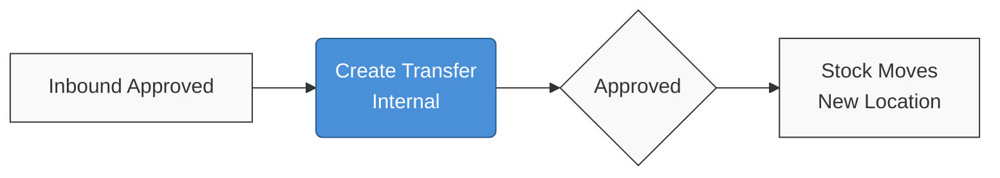
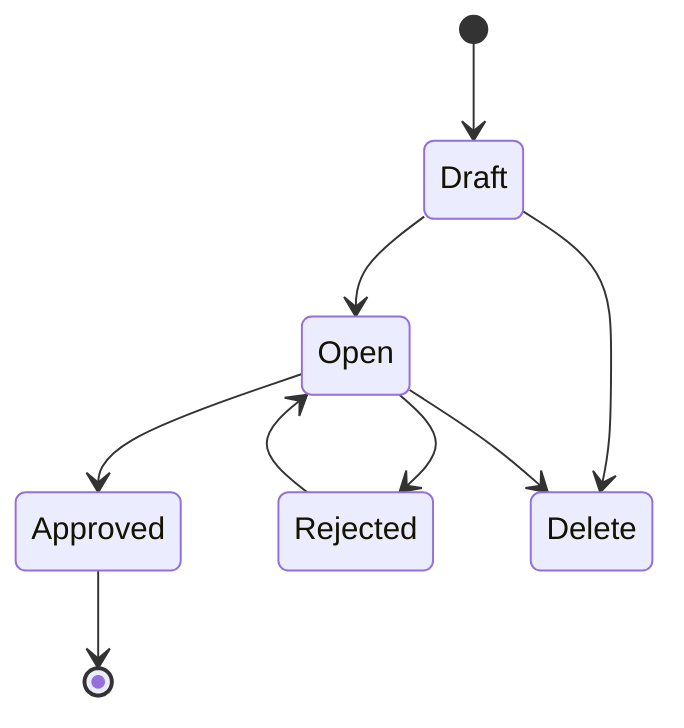
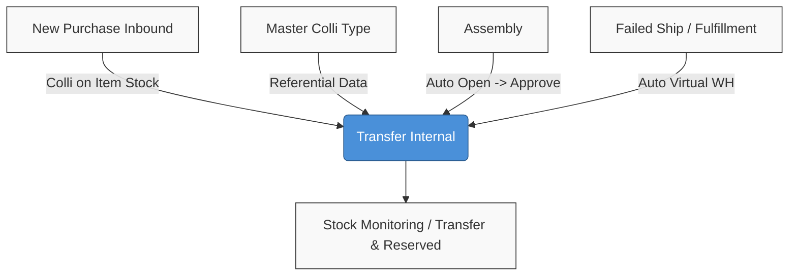

### 🚀 Transfer Internal

**Overview:** Transfer Internal is the module for moving inventory between racks or locations within the same building structure. Transactions use document prefix `TFI-` and can be created manually or automatically through order fulfillment processes.

**Target Audience:**

| Persona | Typical Use | Where to Begin |
| :---- | :---- | :---- |
| **Warehouse Operator** | Daily physical stock moves inside the warehouse building. | Legacy UI: `/supplychain/mutation-transfer-internal` |
| **Logistics Manager** | Bulk stock moves using packaging (Colli). | BETA UI: `/supplychain/new-mutation-transfer-internal` |

**UI & System Legend:**

* **Show Virtual WH:** Toggle to display automatic (*virtual*) transfer documents created by other system processes.

---

### 📦 Title & Short Summary

**Transfer Internal** is a core logistics feature for moving stock between racks or locations within the same warehouse building (*Origin* and *Destination* share one *Warehouse*). It supports regular loose moves through strict Colli-based moves to preserve inventory allocation integrity.

---

### 🔑 Key Terms

| Term | Definition |
| :---- | :---- |
| **TFI** | Standard document code prefix for Transfer Internal. |
| **Fulfill-after-FIFO** | Allocation logic that tries to fulfill from one batch/rack first; if insufficient, combines the oldest batches (classic FIFO). |
| **Stock ID** | Identity number of a specific stock batch (one SKU can have many Stock IDs). |
| **Group View / Detail View** | UI modes; *Group View* summarizes per SKU, *Detail View* shows each Stock ID (batch). |
| **Reserved** | Quantity held by transfers in *Draft* / *Open* status, reducing *Availability*. |
| **Colli (COL)** | Container holding multi-SKU at one location; Colli v2 is BETA UI only. |
| **Show Virtual WH** | Filter toggle for automatic TFI documents from order *fulfillment*. |
| **Loose** | Regular goods not bound to a colli (`multisku_colli_id` is NULL). |
| **Relocate whole colli** | Moving all contents of one colli to a new location using the same colli code. |

---

### 🎯 When & Why to Use

| Use This Module When | Do Not Use When |
| :---- | :---- |
| Moving goods between racks in the same physical building. | Moving between buildings or externally (use **Transfer External**). |
| Stock balance is physically available at the origin location. | Physical stock is insufficient or fully *Reserved*. |
| Transaction is in an open fiscal period with date today or earlier. | Transaction date is set in the future (*future date*). |
| Daily moves without Colli (Legacy UI). | Colli moves in Legacy UI (use BETA UI for Colli). |

---

### 📋 Prerequisites

* Origin warehouse is at hierarchy level ≤ 20; detail destination is a *leaf* in the same building structure.
* *Availability* > 0 per *Stock ID* or *Colli*.
* Fiscal period is open and transaction date ≤ today.
* User has menu *privilege* to view, create, edit, or approve.
* *Colli Type* is active (for *New Colli* in BETA UI).
* Stock or Colli comes from *Approved* *Inbound* (visible in *Multisku Colli*).

---

### 🔄 Position in Business Flow

**Steps:**

1. Goods reach *Approved* status through *Inbound*.
2. User creates a *Transfer Internal* document for internal allocation.
3. After *Approved*, stock logistically moves to the new rack location.

---

### 📍 Menu Location

> 🖼️ **[IMAGE PLACEHOLDER 1]** — Supply Chain sidebar → Transfer Internal.

Two UI surfaces:

* **Legacy UI:** `/supplychain/mutation-transfer-internal` — standard operations.
* **BETA UI:** `/supplychain/new-mutation-transfer-internal` — Colli v2 only.

---

### 🔁 Status Lifecycle

> ⚠️ **Hard Rule:** Manual Transfer Internal documents **do not have a Void status**.

| Status | Can Edit | Approve | Reserved Impact |
| :---- | :---- | :---- | :---- |
| **Draft / Open** | Yes | Allowed (if detail lines exist) | Detail qty adds *Reserved* and reduces *Availability* |
| **Approved** | No (locked) | — | Stock move is final |
| **Rejected** | Yes | — | *Reserved* status retained |

*(Note: Deleting the header restores Reserved on the Transfer column in Stock Monitoring.)*

---

### 🖥️ Legacy vs BETA Colli v2

| Aspect | Legacy (Daily Ops) | BETA Colli v2 (Transition) |
| :---- | :---- | :---- |
| **Route URL** | `/supplychain/mutation-transfer-internal` | `/supplychain/new-mutation-transfer-internal` |
| **Colli Feature** | Not available | Available (*New Colli* / *Existing Colli* toolbar) |
| **End-User Status** | **Default / active** | Colli *rollout* phase |
| **API Backend** | `mutation-transfer` | `mutation-transfer` + `from_menu=new-transfer-internal` |

---

### 📝 Usage — Standard Transfer (Legacy)

1. Open the form in Legacy UI.
2. Set header: *Origin* warehouse and default *Location Destination*.

> 🖼️ **[IMAGE PLACEHOLDER 3]** — Header form (Origin, Location Destination).

3. Add line items using one of the add methods.
4. Verify *Fulfill-after-FIFO* allocation and save to *Open*.
5. *Approve* to finalize the move.

---

### 📦 Usage — Transfer with Colli (BETA)

1. Open the form in BETA UI.
2. Set origin and destination locations.

> 🖼️ **[IMAGE PLACEHOLDER 5]** — BETA: New Colli / Existing Colli toolbar.

3. Use *New Colli* or *Existing Colli* toolbar.
4. Verify location *invariant* rules and approve the document.

---

### ➕ Three Ways to Add Items

| Source Method | Stock Allocation | Qty Edit Rules |
| :---- | :---- | :---- |
| **Select Product** | **Fulfill-after-FIFO** (*Loose* / non-Colli only) | Changes re-trigger FIFO |
| **Import Excel** | Same as *Select Product* in bulk | Same as *Select Product* |
| **Available Product** | **Specific Stock ID** (no auto FIFO) | Max = *Availability* on that *Stock ID* |

> 🖼️ **[IMAGE PLACEHOLDER 4]** — Select Product / Available Product panel.

---

### ⚙️ Fulfill-after-FIFO

Preferred for *Select Product* and *Import*.

**How it works:**

1. Find one oldest batch/rack with availability ≥ requested qty (excluding *Outrack/WIP*).
2. If none is sufficient alone, *fallback* to classic FIFO across oldest batches.
3. If still insufficient: **Insufficient product stock**.

**Example:** Batches A:50, B:100, C:150, D:200 (oldest first).

* Move 50 → from A only.
* Move 75 → from B only (A cannot fulfill alone).
* Move 250 → A(50) + B(100) + C(100).

---

### 👁️ Group View vs Detail View

* **Group View:** Default SKU summary. In BETA, Colli columns are *read-only*.
* **Detail View:** Per *Stock ID* when FIFO splits across batches. Both show Colli Origin/Destination in BETA.

---

### 📦 Colli v2 — One Location Invariant (BETA)

> ⚠️ **INVARIANT:** 1 Colli code = 1 location. No location *split* for the same colli code.

* **New Colli:** FIFO *loose* (excludes colli at same origin location). Colli-bound origin caps qty at colli availability.
* **Existing Colli:** *Assign* multiple SKUs to an existing colli; origin colli of selected line is excluded (*self-assign* guard).
* **Location change:** Changing line *Location Destination* resets *Colli Destination* to NULL (re-assign unless location matches colli).

---

### 🔄 Relocate Whole Colli

Move entire colli contents at once:

1. Use **Available Product**.
2. **Bulk Use** all SKUs in the colli.
3. Set **Colli Origin = Colli Destination = same code** to one new location.

*Failure note:* *Approve* is blocked if any qty in the colli is *Reserved* on another document.

---

### 👻 Show Virtual WH & Automatic TFI

Automatic documents come from Assembly, SO Fulfillment, and Failed Ship.

> 🖼️ **[IMAGE PLACEHOLDER 2]** — Datalist + Show Virtual WH toggle.

* Virtual documents are hidden by default; enable **Show Virtual WH** to view.
* Edit and *Approve* rules for automatic TFI differ from manual input.

| Operational Stage | Process Type | Example Prefix / Ref |
| :---- | :---- | :---- |
| In Wave | in wave | TFI virtual |
| Picking | picking | PL (Manual Picking List) |
| Checking | checking | CL |
| Packing | packing | PK |
| Shipping / Shipping DO | shipping / shipping do | SL / TFI |
| Failed Ship | failed ship | FS |

---

### 📋 Field Reference

| Field Type | Element | Constraint |
| :---- | :---- | :---- |
| **Header** | Origin | Source warehouse (main building) |
| **Header** | Location Destination | Default destination location |
| **Header** | Transaction Date | Cannot exceed today |
| **Header** | Description | Max 150 characters |
| **Detail** | Location Destination | Per-line SKU destination |
| **Detail** | Stock ID | Batch number (*Available Product* path) |
| **Detail** | Colli Origin / Destination | BETA colli tracking |

*(Fields lock after Approved.)*

---

### 🛡️ Business Rules & Validation

| Validation | System Behavior |
| :---- | :---- |
| Transaction date after today (*future date*) | Rejected |
| *Approve* with empty detail | Rejected |
| *Approve* while Excel import still processing (*async*) | Rejected |
| Insufficient *Fulfill-after-FIFO* balance | *Insufficient product stock* |
| *Available Product* qty exceeds *Stock ID* availability | *exceed stock ID* |
| Detail *Origin* equals *Destination* | Rejected |
| *Relocate whole colli* with *reserved* qty on other TF | *Approve* failed |
| Line *Location Destination* changed vs *Colli Destination* | *Colli Destination* set to NULL |

---

### ⚠️ Limitations & Items Under Review

| Topic (System Gap) | Review Status |
| :---- | :---- |
| *Colli Destination* reset to NULL on *Location* change not universal in codebase | **Open Major Gap** |
| Colli import *TO-BE* needs single code column; *AS-IS* still uses legacy format (Colli × Colli Qty v1) | **Open Major Gap** |
| BETA *URL* vs legacy `transactionUrl` on *Multisku Colli* | **Open Gap** |
| Colli ID v1 takedown | **Note** |

---

### 🔗 Related Menus

*(Transfer Internal / TFI-* is **completely different** from Manual Picking List / PL-* or inter-building Transfer External.)*

---

### 🔧 Troubleshooting

| Symptom | Common Cause | Solution |
| :---- | :---- | :---- |
| *Available Product* input rejected | Exceeds *Stock ID* *Availability* | Lower qty or use *Select Product* |
| *Insufficient product stock* | Real stock insufficient | Audit *Stock Monitoring* |
| Colli cleared after line location edit | *Colli destination* reset (invariant) | Re-*assign* colli manually |
| Colli *Approve* fails | *Reserved* on another TF document | Complete other TF or use new colli |
| Partial Colli import failure | Colli code location mismatch | Fix rows (valid partial import still succeeds) |
| Order TFI not visible | Default UI hides system transactions | Enable **Show Virtual WH** |

---

### ❓ FAQ

**Q: Legacy vs BETA UI difference?**
A: Standard *end-users* must use **Legacy**; **BETA** is for Colli v2 until *cutover* is complete.

**Q: Must all goods be wrapped in Colli?**
A: No. Empty Colli fields record *Loose* (unpackaged) goods.

**Q: Is there Void after a mistake?**
A: No. Manual *Transfer Internal* has no *Void* after approval.

**Q: Same as Manual Picking List (MPL)?**
A: No. MPL uses PL-*, *Omni Picking UI*, and auto-approves on *Complete Picking*.

**Q: When does a new Colli appear in Multisku Colli?**
A: Permanently after the creating transfer reaches **Approved**.

---

### 📚 See Also

* [BETA - New Purchase Inbound](/docs/scm/supplychain-new-purchase-inbound/overview)
* [Colli Type](/docs/scm/supplychain-colli-type/overview)
* [Assembly](/docs/scm/supplychain-assembly/overview)
* [Failed Ship](/docs/scm/supplychain-failed-ship/overview)
* [Transfer External](/docs/scm/supplychain-mutation-transfer-external/overview)
