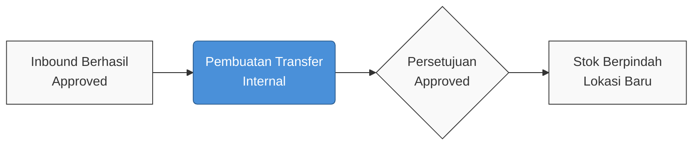
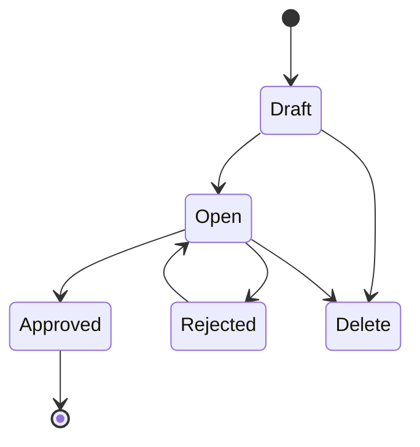
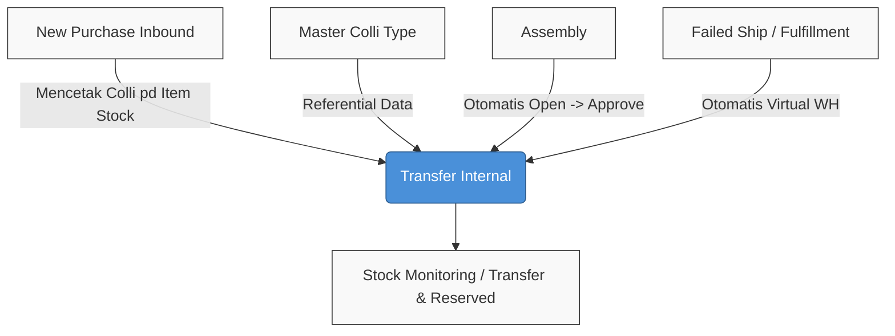

### 🚀 Transfer Internal

**Overview:** Transfer Internal adalah modul untuk memindahkan persediaan barang antar rak atau lokasi di dalam satu struktur gedung yang sama. Transaksi ini menggunakan prefix dokumen `TFI-` dan dapat terbentuk secara manual maupun otomatis melalui proses pemenuhan pesanan.

**Target Audience:**

| Persona | Typical Use | Where to Begin |
| :---- | :---- | :---- |
| **Warehouse Operator** | Memindahkan stok harian fisik di dalam gedung gudang. | Legacy UI: `/supplychain/mutation-transfer-internal` |
| **Logistics Manager** | Mengelola mutasi stok berbasis kemasan (Colli) secara massal. | BETA UI: `/supplychain/new-mutation-transfer-internal` |

**UI & System Legend:**

* **Show Virtual WH:** Toggle untuk menampilkan dokumen transfer otomatis (*virtual*) dari proses sistem lainnya.

---

### 📦 Judul & Ringkasan Singkat

**Transfer Internal** adalah fitur sentral logistik yang bertugas memindahkan stok antar rak atau lokasi dalam satu gedung gudang yang sama (*Origin* dan *Destination* berada di satu *Warehouse*). Fitur ini mengakomodasi pemindahan barang reguler tanpa koli (*loose*) hingga mutasi berbasis kemasan (*Colli*) dengan aturan yang ketat untuk menjaga integritas alokasi persediaan.

---

### 🔑 Istilah Kunci

| Istilah | Definisi |
| :---- | :---- |
| **TFI** | Prefix baku untuk kode dokumen Transfer Internal. |
| **Fulfill-after-FIFO** | Logika alokasi yang mencoba memenuhi permintaan dari satu batch/rak yang cukup terlebih dahulu; jika tidak cukup, menggabungkan beberapa batch terlama (klasik FIFO). |
| **Stock ID** | Nomor identitas satu batch stok tertentu (satu SKU bisa memiliki banyak Stock ID). |
| **Group View / Detail View** | Tampilan antarmuka; *Group View* diringkas per SKU, *Detail View* dirinci per Stock ID (batch). |
| **Reserved** | Kuantitas persediaan yang sedang ditahan oleh transfer berstatus *Draft* / *Open*, menyebabkan saldo *Availability* berkurang. |
| **Colli (COL)** | Wadah atau kemasan yang memuat multi-SKU di satu lokasi; fitur Colli v2 hanya tersedia di UI BETA. |
| **Show Virtual WH** | Toggle filter untuk menampilkan dokumen TFI otomatis dari proses *fulfillment* pesanan. |
| **Loose** | Barang reguler yang tidak terikat dalam wadah colli (`multisku_colli_id` bernilai NULL). |
| **Relocate whole colli** | Proses memindahkan seluruh isi barang dalam satu colli ke lokasi baru dengan menggunakan kode colli yang sama. |

---

### 🎯 Kapan & Kenapa Dipakai

| Kondisi Tepat (Gunakan Modul Ini) | Kondisi Tidak Tepat (Jangan Gunakan) |
| :---- | :---- |
| Memindahkan barang antar rak di dalam satu gedung fisik yang sama. | Memindahkan barang antar gedung atau eksternal (gunakan **Transfer External**). |
| Saldo persediaan (*stok*) tersedia secara riil di lokasi asal. | Stok fisik tidak mencukupi atau telah penuh berstatus *Reserved*. |
| Transaksi dilakukan pada periode fiskal yang terbuka dengan tanggal hari ini atau sebelumnya. | Tanggal pencatatan transaksi diatur untuk masa depan (*future date*). |
| Mengoperasikan mutasi harian tanpa Colli (melalui Legacy UI). | Mengelola perpindahan menggunakan Colli di Legacy UI (gunakan BETA UI untuk Colli). |

---

### 📋 Prasyarat

Untuk menjalankan transfer, pastikan kondisi berikut terpenuhi:

* Gudang asal (*Origin*) berada pada level hierarki ≤ 20, dan gudang tujuan detail merupakan *leaf* (titik akhir) dalam struktur gedung yang sama.
* Nilai ketersediaan (*Availability*) harus lebih besar dari 0 per *Stock ID* atau *Colli*.
* Periode fiskal sistem berstatus terbuka dan tanggal transaksi ≤ hari ini.
* Pengguna memiliki hak akses menu (*privilege*) untuk melihat, membuat, mengubah, atau menyetujui transaksi.
* Status *Colli Type* dalam keadaan aktif (khusus penggunaan *New Colli* di BETA UI).
* Stok atau Colli harus berasal dari dokumen *Inbound* yang sudah berstatus *Approved* (tampak di *Multisku Colli*).

---

### 🔄 Posisi dalam Alur Bisnis

**Keterangan langkah:**

1. Barang masuk melalui proses *Inbound* hingga berstatus *Approved*.
2. Pengguna membuat dokumen *Transfer Internal* untuk alokasi internal.
3. Setelah dokumen *Approved*, stok secara logistik berpindah ke lokasi rak baru.

---

### 📍 Lokasi Menu

> 🖼️ **[PLACEHOLDER GAMBAR 1]** — Sidebar Supply Chain → Transfer Internal.

Modul ini disediakan dalam dua antarmuka (UI):

* **Legacy UI:** `/supplychain/mutation-transfer-internal` — untuk operasional standar.
* **BETA UI:** `/supplychain/new-mutation-transfer-internal` — khusus fungsionalitas Colli v2.

---

### 🔁 Siklus Status

> ⚠️ **Hard Rule:** Dokumen Transfer Internal manual **tidak memiliki status Void**.

| Status | Hak Edit | Kondisi Approve | Dampak Reserved |
| :---- | :---- | :---- | :---- |
| **Draft / Open** | Ya | Diizinkan (jika terdapat detail baris) | Kuantitas pada detail menambah *Reserved* dan mengurangi *Availability* |
| **Approved** | Tidak (terkunci) | — | Mutasi persediaan menjadi final |
| **Rejected** | Ya | — | Status *Reserved* tetap dipertahankan |

*(Catatan: Penghapusan / Delete header akan mengembalikan status Reserved pada kolom Transfer di menu Stock Monitoring.)*

---

### 🖥️ Legacy vs BETA Colli v2

| Aspek Sistem | Legacy (Operasional Harian) | BETA Colli v2 (Transisi) |
| :---- | :---- | :---- |
| **Route URL** | `/supplychain/mutation-transfer-internal` | `/supplychain/new-mutation-transfer-internal` |
| **Fitur Colli** | Tidak tersedia | Tersedia (*New Colli* / *Existing Colli* toolbar) |
| **Status End-User** | **Default / aktif digunakan** | Tahap *rollout* Colli |
| **API Backend** | `mutation-transfer` | `mutation-transfer` + parameter `from_menu=new-transfer-internal` |

---

### 📝 Langkah Penggunaan — Transfer Biasa (Legacy)

1. Buka formulir melalui antarmuka Legacy.
2. Tentukan data header: Gudang asal (*Origin*) dan Lokasi tujuan default (*Location Destination*).

> 🖼️ **[PLACEHOLDER GAMBAR 3]** — Form header (Origin, Location Destination).

3. Masukkan item barang menggunakan salah satu metode penambahan.
4. Periksa kecukupan alokasi *Fulfill-after-FIFO* dan simpan ke status *Open*.
5. Setujui (*Approve*) dokumen untuk memindahkan barang secara final.

---

### 📦 Langkah Penggunaan — Transfer dengan Colli (BETA)

1. Buka formulir melalui antarmuka BETA.
2. Tentukan lokasi asal dan tujuan.

> 🖼️ **[PLACEHOLDER GAMBAR 5]** — BETA: toolbar New Colli / Existing Colli.

3. Pilih pengelolaan Colli menggunakan toolbar *New Colli* atau *Existing Colli*.
4. Verifikasi aturan *invariant* lokasi dan eksekusi persetujuan dokumen.

---

### ➕ Tiga Cara Tambah Barang

| Metode Injeksi Sumber | Pola Alokasi Stok | Aturan Edit Kuantitas |
| :---- | :---- | :---- |
| **Select Product** | **Fulfill-after-FIFO** (hanya berlaku untuk stok tipe *Loose* / tanpa Colli) | Perubahan akan memicu jalannya ulang aturan FIFO |
| **Import Excel** | Sama dengan pola *Select Product* secara massal (*bulk*) | Sama dengan *Select Product* |
| **Available Product** | **Berdasarkan Stock ID spesifik** (mengabaikan FIFO otomatis) | Dibatasi maksimal senilai *Availability* pada *Stock ID* terkait |

> 🖼️ **[PLACEHOLDER GAMBAR 4]** — Panel Select Product / Available Product.

---

### ⚙️ Fulfill-after-FIFO

Algoritma ini diutamakan untuk jalur *Select Product* dan *Import*.

**Cara kerja:**

1. Mencari satu batch/rak dengan umur terlama yang memiliki ketersediaan ≥ kuantitas diminta (mengabaikan lokasi *Outrack/WIP*).
2. Jika tidak ditemukan yang cukup utuh, sistem jatuh (*fallback*) ke metode FIFO klasik dengan menggabungkan beberapa batch terlama.
3. Jika total stok tetap kurang, menampilkan galat: **Insufficient product stock**.

**Contoh alokasi:** Terdapat batch stok (A: 50, B: 100, C: 150, D: 200 berurutan dari tertua).

* Jika dipindah 50: Diambil dari A saja.
* Jika dipindah 75: Diambil dari B saja (karena A tidak cukup utuh untuk Fulfill-after-FIFO).
* Jika dipindah 250: Diambil dari A(50) + B(100) + C(100).

---

### 👁️ Group View vs Detail View

* **Group View:** Tampilan bawaan (*default*) yang diringkas per SKU. Pada antarmuka BETA, kolom Colli bersifat *read-only*.
* **Detail View:** Menampilkan rincian baris per *Stock ID* jika proses FIFO memecah pengambilan dari multi-batch. Keduanya menampilkan kolom Colli Origin/Destination di UI BETA.

---

### 📦 Colli v2 — Invariant 1 Lokasi (BETA)

> ⚠️ **ATURAN INVARIANT:** 1 Kode Colli = 1 Lokasi. Tidak diperbolehkan memecah (*split*) lokasi untuk kode Colli yang sama.

* **Alur New Colli:** Menggunakan FIFO *loose* (mengecualikan colli di lokasi yang sama dengan stok asal). Jika origin terikat Colli, maksimal kuantitas adalah ketersediaan Colli tersebut.
* **Alur Existing Colli:** Menetapkan (*assign*) beberapa SKU berbeda ke dalam Colli yang sudah eksis. Sistem mengecualikan Colli yang menjadi origin baris terpilih (mencegah validasi *self-assign*).
* **Perilaku perubahan lokasi:** Mengubah *Location Destination* pada baris akan secara otomatis mereset (menjadi NULL) field *Colli Destination*, mengharuskan penugasan ulang (kecuali lokasi tujuan masih identik dengan Colli).

---

### 🔄 Relocate Whole Colli

Fungsionalitas memindahkan seluruh isi satu Colli sekaligus tanpa pemecahan:

1. Gunakan jalur **Available Product**.
2. Lakukan aksi **Bulk Use** untuk semua SKU di dalam Colli tersebut.
3. Pastikan parameter **Colli Origin = Colli Destination = Kode Sama**, diarahkan ke satu lokasi baru tunggal.

*Catatan kegagalan:* Persetujuan (*Approve*) akan diblokir jika terdapat sebagian kuantitas dalam Colli tersebut yang sedang ter-*Reserved* pada dokumen transaksi lain.

---

### 👻 Show Virtual WH & TFI Otomatis

Transfer Internal tidak hanya dibuat manual. Proses otomatis menghasilkan dokumen dari Assembly, SO Fulfillment, dan Failed Ship.

> 🖼️ **[PLACEHOLDER GAMBAR 2]** — Datalist + toggle Show Virtual WH.

* Secara default, dokumen virtual ini disembunyikan. Aktifkan **Show Virtual WH** untuk melihat riwayat.
* Aturan pengeditan dan persetujuan (*Approve*) untuk TFI Otomatis **berbeda** mutlak dari input manual.

| Tahap Rantai Operasional | Process Type | Contoh Prefix / Ref |
| :---- | :---- | :---- |
| In Wave | in wave | TFI virtual |
| Picking | picking | PL (Manual Picking List) |
| Checking | checking | CL |
| Packing | packing | PK |
| Shipping / Shipping DO | shipping / shipping do | SL / TFI |
| Failed Ship | failed ship | FS |

---

### 📋 Referensi Field

| Tipe Field | Elemen | Deskripsi Pembatasan |
| :---- | :---- | :---- |
| **Header** | Origin | Gudang asal barang (struktur gedung utama) |
| **Header** | Location Destination | Lokasi tujuan *default* |
| **Header** | Transaction Date | Tanggal tidak boleh melebihi hari ini |
| **Header** | Description | Catatan maksimal 150 karakter |
| **Detail** | Location Destination | Lokasi tujuan rincian per baris SKU |
| **Detail** | Stock ID | Nomor *batch* khusus (jalur *Available Product*) |
| **Detail** | Colli Origin / Destination | Informasi pelacakan Colli khusus BETA |

*(Field terkunci total pasca dokumen menyentuh status Approved.)*

---

### 🛡️ Aturan Bisnis & Validasi

| Kondisi Validasi | Perilaku Sistem |
| :---- | :---- |
| Pengisian tanggal transaksi melebihi hari ini (*future date*) | Proses ditolak |
| Eksekusi *Approve* ketika detail barang masih kosong | Proses ditolak |
| Eksekusi *Approve* saat impor Excel masih memproses data (*async*) | Proses ditolak |
| Jumlah saldo di *Fulfill-after-FIFO* tidak mencukupi | Menampilkan peringatan: *Insufficient product stock* |
| Input kuantitas *Available Product* melampaui ketersediaan *Stock ID* | Menampilkan pesan *exceed stock ID* |
| Lokasi asal (*Origin*) sama persis dengan tujuan (*Destination*) di baris detail | Proses ditolak |
| Menjalankan *Relocate whole colli* saat terdapat kuantitas yang *reserved* di TF lain | *Approve* digagalkan |
| User mengganti *Location Destination* baris namun lokasi berbeda dengan *Colli Destination* | Sistem otomatis mengatur *Colli Destination* menjadi NULL |

---

### ⚠️ Keterbatasan & Hal dalam Tinjauan

| Topik (Celah Sistem) | Status Tinjauan |
| :---- | :---- |
| Perilaku reset *Colli Destination* menjadi NULL saat pergantian *Location* belum teraplikasikan secara universal di seluruh *codebase* | **Open Major Gap** |
| Konsep impor *Colli TO-BE* mengharuskan 1 kolom kode tunggal, namun format impor *AS-IS* saat ini masih menggunakan format lama (Colli × Colli Qty v1) | **Open Major Gap** |
| Keakuratan *URL BETA* jika dikorelasikan dengan parameter `transactionUrl` legacy pada *Multisku Colli* | **Open Gap** |
| Pemusnahan dukungan takedown terhadap ID Colli v1 | **Note** |

---

### 🔗 Hubungan dengan Menu Lain

*(Catatan: Operasional Transfer Internal / TFI-* **berbeda sepenuhnya** dari Manual Picking List / PL-* atau dokumen Transfer External antar-gedung.)*

---

### 🔧 Troubleshooting

| Gejala Error | Akar Penyebab | Solusi |
| :---- | :---- | :---- |
| Input *Available Product* ditolak | Melebihi batas *Availability* pada *Stock ID* tersebut | Turunkan angka kuantitas atau ubah ke rute *Select Product* |
| *Insufficient product stock* | Sisa stok riil belum memadai | Lakukan audit pada halaman *Stock Monitoring* |
| Colli hilang usai modifikasi lokasi baris | *Colli destination* ter-reset (NULL) akibat proteksi keamanan invarian | Lakukan proses penetapan (*assign*) Colli kembali secara manual |
| Persetujuan (*Approve*) Colli gagal total | Terdapat nilai *Reserved* gantung di dokumen TF lainnya | Selesaikan dokumen TF lain terlebih dahulu atau gunakan wadah Colli baru |
| Sebagian baris impor Colli gagal | Kode Colli berada di dimensi lokasi fisik yang tidak cocok | Perbaiki baris tersebut secara mandiri (impor parsial valid tetap sukses masuk) |
| Dokumen TFI dari order tak terlihat | Filter UI default menyembunyikan transaksi sistemis | Aktifkan saklar **Show Virtual WH** |

---

### ❓ FAQ

**Q: Apa perbedaan alokasi UI Legacy vs BETA?**
A: Pengguna standar (*end-user*) diwajibkan menggunakan jalur **Legacy**; UI **BETA** difokuskan secara eksklusif untuk kapabilitas Colli v2 hingga masa *cutover* selesai diresmikan.

**Q: Apakah operator diwajibkan membungkus seluruh barang ke dalam Colli?**
A: Tidak diwajibkan. Kolom Colli yang dibiarkan kosong akan mencatat barang berstatus *Loose* (tanpa kemasan).

**Q: Adakah fungsi atau tombol pembatalan (Void) jika staf melakukan kesalahan?**
A: Tidak tersedia. Seluruh transaksi *Transfer Internal* manual memang tidak memiliki fungsi *Void* pasca dokumen tersebut disetujui.

**Q: Apakah Transfer Internal sama dengan Manual Picking List (MPL)?**
A: Jelas berbeda. MPL menggunakan prefix PL-*, menggunakan *Omni Picking UI*, dan otomatis disetujui ketika fitur *Complete Picking* dieksekusi.

**Q: Kapan Colli yang baru dirakit akan resmi muncul di menu Multisku Colli?**
A: Kode kemasan secara permanen tercipta setelah transaksi perpindahan yang membawanya masuk ke tahap **Approve**.

---

### 📚 Lihat Juga

* [BETA - New Purchase Inbound](/docs/scm/supplychain-new-purchase-inbound/overview)
* [Colli Type](/docs/scm/supplychain-colli-type/overview)
* [Assembly](/docs/scm/supplychain-assembly/overview)
* [Failed Ship](/docs/scm/supplychain-failed-ship/overview)
* [Transfer External](/docs/scm/supplychain-mutation-transfer-external/overview)
