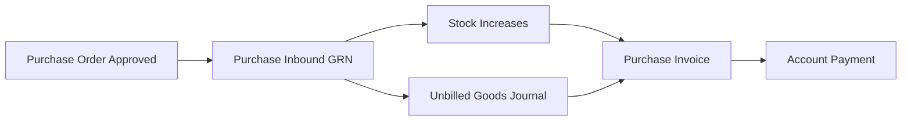
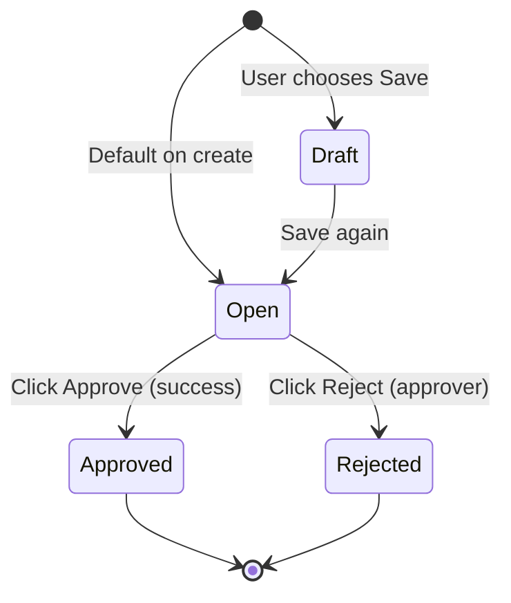
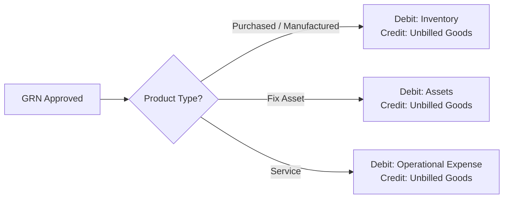
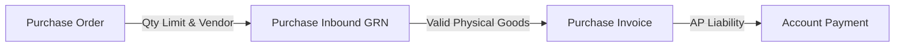

### 🚀 Purchase Inbound (Goods Receipt Note — GRN)

**Overview:**
The **Purchase Inbound** module — often called a **Goods Receipt Note (GRN)** — is used to record the physical goods that actually arrive at your warehouse from a supplier, based on an approved **Purchase Order (PO)**. It makes sure stock is added accurately and acts as the accounting bridge before the official bill is issued in the next module.

### 🔑 Key Terms (Glossary)

* **Goods Receipt Note (GRN) / Purchase Inbound:** The official receiving document that records physical goods coming into your warehouse.
* **Purchase Order (PO):** The upstream purchase commitment that provides the quantity, price, and supplier used to create the GRN.
* **COLLI (Carton):** A feature for recording goods by physical packaging (box, pallet, or crate) with the same contents per pack, so you can receive in bulk without counting units one by one.
* **Unbilled Goods:** A temporary clearing account on the Credit side that holds the payable for goods already received, before the supplier's official invoice is processed.
* **Stock ID:** A unique number the system issues for each group of incoming stock, used to track its location and movement.
* **Batch / Serial / Expired Date:** Product quality controls — the *Batch Number* tracks a production lot, the *Serial Number* tracks a single unique unit, and the *Expired Date* limits the shelf life.
* **Product COA Group:** The Chart of Accounts grouping on the product master that decides how the journal is posted based on item type (**Purchased/Manufactured**, **Fix Asset**, or **Service**).

### 🎯 When & Why to Use It

The system has strict rules about when a GRN can be created:

| ✅ Create a GRN when | ❌ Don't create a GRN when |
| :---- | :---- |
| The physical goods from the supplier have actually arrived at the warehouse. | You only have a *Purchase Requisition* (PR) with no approved PO yet. |
| There is a PO in **Approved** or **Processed** status that still has remaining quantity. | The referenced PO is already **Closed** or **Void**, or its remaining quantity is zero. |
| The product's account settings (*Product COA Group*) are complete in the master data. | The product accounts are still empty — this will fail during *Approve*. |
| The chosen supplier has an active PO whose quantity can be received. | You want to record stock in without a PO reference — use the *Other Inbound* menu instead. |

### 📋 Prerequisites

| Prerequisite | Master Data Source | Key Notes & Limits |
| :---- | :---- | :---- |
| **Valid PO status** | Purchase Order module | The PO must be **Approved** or **Processed**. The PO date must be earlier than the GRN date. |
| **Available supplier** | Vendor / Supplier master | A supplier only appears in the dropdown if it has an outstanding PO. |
| **Valid destination warehouse** | Warehouse master | Must be a real physical warehouse, not a parent warehouse with sub-warehouses. |
| **Complete product accounts** | Product / Account Group master | Must have valid *Unbilled Goods* plus asset/expense account mapping for the product type. |
| **Open fiscal period** | Accounting settings | The GRN date must fall inside a booking month that is still *open*. |

### 📍 Menu Location: Two UIs, One Backend

The system offers two entry points to manage receiving data, but both connect to the same database:

> 1. **BETA - New Purchase Inbound** (the main menu this doc covers)
>    * **System UI Route:** `/supplychain/new-purchase-inbound`
>    * **Highlights:** Includes the **COLLI** feature, a *Group view*, *asynchronous* approval, and is the main reference for the QA team.
> 2. **Purchase Inbound Legacy (old UI)**
>    * **System UI Route:** `/supplychain/mutation-inbound`
>    * **Highlights:** Uses the old layout and does not support carton (COLLI) packaging.

> 🖼️ **[IMAGE PLACEHOLDER]** — Supply Chain → Inbound → BETA - New Purchase Inbound sidebar and the list page.

### 🔄 Business Process Flow

Data flows from upstream to downstream in one procurement chain:

**Step notes:**

> 1. **Upstream reference:** The transaction starts from the remaining quantity not yet received on a valid *Purchase Order*.
> 2. **Physical receiving (GRN):** The warehouse operator records incoming items through *Purchase Inbound* to lock in the arriving volume.
> 3. **Instant impact:** When the document is approved, the system updates real warehouse stock and posts the value to *Unbilled Goods*.
> 4. **Downstream:** The valid GRN is pulled into *Purchase Invoice* to formally recognize the payable and input VAT, then it is settled in *Account Payment*.

### 🛡️ Transaction Lifecycle

The GRN document uses a simpler status cycle than a PO, with *single-level* approval:

| Status | Meaning / Condition | Editable? | UI Buttons & Triggers |
| :---- | :---- | :---- | :---- |
| **Draft** | Early stage — the user intentionally delays submitting the goods for verification. | Yes | Save & Next, Save All, Delete |
| **Open** | Standard active status — the receiving record is complete and ready for review. | Yes | Save All, Approve, Reject, Delete |
| **Approved** | Final authorization. Physical stock and the accounting journal are locked into the database. | No | Print, Print RIR, Show Only |
| **Rejected** | The document was rejected by the reviewer due to a mismatch in field data. | No | Show Only |

📊 **IMPORTANT:** Unlike a PO, the GRN header does **not** have *Processed*, *Complete*, or *Closed* statuses. Those processing states live on and are updated automatically on the source PO header, based on the total quantity received across one or more GRNs.

### ⚙️ Step-by-Step Guide

#### Task 1: Create a New GRN

> 1. Open `/supplychain/new-purchase-inbound` and click the action to create a new document.
> 2. Fill the header in the **Basic Information** block: choose a **Supplier** (only vendors with an outstanding PO appear), choose the destination **Location (Warehouse)** (a physical one), and enter the **Transaction Date**.
> 3. *Transaction Status* defaults to **Open** (or set it to **Draft** if the data isn't final yet).

> 🖼️ **[IMAGE PLACEHOLDER]** — Create Purchase Inbound form, header section (Supplier, Warehouse, Transaction Date).

#### Task 2: Add Items from the Outstanding PO

To fill in item lines, use one of three methods in the *Outstanding PO* panel:

* **Method A (Bulk Use):** Tick several item lines at once. The system auto-fills the receiving quantity with the full remaining outstanding amount on the PO.
* **Method B (Single Use):** Click a line to open the detail modal. Enter the quantity, pick the **Unit**, and fill any required quality fields if the product flags are on (**Expired Date**, **Batch Number**, or **Serial Number**). Use **Allocate Full Qty** to clear out any decimal remainder caused by unit conversion.
* **Method C (Select Product):** A shortcut button to instantly add a specific product from the related supplier's PO.

> 🖼️ **[IMAGE PLACEHOLDER]** — Outstanding PO panel with Bulk Use, Single Use, Select Product buttons.

#### Task 3: Approve (Authorization)

> 1. Do a final review of the item detail grid.
> 2. Click **Approve** at the top of the form.
> 3. If the transaction uses standard lines (no cartons), the status changes to **Approved** instantly. If it uses the carton feature, the system processes the data in the background (see the COLLI section).

> 🖼️ **[IMAGE PLACEHOLDER]** — Approve button and the result notification (success / failed / in progress).

### 📦 COLLI Feature (Carton Packaging)

The **COLLI** feature helps warehouse operators enter goods that arrive in uniform packaging (*box, pallet, crate, bundle*) without doing manual math outside the system.

#### How to Fill the Form

> 1. Turn on the **Group view** option on the item detail grid to show the packaging input columns.
> 2. Enter the **Carton Count** (must be a whole number) and the **Contents per Carton** (how many units are inside one pack).
> 3. The system auto-populates the packaging value based on the last COLLI transaction for the same SKU.
> 4. Once entered, the **Inbound Qty** field becomes **locked (read-only)** using this formula:
>    `Inbound Qty = Carton Count × Contents per Carton`
> 5. If **Carton Count = 0**, the system returns the line to normal manual quantity input.

#### Asynchronous Background Job

⚠️ **IMPORTANT RULE:** Receiving with COLLI data creates a very large number of records, because the system issues a separate *Stock ID* for every carton (for example, 50 cartons create 50 stock records in the database).

* Stock creation is not instant. As soon as you click **Approve**, the header status becomes *Approved*, but the Stock ID creation is sent to a background job queue.
* You should track progress through the **Item Stock Status** column on the transaction list page (shown as a percentage %).
* **If the process fails:** The system protects your data automatically — it returns the status from *Approved* back to **Open**, removes any half-created stock/journal records, and shows an error notification. Just click **Approve** again to re-run the queue; you don't need to re-enter anything.

> 🖼️ **[IMAGE PLACEHOLDER]** — Group view toggle and the Carton Count / Contents per Carton inputs, plus the Item Stock Status progress column.

### 📥 Bulk Excel Import

The spreadsheet import speeds up recording large volumes of received goods. This menu supports up to **10,000 detail rows** per transaction and only allows **one import at a time** (the system blocks two concurrent imports).
Two template types are available to download in the upload panel:

> 1. **Standard Import Template:** For regular manual quantity input.
> 2. **COLLI Import Template:** Has extra columns to map carton counts in bulk.

> 🖼️ **[IMAGE PLACEHOLDER]** — Excel Import panel with standard vs COLLI template options.

### 📊 Full Field Reference

#### 1. Header & Basic Information Block

| Field | Required? | Data Type | Validation & System Behavior |
| :---- | :---- | :---- | :---- |
| **Transaction Code** | — | String | Auto-generated and unique with an `IN-` prefix. |
| **Transaction Date** | Yes | Date | The recording date. The system rejects future dates (beyond today) and dates outside the open fiscal period. |
| **Supplier** | Yes | Dropdown | Only shows vendors with a PO in *Approved/Processed* status. |
| **Location (Warehouse)** | Yes | Dropdown | Physical storage location. Only real warehouses appear; parent warehouses with sub-warehouses are blocked. |
| **Description** | No | Text | Free-text note (max 150 characters). |
| **Transaction Status** | — | Dropdown | Document status. At creation you can only pick *Open* or *Draft*. |
| **Attachments** | No | File | Upload delivery-note proof from the vendor (subject to a file size limit). |

💡 **NOTE:** There is no currency field on the GRN header because the system automatically inherits the currency from the source PO when building the journal. The main header fields (**Supplier**, **Warehouse**, **Transaction Date**) lock automatically once there is at least one item line in the grid.

#### 2. Item Detail Grid (Single Use Modal & Line Properties)

| Field | Data Type | Validation & Limits |
| :---- | :---- | :---- |
| **Product Info** | System Info | Shows the SKU and product name from the PO (cannot be changed). |
| **Unit** | Dropdown | Main or alternate unit. Changing the unit triggers conversion to the base stock unit to validate against the PO remainder. |
| **Expired Date** | Date | Required if the product master has the expiry flag on. Cannot be earlier than the GRN *Transaction Date*. |
| **Batch Number** | Alphanumeric | Required if the product needs a lot number. Max 50 characters. |
| **Serial Number** | Alphanumeric | Required if the product uses individual unit control. Rule: **one detail line holds only one unit**, with a max of 50 serial numbers per process. |
| **Allocate Full Qty** | Button | Pulls the full remaining PO outstanding to minimize decimal conversion differences. |

#### 3. COLLI View Grid Block

| Field | Data Type | Validation & Limits |
| :---- | :---- | :---- |
| **Carton Count** | Number | Number of physical packs received (must be a positive whole number). |
| **Contents per Carton** | Number | Units inside one carton. If the multiplication exceeds the PO outstanding, the system automatically lowers the contents to 1 as a data safeguard. |
| **Inbound Qty** | Number | Auto-calculated as Carton Count × Contents per Carton. Becomes *read-only* whenever Carton Count is greater than 0. |

### 🗃️ Accounting Impact & Ledger Journal

#### Basic Financial Principle

⚖️ **IMPORTANT:** The Purchase Inbound (GRN) document **never records VAT** in its journal. The value posted to the ledger is purely **Price Before VAT** multiplied by the quantity received. Input VAT and the trade payable (*Account Payable*) are only recognized downstream when the *Purchase Invoice* (PI) is approved.
The system splits journals into three branches based on the *Product COA Group*:

#### Scenario 1: Regular Goods (Purchased / Manufactured Item)

* **Stock ID:** Issued automatically by the system (active Stock ID).
* **Journal:** `Debit: Inventory (Incoming Goods) | Credit: Unbilled Goods (Temporary Payable Clearing)`
* *Description:* Goods enter the warehouse as official inventory, offset by a temporary payable because the physical invoice hasn't been issued yet.

#### Scenario 2: Fixed Asset (Fix Asset)

* **Stock ID:** Still issued, but *flagged as fix asset* for internal inventory tracking.
* **Journal:** `Debit: Assets (Fixed Asset — not Inventory) | Credit: Unbilled Goods`
* *Description:* The item is not treated as trade inventory; it is recognized directly as an addition to the company's assets on the balance sheet.

#### Scenario 3: Service

* **Stock ID:** **Not issued at all.** A service has no physical form to store in the warehouse.
* **Journal:** `Debit: Operational Expense (Current Month) | Credit: Unbilled Goods`
* *Description:* The non-physical quantity is absorbed straight into operational expense, but it is still offset against *Unbilled Goods* so the billing flow in *Purchase Invoice* stays in sync.

### 🛡️ Cancelling a Transaction: Void, Reject, Delete

The system handles GRN cancellation with these rules:

* **Delete (remove entirely):** Only possible while the status is still **Draft** or **Open**. It removes all data from the database and returns the remaining quantity allocation to the source PO.
* **Reject:** Used by the reviewer (*approver*) on an **Open** document to cancel the submission, moving the transaction to **Rejected**.
* **Void (cancelling an approved transaction):**
  > 🛑 **WARNING: UI GAP.** The **Void** button looks active on an *Approved* GRN detail page, but if you click it, the server **rejects the request**. This isn't an ordinary error — the button simply isn't wired to the cancellation engine in the backend yet. If you need to correct data after *Approved*, **do not rely on this button** — coordinate a manual stock/journal adjustment with the relevant team.
* **Close (voucher closing):** Same situation as Void — the button appears in some layout areas but **does not work** to close a GRN transaction.

### 🖨️ Export & Print

* **Export:** Download a summary of the receiving list, either as *Header Only* (voucher summary) or *Header + Detail Line Item* in bulk.
* **Print (Purchase Inbound PDF):** Prints the standard GRN document as proof of goods receipt.
* **Print RIR (Receiving Inspection Report):** A secondary printout that issues a Goods Inspection Report for the warehouse *Quality Control* team.

> 🖼️ **[IMAGE PLACEHOLDER]** — Print and Print RIR buttons.

### 🔗 Relationship With Other Menus

*Purchase Inbound* is the operational heart of logistics in the company's supply chain:

| Menu | Role Toward Creating a GRN |
| :---- | :---- |
| **Purchase Order** | The upstream menu that supplies *Approved/Processed* items and caps the maximum quantity the warehouse can receive. |
| **Purchase Invoice** | The downstream accounting menu that absorbs physical data from an *Approved* GRN to issue the official bill. |
| **Account Payment** | The end of the procurement chain that settles the payable created by the earlier documents. |
| **Purchase Inbound (Legacy)** | The old UI that reads the same database as the BETA menu, without the carton feature. |
| **Other Inbound** | A standalone receiving module used when the warehouse receives goods **without** a PO reference. |

### 🛑 Not Yet Available / Under Discussion

#### Category A: Visible on Screen but Not Working Yet (UI Gap)

* **Void & Close buttons on the GRN header:** They look active, but the backend refuses to process the cancellation after *Approved* status (see the Cancelling a Transaction section).

#### Category B: Not Yet Available for Daily Operations

* **Unapprove feature:** The engine to move a status from *Approved* back to *Open* actually exists, but it can **only be run by the Development team** through database intervention — it's not open to daily operational staff.

#### Category C: Awaiting Management Decision (Roadmap)

* **Legacy menu retirement:** Management still runs both menus (*BETA* & *Legacy*) at the same time and hasn't set a date to remove the old one.
* **Over-Receipt tolerance:** No decision yet on whether the warehouse may receive goods beyond the PO quantity (with a certain percentage) or stay strictly locked as it is today.

### 🛠️ Troubleshooting Guide

| Symptom | Likely Cause | Corrective Action |
| :---- | :---- | :---- |
| The target supplier doesn't appear in the GRN header dropdown. | There is no *Approved/Processed* PO tied to that supplier. | Contact procurement and make sure the source PO has been approved. |
| Error: quantity rejected "exceeds remaining outstanding". | The quantity you typed is larger than the remaining undelivered amount on the PO. | Lower the quantity, or check other GRN logs — the SKU may already have been received. |
| *Approve* fails with a "no detail lines" error. | You clicked approve with no items pulled from the outstanding panel. | Add at least one item line from the outstanding panel before *Approve*. |
| Approve fails with an account configuration error. | The *Product COA Group* setup for the item is still empty in the master data. | Open the product group master and complete the *Inventory/Assets/Operational Expense* and *Unbilled Goods* account mapping. |
| The form seems stuck or keeps loading while processing COLLI. | The background job creating carton Stock IDs is processing a large volume. | Wait a moment and watch the *Item Stock Status* column on the list page. If it fails, the status returns to *Open* and you just click *Approve* again. |
| The delete-line button is locked or doesn't respond. | The line is still linked to COLLI data calculations. | Change the Carton Count on that line to 0 first, then delete the line. |
| Items from a certain PO can no longer be added to a GRN. | The source PO was set to *Closed* for its remaining goods. | Confirm with procurement why the remaining PO quantity was closed if it seems incorrect. |
| The *Void* button on an *Approved* GRN fails to cancel. | The Void feature in this module isn't wired to the backend yet (UI Gap). | Coordinate a manual stock and journal fix with accounting — don't rely on this button. |

### ❓ Frequently Asked Questions (FAQ)

**Q: What's the difference between the BETA Purchase Inbound menu and the old one?**
A: The BETA version has bulk packaging management (**COLLI**) and a more modern layout; the old menu has no carton feature. Both read the same backend database.

**Q: Can the warehouse receive goods in stages (Partial Inbound)?**
A: Yes. You can issue several separate GRNs to receive the remaining quantity from one PO over time, until the outstanding is fully used up.

**Q: When does the PO header status automatically become Complete?**
A: The system changes the PO status to **Complete** automatically once every item line on the PO has been 100% received through GRNs.

**Q: Does the GRN value already include purchase VAT?**
A: No. The warehouse receiving module doesn't involve tax. Input VAT is only recognized and recorded when the *Purchase Invoice* is approved.

**Q: Why doesn't a Service product create a Stock ID when the GRN is approved?**
A: Because a service is non-physical and isn't stored in the warehouse, so the system skips Stock ID creation and posts it straight to the operational expense journal.

**Q: How is a Fix Asset handled differently from a regular inventory item?**
A: Both create a *Stock ID* for tracking, but a Fix Asset's value goes to the *Assets* account on the balance sheet instead of the *Inventory* account.

**Q: Why does the COLLI data queue sometimes fail midway?**
A: Processing cartons creates thousands of stock rows on the server at once. If the server load spikes, the queue can break. The system automatically returns the document to *Open* so you just click *Approve* again.

**Q: Can warehouse staff Void a GRN that is already *Approved*?**
A: Not in the current version, due to the UI gap on the Void button. Do a manual accounting adjustment together with the finance team.

### 📑 See Also / Related Documents

* [Purchase Order](/docs/scm/supplychain-purchase-order/overview) — the source of outstanding quantity and suppliers for the GRN.
* [Purchase Invoice](/docs/accounting/accounting-supplier-invoice/overview) — payable and VAT recognition from an Approved GRN.
* **Account Payment** — settlement of the payable created by this document chain.
* **Purchase Inbound (Legacy)** — the alternate UI without the carton feature, same backend.
* **Other Inbound** — receiving goods without a PO reference.
