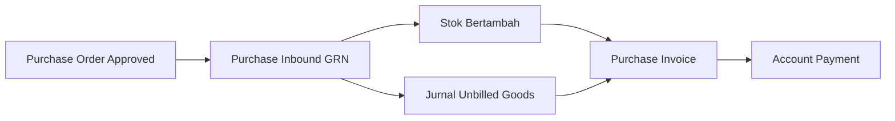
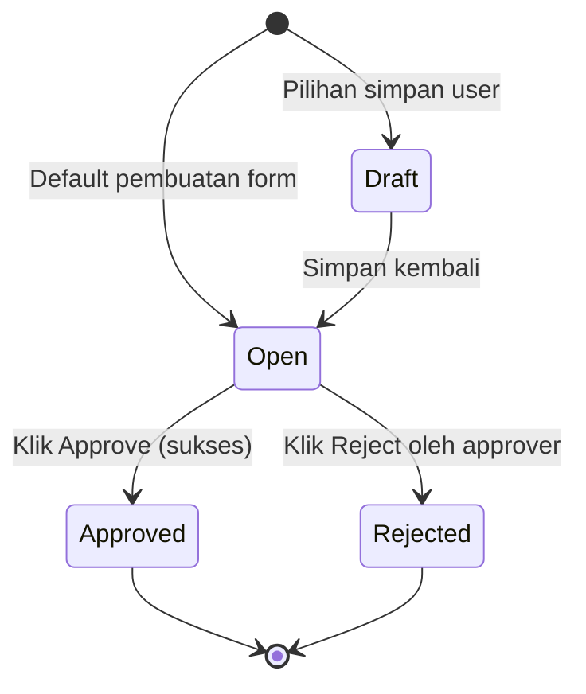
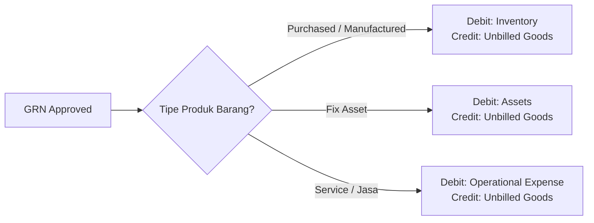
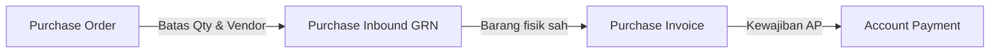

### 🚀 Purchase Inbound (Goods Receipt Note — GRN)

**Overview:**
Modul **Purchase Inbound**, yang sering disebut **Goods Receipt Note (GRN)**, dipakai untuk mencatat barang fisik yang benar-benar masuk ke gudang dari supplier berdasarkan referensi **Purchase Order (PO)** yang sah. Modul ini memastikan penambahan stok tercatat akurat dan menjadi jembatan akuntansi sebelum tagihan resmi diterbitkan di modul hilir.

### 🔑 Istilah Kunci (Glosarium)

* **Goods Receipt Note (GRN) / Purchase Inbound:** Dokumen penerimaan barang resmi yang mencatat masuknya barang fisik ke gudang perusahaan.
* **Purchase Order (PO):** Dokumen komitmen pembelian di hulu yang menjadi acuan kuantitas, harga, dan supplier untuk pembuatan GRN.
* **COLLI (Koli):** Fitur pencatatan barang berdasarkan kemasan fisik (box, pallet, atau krat) dengan isi per kemasan yang seragam, agar penerimaan massal lebih cepat tanpa menghitung unit satu per satu.
* **Unbilled Goods:** Akun perantara (*clearing account*) di sisi Credit yang menampung hutang sementara atas barang yang sudah diterima sebelum faktur resmi dari supplier diproses.
* **Stock ID:** Nomor identitas unik yang diterbitkan sistem untuk setiap kelompok stok masuk, untuk melacak posisi dan pergerakan barang.
* **Batch / Serial / Expired Date:** Parameter kontrol kualitas produk — *Batch Number* melacak lot produksi, *Serial Number* melacak unit individual, dan *Expired Date* membatasi masa kedaluwarsa barang.
* **Product COA Group:** Pengelompokan bagan akun (*Chart of Accounts*) pada master produk yang menentukan arah jurnal berdasarkan jenis barang (**Purchased/Manufactured**, **Fix Asset**, atau **Service**).

### 🎯 Kapan & Kenapa Dipakai

Sistem menerapkan aturan ketat mengenai kapan dokumen GRN boleh dibuat:

| ✅ Buat GRN jika | ❌ Jangan buat GRN jika |
| :---- | :---- |
| Barang fisik dari supplier sudah benar-benar tiba di gudang. | Baru menerima *Purchase Requisition* (PR) tanpa PO resmi yang disetujui. |
| Ada PO berstatus **Approved** atau **Processed** yang masih punya sisa kuantitas (belum habis diterima). | PO referensi sudah **Closed** atau **Void**, atau sisa kuantitasnya sudah habis. |
| Pengaturan akun produk (*Product COA Group*) sudah lengkap di master data. | Akun pembukuan produk masih kosong — akan gagal saat proses *Approve*. |
| Supplier yang dipilih punya PO aktif yang bisa diserap kuantitasnya. | Ingin mencatat stok masuk tanpa referensi PO — untuk kasus ini pakai menu *Other Inbound*. |

### 📋 Prasyarat Operasional

| Prasyarat | Sumber Master Data | Catatan Penting & Batasan |
| :---- | :---- | :---- |
| **Status PO valid** | Modul Purchase Order | PO wajib **Approved** atau **Processed**. Tanggal PO harus lebih awal daripada tanggal GRN. |
| **Ketersediaan supplier** | Master Vendor / Supplier | Supplier hanya muncul di dropdown jika punya PO outstanding. |
| **Gudang tujuan valid** | Master Warehouse | Gudang yang dipilih harus gudang fisik murni, bukan gudang induk yang punya sub-gudang. |
| **Akun produk lengkap** | Master Produk / Kelompok Akun | Wajib punya pemetaan akun *Unbilled Goods* serta akun aset/biaya yang valid sesuai jenis produk. |
| **Periode fiskal terbuka** | Setelan Akuntansi | Tanggal GRN harus berada di bulan pembukuan yang masih terbuka (*open*). |

### 📍 Lokasi Menu: Dua UI, Satu Backend

Sistem menyediakan dua pintu masuk antarmuka untuk mengelola data penerimaan, tetapi keduanya terhubung ke basis data yang sama:

> 1. **BETA - New Purchase Inbound** (menu utama dokumen ini)
>    * **Route UI Sistem:** `/supplychain/new-purchase-inbound`
>    * **Karakteristik:** Dilengkapi fitur **COLLI**, tampilan *Group view*, proses approval *asynchronous*, dan menjadi acuan utama tim QA.
> 2. **Purchase Inbound Legacy (UI lama)**
>    * **Route UI Sistem:** `/supplychain/mutation-inbound`
>    * **Karakteristik:** Memakai tampilan lama dan tidak mendukung pengelolaan kemasan koli.

> 🖼️ **[PLACEHOLDER GAMBAR]** — Sidebar navigasi Supply Chain → Inbound → BETA - New Purchase Inbound, dan tampilan halaman list.

### 🔄 Alur Proses Bisnis

Pergerakan data dari hulu ke hilir berjalan dalam satu rantai procurement:

**Keterangan langkah:**

> 1. **Referensi hulu:** Transaksi berawal dari sisa kuantitas barang yang belum dikirim pada dokumen *Purchase Order* yang sah.
> 2. **Penerimaan fisik (GRN):** Operator gudang mencatat item masuk lewat modul *Purchase Inbound* untuk mengunci volume barang datang.
> 3. **Dampak instan:** Saat dokumen disetujui, sistem memperbarui stok riil gudang dan mencatat nilai keuangan ke pos *Unbilled Goods*.
> 4. **Proses hilir:** GRN yang sah ditarik ke *Purchase Invoice* untuk pengakuan hutang dagang resmi beserta PPN Masukan, lalu dilunasi di *Account Payment*.

### 🛡️ Siklus Status Transaksi

Dokumen GRN memakai siklus status yang lebih ringkas dibanding PO, dengan otorisasi *single-level*:

| Nama Status | Arti / Kondisi | Bisa Diedit? | Tombol UI & Pemicu Aksi |
| :---- | :---- | :---- | :---- |
| **Draft** | Tahap awal pencatatan; user sengaja menunda pengajuan verifikasi barang. | Ya | Save & Next, Save All, Delete |
| **Open** | Status aktif standar — dokumen penerimaan sudah lengkap dan siap diperiksa. | Ya | Save All, Approve, Reject, Delete |
| **Approved** | Tahap final otorisasi. Stok fisik dan jurnal akuntansi terkunci ke database. | Tidak | Print, Print RIR, Show Only |
| **Rejected** | Dokumen ditolak pemeriksa karena ada ketidaksesuaian data lapangan. | Tidak | Show Only |

📊 **PENTING:** Berbeda dengan PO, header GRN **tidak punya** status *Processed*, *Complete*, atau *Closed*. Status pemrosesan tersebut melekat dan diperbarui otomatis di header PO asal, berdasarkan akumulasi kuantitas yang diterima lewat satu atau beberapa GRN.

### ⚙️ Panduan Penggunaan Langkah Demi Langkah

#### Task 1: Buat Dokumen GRN Baru

> 1. Buka `/supplychain/new-purchase-inbound` lalu klik aksi buat dokumen baru.
> 2. Isi header pada blok **Basic Information**: pilih **Supplier** (hanya vendor dengan PO outstanding), pilih **Location (Warehouse)** tujuan bertipe fisik, dan isi **Transaction Date**.
> 3. *Transaction Status* default berada di **Open** (atau pindahkan ke **Draft** jika data belum final).

> 🖼️ **[PLACEHOLDER GAMBAR]** — Form Create Purchase Inbound, bagian header (Supplier, Warehouse, Transaction Date).

#### Task 2: Tambahkan Barang dari Outstanding PO

Untuk mengisi baris detail barang, gunakan salah satu dari tiga metode di panel *Outstanding PO*:

* **Metode A (Bulk Use):** Centang beberapa baris item sekaligus. Sistem otomatis mengisi kuantitas penerimaan sebesar seluruh sisa outstanding yang tersedia di PO.
* **Metode B (Single Use):** Klik baris barang untuk membuka modal detail. Masukkan kuantitas, tentukan **Satuan (Unit)**, dan isi parameter kualitas wajib jika flag produk aktif (**Expired Date**, **Nomor Batch**, atau **Nomor Serial**). Gunakan **Allocate Full Qty** untuk menyapu bersih selisih pecahan desimal akibat konversi satuan.
* **Metode C (Select Product):** Tombol jalan pintas untuk memasukkan produk spesifik secara instan dari PO supplier terkait.

> 🖼️ **[PLACEHOLDER GAMBAR]** — Panel Outstanding PO dengan tombol Bulk Use, Single Use, Select Product.

#### Task 3: Eksekusi Otorisasi (Approve)

> 1. Periksa ulang grid baris detail barang.
> 2. Klik tombol **Approve** di bagian atas form.
> 3. Jika transaksi memakai baris standar (tanpa koli), status langsung menjadi **Approved**. Jika memakai fitur koli, sistem memproses data di latar belakang (lihat bagian COLLI).

> 🖼️ **[PLACEHOLDER GAMBAR]** — Tombol Approve dan notifikasi hasil (sukses / gagal / sedang diproses).

### 📦 Fitur COLLI (Kemasan Koli)

Fitur **COLLI** dirancang untuk mempermudah operator gudang menginput barang yang datang dalam kemasan seragam (*box, pallet, krat, bundle*), tanpa perlu menghitung manual di luar sistem.

#### Cara Mengisi Form

> 1. Aktifkan opsi **Group view** pada panel grid detail untuk memunculkan kolom input kemasan fisik.
> 2. Isi kolom **Jumlah Koli** (wajib bilangan bulat) dan **Isi per Koli** (jumlah barang di dalam satu kemasan).
> 3. Sistem otomatis mengisi (*auto-populate*) nilai kemasan berdasarkan transaksi COLLI terakhir untuk SKU yang sama.
> 4. Setelah nilai diisi, field **Inbound Qty** otomatis menjadi **terkunci (read-only)** dengan rumus:
>    `Inbound Qty = Jumlah Koli × Isi per Koli`
> 5. Jika **Jumlah Koli = 0**, sistem mengembalikan baris ke mode input kuantitas manual biasa.

#### Pemrosesan Latar Belakang (Asynchronous Background Job)

⚠️ **ATURAN PENTING:** Penerimaan barang dengan data COLLI membuat catatan data yang sangat besar, karena sistem menerbitkan *Stock ID* terpisah untuk setiap koli (misalnya 50 koli menghasilkan 50 baris catatan stok di database).

* Proses pembentukan stok tidak instan. Begitu **Approve** diklik, status header langsung menjadi *Approved*, tetapi pembuatan nomor stok dikirim ke antrean latar belakang (*background job*).
* User perlu memantau progres lewat kolom **Item Stock Status** di halaman daftar transaksi (ditampilkan sebagai indikator persentase %).
* **Jika proses gagal:** Sistem otomatis mengamankan data — mengembalikan status dari *Approved* ke **Open**, menghapus sisa stok/jurnal yang sempat terbentuk setengah, dan memunculkan notifikasi error. User cukup menekan **Approve** lagi untuk memicu ulang antrean tanpa input ulang dari awal.

> 🖼️ **[PLACEHOLDER GAMBAR]** — Toggle Group view dan kolom input Jumlah Koli / Isi per Koli, beserta kolom Item Stock Status yang menampilkan progress.

### 📥 Import Excel Massal

Fasilitas impor spreadsheet dipakai untuk mempercepat pencatatan penerimaan barang dalam volume besar. Menu ini mendukung maksimal **10.000 baris detail** per transaksi dan hanya boleh menjalankan **satu proses impor pada satu waktu** (sistem menolak dua impor bersamaan).
Tersedia dua jenis template yang bisa diunduh pada panel unggah data:

> 1. **Template Impor Standar:** Untuk input volume barang konvensional.
> 2. **Template Impor Khusus COLLI:** Dilengkapi kolom ekstra untuk memetakan jumlah kemasan fisik secara massal.

> 🖼️ **[PLACEHOLDER GAMBAR]** — Panel Import Excel dengan pilihan template standar vs COLLI.

### 📊 Referensi Field Lengkap

#### 1. Header & Basic Information Block

| Field | Wajib? | Tipe Data | Aturan Validasi & Perilaku Sistem |
| :---- | :---- | :---- | :---- |
| **Transaction Code** | — | String | Otomatis diterbitkan unik dengan awalan `IN-`. |
| **Transaction Date** | Ya | Date | Tanggal pencatatan. Sistem menolak tanggal mendatang (melebihi hari ini) dan tanggal di luar periode fiskal terbuka. |
| **Supplier** | Ya | Dropdown | Hanya menampilkan vendor yang punya PO berstatus *Approved/Processed*. |
| **Location (Warehouse)** | Ya | Dropdown | Tempat penyimpanan fisik barang. Hanya gudang riil; gudang induk yang punya sub-gudang diblokir. |
| **Description** | Tidak | Text | Catatan tambahan bebas (maksimal 150 karakter). |
| **Transaction Status** | — | Dropdown | Status dokumen. Saat pembuatan awal hanya bisa *Open* atau *Draft*. |
| **Attachments** | Tidak | Berkas | Upload bukti surat jalan dari vendor (dengan batasan ukuran file). |

💡 **CATATAN:** Field mata uang tidak ada di header GRN karena sistem otomatis mewarisi mata uang dari PO sumber saat menyusun jurnal. Field header utama (**Supplier**, **Warehouse**, **Transaction Date**) otomatis terkunci begitu ada minimal 1 baris detail barang di grid.

#### 2. Item Detail Grid (Modal Single Use & Properti Baris)

| Field | Tipe Data | Aturan Validasi & Batasan |
| :---- | :---- | :---- |
| **Info Produk** | Info Sistem | Menampilkan SKU dan nama produk bawaan PO (tidak bisa diubah). |
| **Satuan (Unit)** | Dropdown | Satuan utama atau alternatif. Perubahan satuan memicu konversi ke satuan dasar untuk divalidasi ke sisa PO. |
| **Expired Date** | Date | Wajib jika master produk mengaktifkan flag kedaluwarsa. Tanggal tidak boleh lebih awal dari *Transaction Date* GRN. |
| **Nomor Batch** | Alfanumerik | Wajib jika produk butuh nomor lot. Maksimal 50 karakter. |
| **Nomor Serial** | Alfanumerik | Wajib jika produk memakai kontrol unit individual. Aturan: **satu baris detail hanya berisi satu unit**, dengan kuota maksimal 50 nomor serial per proses. |
| **Allocate Full Qty** | Tombol | Menarik seluruh sisa outstanding PO untuk meminimalkan selisih desimal konversi satuan. |

#### 3. COLLI View Grid Block

| Field | Tipe Data | Aturan Validasi & Batasan |
| :---- | :---- | :---- |
| **Jumlah Koli** | Angka | Jumlah kemasan fisik yang masuk (wajib bilangan bulat positif). |
| **Isi per Koli** | Angka | Jumlah unit barang di dalam satu koli. Jika hasil perkalian melebihi sisa outstanding PO, sistem otomatis menurunkan isi menjadi 1 sebagai pengaman data. |
| **Inbound Qty** | Angka | Hasil otomatis Jumlah Koli × Isi per Koli. Menjadi *read-only* selama Jumlah Koli lebih dari 0. |

### 🗃️ Dampak Akuntansi & Jurnal Buku Besar

#### Prinsip Finansial Dasar

⚖️ **PENTING:** Dokumen Purchase Inbound (GRN) **tidak pernah mencatat komponen PPN** pada jurnalnya. Nilai yang masuk buku besar murni memakai basis **Harga Sebelum PPN** dikalikan kuantitas yang diterima. Pencatatan PPN Masukan dan pengakuan hutang dagang (*Account Payable*) baru dilakukan di modul hilir saat *Purchase Invoice* (PI) disetujui.
Sistem membagi pola jurnal menjadi tiga cabang berdasarkan *Product COA Group*:

#### Skenario 1: Barang Biasa (Purchased Item / Manufactured Item)

* **Stock ID:** Diterbitkan otomatis oleh sistem (Stock ID aktif).
* **Jurnal Keuangan:** `Debit: Inventory (Persediaan Barang Datang) | Credit: Unbilled Goods (Akun Clearing Hutang Sementara)`
* *Deskripsi:* Barang masuk gudang sebagai persediaan resmi, diimbangi pos hutang sementara karena faktur fisik belum diterbitkan vendor.

#### Skenario 2: Aset Tetap (Fix Asset)

* **Stock ID:** Tetap diterbitkan dengan penandaan khusus (*flagged as fix asset*) untuk tracking inventaris internal.
* **Jurnal Keuangan:** `Debit: Assets (Pos Aset Tetap — bukan Inventory) | Credit: Unbilled Goods`
* *Deskripsi:* Barang tidak dianggap persediaan dagang, melainkan langsung diakui sebagai penambahan aset perusahaan di neraca.

#### Skenario 3: Jasa (Service)

* **Stock ID:** **Tidak diterbitkan sama sekali.** Jasa tidak punya wujud fisik untuk disimpan di gudang.
* **Jurnal Keuangan:** `Debit: Operational Expense (Biaya Operasional Bulan Berjalan) | Credit: Unbilled Goods`
* *Deskripsi:* Kuantitas non-fisik langsung diserap menjadi beban operasional, tetapi lawan akunnya tetap di *Unbilled Goods* agar alur penagihan di *Purchase Invoice* tetap sinkron.

### 🛡️ Membatalkan Transaksi: Void, Reject, Delete

Sistem menangani pembatalan dokumen GRN dengan aturan berikut:

* **Delete (hapus total):** Hanya bisa saat status masih **Draft** atau **Open**. Menghapus seluruh data dari database dan mengembalikan alokasi sisa kuantitas ke PO asal.
* **Reject (penolakan):** Dipakai pemeriksa (*approver*) pada dokumen berstatus **Open** untuk membatalkan pengajuan, sehingga transaksi menjadi **Rejected**.
* **Void (pembatalan transaksi sah):**
  > 🛑 **PERHATIAN: FITUR UI GAP.** Tombol **Void** terlihat aktif di halaman detail GRN yang sudah *Approved*, tetapi jika diklik, server akan **menolak eksekusi** tersebut. Ini bukan error biasa, melainkan tombol yang belum terhubung ke engine pembatalan di backend. Jika perlu koreksi data setelah *Approved*, **jangan mengandalkan tombol ini** — koordinasikan penyesuaian stok/jurnal secara manual dengan tim terkait.
* **Close (penutupan voucher):** Kasusnya sama dengan Void — tombol tampil di beberapa bagian layout, tetapi **belum berfungsi** untuk memotong transaksi GRN.

### 🖨️ Ekspor & Cetak (Print)

* **Ekspor:** Unduh rangkuman daftar dokumen penerimaan, baik format *Header Only* (ringkasan voucher) maupun *Header + Detail Line Item* secara massal.
* **Print (Purchase Inbound PDF):** Mencetak lembar dokumen GRN standar sebagai bukti tanda terima barang.
* **Print RIR (Receiving Inspection Report):** Cetakan sekunder untuk Laporan Pemeriksaan Barang Datang bagi divisi *Quality Control* gudang.

> 🖼️ **[PLACEHOLDER GAMBAR]** — Tombol Print dan Print RIR.

### 🔗 Hubungan Antar Menu Sistem

Modul *Purchase Inbound* menjadi jantung operasional logistik dalam rantai pasok perusahaan:

| Nama Menu | Peran Terhadap Pembentukan GRN |
| :---- | :---- |
| **Purchase Order** | Menu hulu penyuplai data barang *Approved/Processed* dan pembatas kuantitas maksimal yang bisa diterima gudang. |
| **Purchase Invoice** | Menu akuntansi hilir yang menyerap data fisik dari GRN *Approved* untuk menerbitkan tagihan resmi. |
| **Account Payment** | Ujung rantai procurement untuk melunasi hutang yang lahir dari dokumen sebelumnya. |
| **Purchase Inbound (Legacy)** | UI lama yang membaca basis data sama dengan menu BETA, tanpa fitur koli. |
| **Other Inbound** | Modul penerimaan barang mandiri jika gudang menerima barang **tanpa** referensi PO. |

### 🛑 Yang Belum Tersedia / Masih Dibahas

#### Kategori A: Terlihat di Layar tapi Belum Berfungsi (UI Gap)

* **Tombol Void & Close pada Header GRN:** Tombol tampak aktif, tetapi backend menolak memproses pembatalan setelah status *Approved* (lihat bagian Membatalkan Transaksi).

#### Kategori B: Belum Tersedia untuk Operasional Harian

* **Fitur Unapprove:** Engine untuk membalik status dari *Approved* kembali ke *Open* sebenarnya sudah ada, tetapi **hanya bisa dijalankan tim Development** lewat intervensi basis data, dan belum dibuka untuk staff operasional harian.

#### Kategori C: Menunggu Keputusan Manajemen (Roadmap)

* **Masa Pensiun Menu Legacy:** Manajemen masih menjalankan dua menu (*BETA* & *Legacy*) bersamaan dan belum memutuskan tanggal penghapusan menu lama.
* **Toleransi Over-Receipt:** Belum ada keputusan apakah gudang boleh menerima barang melebihi kuantitas PO (dengan persentase tertentu) atau tetap dikunci ketat seperti sekarang.

### 🛠️ Panduan Troubleshooting

| Gejala Masalah | Kemungkinan Penyebab | Langkah Koreksi |
| :---- | :---- | :---- |
| Nama supplier tidak muncul di dropdown header GRN. | Belum ada PO berstatus *Approved/Processed* atas nama supplier tersebut. | Hubungi divisi procurement, pastikan PO sumber sudah disetujui. |
| Muncul error qty ditolak "melebihi sisa outstanding". | Kuantitas yang diketik lebih besar dari sisa barang yang belum terkirim di PO. | Turunkan angka kuantitas, atau cek log GRN lain — mungkin SKU sudah pernah diterima. |
| *Approve* gagal dengan error "tidak ada baris detail". | Menekan setuju saat belum ada barang dari panel outstanding. | Masukkan minimal satu baris item dari panel outstanding sebelum *Approve*. |
| Approve gagal dengan error konfigurasi akun. | Setelan *Product COA Group* untuk item masih kosong di master data. | Buka master grup produk, lengkapi pemetaan akun *Inventory/Assets/Operational Expense* dan *Unbilled Goods*. |
| Form terlihat macet / loading terus saat memproses COLLI. | Antrean pembuatan Stock ID koli di latar belakang sedang memproses data besar. | Tunggu sebentar dan pantau kolom *Item Stock Status* di halaman list. Jika gagal, status balik ke *Open* dan tinggal klik *Approve* lagi. |
| Tombol hapus baris detail terkunci / tidak merespons. | Baris masih terhubung dengan perhitungan data COLLI. | Ubah dulu nilai Jumlah Koli di baris tersebut menjadi 0 sebelum menghapus baris. |
| Barang dari PO tertentu tidak bisa dimasukkan lagi ke GRN. | PO sumber sudah diubah statusnya menjadi *Closed* untuk sisa barang. | Konfirmasi ke tim procurement alasan penutupan sisa kuantitas PO jika dirasa keliru. |
| Tombol *Void* pada GRN *Approved* gagal membatalkan. | Fitur Void di modul ini memang belum terhubung ke backend (UI Gap). | Koordinasikan perbaikan stok dan jurnal secara manual dengan tim akuntansi — jangan mengandalkan tombol ini. |

### ❓ Pertanyaan yang Sering Diajukan (FAQ)

**Q: Apa beda menu Purchase Inbound BETA dengan yang lama?**
A: Versi BETA punya fitur pengelolaan kemasan massal (**COLLI**) dan tampilan lebih modern; menu lama tidak punya fitur koli. Keduanya membaca basis data backend yang sama.

**Q: Bolehkah gudang menerima barang bertahap (Partial Inbound)?**
A: Boleh. Anda bisa menerbitkan beberapa GRN terpisah untuk menyerap sisa kuantitas dari satu PO secara berkala, sampai seluruh outstanding habis.

**Q: Kapan status header PO otomatis menjadi Complete?**
A: Sistem otomatis mengubah status PO menjadi **Complete** saat seluruh baris kuantitas item pada PO sudah 100% diterima lewat GRN.

**Q: Apakah nilai barang di GRN sudah termasuk PPN pembelian?**
A: Tidak. Modul penerimaan gudang tidak melibatkan pajak. PPN Masukan baru diakui dan dicatat saat *Purchase Invoice* disetujui.

**Q: Kenapa produk tipe Jasa (Service) tidak menghasilkan Stock ID saat GRN disetujui?**
A: Karena jasa non-fisik dan tidak disimpan di gudang, sehingga sistem melewati pembuatan Stock ID dan langsung mencatatnya ke jurnal biaya operasional.

**Q: Apa beda penanganan Aset Tetap (Fix Asset) dengan barang persediaan biasa?**
A: Keduanya sama-sama menghasilkan *Stock ID* untuk tracking, tetapi nilai uang Aset Tetap diarahkan ke akun *Assets* di neraca, bukan ke akun *Inventory*.

**Q: Kenapa antrean data COLLI kadang gagal di tengah jalan?**
A: Pemrosesan koli membuat ribuan baris stok di server secara bersamaan. Jika beban server melonjak, antrean bisa terputus. Sistem otomatis mengembalikan dokumen ke status *Open* agar Anda cukup menekan *Approve* lagi.

**Q: Bisakah staff gudang membatalkan (Void) GRN yang sudah *Approved*?**
A: Pada versi saat ini belum bisa dilakukan lewat aplikasi karena adanya UI gap pada tombol Void. Lakukan penyesuaian pembukuan manual bersama tim finance.

### 📑 Lihat Juga / Referensi Terkait

* [Purchase Order](/docs/scm/supplychain-purchase-order/overview) — sumber outstanding qty dan supplier untuk GRN.
* [Purchase Invoice](/docs/accounting/accounting-supplier-invoice/overview) — pengakuan hutang dan PPN dari GRN yang Approved.
* **Account Payment** — pelunasan hutang yang lahir dari rantai dokumen ini.
* **Purchase Inbound (Legacy)** — UI alternatif tanpa fitur koli, backend sama.
* **Other Inbound** — penerimaan barang masuk tanpa referensi PO.
