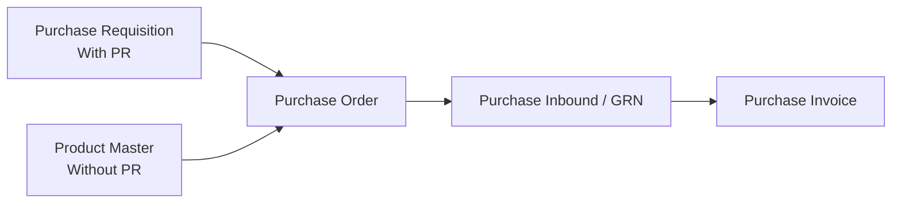
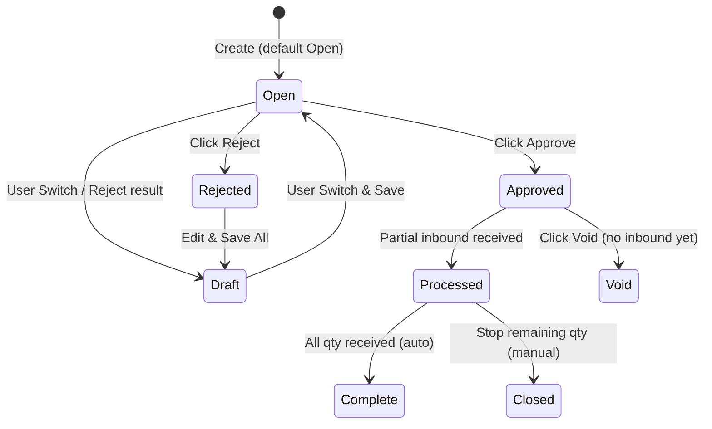
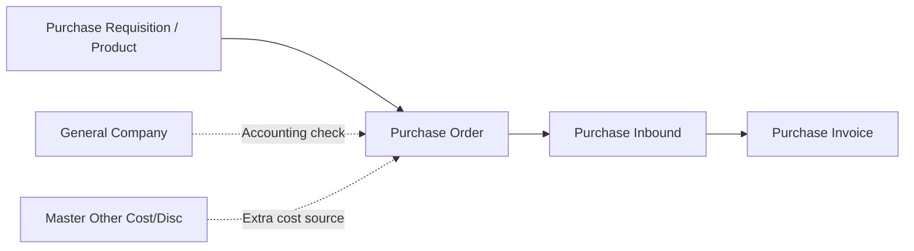

### 📦 Module/Feature: Purchase Order

**Business definition:**
A **Purchase Order (PO)** is an official buying document your company sends to a **supplier** to order goods or services. In **OlshopERP**, a PO is your formal purchase commitment. You can create it in two ways: **With PR** (pulling from a *Purchase Requisition* that still has remaining quantity) or **Without PR** (buying directly by picking active products from master data). The system checks each item carefully so the quantities are correct before the data flows to **Purchase Inbound** (goods receipt) and **Purchase Invoice** (billing). Every PO uses a number that starts with **PO-** under the *Supply Chain Management* (SCM) / *Procurement* module.

### 🔑 Key Terms (Glossary)

* **Purchase Order (PO):** The official order document sent to a supplier as proof of a buying commitment.
* **Purchase Requisition (PR):** An internal purchase request from a team that must be approved before it can become a PO.
* **Purchase Inbound:** Receiving the goods at the warehouse based on an **Approved** PO. Also called a *Good Receipt Note* (GRN).
* **Purchase Invoice (PI):** The supplier's official bill that records the payable (*Account Payable*) after goods are received.
* **With PR / Without PR:** Two ways to fill a PO. *With PR* pulls from the PR's remaining quantity; *Without PR* picks products directly from master data.
* **Additional Cost / Discount:** Extra fees (like shipping) or non-product discounts added to the PO.
* **DPP (Tax Base):** The net price of goods after line discounts, before tax is calculated.
* **VAT (PPN):** Value Added Tax applied to the selected product lines.

### 🎯 When & Why to Use

| ✅ Create a PO when | ❌ Don't create a PO when |
| :---- | :---- |
| You need to buy goods or materials from a supplier (through an internal request or a direct purchase). | The supplier's accounting setup is not complete in master data — the supplier won't show up in the list. |
| **With PR:** The reference PR is **Approved/Processed** and still has remaining quantity. | The PR's quantity is fully used by other POs, or the PR is already **Closed/Complete**. |
| **Without PR:** The product is active and mapped to a valid account group (*COA group*). | The product is a *bundle* or random variant, which can't be picked directly on a PO line. |

### 📋 Prerequisites

| Requirement | Master Data Source | Rule & Limit |
| :---- | :---- | :---- |
| Complete supplier accounting | General Company | The supplier must be active with a fully mapped Chart of Accounts to appear in the dropdown. |
| Valid PR status (*With PR*) | Purchase Requisition | The source PR must be **Approved** or **Processed**, with a PR date earlier than the PO date. |
| Valid SKU & account group (*Without PR*) | Product Master | The item must be active, have an operational account group, and not be a *bundle* or random variant. |
| Active currency | Currency Master | The *Exchange Rate* is automatically 1 for the main currency. For foreign currencies, enter the rate manually. |
| Open fiscal period | Accounting Settings | The target monthly period must be open so data can be saved/approved. |

### 📍 Menu Location & Workspace

You manage purchase orders from the operations navigation panel:

* **UI navigation path:** Supply Chain Management → Procurement → Purchase Order
* **System UI route:** `/supplychain/purchase-order`

*SCM → Procurement → Purchase Order sidebar, plus the list page (DataList).*

### 🔄 Two Purchase Order Types: With PR vs Without PR

The system offers two ways to fill in item details, and they work differently:

> 1. **With PR:** Item lines come only from items listed on a valid *Purchase Requisition*. The quantity you enter is checked against the PR's remaining amount. The **Allocate Full Qty Clearing** button is available to absorb leftover decimal quantities.
> 2. **Without PR:** You add items directly from active product master data — no request needed. You can pick many products at once; the starting quantity is 1 and the price follows the latest transaction.

⚠️ **IMPORTANT RULE:** The type choice (*With PR / Without PR*) **locks automatically** once you add at least one item line. The exception: the bulk *Excel Import* path can change this type based on the file's structure.

### 🔄 Business Process Flow

#### A. From Upstream to Downstream

**Step notes:**

> 1. **Start the need:** The document begins from a PR's remaining quantity (*With PR*) or from picking active products directly (*Without PR*).
> 2. **Issue the PO:** Create an **Approved** PO to lock the item price, VAT type, and any extra costs for the supplier.
> 3. **Receive the goods:** The supplier ships, and the warehouse receives through *Purchase Inbound* to record the stock based on the PO.
> 4. **Bill it:** The supplier's bill is handled in *Purchase Invoice*, which inherits the value, VAT, and extra costs from the PO.

### 🛡️ Transaction Lifecycle

A Purchase Order has 8 statuses that control edit rights and system actions:

#### Status Parameters

| Status | Meaning / Condition | Editable? | Active Buttons & UI Trigger |
| :---- | :---- | :---- | :---- |
| **Draft** | Early stage not yet ready to submit, or a **Rejected** document that was saved again. | **Yes** | Save & Next, Save All, Delete |
| **Open** | Default status when the document is created. Data is ready for approval. | **Yes** | Save All, Approve, Reject, Delete |
| **Approved** | Approved through single-level authorization. Data is locked and ready for *Inbound*. | **No** | Print, Show Only, Void *(if received = 0)* |
| **Rejected** | Rejected by the approver. Must be fixed to return to **Draft**. | **Yes** | Save All *(back to Draft)*, Delete |
| **Processed** | Goods have been partially received by the warehouse via *Purchase Inbound*. | **No** | Show Only, Closed |
| **Complete** | **Auto-finished** — all PO quantity has been fully received. | **No** | Show Only |
| **Closed** | **Manually finished** — the user stops the remaining quantity that won't be shipped. | **No** | Show Only |
| **Void** | Permanent cancellation of an approved PO commitment. | **No** | Show Only |

📊 **IMPORTANT: Complete (auto) vs Closed (manual)**

* **Complete:** Triggered automatically when the received quantity equals the ordered quantity (remaining = 0). Used when the supplier delivers everything.
* **Closed:** Triggered manually by the user. Only available from **Processed** when some quantity is still open but the procurement team decides to stop the rest. After **Closed**, the system blocks any new goods receipt for this PO.

📊 **IMPORTANT: Void vs Delete**

* **Delete:** Removes the data completely from the database. Only for documents in **Draft**, **Open**, or **Rejected**.
* **Void:** Cancels a document that has already been officially issued. Only for **Approved** documents that have **never received any goods** (inbound = 0). Once the status is **Processed**, the **Void** button turns off automatically.

### ⚙️ Step-by-Step Guide

#### Task 1: Create a New Header

> 1. Open `/supplychain/purchase-order` and start a new PO.
> 2. Fill in **Basic Information**: Transaction Date, an active Supplier, and the Currency.
> 3. Choose the transaction method with the radio button: **With PR** or **Without PR**.
> 4. Add supporting data like Exchange Rate (for foreign currency) and an optional description.

> 🖼️ **[IMAGE PLACEHOLDER]** — Create Purchase Order form, With PR / Without PR choice and Basic Information.

#### Task 2: Fill in the Item Details

**Sub-Task A: With PR**

> 1. Click to add an item to open the **Available Product** modal. The system shows all PR lines for the chosen supplier that still have remaining quantity.
> 2. Pick an item and click **Use** to adjust the quantity, unit, line discount, and VAT. A manual quantity **must be a whole number**.
> 3. *Quick option:* Use **Allocate Full Qty Clearing** to absorb the PR's entire remaining quantity automatically without rounding (recommended for leftover decimals).

> 🖼️ **[IMAGE PLACEHOLDER]** — Available Product modal (PR outstanding) and the Use / Allocate Full Qty Clearing buttons.

**Sub-Task B: Without PR**

> 1. Click to add an item to open the direct product modal.
> 2. Pick one or more active product SKUs from master data.
> 3. The system sets the starting quantity to 1 with the base unit, and the price from the latest purchase. Adjust the numbers as needed.

> 🖼️ **[IMAGE PLACEHOLDER]** — Direct product selection modal (Without PR).

#### Task 3: Extra Costs & Discounts (Optional)

> 1. Open the **Additional Cost** or **Additional Discount** panel below the item grid.
> 2. Pick a code from the active master list, then enter the amount in the Amount field (must be greater than or equal to 0).

> 🖼️ **[IMAGE PLACEHOLDER]** — Additional Cost / Additional Discount panel.

#### Task 4: Check the Totals and Approve

> 1. Review the **Totals panel** to make sure *DPP*, *Total VAT*, and *Net Purchase* are correct.
> 2. Make sure the status is **Open**, then click **Approve** to issue single-level authorization. The document locks as **Approved**.

> 🖼️ **[IMAGE PLACEHOLDER]** — Approve button, and the Void/Closed buttons in the datalist based on status.

### 📥 Bulk Detail Import (Excel)

Use this to add many item lines at once with an Excel template file.

#### A. How the System Detects the Document Mode

The system decides the import type from **Column A (first data row)**:

* If Column A has a PR code, the file is treated as **With PR** and checked against the PR's remaining quantity.
* If Column A is empty in every row, the file is treated as **Without PR**.

⚠️ **NOTE:** Don't mix the structure within one file. If some rows have a PR code and others are empty, the system uses an **all-or-nothing** rule — the entire import is **cancelled** and no data is saved.

#### B. Excel Template Columns

| Column | Excel Header | Required? | Data Type / Value | Function & Validation |
| :---- | :---- | :---- | :---- | :---- |
| **A** | *(no fixed title)* | Required for With PR mode | Alphanumeric (e.g., PR-20250705-001) | Links the source PR code for outstanding-item validation. |
| **B** | System Product SKU | **Required** | String / Alphanumeric | The active product SKU code. *Bundle* products are not allowed. |
| **C** | PO Qty | **Required** | Number (greater than or equal to 0) | The item quantity. This import path **allows decimal numbers**. |
| **D** | Unit | **Required** | String | The unit code. Must match the system's unit master. |
| **E** | Unit Price | **Required** | Number (greater than or equal to 1) | The unit price before discounts and tax. |
| **F** | Disc. | No | Number | Line discount percentage (enter at least 0). |
| **G** | Description | No | Free text | Internal note for the line (max 150 characters). |
| **H** | Required Delivery Date | No | Date format | Delivery deadline (must be a real Excel date). |

> 🖼️ **[IMAGE PLACEHOLDER]** — Import Detail panel with the download-template button and the import log.

### 📊 Full Field Reference

#### 1. Basic Information Block

| Field | Required? | Default | Value Source | Validation / Procedure |
| :---- | :---- | :---- | :---- | :---- |
| Transaction Code | — | Automatic | Internal System | Uses the `PO-` prefix. Unique per company and can't be changed. |
| Transaction Date | Yes | Today | Server Clock | Can't be a future date and must be within an open fiscal period. |
| Valid Until Date | No | Empty | User Input | The PO offer's expiry date. |
| Estimated Arrival | No | Empty | User Input | Estimated arrival of goods at the warehouse. |
| Supplier | Yes | — | General Company Master | Shows only active suppliers with complete accounting setup. The dropdown shows up to 25 results. |
| Payment Type | No | Vendor master value | Supplier Profile | Sets the payment method. |
| Currency | Yes | Vendor master value | Currency Master | Sets the base currency for the transaction. |
| Exchange Rate | Yes | 1.00 | Rate Configuration | Must be **1.00** for the main currency. The rate is not auto-synced when you switch to a foreign currency. |
| PO Type | Yes | — | Radio Choice | Sets *With PR* or *Without PR*. Locks after the first item line is added. |
| Your Ref | No | — | Free text | External/internal reference number (max 50 characters). |
| Description | No | — | Free text | General transaction note (max 150 characters). |
| Term and Condition | No | — | Free text | Special terms or conditions (max 150 characters). |
| Shipping/Billing Address | No | — | Free text | Shipping or billing address details. |
| Upload Files | No | — | Local Files | Attachments: xlsx, xls, docx, doc, pdf, jpeg, jpg. |

💡 **NOTE:** Once the detail table has at least one line, header fields like **Transaction Date**, **Supplier**, **Currency**, and **Payment Type** lock automatically.

#### 2. Detail Grid Block (With PR & Without PR)

| Field | Required? | Type / Format | Notes & Validation |
| :---- | :---- | :---- | :---- |
| Ref Purchase Requisition | *(With PR)* | System Info | Shows the source PR number for reference. |
| Request Quantity | *(With PR)* | Quantity Info | The original quantity requested on the PR (converted to the chosen unit). |
| Qty Used by Other POs | *(With PR)* | Quantity Info | Shows PR quantity already used by other PO vouchers. |
| Historical Price Info | — | Financial Info | Shows the highest, lowest, latest, and average price as a guide. |
| Unit | Yes | Dropdown | You can use an alternative product unit. Changing the unit triggers an automatic conversion to the base unit for the outstanding check. |
| Purchase Order Quantity | Yes | Number | The ordered quantity. Manual entry **must be a whole number**; Excel import allows decimals greater than 0. |
| Price | Yes | Financial Value | The unit price. Editable, with a suggestion from the latest transaction. |
| Warranty | No | Master Info | Product warranty info from master data (informational). |
| Discount (%) | No | Percentage | Line discount (enter at least 0). |
| VAT (%) | Yes | Percentage | Product VAT filled automatically from master data, with an *Include/Exclude* tax toggle. |
| Required Delivery Date | No | Date | Delivery target to the warehouse. |
| Net Purchase (Row) | — | Summary | Auto line result: Price × Qty − Discount + VAT before saving. |

#### 3. Additional Cost & Discount Block

| Field | Required? | System Processing Rule |
| :---- | :---- | :---- |
| Additional Cost / Discount | Yes | Chosen from the active *Other Cost / Discount* master. |
| Amount | Yes | The extra cost or discount amount. Must be greater than or equal to 0. |
| Cost Description | No | Context note for the extra cost (max 150 characters). |

#### 4. Totals Panel

* **Total Products:** The gross total of all item prices before discounts and VAT.
* **Disc Products:** The total discount amount across all item lines.
* **Total DPP (Tooltip):** The net tax base used to calculate VAT in the system.
* **Total VAT:** The total VAT across all product lines.
* **Total Additional Cost / Disc:** The net result of extra costs minus extra discounts outside the products.
* **Net Purchase / Total Price:** The final total that becomes the **main reference** for the payable in downstream menus.

### 🧮 Business Logic & Calculations

#### A. Unit Conversion & PR Outstanding Check (With PR)

If procurement staff change the Unit on the item detail, the system automatically converts the quantity to the base unit:

`Base-Unit Quantity = PO Quantity × Unit Coefficient`

The converted value is then compared to the PR's remaining amount:

`PR Outstanding = Approved PR Qty − Qty Used by Other POs`

If the converted quantity is more than the PR's remaining amount, the system blocks the save and lowers the input to the highest allowed value.

#### B. Screen Rounding Tolerance

⚠️ **KNOWN BEHAVIOR (NOT A BUG):** For some decimal values, if you manually add the DPP and VAT shown rounded to 2 decimals per line, the result **can be 1 cent (Rp 0.01) higher** than the official **Total Price / Net Purchase** in the header.
This is normal because the system uses pure decimals without rounding on the server to keep accounting accurate. The payable and journal always follow the header **Net Purchase / Total Price**, not your manual on-screen sum. No manual fix is needed for this cent difference.

#### C. VAT Journal Recognition

The VAT on a PO is **not yet posted to the accounting journal** when goods are received in *Purchase Inbound*. Input VAT is officially recorded only when the downstream **Purchase Invoice (PI)** is **Approved**.

### 🛡️ Business Rules & System Validation

* **If you** set the Transaction Date to a future date, **the system** rejects the document and shows an error.
* **If you** pick the main currency but set the Exchange Rate to anything other than 1, **the system** fails the save (the main-currency rate must be 1).
* **If you** search for a supplier whose accounting setup is incomplete, **the system** won't show that supplier in the dropdown.
* **If you** are in *With PR* mode and pick a SKU that's not in the PR outstanding list, **the system** blocks that product.
* **If you** enter a quantity that, after conversion, exceeds the PR's remaining amount, **the system** rejects the input.
* **If you** click **Approve** while the status isn't *Open* or the detail grid is empty, **the system** cancels the approval.
* **If you** click **Void** on a PO that isn't *Approved*, or the PO has already received goods (*Processed*), **the system** blocks the cancellation.
* **If you** click **Closed** on a PO that isn't yet *Processed*, **the system** rejects it (Closed only stops the remaining quantity on a PO that has already received some goods).
* **If you** click **Delete** on a PO whose status isn't *Draft*, *Open*, or *Rejected*, **the system** blocks the deletion.
* **If you** try to edit a PO that's already *Approved*, *Processed*, *Complete*, *Closed*, or *Void*, **the system** locks the whole form to protect the data.
* **If you** add detail lines (manually or via *Excel Import*) beyond **500 rows**, **the system** rejects the whole document.
* **If you** click *Create*, *Update*, or *Approve* on a date whose fiscal period is closed, **the system** blocks it to protect past financial reports.
* **If you** type a manual quantity with decimals in the form, **the system** rejects it and requires a whole number (decimals are only allowed via Excel import).
* **If you** set Additional Cost/Discount so high that the pre-VAT PO total becomes negative, **the system** fails the save.

### 🖨️ Export & Print

#### A. Detail Data Export

You can download PO detail data per document (SKU, warehouse stock, requested qty, PO qty, unit, price, discount, VAT, and total) or in bulk from the list page using background processing. The downloads are available in a dedicated export files tab.

⚠️ **NOTE: PDF Printout**
The official PDF printout **only totals the product item lines**. The **Additional Cost** and **Additional Discount** components are **not included** in the PDF total.
So the PDF total **can differ** from the *Net Purchase / Total Price* in the app if the PO uses extra costs/discounts. Please explain this to the supplier to avoid billing confusion.

### 🔗 How This Menu Connects to Others

#### Menu Dependencies

| Related Menu | Role Toward the PO |
| :---- | :---- |
| **Purchase Requisition** | Provides item lines and the quantity limit for *With PR* POs. |
| **Product Master** | Provides the active product catalog and default VAT for *Without PR* POs. |
| **General Company** | Provides supplier data with the required accounting mapping. |
| **Purchase Inbound** | The downstream warehouse menu that receives goods from **Approved** POs. |
| **Purchase Invoice** | The downstream accounting menu that records the payable and inherits VAT + *Additional Cost/Discount* from the PO. |
| **Master Other Cost / Discount** | The library of non-product costs (like shipping) you can add to a PO. |

### 🛑 System Limits & Policy Notes (Gaps & Roadmap)

#### A. Features Not Yet Available

* **Without PR Import:** Bulk Excel import for the *Without PR* type is not fully wired in production yet. For now, the stable bulk Excel import only supports the **With PR** type.
* **Template Download:** The download-template button on the import panel sometimes has a *broken link*. If that happens, build the columns manually following the specification table above.

#### B. Policies Still Under Review

📄 **Note:** The points below describe how the system currently behaves, but they are **still under review** by the Finance, Procurement, and QA teams for a final policy:

* **Void PO vs PR Quantity:** When a *With PR* PO that is already *Approved* is **Voided**, the system **does not return the remaining quantity to the source PR**. So the PR quantity stays used/locked. Under review because it affects open-commitment reports.
* **Additional Cost/Discount on PDF:** The policy of not showing extra costs/discounts in the PDF total to the supplier is still being discussed — whether the official document must include them or just a product summary.
* **Financial Column Sort Order:** There's a minor note that the sort order of the DPP and VAT columns in the list sometimes doesn't match the detail numbers.
* **4-Decimal Export:** There's a plan to improve the DPP and VAT export output to 4 decimals for auditing; for now it stays at 2 decimals.
* **Changing the PO Type via Excel Import:** The system currently lets an Excel file change the PO type (overriding the radio choice). It's still being discussed whether to block this strictly or keep it flexible.

### 🛠️ Troubleshooting

| Symptom | Likely Cause | Fix |
| :---- | :---- | :---- |
| A supplier doesn't appear in the PO header dropdown. | The supplier's accounting (COA) setup is incomplete. | Open the **General Company** master and complete the supplier's account setup. |
| The **Approve** button can't be clicked. | The document is still **Draft** and hasn't been saved as **Open**. | Change the status to **Open**, click Save All, then the *Approve* button becomes active. |
| After a PO is rejected and fixed, it's hard to *Approve* again. | The system drops the status to **Draft** each time *Reject* + save happens. | Move the status from *Draft* back to **Open**, then Save All before requesting approval again. |
| The **Void** button doesn't appear. | The PO is still *Draft* or *Open*. | For documents not yet *Approved*, use **Delete**, not *Void*. |
| **Void** is rejected on an *Approved* PO. | The PO has already received goods (status *Processed*). | A PO that has received goods can't be *Voided*. Use **Closed** to stop the remaining quantity. |
| The **Closed** button doesn't appear. | The PO has never received any goods (inbound = 0). | Create a receipt via **Purchase Inbound** first until the status becomes *Processed*. |
| Excel import fails completely with a "type mismatch" error. | The file structure (PR/Non-PR mode) doesn't match the item rows already in the PO. | Clear the saved detail rows, or adjust the file columns to match the PO type. |
| A currency-rate validation error appears on save. | The main currency is selected but the Exchange Rate is not 1. | Set the Exchange Rate to **1.00** for the main currency. |
| PR lines don't appear in the *Available Product* modal. | The PR is already *Complete*, *Closed*, or its quantity is used up by other POs. | Check the PR's status and quantity usage in the *Purchase Requisition* module. |
| The manual DPP + VAT sum is 1 cent higher than the Net total. | A 2-decimal display rounding effect on screen. | **Normal (not an error).** No fix needed — the system processes accurate numbers on the server. |
| Net Purchase / Total Price is far off from Price × Quantity. | Possible data issue on the server or a calculation bug. | Note the PO number, take a screenshot, and report it to the QA or Development team. |
| The extra-cost amount field is greyed out and locked. | The cost line was pulled from the source PO, so it's locked. | If it's wrong, fix the value directly in the source **Purchase Order**. |

### ❓ Frequently Asked Questions (FAQ)

**Q: Why doesn't the supplier appear in the form dropdown?**
A: Because the supplier's accounting setup is incomplete in the *General Company* master.

**Q: After a PO is rejected, why can't I click Approve right away?**
A: The system drops the status to *Draft* after a rejection. Set the status back to *Open* and save first so approval works again.

**Q: When do I use Void, and when do I use Delete?**
A: Use **Delete** for documents in early stages (*Draft, Open, Rejected*). Use **Void** to cancel a document that's already **Approved**, as long as no goods have been received.

**Q: Does voiding a PO return the quantity to the source PR?**
A: No. In the current version, the PR quantity does not go back automatically after a PO is *Voided* (this is still under business review).

**Q: Is the PDF printout total the same as the Net Purchase on screen?**
A: Not always. The PDF currently totals only the product lines. Additional Cost and Additional Discount are not included in the PDF.

**Q: Can the quantity in the form be a decimal?**
A: If you type it manually in the form, it must be a whole number. If you use **Excel Import**, the quantity can be a decimal greater than 0.

**Q: What's the maximum number of detail lines in one PO?**
A: Up to **500 lines** per PO document, whether by form or Excel import.

**Q: Is VAT posted to the journal when the warehouse receives goods in Purchase Inbound?**
A: No. *Purchase Inbound* only records incoming stock to a temporary payable account (*Unbilled Goods*). Input VAT is recorded only when the **Purchase Invoice (PI)** is approved.

### 📑 See Also / Related Documents

* [Purchase Requisition](/docs/scm/supplychain-purchase-requisition/overview) — source of item lines for With PR POs.
* [Purchase Inbound](/docs/scm/supplychain-new-purchase-inbound/overview) — receiving goods from Approved POs.
* [Purchase Invoice](/docs/accounting/accounting-supplier-invoice/overview) — recording the bill and inheriting VAT + extra costs.
* **General Company** — supplier accounting configuration.
* **Master Other Cost & Discount** — non-product cost options.
