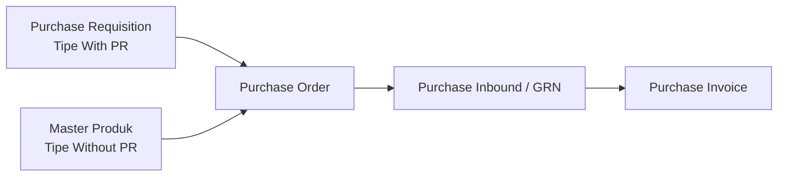
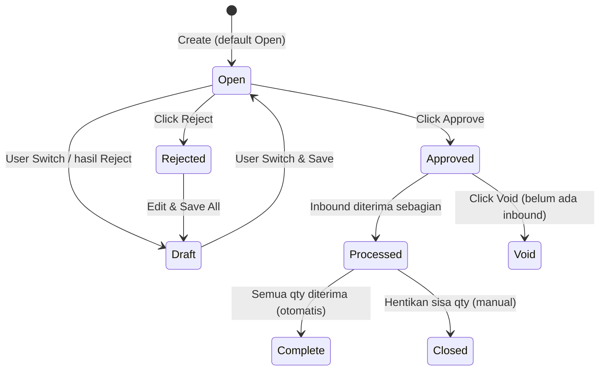
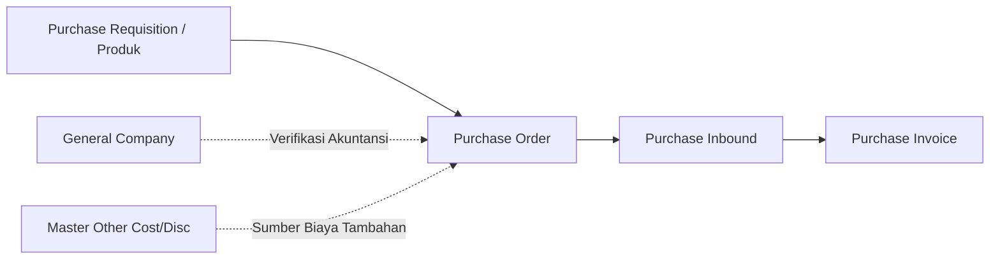

### 📦 Modul/Fitur: Purchase Order

**Definisi Bisnis:**
**Purchase Order (PO)** adalah dokumen pembelian resmi yang diterbitkan perusahaan kepada **supplier** untuk memesan barang atau jasa. Di **OlshopERP**, PO menjadi komitmen belanja resmi dan bisa dibuat lewat dua cara: **With PR** (mengambil dari *Purchase Requisition* yang masih punya sisa kuantitas) atau **Without PR** (pembelian langsung dengan memilih produk aktif dari master data). Sistem menerapkan validasi ketat di level item untuk memastikan kuantitas sesuai aturan sebelum data diteruskan ke **Purchase Inbound** (penerimaan gudang) dan **Purchase Invoice** (tagihan/faktur). Semua PO memakai penomoran dengan awalan **PO-** di modul *Supply Chain Management* (SCM) / *Procurement*.

### 🔑 Istilah Kunci (Glosarium)

* **Purchase Order (PO):** Dokumen pesanan pembelian resmi ke supplier sebagai bukti komitmen belanja.
* **Purchase Requisition (PR):** Permintaan pembelian internal dari divisi terkait yang harus disetujui dulu sebelum diubah menjadi PO.
* **Purchase Inbound:** Proses penerimaan barang di gudang berdasarkan PO yang sudah **Approved**. Sering disebut *Good Receipt Note* (GRN).
* **Purchase Invoice (PI):** Dokumen tagihan resmi dari supplier untuk mengakui hutang dagang (*Account Payable*) setelah barang diterima.
* **With PR / Without PR:** Dua cara mengisi PO. *With PR* menarik dari sisa kuantitas PR, sedangkan *Without PR* memilih langsung dari master produk.
* **Additional Cost / Discount:** Biaya tambahan (misalnya ongkos kirim) atau potongan harga di luar produk yang dibebankan pada PO.
* **DPP (Dasar Pengenaan Pajak):** Nilai harga bersih barang setelah dikurangi diskon baris, sebelum dihitung pajak.
* **PPN / VAT:** Pajak Pertambahan Nilai yang dikenakan pada baris produk terpilih.

### 🎯 Kapan & Kenapa Dipakai

| ✅ Buat PO jika | ❌ Jangan buat PO jika |
| :---- | :---- |
| Ada kebutuhan membeli barang/material ke supplier (lewat pengajuan internal maupun pembelian langsung). | Pengaturan akuntansi supplier belum lengkap di master data — supplier tidak akan muncul di pilihan. |
| **Tipe With PR:** Dokumen PR referensi sudah **Approved/Processed** dan masih punya sisa kuantitas. | Kuantitas PR referensi sudah habis dipakai PO lain, atau PR sudah **Closed/Complete**. |
| **Tipe Without PR:** Produk aktif dan sudah terpetakan ke kelompok akun (*COA group*) yang valid. | Produk bertipe *bundle* atau varian acak yang tidak didukung untuk dipilih langsung di PO. |

### 📋 Prasyarat Operasional

| Prasyarat | Sumber Master Data | Aturan & Batasan |
| :---- | :---- | :---- |
| Akuntansi supplier lengkap | General Company | Supplier harus aktif dan punya pemetaan akun (*Chart of Accounts*) yang lengkap agar bisa dipilih di dropdown. |
| Status PR valid (*With PR*) | Purchase Requisition | PR asal harus **Approved** atau **Processed**, dengan tanggal PR lebih awal daripada tanggal PO. |
| SKU & kelompok akun valid (*Without PR*) | Master Produk | Item harus aktif, punya kelompok akun operasional, dan bukan produk *bundle* atau varian acak. |
| Mata uang aktif | Master Currency | *Exchange Rate* otomatis 1 untuk mata uang utama. Untuk mata uang asing, kurs diisi manual. |
| Periode fiskal terbuka | Setting Akuntansi | Periode bulanan target harus terbuka agar data bisa disimpan/disetujui. |

### 📍 Lokasi Menu & Workspace

Pengelolaan data pesanan pembelian diakses lewat panel navigasi operasional:

* **Jalur Navigasi UI:** Supply Chain Management → Procurement → Purchase Order
* **Route UI Sistem:** `/supplychain/purchase-order`

*Sidebar SCM → Procurement → Purchase Order, beserta tampilan halaman list (DataList).*

### 🔄 Dua Tipe Purchase Order: With PR vs Without PR

Sistem menyediakan dua jalur pengisian detail barang dengan cara kerja berbeda:

> 1. **Tipe With PR:** Baris barang diambil hanya dari item yang terdaftar di dokumen *Purchase Requisition* yang valid. Kuantitas yang diisi divalidasi terhadap sisa outstanding PR. Tersedia tombol **Allocate Full Qty Clearing** untuk menyerap sisa kuantitas pecahan desimal.
> 2. **Tipe Without PR:** User menambahkan barang langsung dari master produk aktif tanpa perlu PR. Bisa memilih banyak produk sekaligus; kuantitas awal diatur 1 dan harga mengikuti transaksi terakhir.

⚠️ **ATURAN PENTING:** Pilihan tipe (*With PR / Without PR*) otomatis **terkunci** begitu ada minimal 1 baris barang di tabel. Pengecualiannya: jalur *Import Excel* massal dapat mengubah konfigurasi tipe ini sesuai struktur file.

### 🔄 Alur Proses Bisnis

#### A. Konteks Alur Hulu ke Hilir

**Keterangan langkah:**

> 1. **Inisiasi kebutuhan:** Dokumen berawal dari sisa kuantitas PR yang disetujui (*With PR*) atau dari pemilihan langsung master produk aktif (*Without PR*).
> 2. **Penerbitan PO:** PO berstatus **Approved** untuk mengunci harga barang, jenis PPN, dan alokasi biaya tambahan ke supplier.
> 3. **Penerimaan fisik:** Barang dikirim supplier dan diterima gudang lewat *Purchase Inbound* untuk mencatat stok masuk berdasarkan PO.
> 4. **Penagihan finansial:** Tagihan supplier diproses di *Purchase Invoice* dengan mewarisi nilai, PPN, dan biaya tambahan dari PO.

### 🛡️ Siklus Status Transaksi

Purchase Order punya 8 status yang mengatur hak edit dan aksi sistem:

#### Tabel Parameter Status

| Nama Status | Arti / Kondisi | Bisa Diedit? | Tombol Aktif & Pemicu UI |
| :---- | :---- | :---- | :---- |
| **Draft** | Tahap awal yang belum siap diajukan, atau hasil perbaikan dokumen **Rejected** yang disimpan kembali. | **Ya** | Save & Next, Save All, Delete |
| **Open** | Status default saat dokumen dibuat. Data siap diajukan untuk disetujui. | **Ya** | Save All, Approve, Reject, Delete |
| **Approved** | Dokumen disetujui lewat otorisasi satu tingkat (*single-level*). Data terkunci dan siap ditarik ke *Inbound*. | **Tidak** | Print, Show Only, Void *(jika penerimaan = 0)* |
| **Rejected** | Dokumen ditolak *approver*. Harus diperbaiki agar kembali ke **Draft**. | **Ya** | Save All *(kembali ke Draft)*, Delete |
| **Processed** | Barang sudah diterima sebagian oleh gudang lewat *Purchase Inbound*. | **Tidak** | Show Only, Closed |
| **Complete** | **Selesai otomatis** — seluruh kuantitas PO sudah 100% diterima gudang. | **Tidak** | Show Only |
| **Closed** | **Selesai manual** — user menghentikan sisa kuantitas yang tidak akan dikirim lagi. | **Tidak** | Show Only |
| **Void** | Pembatalan permanen untuk mematikan komitmen PO yang sudah disetujui. | **Tidak** | Show Only |

📊 **PENTING: Complete (otomatis) vs Closed (manual)**

* **Complete:** Dipicu otomatis saat kuantitas yang diterima gudang sudah sama dengan kuantitas pesanan (sisa = 0). Dipakai saat supplier memenuhi seluruh pengiriman.
* **Closed:** Dipicu manual oleh user. Hanya bisa dari status **Processed** ketika masih ada sisa kuantitas, tetapi tim procurement memutuskan membatalkan sisa pengiriman. Setelah **Closed**, sistem menolak penerimaan barang baru untuk PO ini.

📊 **PENTING: Void vs Delete**

* **Delete:** Menghapus data sepenuhnya dari database. Hanya untuk dokumen berstatus **Draft**, **Open**, atau **Rejected**.
* **Void:** Membatalkan dokumen yang sudah terbit resmi. Hanya untuk dokumen **Approved** yang **belum pernah menerima barang sama sekali** (inbound = 0). Jika status sudah **Processed**, tombol **Void** otomatis nonaktif.

### ⚙️ Panduan Penggunaan Langkah Demi Langkah

#### Task 1: Buat Dokumen Header Baru

> 1. Buka `/supplychain/purchase-order` lalu pilih aksi buat dokumen PO baru.
> 2. Isi bagian **Basic Information**: Transaction Date, Supplier aktif, dan jenis Currency.
> 3. Pilih metode transaksi lewat radio button: **With PR** atau **Without PR**.
> 4. Lengkapi data pendukung seperti Exchange Rate (jika mata uang asing) dan deskripsi opsional.

> 🖼️ **[PLACEHOLDER GAMBAR]** — Form Create Purchase Order, pilihan With PR / Without PR dan Basic Information.

#### Task 2: Isi Detail Baris Barang

**Sub-Task A: Jalur With PR**

> 1. Klik penambahan item untuk membuka modal **Available Product**. Sistem menampilkan seluruh baris PR milik supplier terpilih yang masih punya sisa kuantitas.
> 2. Pilih item lalu klik **Use** untuk menyesuaikan kuantitas, satuan, diskon baris, dan PPN. Kuantitas yang diisi manual **wajib bilangan bulat**.
> 3. *Alternatif cepat:* Gunakan **Allocate Full Qty Clearing** untuk menyerap seluruh sisa kuantitas PR otomatis tanpa pembulatan (disarankan jika sisa berupa pecahan desimal).

> 🖼️ **[PLACEHOLDER GAMBAR]** — Modal Available Product (outstanding PR) dan tombol Use / Allocate Full Qty Clearing.

**Sub-Task B: Jalur Without PR**

> 1. Klik penambahan barang untuk membuka modal produk langsung.
> 2. Pilih satu atau beberapa SKU produk aktif dari master data.
> 3. Sistem otomatis mengatur kuantitas awal = 1 dengan satuan dasar, dan harga dari transaksi terakhir. Sesuaikan angkanya sesuai kebutuhan.

> 🖼️ **[PLACEHOLDER GAMBAR]** — Modal pemilihan produk langsung (Without PR).

#### Task 3: Biaya & Potongan Tambahan (Opsional)

> 1. Buka panel **Additional Cost** atau **Additional Discount** di bawah grid barang.
> 2. Pilih kode dari master komponen yang aktif, lalu isi nominal biaya/diskon pada kolom Amount (nilai wajib lebih dari sama dengan 0).

> 🖼️ **[PLACEHOLDER GAMBAR]** — Panel Additional Cost / Additional Discount.

#### Task 4: Validasi Finansial dan Approve

> 1. Periksa **Panel Total** untuk memastikan hitungan *DPP*, *Total VAT*, dan *Net Purchase* sudah benar.
> 2. Pastikan status dokumen **Open**, lalu klik **Approve** untuk menerbitkan otorisasi tingkat tunggal. Dokumen akan terkunci dengan status **Approved**.

> 🖼️ **[PLACEHOLDER GAMBAR]** — Tombol Approve, dan tombol Void/Closed di datalist sesuai status.

### 📥 Import Detail Massal (Excel)

Fitur ini dipakai untuk menambahkan baris detail belanja secara massal memakai file template Excel.

#### A. Cara Sistem Mendeteksi Mode Dokumen

Sistem mengenali tipe file impor dari isi **Kolom A (baris data pertama)**:

* Jika Kolom A diisi nomor kode PR, file diperlakukan sebagai tipe **With PR** dan divalidasi terhadap sisa outstanding PR.
* Jika Kolom A dikosongkan di semua baris, file diperlakukan sebagai tipe **Without PR**.

⚠️ **PERHATIAN:** Struktur data dalam satu file **tidak boleh dicampur**. Jika sebagian baris berisi kode PR dan sebagian kosong, sistem menerapkan aturan **all-or-nothing** — seluruh proses impor **dibatalkan total** dan tidak ada data yang masuk.

#### B. Struktur & Spesifikasi Kolom Template Excel

| Kolom | Nama Header Excel | Wajib? | Tipe Data / Isi | Fungsi & Validasi |
| :---- | :---- | :---- | :---- | :---- |
| **A** | *(tanpa judul wajib)* | Wajib jika mode With PR | Alfanumerik (mis. PR-20250705-001) | Menautkan kode PR asal untuk validasi outstanding item. |
| **B** | System Product SKU | **Wajib** | String / Alfanumerik | Kode SKU produk yang aktif. Produk *bundle* tidak diperbolehkan. |
| **C** | PO Qty | **Wajib** | Angka (lebih dari sama dengan 0) | Jumlah kuantitas barang. Jalur impor ini **mengizinkan angka pecahan/desimal**. |
| **D** | Unit | **Wajib** | String | Kode satuan barang. Harus cocok dengan master satuan sistem. |
| **E** | Unit Price | **Wajib** | Angka (lebih dari sama dengan 1) | Harga satuan barang sebelum diskon & pajak. |
| **F** | Disc. | Tidak | Angka | Persentase potongan harga per baris (isi minimal 0). |
| **G** | Description | Tidak | Teks bebas | Catatan internal untuk baris barang (maksimal 150 karakter). |
| **H** | Required Delivery Date | Tidak | Format tanggal | Tenggat pengiriman barang (wajib format tanggal asli Excel). |

> 🖼️ **[PLACEHOLDER GAMBAR]** — Panel Import Detail dengan tombol download template dan hasil import log.

### 📊 Referensi Field Lengkap

#### 1. Basic Information Block

| Field | Wajib? | Default | Sumber Nilai | Aturan Validasi / Prosedur |
| :---- | :---- | :---- | :---- | :---- |
| Transaction Code | — | Otomatis | Sistem Internal | Format awalan `PO-`. Unik per perusahaan dan tidak bisa diubah. |
| Transaction Date | Ya | Hari ini | Jam Server | Tidak boleh melebihi tanggal hari ini dan wajib dalam periode fiskal terbuka. |
| Valid Until Date | Tidak | Kosong | Input User | Batas waktu penawaran PO. |
| Estimated Arrival | Tidak | Kosong | Input User | Estimasi kedatangan barang di gudang. |
| Supplier | Ya | — | Master General Company | Hanya menampilkan supplier aktif dengan pengaturan akuntansi lengkap. Dropdown maksimal 25 hasil. |
| Payment Type | Tidak | Nilai Master Vendor | Profil Supplier | Menentukan metode pembayaran. |
| Currency | Ya | Nilai Master Vendor | Master Currency | Menentukan mata uang dasar transaksi. |
| Exchange Rate | Ya | 1.00 | Konfigurasi Kurs | Wajib **1.00** jika mata uang utama. Kurs tidak disinkronkan otomatis saat mata uang asing diubah. |
| Tipe PO | Ya | — | Pilihan Radio | Menentukan *With PR* atau *Without PR*. Terkunci setelah baris pertama masuk. |
| Your Ref | Tidak | — | Teks bebas | Nomor referensi eksternal/internal (maksimal 50 karakter). |
| Description | Tidak | — | Teks bebas | Catatan umum transaksi (maksimal 150 karakter). |
| Term and Condition | Tidak | — | Teks bebas | Klausul atau syarat ketentuan khusus (maksimal 150 karakter). |
| Shipping/Billing Address | Tidak | — | Teks bebas | Alamat pengiriman atau penagihan. |
| Upload Files | Tidak | — | Berkas Lokal | Lampiran: xlsx, xls, docx, doc, pdf, jpeg, jpg. |

💡 **CATATAN:** Setelah tabel detail terisi minimal satu baris, field header seperti **Transaction Date**, **Supplier**, **Currency**, dan **Payment Type** otomatis terkunci.

#### 2. Detail Grid Block (With PR & Without PR)

| Field | Wajib? | Tipe / Format | Keterangan & Validasi |
| :---- | :---- | :---- | :---- |
| Ref Purchase Requisition | *(With PR)* | Info Sistem | Menampilkan nomor PR asal sebagai rujukan. |
| Request Quantity | *(With PR)* | Info Kuantitas | Kuantitas awal yang diajukan di PR (dikonversi ke satuan pilihan). |
| Qty Terpakai PO Lain | *(With PR)* | Info Kuantitas | Kuantitas PR yang sedang dipakai voucher PO lain. |
| Info Harga Historis | — | Info Finansial | Ringkasan harga tertinggi, terendah, terbaru, dan rata-rata sebagai panduan. |
| Satuan (Unit) | Ya | Dropdown | Bisa memakai satuan alternatif produk. Perubahan satuan memicu konversi otomatis ke satuan dasar untuk validasi outstanding. |
| Purchase Order Quantity | Ya | Angka | Jumlah barang dipesan. Input manual **wajib bilangan bulat**; jalur impor Excel mengizinkan desimal lebih dari 0. |
| Harga | Ya | Nilai Finansial | Harga beli per unit. Bisa diedit, dengan saran dari harga transaksi terakhir. |
| Warranty | Tidak | Info Master | Informasi garansi produk dari master (informatif). |
| Discount (%) | Tidak | Persentase | Potongan harga per baris (isi minimal 0). |
| VAT (%) | Ya | Persentase | PPN produk otomatis dari master, dengan opsi *Include/Exclude* pajak. |
| Required Delivery Date | Tidak | Tanggal | Target pengiriman barang ke gudang. |
| Net Purchase (Row) | — | Ringkasan | Hitung baris otomatis: Harga × Qty − Diskon + PPN sebelum disimpan. |

#### 3. Additional Cost & Discount Block

| Field | Wajib? | Aturan Pemrosesan Sistem |
| :---- | :---- | :---- |
| Additional Cost / Discount | Ya | Dipilih dari master *Other Cost / Discount* yang aktif. |
| Amount | Ya | Nominal biaya/potongan tambahan. Wajib lebih dari sama dengan 0. |
| Cost Description | Tidak | Catatan konteks biaya tambahan (maksimal 150 karakter). |

#### 4. Panel Total

* **Total Products:** Total kotor seluruh harga barang sebelum diskon dan PPN.
* **Disc Products:** Total nilai potongan harga dari seluruh baris barang.
* **Total DPP (Tooltip):** Dasar Pengenaan Pajak bersih yang jadi basis hitung PPN di sistem.
* **Total VAT:** Total nilai PPN dari seluruh baris produk.
* **Total Additional Cost / Disc:** Hasil bersih biaya tambahan dikurangi diskon tambahan di luar produk.
* **Net Purchase / Total Price:** Total harga final yang menjadi **acuan utama** pembentukan nilai hutang di menu hilir.

### 🧮 Logika Bisnis & Perhitungan

#### A. Konversi Satuan & Validasi Outstanding PR (Tipe With PR)

Jika staf procurement mengubah pilihan Satuan (Unit) pada detail barang, sistem otomatis mengonversi kuantitas ke satuan dasar:

`Kuantitas Satuan Dasar = PO Quantity × Koefisien Satuan`

Nilai hasil konversi lalu dibandingkan dengan sisa outstanding PR asal:

`Sisa Outstanding PR = Qty PR Approved − Qty Terpakai PO Lain`

Jika kuantitas hasil konversi melebihi sisa outstanding PR, sistem memblokir proses simpan dan menurunkan nilai input ke batas maksimal yang diizinkan.

#### B. Toleransi Pembulatan Tampilan Layar

⚠️ **KNOWN BEHAVIOR (BUKAN BUG):** Untuk nilai pecahan tertentu, jika Anda menjumlahkan manual angka DPP dan VAT yang tampil terbulat 2 desimal per baris, hasilnya **bisa lebih besar 1 sen (Rp 0,01)** dibanding angka resmi **Total Price / Net Purchase** di header.
Ini wajar karena sistem memakai pecahan desimal murni tanpa pembulatan di server untuk menjaga presisi akuntansi. Acuan hutang dan jurnal **selalu mengikuti Net Purchase / Total Price di header**, bukan hasil penjumlahan manual di layar. Tidak perlu koreksi manual untuk selisih sen ini.

#### C. Pengakuan Jurnal PPN

PPN pada PO **belum dicatat ke jurnal akuntansi** saat barang diterima di *Purchase Inbound*. PPN Masukan baru resmi dicatat ketika **Purchase Invoice (PI)** disetujui (*Approved*).

### 🛡️ Aturan Bisnis & Validasi Sistem

* **Kalau kamu** mengisi Transaction Date dengan tanggal mendatang, **maka sistem** menolak dokumen dan menampilkan pesan error.
* **Kalau kamu** memilih mata uang utama tetapi mengisi Exchange Rate selain 1, **maka sistem** menggagalkan penyimpanan (kurs mata uang utama wajib 1).
* **Kalau kamu** mencari supplier yang setelan akuntansinya belum lengkap, **maka sistem** tidak memunculkan supplier tersebut di dropdown.
* **Kalau kamu** di tipe *With PR* memilih SKU yang tidak ada di daftar outstanding PR, **maka sistem** memblokir produk itu dari pilihan.
* **Kalau kamu** mengisi kuantitas yang setelah dikonversi melebihi sisa outstanding PR, **maka sistem** menolak input tersebut.
* **Kalau kamu** menekan **Approve** saat status bukan *Open* atau grid detail masih kosong, **maka sistem** membatalkan proses approval.
* **Kalau kamu** menekan **Void** pada PO yang belum *Approved*, atau PO sudah pernah menerima barang (*Processed*), **maka sistem** memblokir pembatalan tersebut.
* **Kalau kamu** menekan **Closed** pada PO yang belum *Processed*, **maka sistem** menolak perintah tersebut (Closed hanya untuk menghentikan sisa kuantitas pada PO yang sudah menerima barang sebagian).
* **Kalau kamu** menekan **Delete** pada PO yang statusnya bukan *Draft*, *Open*, atau *Rejected*, **maka sistem** menggagalkan penghapusan.
* **Kalau kamu** mengedit dokumen yang sudah *Approved*, *Processed*, *Complete*, *Closed*, atau *Void*, **maka sistem** mengunci seluruh form untuk melindungi data.
* **Kalau kamu** memasukkan baris detail (manual maupun *Import Excel*) melebihi **500 baris**, **maka sistem** menolak seluruh dokumen.
* **Kalau kamu** menekan *Create*, *Update*, atau *Approve* pada tanggal yang periode fiskalnya sudah ditutup, **maka sistem** memblokir transaksi untuk menjaga laporan keuangan masa lalu.
* **Kalau kamu** mengetik kuantitas manual via form dengan angka desimal, **maka sistem** menolak input dan mewajibkan bilangan bulat (desimal hanya lewat impor Excel).
* **Kalau kamu** mengatur Additional Cost/Discount berlebihan sampai total PO sebelum PPN bernilai negatif, **maka sistem** menggagalkan penyimpanan.

### 🖨️ Fitur Ekspor & Cetak (Print)

#### A. Ekspor Data Detail

Anda bisa mengunduh data detail PO per dokumen (berisi SKU, stok gudang, qty diminta, qty PO, satuan, harga, diskon, PPN, dan total) maupun massal dari halaman list dengan proses latar belakang (*asynchronous*). Hasil unduhan tersedia di tab file ekspor khusus.

⚠️ **PERHATIAN: Cetakan PDF**
Dokumen cetakan PDF resmi **hanya menghitung total dari baris barang produk saja**. Komponen **Additional Cost** dan **Additional Discount** **tidak ikut dihitung** di total cetakan PDF.
Akibatnya, total di lembar PDF **bisa berbeda** dari *Net Purchase / Total Price* di aplikasi jika PO memakai biaya/diskon tambahan. Sampaikan hal ini ke supplier agar tidak terjadi salah paham penagihan.

### 🔗 Hubungan Antar Menu Sistem

#### Tabel Interdependensi Menu

| Menu Terkait | Peran Terhadap Pembentukan PO |
| :---- | :---- |
| **Purchase Requisition** | Sumber baris barang dan pembatas kuantitas untuk PO tipe *With PR*. |
| **Master Produk** | Katalog produk aktif + info PPN bawaan untuk PO tipe *Without PR*. |
| **General Company** | Data supplier lengkap dengan validasi pemetaan akun akuntansi. |
| **Purchase Inbound** | Menu hilir gudang untuk menerima barang fisik dari PO yang **Approved**. |
| **Purchase Invoice** | Menu hilir akuntansi untuk mencatat hutang dan mewarisi PPN + *Additional Cost/Discount* dari PO. |
| **Master Other Cost / Discount** | Pustaka pilihan biaya di luar produk (mis. ongkir) untuk disisipkan di PO. |

### 🛑 Batasan Sistem & Catatan Kebijakan (Gaps & Roadmap)

#### A. Kapabilitas yang Belum Tersedia

* **Impor Jalur Without PR:** Impor massal Excel untuk tipe *Without PR* belum dihubungkan penuh di server produksi. Saat ini impor massal Excel yang stabil baru mendukung tipe **With PR**.
* **Unduhan Template:** Tombol download template Excel di panel impor kadang mengalami *broken link*. Jika terjadi, susun kolom secara manual mengikuti tabel spesifikasi di atas.

#### B. Kebijakan yang Masih Ditinjau

📄 **Catatan:** Poin berikut menggambarkan perilaku sistem apa adanya, tetapi **masih ditinjau** oleh tim Finance, Procurement, dan QA untuk arah kebijakan final:

* **Void PO vs Kuantitas PR:** Saat PO tipe *With PR* yang sudah *Approved* di-**Void**, sistem **tidak mengembalikan sisa kuantitas ke PR asal**. Akibatnya kuantitas PR tetap terpakai/terkunci. Masih ditinjau karena memengaruhi laporan komitmen belanja.
* **Additional Cost/Discount di PDF:** Kebijakan tidak munculnya biaya/diskon tambahan di total PDF ke supplier masih dibahas — apakah dokumen resmi wajib menyertakannya atau cukup ringkasan barang.
* **Urutan Sortir Kolom Keuangan:** Ada catatan kecil bahwa urutan sortir kolom DPP dan VAT di list kadang tidak sinkron dengan angka di detail.
* **Ekspor Presisi 4 Desimal:** Ada rencana meningkatkan output ekspor DPP dan VAT ke 4 desimal untuk kebutuhan audit; saat ini masih 2 desimal.
* **Ubah Tipe Transaksi via Impor Excel:** Sistem saat ini mengizinkan file Excel mengubah tipe PO (menimpa pilihan radio). Masih dibahas apakah perlu diblokir ketat atau dipertahankan.

### 🛠️ Panduan Troubleshooting

| Gejala Masalah | Kemungkinan Penyebab | Langkah Koreksi |
| :---- | :---- | :---- |
| Nama supplier tidak muncul di dropdown header PO. | Setelan akun keuangan (COA) supplier belum lengkap. | Buka master **General Company**, lengkapi konfigurasi akun supplier hingga lengkap. |
| Tombol **Approve** tidak bisa diklik. | Dokumen masih **Draft** dan belum disimpan sebagai **Open**. | Ubah status ke **Open**, klik Save All, lalu tombol *Approve* aktif. |
| Setelah PO ditolak dan diperbaiki, sulit *Approve* lagi. | Sistem menurunkan status ke **Draft** setiap kali *Reject* + save. | Pindahkan status dari *Draft* ke **Open**, klik Save All sebelum ajukan approval ulang. |
| Tombol **Void** tidak muncul. | PO masih *Draft* atau *Open*. | Untuk dokumen belum *Approved*, pakai **Delete**, bukan *Void*. |
| **Void** ditolak pada PO *Approved*. | PO sudah pernah menerima barang (status *Processed*). | PO yang sudah menerima barang tidak bisa *Void*. Pakai **Closed** untuk menghentikan sisa kuantitas. |
| Tombol **Closed** tidak muncul. | PO belum pernah menerima barang (inbound = 0). | Buat penerimaan lewat **Purchase Inbound** dulu hingga status *Processed*. |
| Impor Excel gagal total, muncul error "tipe tidak sesuai". | Struktur file (mode PR/Non-PR) tidak cocok dengan baris item yang sudah ada di PO. | Kosongkan baris detail yang sudah tersimpan, atau sesuaikan isi kolom file agar selaras dengan tipe PO. |
| Muncul error validasi kurs saat menyimpan. | Mata uang utama dipilih tetapi Exchange Rate diisi selain 1. | Isi Exchange Rate = **1.00** untuk mata uang utama. |
| Baris PR tidak muncul di modal *Available Product*. | PR sudah *Complete*, *Closed*, atau sisa kuantitasnya habis dipakai PO lain. | Periksa status dan riwayat penyerapan kuantitas PR di modul *Purchase Requisition*. |
| Jumlah manual DPP + VAT lebih besar 1 sen dari Total Net. | Efek pembulatan tampilan 2 desimal di layar. | **Wajar (bukan error).** Tidak perlu koreksi — sistem memproses angka akurat di server. |
| Net Purchase / Total Price menyimpang jauh dari Harga × Kuantitas. | Kemungkinan gangguan data server atau bug perhitungan. | Catat nomor PO, ambil screenshot, laporkan ke tim QA atau Development. |
| Kolom nominal biaya tambahan terkunci abu-abu. | Baris biaya ditarik dari PO rujukan sehingga dikunci. | Jika salah, perbaiki nilainya langsung dari dokumen **Purchase Order** asal. |

### ❓ Pertanyaan yang Sering Diajukan (FAQ)

**Q: Kenapa nama supplier tidak muncul di dropdown form?**
A: Karena setelan akun keuangan supplier belum lengkap di master *General Company*.

**Q: Setelah PO ditolak, kenapa tidak bisa langsung *Approve* lagi?**
A: Sistem otomatis menurunkan status ke *Draft* setelah penolakan. Kembalikan status ke *Open* dan simpan dulu agar fungsi approval aktif.

**Q: Kapan pakai Void, kapan pakai Delete?**
A: Pakai **Delete** untuk dokumen di posisi awal (*Draft, Open, Rejected*). Pakai **Void** untuk membatalkan dokumen yang sudah **Approved**, dengan syarat belum ada penerimaan gudang sama sekali.

**Q: Apakah Void PO otomatis mengembalikan kuantitas ke PR asal?**
A: Tidak. Pada versi saat ini, kuantitas PR tidak bertambah kembali otomatis setelah PO di-*Void* (masih ditinjau tim bisnis).

**Q: Apakah total di cetakan PDF sama dengan Net Purchase di layar?**
A: Belum tentu. Cetakan PDF saat ini hanya menghitung total baris barang. Additional Cost dan Additional Discount tidak ikut dihitung di PDF.

**Q: Apakah kuantitas di form boleh angka desimal?**
A: Jika mengisi manual via form, wajib bilangan bulat. Jika lewat **Import Excel**, kuantitas boleh pecahan desimal lebih dari 0.

**Q: Berapa batas maksimal baris detail dalam satu PO?**
A: Maksimal **500 baris** per dokumen PO, baik lewat form maupun impor Excel.

**Q: Apakah PPN dicatat ke jurnal saat gudang menerima barang di Purchase Inbound?**
A: Tidak. *Purchase Inbound* hanya mencatat stok masuk ke akun hutang sementara (*Unbilled Goods*). PPN Masukan baru dicatat saat **Purchase Invoice (PI)** disetujui.

### 📑 Lihat Juga / Referensi Terkait

* [Purchase Requisition](/docs/scm/supplychain-purchase-requisition/overview) — sumber baris barang untuk PO tipe With PR.
* [Purchase Inbound](/docs/scm/supplychain-new-purchase-inbound/overview) — penerimaan barang dari PO yang Approved.
* [Purchase Invoice](/docs/accounting/accounting-supplier-invoice/overview) — pencatatan tagihan dan pewarisan PPN + biaya tambahan.
* **General Company** — konfigurasi data akuntansi supplier.
* **Master Other Cost & Discount** — pilihan biaya di luar produk.
