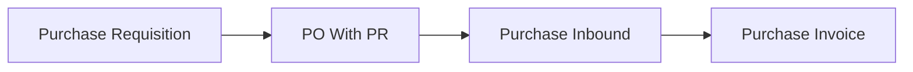

## Module/Feature: Purchase Requisition (PR)

**Business definition.** A **Purchase Requisition** is an **internal purchase request**. After approval, procurement creates a **Purchase Order (With PR)** from outstanding lines. PR is **not** the supplier order — PO is.

## Key terms

* **PR-:** Requisition document prefix.
* **Complete:** Auto-finished when all qty is on approved POs.
* **Closed:** Manual stop of remaining qty from **Processed**.
* **Outstanding PR:** Approved/processed lines still available for PO With PR.
* **Priority:** Normal / Urgent / Top Urgent — informational only.

## When to use

* Internal teams need formal approval before buying.
* Procurement will convert approved lines into PO With PR.

## When to avoid

* Ordering directly to a supplier without internal approval → use PO Without PR if that is your process.
* Expecting PR itself to create supplier commitment — it does not.

## Prerequisites

| Requirement | Rule |
| :---- | :---- |
| Eligible products | Active System Product; not bundle child / random |
| Max 100 detail lines | Manual + import combined |
| Open fiscal period | For transaction date |
| Open status before Approve | Especially after reject |

## Navigation

* **UI path:** Supply Chain → Purchase Requisition  
* **Route:** `/supplychain/purchase-requisition`

> Image placeholder — SCM Purchase Requisition DataList.

## Process flow

### Order of execution

1. Create PR → add details (or import).  
2. Set **Open** → **Approve**.  
3. Create **Purchase Order With PR** from outstanding.  
4. PR becomes **Processed** → then **Complete** (auto) or **Closed** (manual).

## Transaction states

| Status | Meaning | Editable? |
| :---- | :---- | :---- |
| Draft / Open / Rejected | Working | Yes (Rejected: no delete) |
| Approved | Ready for PO | No |
| Processed | On PO | No |
| Complete / Closed | Finished | No |
| Void | Cancelled from Approved | No |

## Step-by-step (happy path)

1. Create PR and add SKUs (≤ 100 lines).  
2. Approve while **Open**.  
3. In Purchase Order, choose **With PR** and pull outstanding lines.  
4. Close remaining qty via datalist **Closed** if needed (prefer datalist over form Close).

## Common pitfalls

* Approve while still Draft after reject — set Open first.  
* Import: one bad row cancels the whole file.  
* Close from form fails — use **Closed** on the datalist.  
* Cannot delete Rejected PRs.  
* Complete vs Closed both mean finished for new POs.

## Related docs in Help Center

* Knowledge Base · Feature Map · User Guide · Requirement / Technical  

**Related menus:** Purchase Order · System Product
