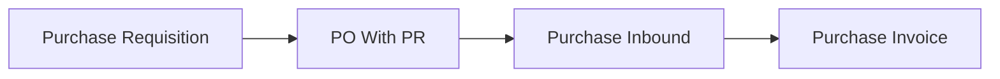

## Modul/Fitur: Purchase Requisition (PR)

**Definisi bisnis.** **Purchase Requisition** adalah **permintaan pembelian internal**. Setelah disetujui, procurement membuat **Purchase Order (With PR)** dari baris outstanding. PR **bukan** pesanan ke supplier — itu PO.

## Istilah penting

* **PR-:** Prefix dokumen requisition.
* **Complete:** Selesai otomatis saat semua qty sudah di PO approved.
* **Closed:** Stop sisa qty manual dari status **Processed**.
* **Outstanding PR:** Baris approved/processed yang masih bisa diambil ke PO With PR.
* **Priority:** Normal / Urgent / Top Urgent — hanya informasi.

## Kapan dipakai

* Tim internal butuh persetujuan formal sebelum beli.
* Procurement akan mengubah baris approved menjadi PO With PR.

## Kapan dihindari

* Langsung pesan ke supplier tanpa approval internal → pakai PO Without PR jika itu prosesmu.
* Menganggap PR sudah mengikat supplier — tidak.

## Prasyarat

| Persyaratan | Aturan |
| :---- | :---- |
| Produk eligible | System Product aktif; bukan bundle child / random |
| Maks 100 baris detail | Manual + import digabung |
| Periode fiskal terbuka | Untuk tanggal transaksi |
| Status Open sebelum Approve | Terutama setelah reject |

## Navigasi

* **Jalur UI:** Supply Chain → Purchase Requisition  
* **Route:** `/supplychain/purchase-requisition`

*DataList Purchase Requisition.*

## Alur proses

### Urutan eksekusi

1. Buat PR → tambah detail (atau import).  
2. Set **Open** → **Approve**.  
3. Buat **Purchase Order With PR** dari outstanding.  
4. PR jadi **Processed** → lalu **Complete** (otomatis) atau **Closed** (manual).

## Status transaksi

| Status | Arti | Bisa diedit? |
| :---- | :---- | :---- |
| Draft / Open / Rejected | Sedang dikerjakan | Ya (Rejected: tidak bisa delete) |
| Approved | Siap ke PO | Tidak |
| Processed | Sudah masuk PO | Tidak |
| Complete / Closed | Selesai | Tidak |
| Void | Dibatalkan dari Approved | Tidak |

## Langkah singkat (happy path)

1. Buat PR dan tambah SKU (≤ 100 baris).  
2. Approve saat status **Open**.  
3. Di Purchase Order, pilih **With PR** dan ambil outstanding.  
4. Stop sisa lewat **Closed** di datalist bila perlu (hindari Close di form).

## Hal yang sering bikin bingung

* Approve masih Draft setelah reject — set Open dulu.  
* Import: satu baris salah membatalkan seluruh file.  
* Close di form gagal — pakai **Closed** di datalist.  
* Tidak bisa hapus PR Rejected.  
* Complete vs Closed sama-sama artinya selesai untuk PO baru.

## Dokumen terkait di Help Center

* Knowledge Base · Feature Map · User Guide · Requirement / Technical  

**Menu terkait:** Purchase Order · System Product
