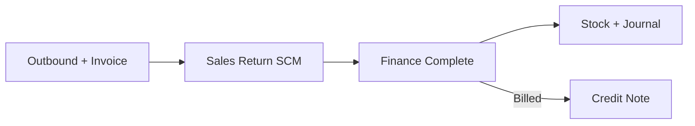

## Module/Feature: Sales Return (Warehouse)

**Business definition.** Sales Return records goods returned by customers **after outbound and invoicing**. Warehouse operators scan the order and classify returned quantities; Finance later Completes the return to post stock, journals, and an optional Credit Note.

## Key terms

* **Restock / Broken / Lost:** Item condition and downstream stock treatment.
* **Return WH / CCTV Location:** Required warehouse destination and processing camera location.
* **Sales Return Platform:** Marketplace refund/cancelled return list.
* **Billed / Unbilled:** Determines whether Finance creates a Credit Note or sales/AR adjustment.

## When to use

* The order is already outbound and invoiced.
* Customer returns physical goods after settlement.
* Marketplace refund/cancel data appears in the platform return list.

## When to avoid

* Before outbound/invoice — use **Failed Ship**.
* Foreign-currency invoices or invoices with pending payments.
* An Open SR already exists for the order.

## Navigation

* **Warehouse:** `/supplychain/sales-returns`
* **Finance approval:** `/accounting/sales-return`

## Process flow

1. Select Return Warehouse and CCTV Location.
2. Scan an order or choose one from Sales Return Platform.
3. Fill Restock/Broken/Lost quantities.
4. Wait for Finance Complete.

## Common pitfalls

* Complete is intentionally hidden in SCM.
* Total return quantity cannot exceed the remaining outbound quantity.
* Multi-order → one SR is not available; process one order per scan.
* Lost items require Return Expense COA before Finance can Complete.

## Related docs

Knowledge Base · Feature Map · User Guide · Requirement / Technical

**Related menus:** Sales Return Approval · Failed Ship · Credit Note · Sales Platform
