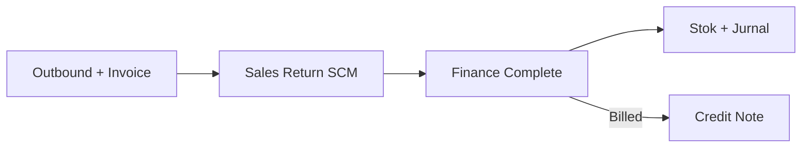

## Modul/Fitur: Sales Return (Gudang)

**Definisi bisnis.** Sales Return mencatat barang yang dikembalikan customer **setelah outbound dan invoice**. Operator gudang scan order dan mengelompokkan qty retur; Finance kemudian Complete untuk memposting stok, jurnal, dan Credit Note bila relevan.

## Istilah penting

* **Restock / Broken / Lost:** Kondisi barang dan perlakuan stok berikutnya.
* **Return WH / CCTV Location:** Gudang tujuan dan lokasi kamera proses.
* **Sales Return Platform:** Daftar retur marketplace refund/cancelled.
* **Billed / Unbilled:** Menentukan Credit Note atau jurnal penyesuaian sales/AR.

## Kapan dipakai

* Order sudah outbound dan invoiced.
* Customer mengembalikan barang setelah settlement.
* Data refund/cancel marketplace muncul di daftar return platform.

## Kapan dihindari

* Sebelum outbound/invoice — gunakan **Failed Ship**.
* Invoice foreign currency atau masih punya payment pending.
* Sudah ada SR Open untuk order tersebut.

## Navigasi

* **Gudang:** `/supplychain/sales-returns`
* **Approval Finance:** `/accounting/sales-return`

## Alur proses

1. Pilih Return Warehouse dan CCTV Location.
2. Scan order atau pilih dari Sales Return Platform.
3. Isi qty Restock/Broken/Lost.
4. Tunggu Finance Complete.

## Hal yang sering bikin bingung

* Complete memang disembunyikan di SCM.
* Total qty retur tidak boleh melebihi sisa qty outbound.
* Multi-order → satu SR belum tersedia; proses satu order per scan.
* Lost memerlukan Return Expense COA sebelum Finance bisa Complete.

## Dokumen terkait

Knowledge Base · Feature Map · User Guide · Requirement / Technical

**Menu terkait:** Sales Return Approval · Failed Ship · Credit Note · Sales Platform
