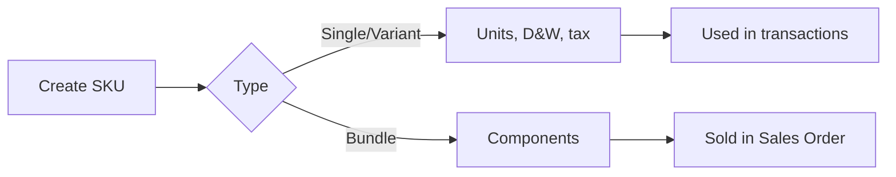

## Module/Feature: System Product

**Business definition.** System Product is the internal **SKU master** that stores product identity, units, per-unit dimension/weight, variants, bundles, inventory flags, and tax settings. It is the source of truth used by every transaction — purchasing, inbound/outbound, and sales.

## Key terms

* **Single / Variant / Bundle:** Product types that control transactability and stock behavior.
* **Primary / Alternate Unit:** Base unit plus converted units.
* **D&W profile:** Dimension & weight configured **per unit**.
* **Availability / On Hand / ATS:** The three stock indicators shown per SKU.

## When to use

* Creating or maintaining product master data.
* Setting up units, dimensions, variants, or bundles.
* Bulk creating/updating SKUs via Excel import (full menu only).

## When to avoid

* Assembly recipes — use **Bill of Material** (Header BOM), not the bundle toggle.
* Selling a parent variant directly — only child SKUs are transactable.
* Inbounding a bundle header — inbound the components instead.

## Navigation

* **Full:** `/supplychain/product`
* **General config:** `/supplychain/product-general-configuration`
* **Inventory config:** `/supplychain/product-inventory-configuration`

> Image placeholder — System Product datalist with Availability/On Hand/ATS columns.

## Process flow

1. Create SKU and choose the type.
2. Configure units and per-unit D&W.
3. Add variant children or bundle components as needed.
4. Complete inventory and tax, then save.

## Common pitfalls

* Parent variants are not transactable — pick a child SKU.
* Bundle activation requires ≥2 items or 1 item with qty ≥2.
* Accounting & Tax section is hidden when the bundle toggle is ON.
* Inactivation requires zero Availability and ATS across all warehouses.

## Related docs

Knowledge Base · Feature Map · User Guide · Requirement / Technical

**Related menus:** Bill of Material · Random SKU · Master Unit · Dimension & Weight Label
