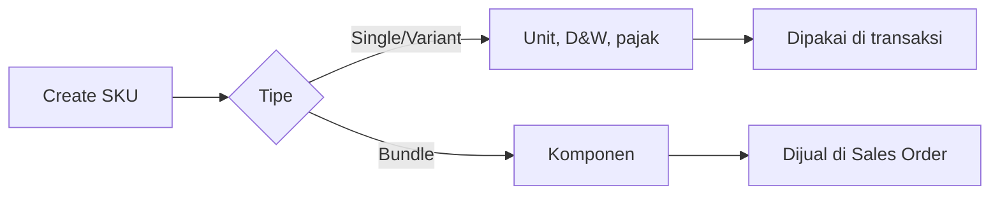

## Modul/Fitur: System Product

**Definisi bisnis.** System Product adalah **master data SKU** internal yang menyimpan identitas produk, satuan, dimensi/berat per unit, variant, bundle, flag inventori, dan pengaturan pajak. Ini sumber utama yang dipakai seluruh transaksi — pembelian, inbound/outbound, dan penjualan.

## Istilah penting

* **Single / Variant / Bundle:** Tipe produk yang menentukan transactability dan perilaku stok.
* **Primary / Alternate Unit:** Satuan dasar plus satuan konversi.
* **Profil D&W:** Dimensi & berat diatur **per satuan**.
* **Availability / On Hand / ATS:** Tiga indikator stok per SKU.

## Kapan dipakai

* Membuat atau merawat master data produk.
* Mengatur satuan, dimensi, variant, atau bundle.
* Membuat/ubah SKU massal lewat import Excel (menu full saja).

## Kapan dihindari

* Resep produksi — gunakan **Bill of Material** (Header BOM), bukan toggle bundle.
* Menjual parent variant langsung — hanya child SKU yang transactable.
* Inbound header bundle — inbound komponennya masing-masing.

## Navigasi

* **Full:** `/supplychain/product`
* **General config:** `/supplychain/product-general-configuration`
* **Inventory config:** `/supplychain/product-inventory-configuration`

> Placeholder gambar — datalist System Product dengan kolom Availability/On Hand/ATS.

## Alur proses

1. Buat SKU dan pilih tipe.
2. Atur satuan dan D&W per unit.
3. Tambah variant child atau komponen bundle bila perlu.
4. Lengkapi inventori dan pajak, lalu simpan.

## Hal yang sering bikin bingung

* Parent variant tidak transactable — pilih child SKU.
* Activate bundle butuh ≥2 item atau 1 item dengan qty ≥2.
* Section Accounting & Tax disembunyikan saat toggle bundle ON.
* Inactive butuh Availability dan ATS = 0 di semua gudang.

## Dokumen terkait

Knowledge Base · Feature Map · User Guide · Requirement / Technical

**Menu terkait:** Bill of Material · Random SKU · Master Unit · Dimension & Weight Label
