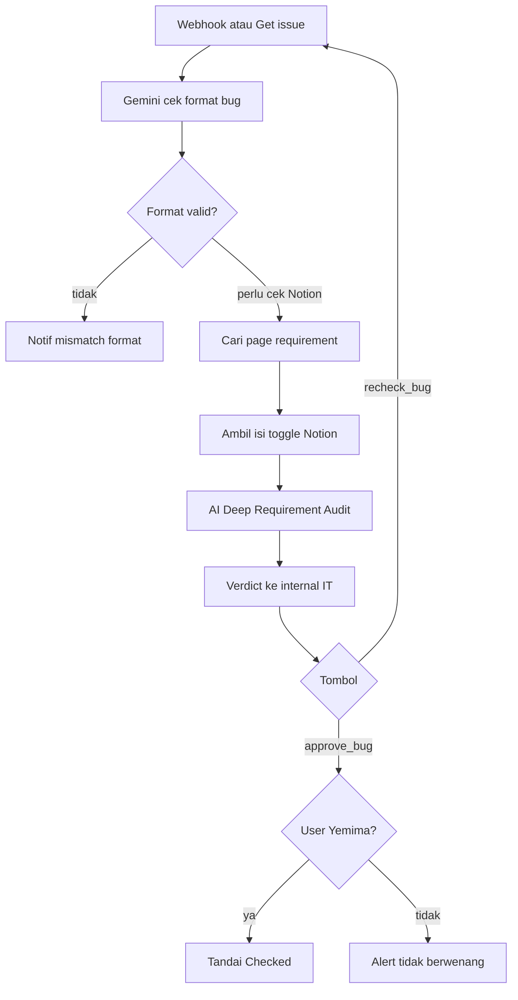

Menjaga kualitas tiket bug sebelum dianggap “lolos gate”.

Trigger:

- Webhook `bug-gatekeeper-n8n` (Jira automation saat bug dibuat/diubah)
- Tombol `approve_bug` / `recheck_bug` dari [Master Telegram](/docs/n8n-automation/master-telegram)

## Alur

**Keterangan langkah:**

- Screening pertama: kelengkapan format (summary, langkah, expected, dsb.).
- Screening kedua: teks bug vs requirement di Notion (header toggle + isi yang tertangkap API).
- Recheck menghapus bubble mismatch lama lalu menjalankan audit ulang.

## Relasi

Masuk dari bug yang dibuat [Ticket Actions](/docs/n8n-automation/sub-ticket-actions) atau [Testcase Gatekeeper](/docs/n8n-automation/testcase-gatekeeper).
