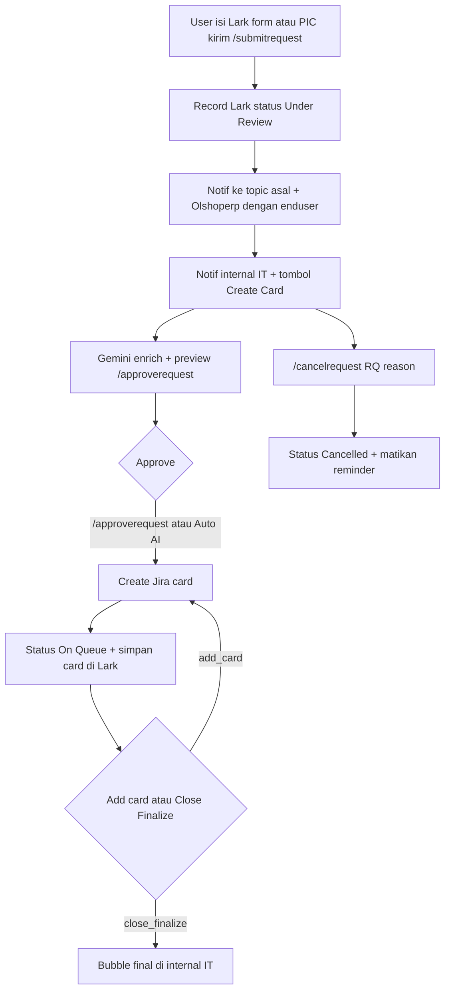

Pintu masuk **request user**. Mencatat ke Lark Bitable, kasih notif ke dua grup, enrich dengan Gemini, lalu buat kartu Jira setelah di-approve.

Punya **dua trigger Telegram yang disengaja**:

1. Telegram Trigger sendiri — grup **[Olshoperp dengan enduser](https://t.me/c/2223489920/1)** dan submit `/submitrequest` / `/submitbug`.
2. Dipanggil [Master Telegram](/docs/n8n-automation/master-telegram) — tombol dan command di grup **Olshoperp internal IT**.

Tambahan: webhook Lark form `lark-form-submit`.

## Alur



**Keterangan langkah:**

- `/submitrequest` vs `/submitbug` hanya beda Type di Lark (`Request` / `Bug`). Field wajib: **Summary, Menu, Detail**.
- Boleh reply ke pesan user (requester diambil dari pesan yang di-reply) atau isi `Request by:`.
- `/approverequest` wajib `Record`, `Summary`, `Assign to`, `Labels`. Mode Auto AI mengisi label `ai-generated` + slug menu + `goals-{JumatBerikutnya}`.
- Assignee kosong → Jira tanpa assignee (cabang Create Jira Task by AI).

## Syntax

Submit:

```text
/submitrequest
Summary: ...
Menu: ...
Detail: ...
Request by: @username
Department: ...
```

Approve (setelah preview AI, atau ketik manual):

```text
/approverequest
Record: recXXXX
Summary: ...
Assign to: @username
Labels: tag1, tag2
Description: ...
```

Cancel:

```text
/cancelrequest RQ-123
reason: ...
```

## Relasi

- Mengisi Lark yang nanti di-scan [Reminder Pending](/docs/n8n-automation/reminder-request-pending).
- Kartu Jira yang dibuat memicu [Jira Events Monitor](/docs/n8n-automation/jira-events-monitor) (sync + release).
- Tombol `create_card::`, `add_card::`, `close_finalize::`, `auto_approve::` di-route Master Telegram ke sini.
