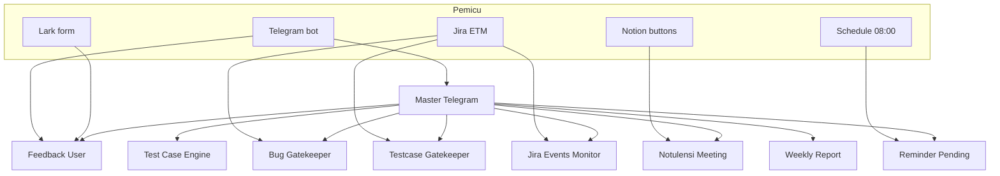
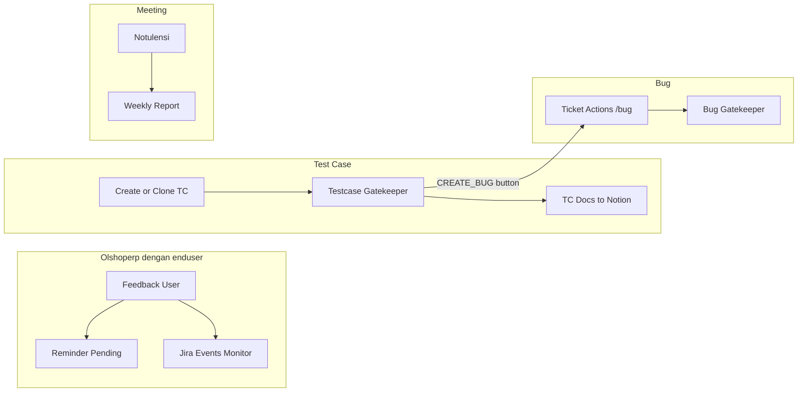

Katalog automation internal OlshopERP yang jalan di n8n. Bukan dokumentasi menu produk — ini task yang tim QA/dev bisa pakai dari Telegram, tombol Notion, form Lark, atau event Jira.

Semua workflow di katalog ini **active**. Router utamanya adalah [Master Telegram](/docs/n8n-automation/master-telegram).

## Bagaimana sistem ini tersambung

**Keterangan langkah:**

- Satu bot Telegram, **dua grup terpisah** — itu disengaja. Grup **[Olshoperp internal IT](https://t.me/c/1931573603/1)** pakai Master Telegram. Grup **[Olshoperp dengan enduser](https://t.me/c/2223489920/1)** pakai trigger Telegram di Feedback User.
- Jira, Notion, dan Lark bisa memicu workflow tanpa ketik command.
- Master Telegram tidak mengerjakan bisnis logic — dia hanya mengarahkan ke sub-workflow.

## Dua grup Telegram

Nama resmi grup (dari link Telegram):

| Label di docs | Chat ID | Link | Dipakai untuk |
|---|---|---|---|
| **Olshoperp internal IT** | `-1001931573603` | [t.me/c/1931573603/1](https://t.me/c/1931573603/1) | Command tim, notif Jira, preview AI, weekly report, notulen |
| **Olshoperp dengan enduser** | `-1002223489920` | [t.me/c/2223489920/1](https://t.me/c/2223489920/1) | Submit request/bug dari user, notif onboarding, release fitur |

Topic khusus create bug: `3958` di Olshoperp internal IT (`/bug` hanya diproses di topic itu).

## Katalog per grup kerja

| Grup | Workflow | Fungsi singkat |
|---|---|---|
| Hub | [Master Telegram](/docs/n8n-automation/master-telegram) | Router 29 route command/tombol |
| Hub | [Sub - Menu System](/docs/n8n-automation/sub-menu-system) | `/help` — menu bantuan (belum lengkap vs command hidup) |
| Olshoperp dengan enduser | [Feedback User Automation](/docs/n8n-automation/feedback-user) | Intake RQ, AI enrich, approve, create Jira, cancel |
| Olshoperp dengan enduser | [Reminder Request Pending](/docs/n8n-automation/reminder-request-pending) | Tandai pending + reminder jam 08:00 |
| Olshoperp dengan enduser | [Jira Events Monitor](/docs/n8n-automation/jira-events-monitor) | Sync Jira ke Lark, re-open, tombol release ke user |
| Test Case | [Test Case Create & Clone](/docs/n8n-automation/test-case-create-clone) | `/createtestcase` dan `/clonetc` + sync Notion |
| Test Case | [Testcase Gatekeeper](/docs/n8n-automation/testcase-gatekeeper) | FAILED/PASSED + tombol create bug / ignore mismatch |
| Test Case | [Jira Backend - TC Docs](/docs/n8n-automation/jira-backend-testcase-docs) | Tulis hasil test ke toggle Notion |
| Bug & tiket | [Sub - Ticket Actions](/docs/n8n-automation/sub-ticket-actions) | `/bug`, `/assign`, `/set ST`, `/starttest` |
| Bug & tiket | [Bug Gatekeeper](/docs/n8n-automation/bug-gatekeeper) | Audit format bug vs requirement Notion |
| Meeting & report | [Notulensi Meeting](/docs/n8n-automation/notulensi-meeting) | Draft/final notulen → Jira + Lark |
| Meeting & report | [Weekly Report](/docs/n8n-automation/weekly-report) | Rekap Jira Senin–sekarang ke Notion |
| Meeting & report | [Sub - Reporting Center](/docs/n8n-automation/sub-reporting-center) | `/progress`, `/qareview`, `/testcase update` |
| Ops | [User Activity Hub](/docs/n8n-automation/user-activity-hub) | Webhook ingest/export last_opened + last_write (Tyas/Merdian) — status draft sampai di-import |

## Command yang hidup

| Command | Workflow | Siapa pakai |
|---|---|---|
| `/help` | Menu System | Semua |
| `/bug` / `/bug gemini` | Ticket Actions | QA — topic 3958, wajib `Labels:` |
| `/assign [tiket] to @user` | Ticket Actions | QA/PM |
| `/set ST for [tiket] to [n]` | Ticket Actions | Yemima, Yendy, Jeini, Dapirda |
| `/starttest [tiket]` | Ticket Actions | QA |
| `/createtestcase` | Test Case Engine | QA |
| `/clonetc` | Test Case Engine | QA |
| `/progress dev @user` | Reporting Center | QA/PM |
| `/progress labels: "nama"` | Reporting Center | QA/PM |
| `/qareview update` | Reporting Center | QA |
| `/qareview testing @user` | Reporting Center | QA |
| `/testcase update` | Reporting Center | QA |
| `/submitrequest` / `/submitbug` | Feedback User | PIC di grup enduser atau internal IT |
| `/approverequest` | Feedback User | Olshoperp internal IT |
| `/cancelrequest [RQ] reason:` | Feedback User | Olshoperp internal IT |
| `/pendingrequest` | Reminder Pending | Olshoperp internal IT |
| `/updatenotulen` | Notulensi | Olshoperp internal IT |
| `/weeklyreport` | Weekly Report | Olshoperp internal IT |
| `/weeklyreportwithnotulen` | Weekly Report | Olshoperp internal IT |

Tombol (bukan ketik): create/add/close Jira card, auto-approve AI, release fitur, approve/recheck bug, ignore TC mismatch, lanjut/batal weekly notulen.

## Event yang jalan sendiri

| Pemicu | Path / event | Workflow |
|---|---|---|
| Lark form | webhook `lark-form-submit` | Feedback User |
| Jira issue created/updated | Jira Trigger | Jira Events Monitor |
| Jira TC update | webhook `jira-bug-trigger-from-testcase` | Testcase Gatekeeper |
| Jira bug create/update | webhook `bug-gatekeeper-n8n` | Bug Gatekeeper |
| Jira TC status | webhook `jira-update-status` | Jira Backend - TC Docs |
| Notion Draft / Final | `notulen-draft` / `notulen-final` | Notulensi Meeting |
| Jam 08:00 | Schedule | Reminder Request Pending |
| FE Tyas/Merdian | webhook `user-activity` / `user-activity-export` | User Activity Hub |

## Relasi alur utama

## Status khusus — jangan kira hidup

| Item | Status |
|---|---|
| `/updateqadocs` | **Retired.** Route masih ada di Master Telegram tapi tidak terhubung. QA docs sekarang di-build di dalam OlshopERP. |
| `/donetesting` | Logic ada di Ticket Actions, **belum di-wire** di Master Telegram. Flow belum selesai. |
| `/help` | Menu bantuan **belum mencakup** semua command hidup (weekly report, pending, notulen, approve, dll). Syntax `/qa testing` di help tidak match kode (`/qareview testing`). |
| Mapping Telegram ke Jira | Tidak seragam antar workflow. Revisi ID/username akan dilakukan terpisah. |
| Jira Events Monitor — Search Parent | Masih ada placeholder `[APP_ID]` / `[TABLE_ID]`. Flow clone parent mungkin belum lengkap. |

## Cara baca docs ini

1. Mulai dari katalog ini supaya kelihatan relasi.
2. Buka halaman workflow yang kamu pakai — tiap halaman punya mermaid + command + apa yang terjadi.
3. Kalau command tidak merespons: cek grup (internal IT vs enduser), topic, dan status di tabel di atas.
