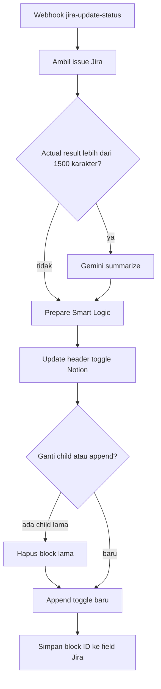

Backend silent: tidak ada command Telegram. Jira (automation) POST ke webhook `jira-update-status` setiap actual result / status TC berubah.

## Alur

**Keterangan langkah:**

- Satu toggle Notion per TC, ID-nya disimpan di field custom Jira supaya update berikutnya menimpa toggle yang sama, bukan menumpuk.
- Ringkasan AI hanya jika actual result tembus ~1500 karakter (batas Notion/block).

## Relasi

Pelengkap [Test Case Engine](/docs/n8n-automation/test-case-create-clone) (engine membuat toggle kosong/synced; workflow ini mengisi hasil uji).
