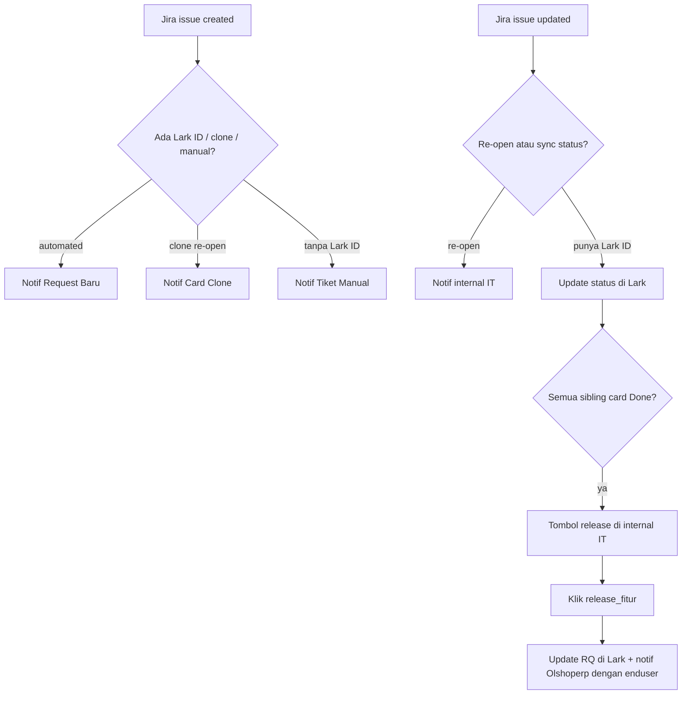

Mendengarkan Jira project ETM, lalu menjaga Lark dan Telegram tetap selaras dengan kartu yang lahir dari request user.

Trigger:

- Jira `issue_created`
- Jira `issue_updated`
- Tombol `release_fitur:` dari [Master Telegram](/docs/n8n-automation/master-telegram)

## Alur

**Keterangan langkah:**

- Update **diabaikan** jika tiket tidak punya custom field Lark ID **dan** bukan re-open.
- Tombol release hanya muncul setelah **The Judge** menilai semua kartu saudara di request yang sama sudah Done.
- Klik release mengedit bubble internal IT dan mengirim notif ke grup **[Olshoperp dengan enduser](https://t.me/c/2223489920/1)**.

## Relasi

Sumber kartu: [Feedback User](/docs/n8n-automation/feedback-user) dan [Notulensi Meeting](/docs/n8n-automation/notulensi-meeting).

## Catatan

Node Search Parent masih memakai URL placeholder `[APP_ID]` / `[TABLE_ID]`. Flow menonaktifkan parent saat clone mungkin belum lengkap — cek di n8n sebelum andalkan perilaku itu.
