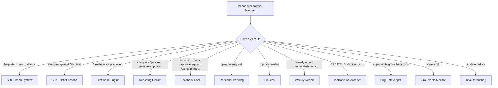

Router semua pesan dan tombol bot di grup **[Olshoperp internal IT](https://t.me/c/1931573603/1)**. Workflow ini **tidak** membuat tiket — dia hanya memilah 29 route lalu `executeWorkflow` ke sub-workflow.

Trigger: Telegram (`message` + `callback_query`).

## Alur

**Keterangan langkah:**

- Route dievaluasi **urut dari atas**. Callback tombol harus match prefix (`create_card::`, `approve_bug`, …) sebelum fallback “ada callback_query”.
- `/updateqadocs` masih ada di switch (output ke-26) tapi **cabangnya kosong**. Jangan dipakai.
- Grup **[Olshoperp dengan enduser](https://t.me/c/2223489920/1)** tidak lewat sini — lihat [Feedback User](/docs/n8n-automation/feedback-user).

## Yang di-route

Command ketik: `/help`, `/bug`, `/assign`, `/set`, `/starttest`, `/createtestcase`, `/clonetc`, `/progress`, `/qareview`, `/testcase update`, `/approverequest`, `/cancelrequest`, `/pendingrequest`, `/updatenotulen`, `/weeklyreport`, `/weeklyreportwithnotulen`.

Tombol: `CREATE_BUG:`, `create_card::`, `add_card::`, `close_finalize::`, `auto_approve::`, `release_fitur:`, `ignore_tc:`, `approve_bug`, `recheck_bug`, `ya_notulen_`, `batal_notulen`, plus callback menu `/help`.

## Relasi

Dipanggil oleh: Telegram bot (Olshoperp internal IT).

Memanggil: semua sub-workflow di katalog kecuali trigger murni webhook/Jira (tetap bisa dipanggil dari sini untuk aksi tombol).

## Catatan

- `/donetesting` **tidak** ada di switch ini, jadi ketik command itu tidak sampai ke Ticket Actions.
- Satu bot, dua grup: Master hanya untuk Olshoperp internal IT.
