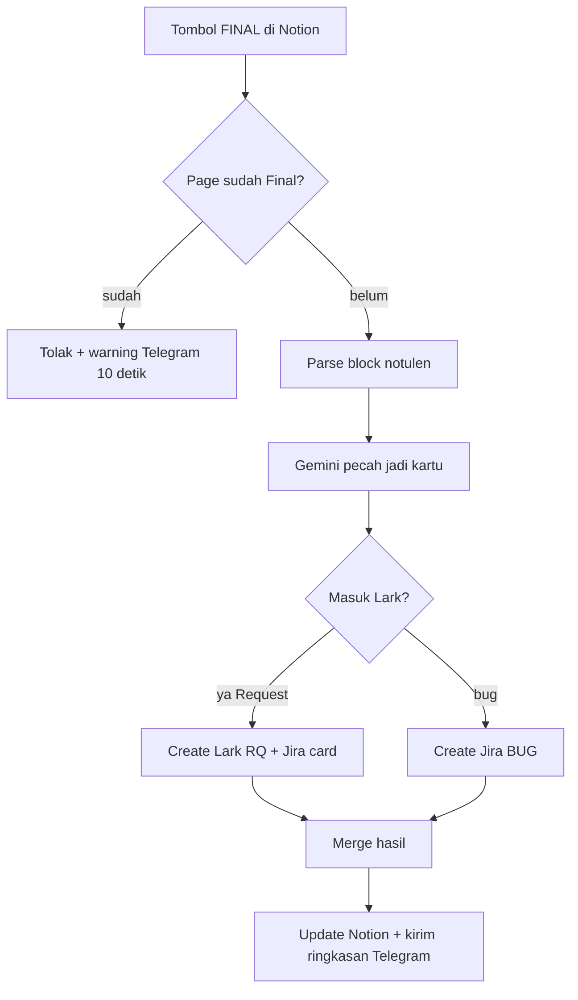

Mengubah halaman notulen Notion menjadi action item yang terlacak.

Trigger:

- Webhook `notulen-draft` (tombol Draft di Notion)
- Webhook `notulen-final` (tombol Final)
- Command `/updatenotulen` dari [Master Telegram](/docs/n8n-automation/master-telegram) — cari notulen by tanggal, heal/trace ID Jira ke Notion

## Alur Final

Draft hanya format + kirim ke Olshoperp internal IT, tanpa Jira.

`/updatenotulen` menelusuri database Notion, filter tanggal, lalu menulis ulang jejak Jira di block (heal & trace) dan kirim progress ke chat pemanggil.

## Relasi

Kartu Jira/Lark yang dihasilkan ikut [Jira Events Monitor](/docs/n8n-automation/jira-events-monitor). Teks notulen bisa dipakai [Weekly Report](/docs/n8n-automation/weekly-report) lewat `/weeklyreportwithnotulen`.
