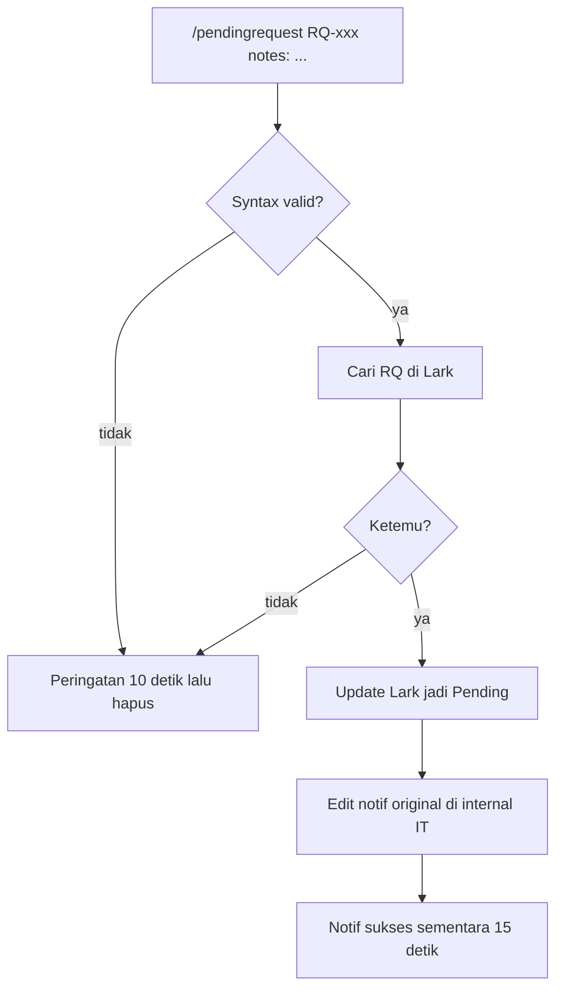

Dua pintu:

1. Command `/pendingrequest` dari [Master Telegram](/docs/n8n-automation/master-telegram).
2. **Schedule jam 08:00** — scan record Lark yang masih perlu diingatkan.

## Alur command

## Alur jam 08:00

Schedule → token Lark → cari RQ pending / reminder aktif → (lanjut ke notif sesuai record yang ketemu).

Command mengubah status + mematikan alur “masih under review”. Cron adalah pengingat harian, bukan pengganti command.

## Relasi

Baca/tulis Lark yang sama dengan [Feedback User](/docs/n8n-automation/feedback-user). `/cancelrequest` di Feedback User mematikan reminder.
