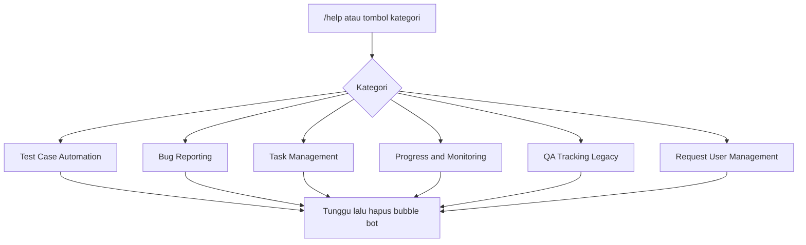

Menampilkan kategori bantuan bot. Dipanggil dari [Master Telegram](/docs/n8n-automation/master-telegram) saat user ketik `/help` atau klik tombol kategori.

## Alur

## Isi help saat ini

| Kategori | Syntax yang ditampilkan |
|---|---|
| Test Case | `/createtestcase`, `/clonetc`, `/starttest`, `/testcase update` |
| Bug | `/bug gemini`, `/bug` manual |
| Task | `/assign`, `/set ST for ... to ...` |
| Progress | `/progress dev @user`, `/progress labels: "..."` |
| QA Tracking | `/qa testing @username`, `/qareview update` |
| Request User Management | `/cancelrequest` saja; tulis “Update Status (Soon)” — kategori help bot, bukan nama grup Telegram |

## Belum ada di help (tapi command-nya hidup)

`/approverequest`, `/pendingrequest`, `/updatenotulen`, `/weeklyreport`, `/weeklyreportwithnotulen`, `/submitrequest`, `/submitbug`, `/qareview testing` (help masih tulis `/qa testing`).

`/donetesting` juga tidak ada di help — dan memang belum di-wire di Master Telegram.

## Relasi

Hanya dipanggil Master Telegram. Tidak menulis Jira/Lark/Notion.
