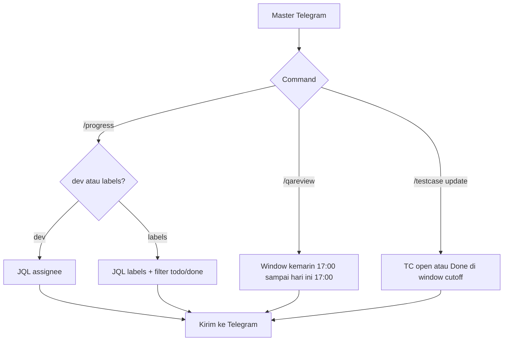

Laporan on-demand ke chat pemanggil. Tidak menulis Lark/Notion.

## Alur



## Syntax

```text
/progress dev @dapirdaa
/progress labels: "payment" todo
/progress labels: "payment" done
/qareview update
/qareview testing @yemimatifani
/testcase update
/testcase update labels: payment, checkout
```

Window QA/TC memakai cutoff **17:00**. Help `/help` masih menulis `/qa testing` — yang hidup adalah `/qareview testing @user`.

## Relasi

Hanya dipanggil [Master Telegram](/docs/n8n-automation/master-telegram). Beda tujuan dengan [Weekly Report](/docs/n8n-automation/weekly-report) (mingguan + Notion).
