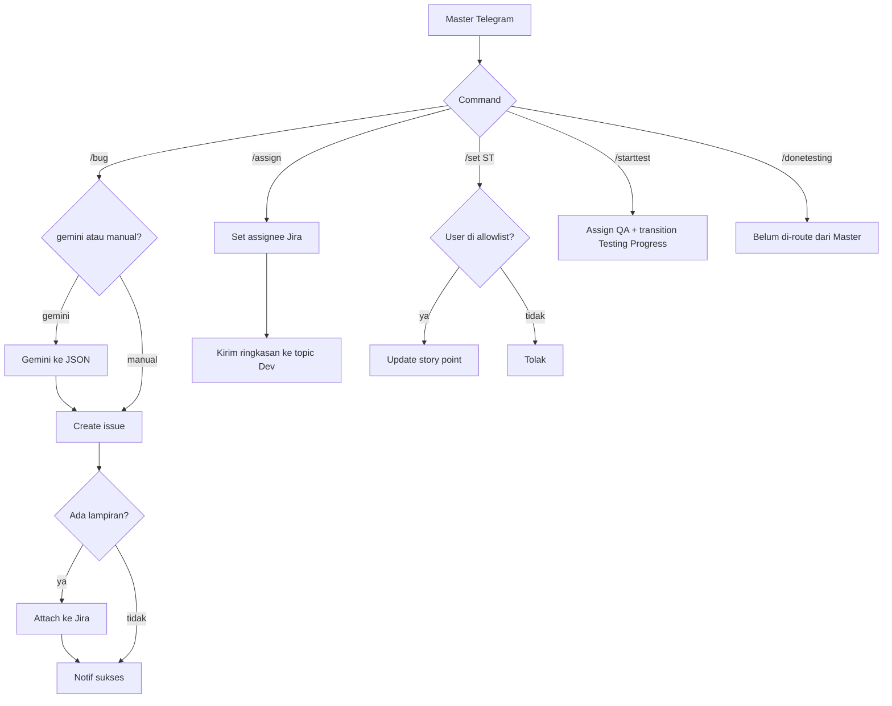

Command operasional tiket di grup Olshoperp internal IT. Dipanggil Master Telegram untuk `/bug`, `/assign`, `/set`, `/starttest`.

Ada parser `/donetesting` di dalam workflow ini, tapi Master Telegram **belum** mengarahkannya ke sini — anggap belum selesai.

## Alur



## Syntax

`/bug` hanya di **topic 3958**. Wajib baris `Labels:` di akhir.

```text
/bug gemini cerita singkat...
Labels: payment, checkout
```

```text
/bug
Summary: ...
Deskripsi: ...
Labels: payment
```

```text
/assign 12176 to @dapirdaa
/set ST for ETM-12176 to 3
/starttest 12176
```

`/set ST` hanya: `yemimatifani`, `yendyrach`, `Jeiniiii`, `dapirdaa`.

`/starttest` menolak jika tipe/status tiket tidak valid (harus Test Case yang siap diuji).

## Relasi

Bug baru bisa masuk [Bug Gatekeeper](/docs/n8n-automation/bug-gatekeeper). `/starttest` memakai TC dari [Test Case Engine](/docs/n8n-automation/test-case-create-clone).
