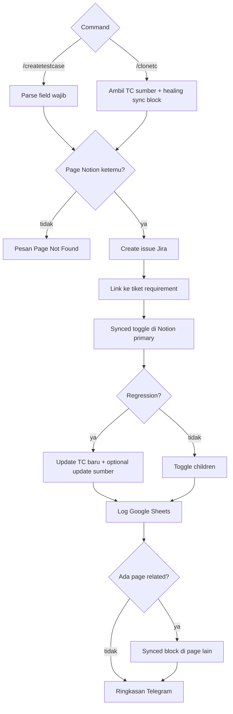

Membuat atau menggandakan tiket **Test Case** di Jira ETM, menempelkan synced block ke halaman Notion “Test Case {Menu}”, dan mencatat baris di Google Sheets.

Dipanggil Master Telegram untuk `/createtestcase` dan `/clonetc`.

## Alur



## Syntax create

Wajib: Summary, `Page:`, `Linked Issue:`, `Labels:`. Multi-page dipisah koma — page pertama primary, sisanya related.

```text
/createtestcase
Summary: [Judul skenario]
Page: Menu Utama, Menu Tambahan
Linked Issue: ETM-123
Labels: tag1, tag2
Expected Result: ...
```

## Syntax clone

```text
/clonetc ETM-111, ETM-112
Page: Nama Menu
Linked Issue: ETM-999
Labels: regression
```

ID boleh angka saja (`111` → `ETM-111`). Clone menandai regresi dan mencoba menyembuhkan sync block Notion di TC sumber.

## Relasi

TC yang Done FAILED/PASSED memicu [Testcase Gatekeeper](/docs/n8n-automation/testcase-gatekeeper). Hasil uji ditulis ke Notion oleh [Jira Backend - TC Docs](/docs/n8n-automation/jira-backend-testcase-docs).
