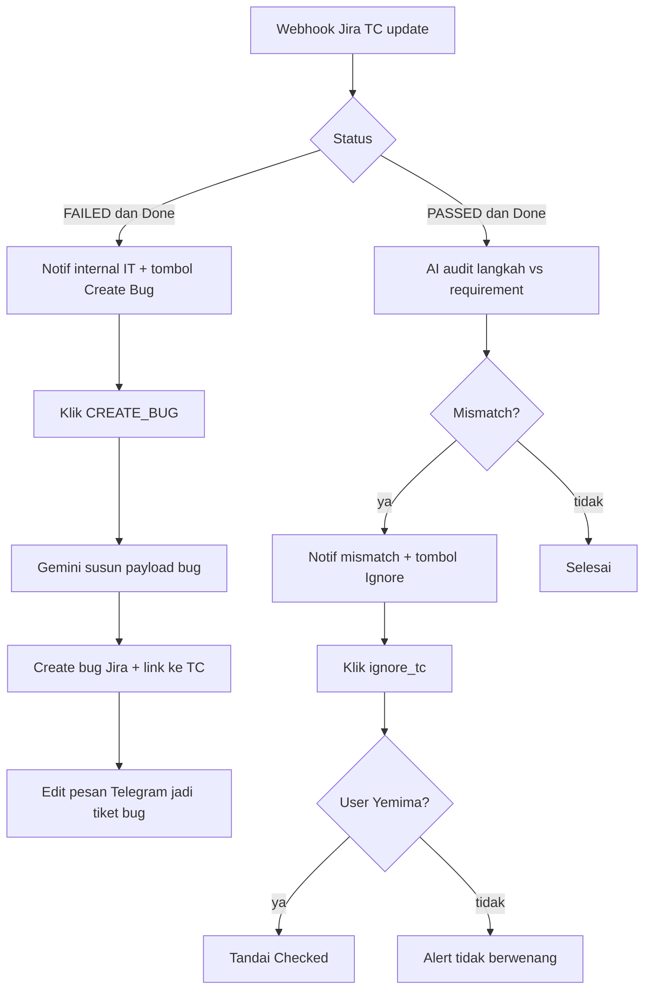

Nama di n8n: **Testcase Gatekeeper & Bug Automator** (Master Telegram masih label *Auto-Alert: Failed Test Case to Telegram*).

Trigger:

- Webhook `jira-bug-trigger-from-testcase` (Jira automation saat TC di-update)
- Tombol `CREATE_BUG:` dan `ignore_tc:` dari [Master Telegram](/docs/n8n-automation/master-telegram)

## Alur

**Keterangan langkah:**

- Create bug dari tombol memakai data TC (reporter, langkah, expected) + Gemini, lalu issue link ke TC sumber.
- Tombol ignore mismatch **hanya Yemima** (`yemimatifani`). User lain dapat alert.

## Relasi

Masuk dari hasil [Create & Clone](/docs/n8n-automation/test-case-create-clone). Keluar ke Jira bug yang kemudian bisa masuk [Bug Gatekeeper](/docs/n8n-automation/bug-gatekeeper).
