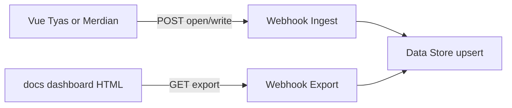

Menerima beacon dari Vue (`VITE_USER_ACTIVITY_WEBHOOK_URL`), upsert satu baris per `(env, user_id)`, dan menyediakan GET export untuk [User Activity dashboard](https://github.com/olshoperp/olshoperp-docs) di `dashboard/user-activity.html`.

Import JSON & setup: repo `olshoperp-docs` → `n8n/user-activity/`.

## Alur

## Payload

Lihat `olshoperp-docs/n8n/user-activity/README.md`.

## Relasi

- FE: `olshoperp-frontend/src/utils/userActivityTelemetry.ts`
- Viewer: `olshoperp-docs/dashboard/user-activity.html`
