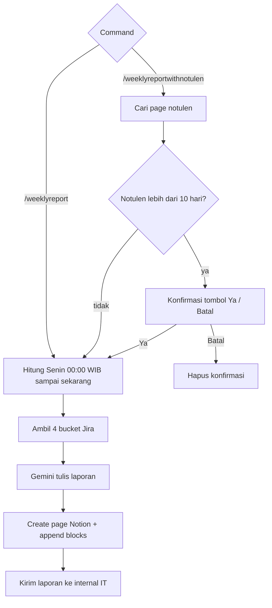

Membangun weekly report dari status Jira (Done, In Progress, QA Review, Outstanding), merangkum dengan Gemini, lalu membuat halaman Notion.

Command (tepat, bukan prefix):

- `/weeklyreport` — langsung generate
- `/weeklyreportwithnotulen` — cari notulen Notion dulu

Tombol: `ya_notulen_` (lanjut meski notulen >10 hari) dan `batal_notulen`.

## Alur

Periode selalu **Senin minggu ini 00:00 WIB** sampai waktu command dijalankan.

## Relasi

Notulen dari [Notulensi Meeting](/docs/n8n-automation/notulensi-meeting). Angka Jira independen dari Reporting Center (itu snapshot harian, ini rekap mingguan).
