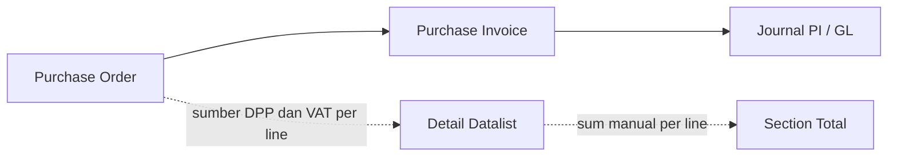

# DPP dan VAT Calculation - Rounding Precision

## Fungsi dan Tujuan

Dokumen ini mendefinisikan sumber data dan mekanisme perhitungan DPP (Dasar Pengenaan Pajak) dan VAT per unit maupun per total, pada modul Purchase Order (PO), Purchase Invoice (PI), dan Journal PI di OlshopERP.

Tujuan dokumen: mengunci definisi variable turunan (Net Unit Price, DPP per unit, VAT per unit, DPP total, VAT total, Total Price) beserta titik-titik rounding yang terjadi di sepanjang alur, supaya ketidaksesuaian antara Detail Datalist dan Section Total pada kasus tertentu bisa ditelusuri ke sumbernya, bukan dianggap random floating point error.

Precision storage saat ini: DPP per unit dan VAT per unit disimpan dengan 4 digit desimal. Backend menyimpan dan mengakumulasi DPP total serta VAT total pada presisi 4 desimal (tidak dibulatkan). Pembulatan ke 2 desimal hanya terjadi di layer tampilan (UI) untuk breakdown DPP dan VAT per baris. Total utang atau Total Price yang tampil di UI mengikuti nilai backend yang presisi, bukan hasil penjumlahan dari breakdown yang sudah dibulatkan di UI.

Status: kondisi ini sudah final dan sudah disetujui end user (per 27 Juli 2026). Bukan lagi kategori bug terbuka, melainkan known behavior dengan solusi export yang disepakati (lihat bagian Resolusi Selisih Tampilan UI).

## How It Works

### 1. Variable dan Sumber Data

| Variable | Formula | Presisi Storage |
|---|---|---|
| Unit Price | input manual, integer Rupiah | 0 desimal |
| Disc percent | input manual, integer persen (tidak menerima desimal) [VERIFY: CODEBASE] | 0 desimal |
| Net Unit Price | Unit Price dikali (100 dikurangi Disc persen) dibagi 100 | 2 desimal, selalu clean karena integer dikali integer dibagi 100 |
| DPP per unit | Net Unit Price dibagi 1,11 (VAT 11 persen included) | 4 desimal |
| VAT per unit | Net Unit Price dikurangi DPP per unit (metode komplemen, bukan dihitung independen) | 4 desimal |
| DPP total | DPP per unit (4 desimal) dikali Qty, lalu dibulatkan ke 2 desimal | 2 desimal |
| VAT total | VAT per unit (4 desimal) dikali Qty, lalu dibulatkan ke 2 desimal | 2 desimal |
| Total Price | DPP total ditambah VAT total | 2 desimal |

Catatan penting: karena VAT per unit dihitung sebagai komplemen dari Net Unit Price dikurangi DPP per unit (bukan dihitung terpisah dari persentase VAT), maka secara identitas matematis DPP per unit ditambah VAT per unit akan selalu sama persis dengan Net Unit Price pada level 4 desimal. Sifat komplementer ini penting karena jadi dasar kenapa rounding di level total bisa bermasalah (lihat bagian Skenario Rounding Tie di bawah).

### 2. Alur Perhitungan

```mermaid
flowchart TD
    A[Unit Price integer] --> B{Ada Disc persen?}
    B -- ya, integer percent --> C[Net Unit Price = Unit Price x (100 - Disc) / 100]
    B -- tidak --> C2[Net Unit Price = Unit Price]
    C --> D[DPP per unit = Net Unit Price / 1,11, dibulatkan 4 desimal]
    C2 --> D
    D --> E[VAT per unit = Net Unit Price - DPP per unit, 4 desimal]
    E --> F[DPP total = DPP per unit x Qty, dibulatkan 2 desimal]
    E --> G[VAT total = VAT per unit x Qty, dibulatkan 2 desimal]
    F --> H[Total Price = DPP total + VAT total]
    G --> H
```

### 3. Kenapa Case dengan Qty Kelipatan 1000 atau 500 Selalu Terlihat Aman

Ketika Qty adalah kelipatan besar dan rapi (1000, 500), hasil perkalian DPP per unit (4 desimal) dan VAT per unit (4 desimal) dengan Qty tersebut kebetulan jatuh tepat di 2 desimal atau mendekati tanpa menyentuh titik tie pembulatan. Ini bukan bukti sistem bebas dari selisih, melainkan karena kombinasi angka tersebut tidak memicu kondisi rounding yang bermasalah. Lihat Skenario Rounding Tie untuk kondisi yang benar-benar memicu selisih.

### 4. Skenario Rounding Tie (Selisih Tampilan UI, Bukan Selisih Data)

Selisih pada breakdown DPP total dan VAT total muncul ketika kedua angka tersebut, pada presisi 4 desimal, sama-sama berhenti tepat di remainder 0,0050 (titik tie pembulatan). Karena DPP per unit dan VAT per unit bersifat komplementer terhadap Net Unit Price, remainder gabungan keduanya seharusnya saling menutup. Jika kedua sisi dibulatkan secara independen di layer UI dan kebetulan jatuh di titik tie yang sama, rounding half up membulatkan ke atas di kedua sisi sekaligus, sehingga jumlah breakdown yang tampil di UI menjadi 1 sen lebih besar dari Total Price yang sebenarnya.

Kondisi ini dipicu oleh kombinasi Unit Price, Disc persen (opsional), dan Qty yang bukan kelipatan 10, 100, atau 1000. Diskon dengan input integer persen dan Unit Price integer tidak menambah sumber error baru pada tahap Net Unit Price, karena hasil kali integer dikali integer dibagi 100 selalu clean di 2 desimal tanpa perlu pembulatan tambahan.

Penting: selisih ini tidak pernah tersimpan atau terakumulasi di database. Backend menjumlahkan DPP total dan VAT total pada presisi 4 desimal (contoh: 34.234,2342 ditambah 3.765,7658 sama dengan 38.000,0000 exact), sehingga akumulasi Section Total maupun nilai kredit di Journal PI tetap pas mengikuti Grand Total asli. Yang berbeda hanya breakdown DPP dan VAT yang ditampilkan di UI per baris, karena masing-masing dibulatkan independen ke 2 desimal untuk keperluan tampilan. Total utang atau Invoice Total yang tampil tetap mengikuti angka backend yang presisi, bukan hasil penjumlahan dari breakdown UI yang sudah dibulatkan.

## Validasi

| No | Skenario | Input | Backend (akumulasi 4dp) | Breakdown UI (2dp per baris) | Status |
|---|---|---|---|---|---|
| 1 | Qty kelipatan 1000, tanpa disc | Unit Price 38.000, Qty 1.000, Disc 0 persen | 38.000.000,00 | 38.000.000,00 | Sesuai, tidak kena tie |
| 2 | Qty kelipatan 500, tanpa disc | Unit Price 45.000, Qty 500, Disc 0 persen | 22.500.000,00 | 22.500.000,00 | Sesuai, tidak kena tie |
| 3 | Unit Price clean, tanpa desimal sama sekali | Unit Price 333, Qty 1.000, Disc 0 persen | 333.000,00 | 333.000,00 | Sesuai, tidak kena tie |
| 4 | Qty bukan kelipatan 10/100/1000, memicu rounding tie | Unit Price 38.000, Qty 25, Disc 0 persen | 950.000,00 (Total Price atau Invoice Total mengikuti ini) | 855.855,86 + 94.144,15 = 950.000,01 (breakdown UI saja) | Final, known behavior, sudah disetujui end user |
| 5 | Qty bukan kelipatan 10/100/1000, dengan Disc integer persen | Unit Price 40.000, Qty 25, Disc 5 persen | 950.000,00 (Total Price atau Invoice Total mengikuti ini) | 855.855,86 + 94.144,15 = 950.000,01 (breakdown UI saja) | Final, known behavior, sudah disetujui end user |

Catatan: Total Price atau Invoice Total yang tampil ke user selalu mengikuti angka backend (presisi 4 desimal, exact), bukan hasil penjumlahan breakdown DPP dan VAT yang sudah dibulatkan 2 desimal di UI. Selisih 1 sen pada baris 4 dan 5 hanya terlihat kalau user menjumlahkan sendiri angka breakdown DPP dan VAT yang tampil di layar.

## Detail Perhitungan Case 4 (Referensi Manual)

Unit Price 38.000, Disc 0 persen, Qty 25.

Net Unit Price sama dengan 38.000.

DPP per unit sama dengan 38.000 dibagi 1,11 sama dengan 34.234,2342342 dibulatkan menjadi 34.234,2342.

VAT per unit sama dengan 38.000 dikurangi 34.234,2342 sama dengan 3.765,7658.

DPP total sebelum pembulatan sama dengan 34.234,2342 dikali 25 sama dengan 855.855,8550.

VAT total sebelum pembulatan sama dengan 3.765,7658 dikali 25 sama dengan 94.144,1450.

Cek komplementer: 855.855,8550 ditambah 94.144,1450 sama dengan 950.000,0000, sesuai dengan 38.000 dikali 25.

Kedua angka berhenti tepat di remainder 0,0050. Untuk keperluan breakdown di UI, keduanya dibulatkan ke atas: DPP total tampil 855.855,86, VAT total tampil 94.144,15. Jika dijumlahkan manual, breakdown UI ini menghasilkan 950.000,01.

Namun secara backend, DPP total dan VAT total tetap disimpan dan dijumlahkan pada presisi 4 desimal, yaitu 855.855,8550 ditambah 94.144,1450 sama dengan 950.000,0000 exact. Total Price atau Invoice Total yang tampil ke user mengikuti angka backend ini, yaitu 950.000,00, bukan hasil penjumlahan breakdown UI yang sudah dibulatkan. Selisih 1 sen hanya muncul kalau user menjumlahkan sendiri dua angka breakdown yang tampil di layar.

## Detail Perhitungan Case 5 (Referensi Manual, dengan Disc Integer)

Unit Price 40.000, Disc 5 persen (integer), Qty 25.

Net Unit Price sama dengan 40.000 dikali (100 dikurangi 5) dibagi 100 sama dengan 38.000,00 (clean, tanpa perlu pembulatan tambahan karena integer dikali integer dibagi 100).

Perhitungan selanjutnya identik dengan Case 4 karena Net Unit Price bernilai sama, yaitu 38.000. Breakdown UI menghasilkan 855.855,86 ditambah 94.144,15 sama dengan 950.000,01 jika dijumlahkan manual, sementara Total Price atau Invoice Total yang tampil tetap 950.000,00 karena mengikuti akumulasi backend pada presisi 4 desimal.

Poin penting: penambahan Disc integer tidak menciptakan sumber error baru pada tahap Net Unit Price. Selisih yang ada murni terjadi di layer tampilan breakdown UI, tidak mempengaruhi Total Price, Invoice Total, maupun nilai yang tersimpan di database atau Journal.

## Resolusi Selisih Tampilan UI

Kondisi rounding tie pada Case 4 dan Case 5 sudah dikonfirmasi final dan disetujui end user. Poin kesepakatan:

Backend tidak berubah. DPP total dan VAT total tetap diakumulasi pada presisi 4 desimal, dan Total Price atau Invoice Total tetap mengikuti angka backend yang exact.

UI tetap menampilkan breakdown DPP dan VAT dengan pembulatan 2 desimal per baris, untuk kebutuhan tampilan Rupiah yang lazim. Selisih 1 sen pada penjumlahan manual breakdown ini diterima sebagai known behavior, bukan bug yang harus diperbaiki di level kalkulasi backend.

Solusi untuk kebutuhan audit atau rekonsiliasi presisi penuh: pada saat data di-export (contoh: export PO, PI, atau Journal ke format spreadsheet atau sejenisnya), nilai DPP dan VAT yang di-export akan menggunakan presisi 4 desimal, bukan 2 desimal seperti tampilan UI. Dengan begitu pihak yang butuh cross check detail breakdown per baris bisa mengacu ke file export, sementara tampilan UI tetap ringkas dengan 2 desimal.

Scope perubahan yang perlu diimplementasi: format export DPP dan VAT (PO, PI, Journal PI atau GL) diubah dari 2 desimal menjadi 4 desimal. Tidak ada perubahan pada logika kalkulasi backend maupun tampilan UI existing.

## Relasi Menu Lain



| Menu | Relasi |
|---|---|
| Purchase Order | Sumber awal DPP dan VAT per line, dihitung dari Unit Price, Disc, dan Qty saat input PO |
| Purchase Invoice | Mewarisi nilai DPP dan VAT dari PO, ditampilkan ulang di level invoice |
| Journal PI atau GL | Debit DPP dan Debit VAT diambil dari DPP total dan VAT total pada PI, Kredit diambil dari Invoice Total |
| Detail Datalist | Menampilkan DPP dan VAT per line (hasil rounding 2 desimal per line) |
| Section Total | Berpotensi dihitung ulang dari Grand Total dibagi 1,11 secara langsung (1 kali rounding), bukan sum dari Detail Datalist, sehingga bisa berbeda dengan sum manual Detail Datalist pada kasus multi-line [VERIFY: CODEBASE] |

## Do's dan Don'ts

Do: gunakan Qty non-kelipatan 10, 100, atau 1000 (contoh 25, 75, 175) sebagai bagian dari regression test set untuk kalkulasi DPP dan VAT, karena kelipatan besar seperti 500 dan 1000 tidak memicu kondisi rounding tie.

Do: verifikasi apakah Section Total dihitung dari sum Detail Datalist per line, atau dari Grand Total dibagi 1,11 secara langsung, karena kedua metode ini bisa menghasilkan angka berbeda meski masing-masing "benar" secara lokal.

Don't: menyimpulkan sistem bebas dari selisih rounding hanya berdasarkan test case dengan Qty kelipatan rapi (500, 1000) atau Unit Price yang clean tanpa desimal, karena kombinasi tersebut secara kebetulan tidak memicu titik tie.

Don't: menambahkan pembulatan tambahan pada Net Unit Price ketika Disc berupa integer persen dan Unit Price integer, karena hasil kali tersebut sudah pasti clean di 2 desimal dan pembulatan tambahan justru bisa menciptakan sumber error baru yang tidak perlu.

Do: pastikan fitur export (PO, PI, Journal PI atau GL) menampilkan DPP dan VAT dengan presisi 4 desimal, bukan 2 desimal seperti tampilan UI, sesuai kesepakatan resolusi dengan end user.

Don't: mengubah logika kalkulasi backend atau pembulatan tampilan UI untuk menutup selisih 1 sen pada breakdown, karena kondisi ini sudah final dan disetujui end user sebagai known behavior, dengan solusi di sisi export.

## FAQ

Kenapa contoh dengan Qty 1000 dan 500 hasilnya selalu bulat sempurna.
Karena qty tersebut kebetulan tidak memicu kondisi rounding tie pada level DPP total dan VAT total. Ini bukan indikasi sistem bebas masalah, hanya kebetulan kombinasi angka.

Apakah Disc dengan input desimal (contoh 8,3 persen) juga berpotensi menyebabkan masalah yang sama.
Saat ini Disc hanya menerima input integer persen [VERIFY: CODEBASE], sehingga skenario tersebut tidak relevan untuk kondisi sistem saat ini. Jika di masa depan input desimal diizinkan, perlu dokumen tambahan karena akan muncul titik rounding baru di tahap Net Unit Price.

Apakah selisih 1 sen ini signifikan.
Selisih ini hanya terjadi di layer tampilan UI ketika breakdown DPP dan VAT dijumlahkan manual. Backend tetap akumulasi pada presisi 4 desimal sehingga Total Price, Invoice Total, dan nilai yang tersimpan di database atau Journal tidak pernah kena selisih ini. Dampaknya terbatas pada persepsi visual saat user cross check breakdown per baris secara manual.

Apakah ini dianggap bug yang perlu diperbaiki.
Tidak. Kondisi ini sudah dikonfirmasi final dan disetujui end user. Solusi yang disepakati bukan mengubah logika kalkulasi atau pembulatan UI, melainkan menyediakan presisi penuh (4 desimal) pada saat data di-export, untuk kebutuhan audit atau rekonsiliasi detail.

Apakah tampilan UI juga akan diubah jadi 4 desimal.
Tidak. UI tetap menampilkan 2 desimal seperti biasa untuk kebutuhan pembacaan yang ringkas. Presisi 4 desimal hanya berlaku pada file hasil export.

## Changelog

23 Juli 2026, dokumen dibuat, mendefinisikan sumber variable DPP dan VAT, mekanisme rounding, serta skenario rounding tie yang menyebabkan selisih 1 sen pada Total Price, berdasarkan analisa data test PO-6A602A9E, PO-6A606BAD, PO-6A606D04, dan skenario tambahan Qty non-kelipatan besar.

27 Juli 2026, update status final. Diklarifikasi bahwa selisih pada Case 4 dan Case 5 hanya terjadi di layer tampilan UI (breakdown DPP dan VAT dibulatkan 2 desimal independen per baris), sementara backend tetap akumulasi pada presisi 4 desimal sehingga Total Price atau Invoice Total tidak pernah menyimpang. Kondisi ini disetujui end user sebagai known behavior, dengan solusi export data DPP dan VAT menggunakan presisi 4 desimal. Tabel Validasi, detail perhitungan Case 4 dan 5, Do's dan Don'ts, serta FAQ diperbarui mengikuti keputusan ini.
