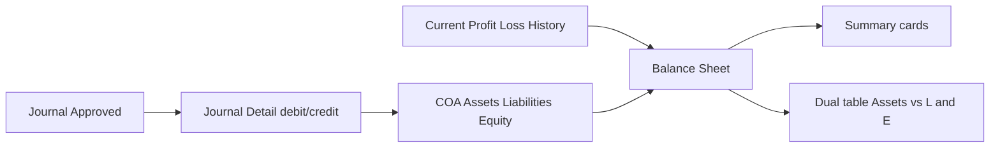
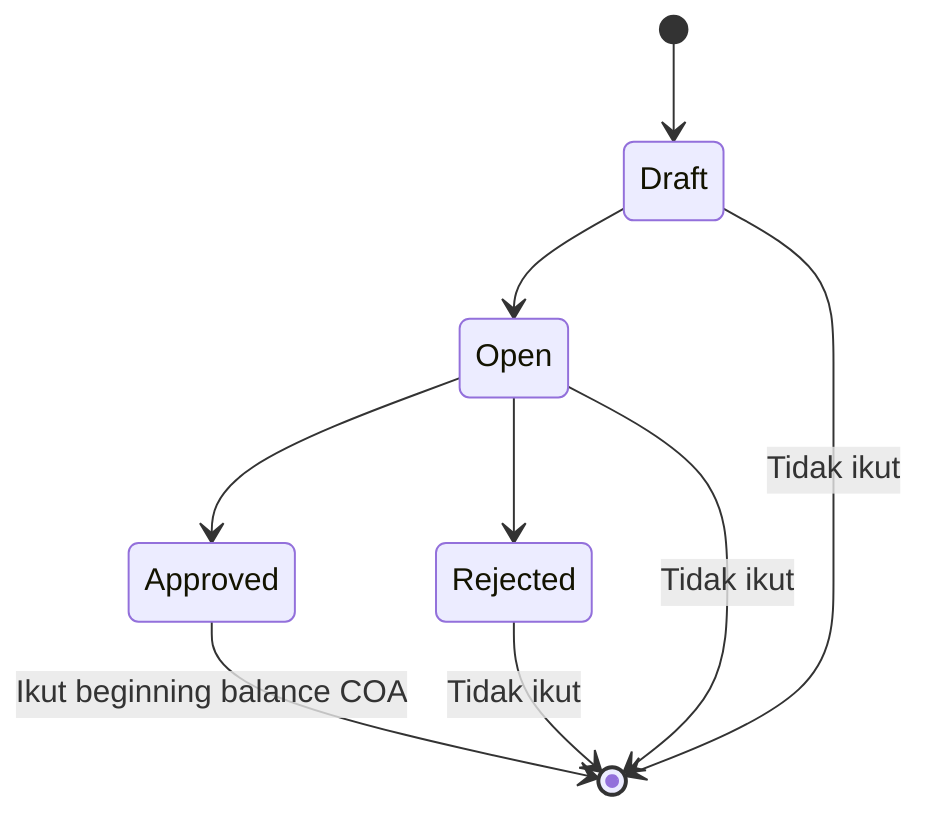
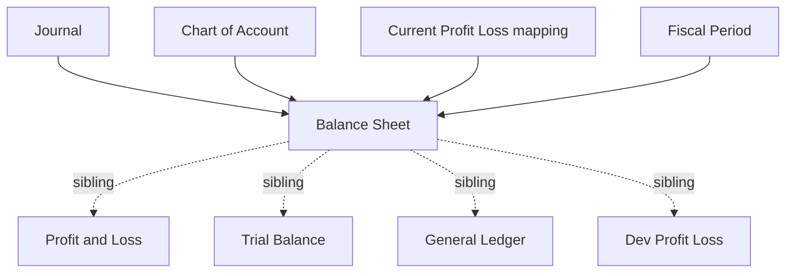

# Balance Sheet — Source of Truth

## 1. Ringkasan Eksekutif

**Balance Sheet** adalah laporan **neraca** (posisi keuangan) perusahaan **pada satu tanggal “As at”**. Menampilkan kartu ringkasan (Total Assets, Total Liabilities, Total Equity, Total Liabilities & Equity, Current Profit/Loss) plus **dua tabel berdampingan**: Assets | Liabilities and Equity. Angka dari journal **Approved** (path COA biasa) yang diagregasi sampai cut-off tanggal.

Persamaan akuntansi yang ditarget UI: **Total Assets ≈ Total Liabilities + Total Equity**, dengan Current Profit/Loss (ending) menjadi penambah/pengurang Equity. Menu **view-only** — **tidak ada export**, create, edit, atau delete.



## 2. Prasyarat

| Prerequisite | Sumber | Catatan |
|--------------|--------|---------|
| COA aktif class **Assets**, **Liabilities**, **Equity** | Chart of Account + COA Class | Revenue/Expense/COGS **tidak** masuk BS |
| Hierarki parent–child COA | COA Tree | Parent = agregasi child; indent + bold |
| Mapping Current Profit/Loss (company) | Internal / General Company | Kartu + baris COA Current P/L + penambah Equity |
| Journal Approved di tanggal relevan | Journal (+ SI, PI, Payment, Outbound, Settlement, dll.) | Path beginning balance filter Approved |
| Privilege `viewAny` Balance Sheet | Gate (`accounting/balance-sheet`) | Kedua API report + datalist authorize |
| Fiscal Period covering As at (untuk path Current P/L parent) | Fiscal Period | Jika period tidak Open / tidak cover tanggal → kontribusi `getCurrentProfitLoss` = **0** |

## 3. Siklus Status

Menu **tidak punya status dokumen**. Yang menentukan angka masuk adalah status Journal (dan untuk path history: soft-delete + fiscal period).



| Status Journal | Beginning balance COA (Assets/L/E biasa) | Ending / Current P/L (history) |
|----------------|------------------------------------------|--------------------------------|
| **Approved** | Ya (`transaction_date` **&lt;** As at) | History join journal; Ending **≤** As at — **tanpa** filter Approved di query (GAP-BS-03) |
| Draft / Open / Rejected | Tidak | Risiko ikut di ending history jika record history ada (GAP-BS-03) |

## 4. Datalist

**Route UI:** `/accounting/balance-sheet`  
**API:** `GET …/balance-sheet/report?period=` · `GET …/balance-sheet/datalist?className[]=&period=`

### 4.1 Layout

| Zona | Isi |
|------|-----|
| Filter | **As at** (single date) + **Apply** |
| Kartu kiri | **Total Assets** |
| Kartu tengah | **Total Liabilities and Equity** + sub **Total Liabilities** / **Total Equity** |
| Kartu kanan | **Current Profit/Loss** |
| Tabel kiri | Judul **Assets** — class Assets |
| Tabel kanan | Judul **Liabilities and Equity** — class Liabilities + Equity |

### 4.2 Kolom tabel (kedua sisi sama)

| Kolom | Visible | Keterangan |
|-------|---------|------------|
| COA CLASS | false | Label class + total (row-group legacy; FE aktif tidak pass row group) |
| COA SEQ. | false | Class id |
| **CODE** | true | Kode COA; order numerik segmen di BE |
| **NAME** | true | Nama + indent hierarki; parent **bold** |
| **ENDING BALANCE** | true | Saldo as-of cut (helper beginning / ending P/L — lihat §6) |

### 4.3 Karakteristik tabel

| Aspek | AS-IS |
|-------|--------|
| Dom DataTables | `t` saja (tanpa search/length/pagination UI tipikal) |
| pageLength | 1000 |
| Filter kolom / Search Builder | Tidak |
| Action baris | Tidak |
| Export / print | **Tidak ada** (selaras requirement view-only) |
| Drill-down ke Journal/GL | Tidak |

### 4.4 Filter & Apply

| Kontrol | Behavior |
|---------|----------|
| **As at** | Date picker single; model `yyyy-MM-dd`; tampil `dd-MM-yyyy`; tanpa waktu |
| **Apply** | Hanya jika tanggal terisi: update URL kedua tabel + `period=`, fetch kartu, remount tabel |
| Apply tanpa tanggal | **No-op** |
| First load | `period` lokal kosong; API default **hari ini**; kartu + tabel load today |

## 5. Form & Field

Bukan transaksi — hanya filter report.

| Field | Wajib UI | Keterangan |
|-------|----------|------------|
| As at (`period`) | Ya untuk Apply | Single date; tujuan = potong perhitungan neraca **per tanggal tersebut** |
| className (API only) | — | Assets table: `assets`. L+E: `liabilities` + `equity` |

Tidak ada FormRequest bisnis; format `period` **tidak** divalidasi ketat di BE (GAP-BS-05).

## 6. How It Works

### 6.1 Persamaan & kartu (requirement + AS-IS)

```text
Total Assets              = Σ beginning balance class Assets          (tanpa abs di kartu)
Total Liabilities         = |Σ beginning balance class Liabilities|
Current Profit/Loss       = ending balance mapping Current P/L        (signed)
Total Equity              = |Σ beginning balance class Equity| + Current Profit/Loss
Total Liabilities & Equity = Total Liabilities + Total Equity
```

- Current P/L **minus** → mengurangi Total Equity; **plus** → menambah Equity (COA class Equity).
- UI **tidak** hard-error jika Assets ≠ L+E — hanya ditampilkan.

### 6.2 Dual table (requirement)

| Panel | COA class | Parent |
|-------|-----------|--------|
| **Assets** | Assets | Nilai = agregasi child |
| **Liabilities and Equity** | Liabilities + Equity | Nilai = agregasi child (+ Current P/L pada parent Equity — GAP-BS-02) |

### 6.3 Rumus Ending Balance per baris

| Baris | Rumus AS-IS |
|-------|-------------|
| COA = **Current Profit/Loss** (mapping company) | `getEndingProfitLoss(As at)` — signed |
| Parent (punya child) | `|getBeginningBalanceParent|`; jika class **Equity** → **+ `getCurrentProfitLoss(As at)`** |
| Leaf biasa | `|getBeginningBalance|` |

**Catatan penamaan:** label UI **ENDING BALANCE**; helper COA biasa = **beginning** as-of (`DATE(transaction_date) < As at`).

### 6.4 Cut-off tanggal (penting)

| Path | Operator vs As at `D` | Efek |
|------|----------------------|------|
| Beginning balance COA | `transaction_date` **&lt;** `D` | Transaksi **pada hari As at tidak masuk** saldo COA |
| Ending Profit/Loss | `transaction_date` **≤** `D` | Transaksi **hari As at ikut** di kartu/baris Current P/L |

### 6.5 Dua helper P/L

| Dipakai di | Helper | Ciri |
|------------|--------|------|
| Kartu Current P/L + baris COA Current P/L | `getEndingProfitLoss` | Sum history sampai ≤ D |
| Equity parent (+ label class di kolom hidden) | `getCurrentProfitLoss` | Hanya jika Fiscal Period **Open** cover D; ambil snapshot history terakhir ≤ D di period itu; else **0** |

Angka kartu Equity vs total visual parent Equity bisa beda (GAP-BS-01 / BS-02).

### 6.6 Contoh kasus

| # | Situasi | Expected |
|---|---------|----------|
| 1 | Buka menu tanpa ubah tanggal | Kartu + tabel pakai **hari ini** |
| 2 | Pilih As at → Apply | Kartu & kedua tabel refresh ke tanggal itu |
| 3 | Apply tanpa isi As at | Tidak reload (no-op) |
| 4 | Current P/L ending positif | Total Equity naik sebesar nilai itu |
| 5 | Current P/L ending negatif | Total Equity turun (faktor pengurang) |
| 6 | Journal Draft pada tanggal &lt; As at | Tidak masuk beginning COA |
| 7 | Journal Approved tanggal = As at | Tidak masuk beginning COA; bisa masuk Ending P/L |
| 8 | Parent Assets | Ending Balance = akumulasi child (abs parent path) |
| 9 | Cari tombol Export | Tidak ada — view only |

## 7. Validasi

| Kondisi | Behavior |
|---------|----------|
| Tidak login / tanpa privilege | 403 pada report & datalist |
| Apply dengan As at kosong | UI no-op |
| `period` kosong di API | Default `date('Y-m-d')` (today) |
| `className` kosong/salah | Query bisa kosong (tidak ada enum-check) |
| Format `period` invalid | Tidak divalidasi eksplisit — bergantung parsing tanggal helper (GAP-BS-05) |
| Assets ≠ L+E | Tetap tampil; tidak ada error hard |

## 8. Relasi Menu Lain



| Menu | Relasi |
|------|--------|
| Journal | Sumber saldo Approved |
| Chart of Account / COA Class / Tree | Baris & hierarki |
| Profit & Loss | Kinerja periode; BS = posisi as at; Current P/L mestinya selaras via history |
| Trial Balance / General Ledger | Sibling; TB/GL lebih lebar class / detail mutasi |
| Fiscal Period | Mempengaruhi `getCurrentProfitLoss`; closing geser ke Retained |
| Cash/Bank, AR/AP report | Bukan sumber BS; hanya jika post ke COA Assets/Liabilities |

## 9. Gap Registry

| ID | Deskripsi | Type | Dampak | Status |
|----|-----------|------|--------|--------|
| GAP-BS-01 | Cut-off tidak seragam: COA beginning pakai **&lt;** As at; Ending P/L pakai **≤** As at. Requirement “per tanggal tersebut” ambigu apakah transaksi hari As at masuk | Contradiction / Unverified | Kartu vs baris COA di tanggal cut | Pending Decision — Yemima (include hari As at = `<=` untuk semua?) |
| GAP-BS-02 | Kartu Equity / Current P/L pakai **Ending** P/L; parent Equity di tabel pakai **Current** P/L (FP Open). Setiap parent Equity + full Current P/L → risiko double-count visual | Contradiction | Total Equity kartu vs jumlah baris | Pending Decision — Yemima |
| GAP-BS-03 | Path Ending/Current ProfitLoss history **tanpa** filter journal Approved (beda beginning COA) | Contradiction | Akurasi Current P/L jika history dari journal non-approved | Pending Decision — Yemima |
| GAP-BS-04 | Kartu Total Assets **tanpa** `abs()`; Liabilities/Equity class di-`abs()` dulu | Unverified / UX | Tanda Assets vs sisi kanan | Open — document AS-IS; putuskan normalisasi tanda |
| GAP-BS-05 | Tidak ada validasi format `period` di BE | Missing Behavior | Request rusak / angka 0 aneh | Open — note for Dev (validate date) |
| GAP-BS-06 | Label kolom **ENDING BALANCE** vs helper **getBeginningBalance*** (saldo kumulatif sebelum D) | Unverified naming | Bingung QA/Dev | Resolved for docs — catat di KB/tech; behavior tetap beginning as-of |
| GAP-BS-07 | Tidak ada export — **by design** requirement (view only) | Missing Behavior (accepted) | Tidak bisa unduh Excel | **Resolved** — out of scope |
| GAP-BS-08 | Persamaan Assets = L+E tidak di-enforce (hanya tampil) | Unverified | User lihat unbalanced tanpa warning | Open — optional soft warning? Pending Decision |

## 10. FAQ

**Q: As at itu apa?**  
A: Satu tanggal potong neraca. Semua angka dihitung posisi keuangan **sampai** tanggal itu (dengan nuance transaksi hari itu — lihat cut-off).

**Q: Kenapa harus Apply?**  
A: Mengubah tanggal saja belum reload. Apply baru refresh kartu + kedua tabel.

**Q: Assets harus sama dengan Liabilities + Equity?**  
A: Idealnya ya (konsep neraca). Sistem menampilkan kedua sisi; tidak memblok jika belum balance.

**Q: Current Profit/Loss dari mana?**  
A: Ending balance COA yang di-map sebagai Current Profit/Loss (+ history). Plus menambah Equity; minus mengurangi Equity.

**Q: Ada export?**  
A: Tidak. Menu ini view only.

**Q: Bedanya dengan Trial Balance / P&L?**  
A: TB = saldo banyak class (sering beginning/in-period/ending). P&L = laba rugi **rentang tanggal**. BS = posisi Assets vs L+E **satu tanggal**.

## 11. Changelog

| Version | Date | Changes |
|---------|------|---------|
| 1.0 | 2026-08-12 | Initial SOT dari requirement Yemima + verifikasi Balance Sheet AS-IS (As at, dual table, kartu, no export) |

## 12. Knowledge Base Hints

### Kamus

| Istilah | Bahasa awam |
|---------|-------------|
| As at | Tanggal posisi neraca |
| Ending Balance (UI) | Saldo akun sampai cut-off tanggal (bukan mutasi dalam range) |
| Current Profit/Loss | Laba/rugi berjalan yang menambah atau mengurangi Equity |
| Parent COA | Akun induk; angkanya jumlah anak |
| Liabilities and Equity | Sisi kanan neraca (utang + modal) |

### Troubleshooting

| Gejala | Cek |
|--------|-----|
| Angka masih hari ini setelah ganti tanggal | Sudah klik **Apply**? Tanggal terisi? |
| Apply tidak bereaksi | As at masih kosong |
| Assets ≠ L+E | Cek journal Approved, mapping Current P/L, fiscal period Open, transaksi di tanggal As at (cut-off) |
| Current P/L 0 di parent Equity tapi kartu ada nilai | Fiscal period closed / tidak cover tanggal → path Current = 0 |
| Tidak ada tombol Export | By design |

### Skip di KB

Path class helper, cache key, FIELD/order SQL, kolom hidden `coa_class`.

## 13. Technical Hints

### File map

| Layer | Path / nama |
|-------|-------------|
| FE | `olshoperp-frontend/src/pages/Accounting/Report/BalanceSheet/DataList.vue` |
| Routes API | `Modules/Accounting/Routes/api.php` — `balance-sheet/report`, `balance-sheet/datalist` |
| Controller | `BalanceSheetController@get_heading_cards`, `@index` |
| Entity / Policy | `BalanceSheet`, `BalanceSheetPolicy` (`menu_link` = `accounting/balance-sheet`) |
| Helper | `JournalReport::getBeginningBalance*`, `getBeginningBalanceClass`, `getBeginningBalanceParent`, `getEndingProfitLoss`, `getCurrentProfitLoss` |
| History | `CurrentProfitLossHistory` |
| Mapping COA P/L | `getProfitLossCoaIds(getCompany())` |
| Menu seeder | `AccountingMenuSeeder` → `accounting/balance-sheet` |

### Invariants

1. Hanya class Assets, Liabilities, Equity.
2. Report & datalist wajib `authorize viewAny` BalanceSheet.
3. Default `period` kosong → today (`Y-m-d`).
4. Kartu: `equities = abs(equity class) + getEndingProfitLoss`.
5. Tidak menulis journal; tidak ada entity tabel `balance_sheets`.
6. Tidak ada export endpoint/UI aktif.

### Failure modes

| Mode | Sumber |
|------|--------|
| 403 | Policy viewAny |
| Apply no-op | FE `period == ""` |
| Tabel kosong | className mismatch / tidak ada COA class |
| Angka “aneh” di As at | Cut-off `<` vs `<=`; dual helper Ending vs Current P/L |

### Data lifecycle

Journal Approved → Journal Detail → agregasi on-read Balance Sheet (cards + dual datalist). Optional: Fiscal Period close memindahkan P/L ke Retained (dampak lewat COA Equity / journal close, bukan UI BS).

## 14. Referensi Struktur untuk Proses Split

```
Section 1-11 → material utama untuk requirement.md
Section 5, 6, 7, 10 → adaptasi ke knowledge-base.md dengan tone awam (lihat Section 12)
Section 13 Technical Hints → seed untuk technical.md, sudah pakai path/nama real
Frontmatter YAML di atas → copy ke 3 file utama (+ user-guide.md kalau gate review/final), sinkronkan version + last_updated
Golden reference tone & struktur: docs/qa-docs/accounting-supplier-invoice/
```
