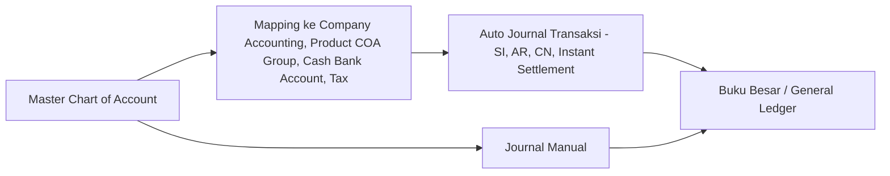
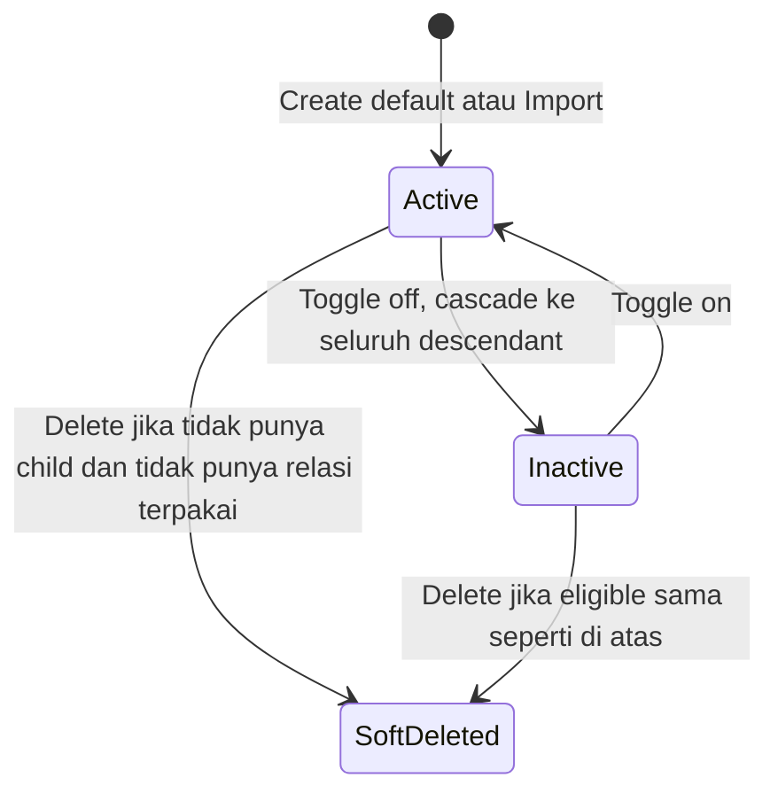
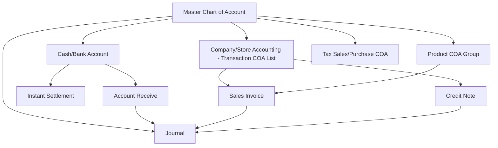

# Chart of Account (Master COA) — Source of Truth

## 1. Ringkasan Eksekutif

Chart of Account (COA), sering disebut Master COA, adalah master akun buku besar per company di modul Finance & Accounting. Setiap baris Debit/Credit di Journal, serta hampir seluruh auto-journal transaksi (Sales Invoice, Account Receive, Credit Note, Instant Settlement, dan lainnya), harus merujuk ke leaf COA yang aktif. Menu ini murni master data — tidak ada siklus Draft/Approve seperti dokumen transaksi, hanya kondisi Active/Inactive ditambah soft delete. Audience utama: tim Finance/Accounting dan QA.



---

## 2. Prasyarat

| Prasyarat | Sumber | Catatan |
|---|---|---|
| Master COA Class sudah tersedia (7 opsi tetap: Assets, Liabilities, Equity, Revenue, Expense, Cost Of Goods Sold, Other Revenue and Expenses) | Master COA Class (di-seed sistem) | Wajib dipilih saat create COA tanpa parent |
| Company/Store sudah terdaftar | Master Company | COA bersifat per company (`owned_by`) |

---

## 3. Siklus Status

Bukan siklus dokumen transaksi. Kondisi yang berlaku pada satu baris COA:



| Kondisi | Arti | Efek |
|---|---|---|
| Active | Bisa dipakai di transaksi | Muncul di picker parent/child sesuai syarat |
| Inactive | Tidak dipakai di transaksi | Hilang dari picker; toggle inactive pada COA yang berstatus parent akan cascade menjadikan seluruh descendant-nya ikut Inactive (lihat Section 6.6) |
| Soft-deleted | Sudah dihapus | Tidak dihitung di validasi Code unik; masih bisa dilihat lewat Show Deleted Data |
| Parent / Group | Punya minimal satu child di struktur tree | Tidak muncul di child picker transaksi; tidak bisa dihapus selama masih punya child |
| Leaf | Tidak punya child | Boleh dipakai di Journal, Sales Invoice, Account Receive, Cash/Bank, dan seterusnya |
| View-only (locked) | Sudah punya relasi terpakai di menu lain (lihat Section 6.3) | Code, Parent, Class, dan Active terkunci; Name dan Description masih bisa diubah; tombol Delete hilang |

---

## 4. Datalist

### 4.1 Kolom Datatable

| Kolom | Visible Default | Sumber Data | Keterangan |
|---|---|---|---|
| Code \| Name | Ya | Field COA | Kode dan nama akun |
| Parent Code \| Parent Name | Ya | Relasi tree COA | Kosong jika COA ini tidak punya parent |
| Class | Ya | Master COA Class | Assets, Liabilities, Equity, Revenue, Expense, Cost Of Goods Sold, Other Revenue and Expenses |
| Position | Ya | Diturunkan dari Class | Activa atau Passiva — lihat Section 6.2 untuk aturan lengkap |
| Active | Ya | Status COA | Yes / No |
| Created By \| Created At | Ya | Audit log | |
| Updated By \| Updated At | Ya | Audit log | |

### 4.2 Fitur Datalist

| Fitur | Detail |
|---|---|
| Global Search | Mencari keyword yang match di seluruh field datalist yang searchable. `[VERIFY: CODEBASE]` apakah pencarian bersifat exact match atau contains — behavior ini diketahui berbeda antar datatable di sistem, perlu dikonfirmasi Cursor khusus untuk menu COA agar dokumentasi valid sesuai codebase |
| Advanced Filter | Pencarian multi-keyword dan multi-variable sekaligus dalam satu kali pencarian. `[VERIFY: CODEBASE]` daftar lengkap field yang searchable, daftar operator yang tersedia per field, dan fungsi masing-masing operator — perlu breakdown detail dari Cursor terhadap codebase, belum ada di dokumen ini |
| Show Deleted Data | Standar sama seperti menu master lain — checkbox untuk menampilkan seluruh data (aktif dan yang sudah di-soft-delete sekaligus) |
| Column Show/Hide | Standar sama seperti menu master lain |
| Export | Advanced export: With Details, Without Details, dan This Page Only berdasarkan data yang sedang difilter user. `[VERIFY: CODEBASE]` apakah mapping kolom benar-benar berbeda antar tiga opsi ini, karena ada indikasi AS-IS saat ini mapping kolomnya masih cenderung sama |
| Import | Lihat Section 6.4 untuk detail template, tab Import History, dan tab View Error Logs |

### 4.3 Action Button

| Tombol | Kondisi Muncul | Keterangan |
|---|---|---|
| Show / Edit | Selalu | Field yang bisa diubah tergantung status view-only — lihat Section 6.3 |
| Delete | Hanya muncul jika COA belum dipakai relasi apapun di menu lain dan tidak punya child di tree | Kalau sudah punya relasi atau masih punya child, tombol Delete hilang, Code terkunci, dan hanya Name yang masih bisa diubah |

---

## 5. Form & Field

### Section: Chart of Account (Create/Edit)

Catatan: metode create COA saat ini belum memakai fitur auto save — user tetap harus klik tombol create lalu save manual.

| Field | Wajib? | Default | Sumber Opsi | Validasi | Catatan |
|---|---|---|---|---|---|
| Code | Ya | - | Input manual | Tidak boleh mengandung spasi; tidak boleh sama dengan Code aktif yang sudah tersimpan, kecuali Code existing tersebut statusnya sudah soft-deleted | Terkunci kalau COA sudah view-only |
| Name | Ya | - | Input manual | - | Tetap bisa diubah walau COA sudah view-only |
| Parent Group Name | Tidak | Kosong | Daftar COA eligible jadi parent | Parent harus Active. Definisi "eligible jadi parent" saat ini punya dua versi berbeda antara requirement dan codebase — lihat GAP-COA-01. `[VERIFY: CODEBASE]` sebelum definisi final dipakai di test case | Kalau parent dipilih, Class otomatis mengikuti Class parent |
| Class | Wajib jika Parent kosong | - | 7 opsi Master COA Class | RequiredIf Parent kosong; field otomatis disabled dan mengikuti Class parent kalau Parent Group Name diisi | Class child harus selalu sama dengan Class parent, tidak boleh berbeda |
| Description | Tidak | Kosong | Input manual | - | Catatan bebas terkait COA |
| Toggle Active | - | ON (Active) | Switch | - | Kalau di-set Inactive, COA tidak bisa dipakai di menu lain. Kalau COA ini berstatus parent dan di-toggle Inactive, seluruh descendant-nya ikut cascade jadi Inactive — lihat Section 6.6 |

---

## 6. How It Works

### 6.1 Struktur Parent — Child dan Pewarisan Class

Hierarki parent-child COA disimpan di struktur tree terpisah dari baris data COA itu sendiri (bukan atribut langsung pada baris COA). COA yang punya minimal satu child disebut parent atau group; COA yang tidak punya child disebut leaf, dan hanya leaf yang boleh dipilih di transaksi (Journal, Sales Invoice, Account Receive, Cash/Bank, dan lainnya).

Kalau user memilih Parent Group Name saat create atau edit, Class COA yang dibuat otomatis mengikuti Class parent tersebut dan field Class dikunci — child tidak boleh punya Class berbeda dari parent-nya.

### 6.2 Posisi COA per Class (Position Rule)

Setiap COA Class punya Position tetap yang menentukan arah penjurnalan:

```
Activa  : akun bertambah di posisi Debit, berkurang di posisi Kredit
Passiva : akun bertambah di posisi Kredit, berkurang di posisi Debit
```

| Class | Position |
|---|---|
| Assets | Activa |
| Cost Of Goods Sold | Activa |
| Expense | Activa |
| Liabilities | Passiva |
| Equity | Passiva |
| Revenue | Passiva |
| Other Revenue and Expenses | Passiva |

### 6.3 Locked State (View-Only) Saat COA Sudah Punya Relasi

COA yang sudah dipakai di salah satu relasi berikut menjadi view-only:

- Product COA Group
- Product Accounting
- Company/Store Accounting (Transaction COA List)
- Purchase Tax / Sales Tax
- Journal Detail
- Cash/Bank Account (Company Detail Bank)

Efeknya: Code, Parent, Class, dan Active terkunci, tidak bisa diubah. Name dan Description tetap bisa diubah. Tombol Delete hilang dari action button.

### 6.4 Import — Template dan Proses

**Template — 5 kolom, header harus exact:**

| Kolom | Header | Wajib | Keterangan |
|---|---|---|---|
| A | Code | Ya | Kode COA unik per company |
| B | Code Parent COA | Tidak | Kode parent — harus sudah Active di sistem, atau muncul sebagai baris parent di atas baris child-nya dalam sheet yang sama |
| C | COA Name | Ya | Nama akun |
| D | Description | Tidak | Deskripsi bebas |
| E | COA Class ID | Ya | ID numerik Master COA Class (bukan nama Class) — lihat mapping ID di Section 12 |

**Validasi per baris:**

| Kolom | Rule |
|---|---|
| Code | Tidak boleh kosong; belum dipakai di company (yang belum di-soft-delete) |
| Code Parent COA | Kalau diisi: parent harus ketemu Active di sistem, atau baris parent-nya ada di atas child dalam file yang sama. Parent di file tapi posisinya di bawah child, atau parent sama sekali tidak ketemu, akan gagal |
| COA Name | Tidak boleh kosong |
| Description | Opsional |
| COA Class ID | Tidak boleh kosong; harus ID yang benar-benar ada di Master COA Class |

**Validasi proses:**

1. Header harus exact 5 kolom di atas; kolom tambahan yang tidak kosong membuat format gagal.
2. File kosong (tidak ada baris data) ditolak.
3. Semua error dikumpulkan dulu sebelum proses jalan. Kalau ada satu saja baris error, seluruh proses import gagal total — tidak ada baris yang masuk sebagian.
4. Kalau lolos validasi, sistem memproses tiap baris satu per satu.
5. Import bersifat create-only — tidak bisa dipakai untuk update COA yang sudah ada. Seluruh baris yang berhasil dibuat otomatis berstatus Active.
6. Parent yang baru muncul di sheet yang sama akan diselesaikan urutannya saat proses berjalan — urutan parent harus di atas child-nya.

**Tab Import History** — kolom:

| Kolom | Keterangan |
|---|---|
| Action | Tombol download file yang sudah diimport. File hanya bisa didownload maksimal 24 jam sejak proses import |
| File Name | Nama file yang diimport |
| Imported By \| Imported At | Siapa dan kapan file diimport |
| Status | Hanya dua nilai: Success atau Failed |
| Total Failed Row | Jumlah baris yang gagal atau bermasalah |
| Total Success Row | Jumlah baris yang berhasil diimport |

**Tab View Error Logs** — menampilkan pesan error dari proses import terakhir saja. Kalau proses import berikutnya sukses semua tanpa error, log error di tab ini otomatis hilang — kolom Message akan kosong (tidak ada data), karena sistem menganggap import terakhir sudah sukses tanpa masalah.

### 6.5 Export

Export mendukung tiga mode: With Details, Without Details, dan This Page Only, berdasarkan data yang sedang difilter user di datalist. `[VERIFY: CODEBASE]` untuk memastikan mapping kolom benar-benar berbeda antar tiga mode ini di implementasi saat ini.

### 6.6 Toggle Active dan Cascade ke Descendant

COA yang berstatus parent tetap bisa di-toggle menjadi Inactive. Saat di-toggle Inactive, seluruh descendant-nya (semua child di bawahnya, bertingkat) ikut otomatis menjadi Inactive. Perilaku yang sama juga berlaku untuk perubahan Class pada parent — kalau Class parent diubah (hanya bisa terjadi kalau parent dan seluruh descendant-nya belum punya relasi terpakai), seluruh descendant ikut cascade mengikuti Class baru tersebut.

Untuk kasus mengaktifkan kembali (toggle Active) satu child ketika parent-nya sedang Inactive, ada indikasi pengecekan status parent yang dipakai saat ini berpotensi tidak konsisten dengan struktur tree aktif — lihat GAP-COA-03.

---

## 7. Validasi

| # | Kondisi | Behavior | Error Message |
|---|---|---|---|
| 1 | Code kosong atau mengandung spasi | Ditolak | - |
| 2 | Code sama dengan Code aktif (belum di-soft-delete) yang sudah ada | Ditolak | Code sudah dipakai |
| 3 | Code sama dengan Code milik COA yang sudah di-soft-delete | Diizinkan | - |
| 4 | Name kosong | Ditolak | - |
| 5 | Parent Group Name diisi, tapi parent yang dipilih berstatus Inactive | Ditolak | - |
| 6 | Parent Group Name diisi | Class otomatis ikut Class parent dan field Class terkunci | - |
| 7 | Definisi eligible jadi parent | `[VERIFY: CODEBASE]` — requirement dan codebase punya versi berbeda, lihat GAP-COA-01 | - |
| 8 | Parent Group Name kosong | Class wajib diisi manual dari 7 opsi Class | - |
| 9 | Ubah Class pada COA yang sudah punya relasi terpakai di diri sendiri atau descendant-nya | Ditolak | Class tidak bisa diubah karena sudah dipakai di relasi terkait |
| 10 | Toggle Inactive pada COA berstatus parent | Diizinkan, cascade Inactive ke seluruh descendant | - |
| 11 | Delete COA yang masih punya child di tree | Ditolak | Masih ada child COA di bawahnya |
| 12 | Delete COA yang sudah punya relasi terpakai (Product COA Group, Product Accounting, Company/Store Accounting, Tax, Journal Detail, Cash/Bank Account) | Ditolak, Code dan field lain jadi terkunci, hanya Name dan Description yang masih bisa diubah | Sudah dipakai di transaksi terkait |
| 13 | Delete COA yang tidak punya child dan tidak punya relasi terpakai | Diizinkan, soft-delete | - |
| 14 | Import — header file tidak exact 5 kolom, atau ada kolom tambahan berisi data | Format ditolak | - |
| 15 | Import — file kosong tanpa baris data | Ditolak | Tambahkan minimal satu baris COA |
| 16 | Import — ada satu atau lebih baris error | Seluruh proses import gagal total, tidak ada baris yang masuk sebagian | - |
| 17 | Import — Code Parent COA di file berada di bawah baris child-nya | Ditolak | Parent harus ditempatkan di atas child-nya |
| 18 | Import — Code Parent COA tidak ketemu baik di sistem maupun di file | Ditolak | Parent tidak ditemukan |
| 19 | Import — semua baris lolos validasi | Seluruh baris dibuat dengan status Active | - |
| 20 | Download file Import History melewati 24 jam sejak waktu import | Tombol download tidak lagi tersedia | - |

---

## 8. Relasi Menu Lain



| Menu | Peran dalam Relasi |
|---|---|
| Journal | Setiap baris debit/credit merujuk ke leaf COA yang Active; parent COA ditolak sebagai baris jurnal |
| Cash/Bank Account | Menyimpan mapping ke leaf COA Cash/Bank untuk Account Receive dan Instant Settlement |
| Company/Store Accounting (Transaction COA List) | Menyimpan mapping berbagai COA (Account Receivable, Customer's Deposit, Sales Discount, dan lainnya) yang dipakai auto-journal Sales Invoice, Account Receive, Credit Note |
| Product COA Group | Sumber COA per produk untuk auto-journal Sales Invoice dan Journal |
| Purchase Tax / Sales Tax | Menyimpan mapping COA pajak penjualan/pembelian |
| Product Accounting | Konsumen leaf COA lain, ikut menentukan status view-only COA |

---

## 9. Gap Registry

| ID | Deskripsi | Dampak | Status |
|---|---|---|---|
| GAP-COA-01 | Definisi "eligible jadi parent" berbeda antara requirement (COA eligible jadi parent selama belum punya relasi apapun di menu manapun) dan codebase (picker parent hanya mengecualikan COA yang sudah punya baris Journal Detail — relasi lain seperti Product COA Group atau Tax tidak ikut jadi filter) | Mempengaruhi opsi yang muncul di field Parent Group Name dan test case parent picker | Open — butuh keputusan Mas Yendy/dev, `[VERIFY: CODEBASE]` sebelum final |
| GAP-COA-02 | Validasi anti-circular assignment parent (mencegah parent dan child saling melingkar dalam satu rantai) belum aktif dipanggil saat proses update parent | Risiko rantai parent-child yang circular tidak tercegah sistem, berpotensi merusak struktur tree | Open |
| GAP-COA-03 | Pengecekan status parent saat proses activate kembali satu child berpotensi masih memakai referensi relasi lama, belum tentu sinkron dengan struktur tree yang aktif saat ini | Berisiko hasil validasi activate child tidak konsisten dengan kondisi tree sebenarnya | Open — `[VERIFY: CODEBASE]` |

---

## 10. FAQ

**Q: Kenapa Code COA yang aku pilih ditolak padahal setahu aku belum ada COA lain dengan Code itu?**
A: Kemungkinan Code tersebut masih dipakai COA aktif lain yang belum di-soft-delete. Kalau COA lama dengan Code sama sudah dihapus, Code itu boleh dipakai ulang.

**Q: Kenapa field Class di form Create tiba-tiba terkunci?**
A: Karena Parent Group Name sudah diisi. Class child wajib sama dengan Class parent, jadi field-nya otomatis mengikuti dan tidak bisa diubah manual.

**Q: Kenapa tombol Delete hilang di beberapa baris COA?**
A: COA tersebut sudah punya relasi terpakai di menu lain (misalnya sudah dipakai di Journal atau Product COA Group), atau masih punya child di bawahnya. Selama masih ada relasi atau child, COA tidak bisa dihapus dan Code-nya juga terkunci — hanya Name yang masih bisa diubah.

**Q: Kenapa import COA aku gagal total padahal cuma satu baris yang error?**
A: Proses import ini all-or-nothing — semua baris divalidasi dulu, dan kalau ada satu saja baris bermasalah, seluruh file dianggap gagal, tidak ada baris yang masuk sebagian.

**Q: Kenapa aku sudah download file import tapi sekarang tombol download-nya hilang?**
A: File hasil import hanya bisa didownload maksimal 24 jam sejak waktu import. Setelah lewat waktu itu, tombol download tidak lagi tersedia.

**Q: Kenapa tab View Error Logs kosong padahal kemarin sempat ada error?**
A: Tab ini hanya menampilkan error dari proses import paling terakhir. Kalau import terakhir sudah sukses tanpa error, log dari import sebelumnya otomatis dianggap tidak relevan lagi dan kolom Message jadi kosong.

---

## 11. Changelog

| Tanggal | Versi | Perubahan |
|---|---|---|
| 2026-07-30 | 1.0 | Draft awal SOT Chart of Account (Master COA), disusun dari requirement Yemima dibandingkan dengan hasil analisis codebase |

---

## 12. Knowledge Base Hints (untuk operator)

**Istilah teknis yang perlu diterjemahkan awam:**

| Istilah Teknis di Dokumen Ini | Padanan Awam untuk KB |
|---|---|
| Leaf COA | Akun COA yang aktif dan bisa dipakai langsung di transaksi |
| Parent / Group COA | Akun COA induk, cuma dipakai untuk mengelompokkan akun-akun lain, tidak bisa langsung dipakai di transaksi |
| View-only / Locked | Akun sudah pernah terpakai di transaksi atau setting lain, jadi sebagian datanya tidak bisa diubah lagi |
| Cascade | Perubahan otomatis ikut turun ke akun-akun anak di bawahnya |
| Position (Activa/Passiva) | Aturan arah penambahan saldo akun — sebagian akun bertambah kalau di-debit, sebagian bertambah kalau di-kredit |

**Mapping COA Class ke ID untuk kebutuhan Import (wajib ada di KB karena template hanya menerima angka, bukan nama):**

| Nama Class | ID di Template Import |
|---|---|
| Assets | 1 |
| Liabilities | 2 |
| Equity | 3 |
| Revenue | 4 |
| Expense | 5 |
| Cost Of Goods Sold | 6 |
| Other Revenue and Expenses | 7 |

**Skenario troubleshooting:**

- Gejala: import gagal total, padahal cuma satu baris data yang salah. Penyebab: proses import bersifat all-or-nothing. Solusi: cek tab View Error Logs untuk tahu baris mana yang bermasalah, perbaiki, lalu import ulang seluruh file.
- Gejala: COA yang mau dijadikan parent tidak muncul di pilihan. Penyebab: COA tersebut kemungkinan sudah punya relasi terpakai di menu lain. Solusi: pastikan COA yang dipilih sebagai parent belum pernah dipakai di transaksi manapun.
- Gejala: tombol Delete tidak ada di suatu baris COA. Penyebab: COA sudah dipakai di transaksi atau setting lain, atau masih punya child. Solusi: bukan bug, itu perlindungan sistem — ubah Name saja kalau memang perlu revisi.

**Field yang tidak relevan untuk operator di KB:** tidak ada field internal reference id yang perlu disembunyikan — seluruh field yang tampil di form dan datalist relevan untuk operator.

---

## 13. Technical Hints (untuk developer)

**Area codebase yang perlu didokumentasikan:**
- Controller untuk create/update/delete COA, termasuk logic cascade status dan Class ke descendant
- Service/handler untuk struktur tree parent-child COA (terpisah dari baris data COA)
- Picker/selector endpoint untuk parent dan untuk child (leaf-only), termasuk seluruh variannya
- Import pipeline: validasi template, job per baris, log history dan error log
- Export pipeline: job generate file untuk mode With Details / Without Details / This Page Only
- Master COA Class (seed data 7 Class tetap beserta Position masing-masing)

**Invariants:**
- Leaf COA adalah COA yang tidak muncul sebagai parent dari COA manapun di tree aktif
- Child selalu mewarisi Class dari parent kalau parent di-set
- Toggle Active dan perubahan Class pada parent selalu cascade ke seluruh descendant
- Journal, Sales Invoice, Account Receive, Credit Note tidak boleh posting ke parent COA, hanya leaf
- COA dengan relasi terpakai tidak bisa dihapus; perubahan Class diblokir kalau COA atau descendant-nya sudah punya relasi
- Import selalu create-only, seluruh baris sukses selalu berstatus Active, Class direferensikan lewat ID numerik bukan nama

**Failure modes:**
- Circular parent assignment (A jadi parent B, B jadi parent A) — mekanisme deteksi ada tapi belum aktif dipanggil saat update, lihat GAP-COA-02
- Proses import harus benar-benar all-or-nothing — pastikan tidak ada partial commit kalau ada baris error di tengah batch
- Activate child saat parent sedang Inactive — ada indikasi pengecekan status parent memakai referensi yang belum tentu sinkron dengan tree aktif, lihat GAP-COA-03
- Global Search dan Advanced Filter — perlu verifikasi langsung ke codebase apakah behavior-nya exact match atau contains, dan enumerasi lengkap field plus operator yang tersedia untuk Advanced Filter di menu ini secara spesifik, karena behavior ini diketahui bervariasi antar datatable lain di sistem

**Data lifecycle lintas dokumen:**
- Status view-only (lock Code/Parent/Class/Active) bukan flag yang disimpan permanen di baris COA, melainkan hasil pengecekan keberadaan relasi ke tabel-tabel lain (Product COA Group, Product Accounting, Company/Store Accounting, Tax, Journal Detail, Cash/Bank Account) — `[VERIFY: CODEBASE]` apakah pengecekan ini dilakukan real-time setiap request atau ada mekanisme cache

---

## 14. Referensi Struktur untuk Cursor

```
Section 1-11 → material utama untuk requirement.md
Section 5, 6, 7, 10 → adaptasi ke knowledge-base.md dengan tone awam (lihat Section 12 KB Hints)
Section 13 Technical Hints → seed untuk technical.md, dilengkapi Cursor dari codebase
Frontmatter YAML di atas → copy ke 3 file utama, sinkronkan version + last_updated
Golden reference tone & struktur: docs/qa-docs/accounting-supplier-invoice/
```
