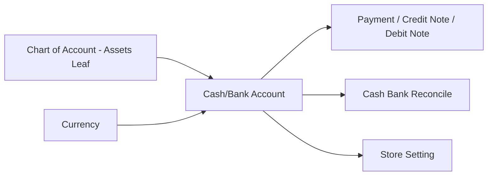
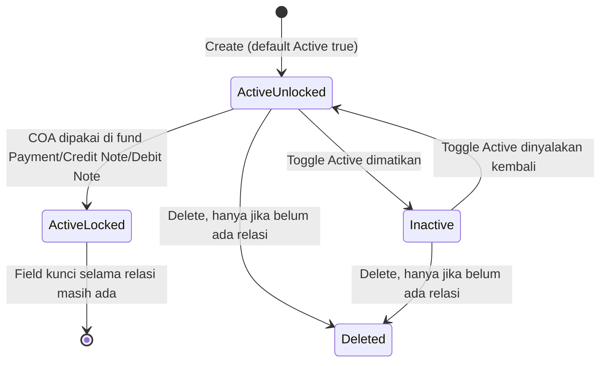
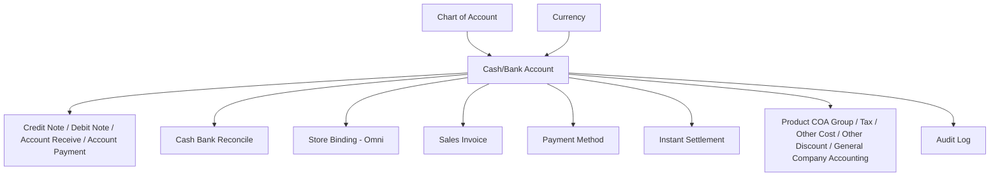

# Cash/Bank Account — Source of Truth

## 1. Ringkasan Eksekutif

Cash/Bank Account adalah master rekening kas dan bank perusahaan yang mengikat identitas rekening operasional ke satu leaf Chart of Account kelas Assets (COA Binding) beserta currency-nya. Master ini menjadi bridge, bukan jurnal dan bukan Chart of Account itu sendiri, yang dipakai sebagai sumber atau tujuan dana di hampir seluruh transaksi Finance (Payment, Credit Note, Debit Note, Account Receive/Payment), jadi basis pencocokan di Cash Bank Reconcile, serta jadi default cash bank di Store. Audience utama: tim Finance/Accounting saat setup awal company dan saat maintenance data rekening.



## 2. Prasyarat

| Prasyarat | Sumber | Catatan |
|---|---|---|
| COA Assets leaf aktif dan belum terikat Cash/Bank lain | Master Chart of Account | Hanya COA kelas Assets yang tidak punya child (leaf) dan belum punya relasi ke Cash/Bank Account manapun yang muncul di picker COA Binding |
| Currency aktif | Master Currency | Menentukan currency rekening dan kecocokan dengan currency dokumen transaksi konsumen |
| Konteks company (login) | Session/token user | Data ter-scope per company, rekening satu company tidak terlihat di company lain |

## 3. Siklus Status

Cash/Bank Account adalah data master, bukan dokumen transaksional berjenjang approval. Siklus di bawah ini menggambarkan kombinasi status Active/Inactive dan status terkunci (locked) setelah dipakai transaksi.



| Status | Kondisi Transisi | Editable? | Tombol yang Muncul |
|---|---|---|---|
| Active - Unlocked | Baru dibuat, atau belum pernah dipakai transaksi apa pun | Semua field bisa diedit: Type, Label, Bank Name, Bank Branch, Currency, COA Binding, Account Holder Name, Account Number, Swift Code, Description, Default, Active | Save, Delete |
| Active - Locked | COA sudah dipakai di fund Payment/Credit Note/Debit Note | Hanya Label, Bank Name, Bank Branch, Account Holder Name, Account Number, Swift Code, Description yang bisa diedit. Type, Currency, COA Binding, Active terkunci (disabled) | Save (field terbatas). Delete disembunyikan |
| Inactive | Toggle Active dimatikan dari status Active - Unlocked, dan rekening bukan satu-satunya default aktif | Semua field bisa diedit selama belum locked | Save, Delete |
| Deleted (soft-deleted) | Delete diklik pada status Active-Unlocked atau Inactive tanpa relasi | Tidak bisa diedit | Tidak ada aksi |

Catatan: klaim "tidak bisa di-set Inactive kalau masih ada saldo aktif" ditandai `[VERIFY: CODEBASE]` — belum ditemukan buktinya di analisis AS-IS backend saat ini, lihat Gap Registry GAP-CBA-02.

## 4. Datalist

| # | Kolom | Visible Default | Sumber Data | Keterangan |
|---|---|---|---|---|
| 1 | Type | True | Field `type` | Cash atau Bank |
| 2 | Label | True | Field `label` | - |
| 3 | Bank Name | True | Field `bank_name` | Kosong kalau Type Cash atau tidak diisi |
| 4 | Bank Branch | True | Field `bank_branch` | - |
| 5 | Acc Holder Name | True | Field `account_holder_name` | - |
| 6 | Acc Number | True | Field `account_number` | - |
| 7 | Curr | True | `currency.code` | - |
| 8 | COA Code \| COA Name | True | Chart of Account terikat | Format gabungan code dan name |
| 9 | Default Data | True | Field `is_default` | Boolean render |
| 10 | Active | True | Field `is_active` | Boolean render |
| 11 | Created By \| Created at | True | System | Nama user dan date time |
| 12 | Action | True | - | Show/Edit selalu ada. Delete hanya muncul kalau master belum punya relasi ke menu lain |

Fitur datalist: Global Search, Button Create, Show Deleted Data, Column Show and Hide, Export.

## 5. Form & Field

### 5.1 Section Account Detail (Create)

| Field | Wajib? | Default | Sumber Opsi | Validasi | Catatan |
|---|---|---|---|---|---|
| Type | Ya | Bank | Opsi tetap: Cash, Bank | Backend menerima value apa adanya dari request, tidak ada whitelist eksplisit di validasi (lihat GAP-CBA-05) | Editable, opsi dibatasi di FE |
| Label | Ya | - | Free text | Max 30 karakter | - |
| Bank Name | Tidak | - | Free text | - | Tetap opsional meski Type Bank |
| Bank Branch | Tidak | - | Free text | - | - |
| Currency | Ya | Primary currency (IDR) | Master Currency aktif | Wajib diisi | Menentukan currency transaksi yang bisa memakai rekening ini |
| COA Binding | Ya | - | Master Chart of Account, kelas Assets, leaf, aktif, belum terikat Cash/Bank lain | Satu COA hanya boleh terikat ke satu Cash/Bank aktif, kalau sudah dipakai ditolak | Picker mengecualikan COA yang sudah punya relasi Cash/Bank |
| Account Holder Name | Tidak | - | Free text | - | - |
| Account Number | Tidak | - | Free text | - | - |
| Swift Code | Tidak | - | Free text | - | - |
| Description | Tidak | - | Free text | - | - |
| Set as Default Data | Ya (toggle) | Tergantung kondisi | - | Tidak boleh Default dan Inactive bersamaan. Kalau company belum punya default sama sekali, create non-default ditolak | Set default baru otomatis unset default lama (lihat GAP-CBA-01 soal risiko query) |
| Active | Ya (toggle) | Active | - | Tidak boleh Inactive dan Default bersamaan | Rekening Inactive tidak muncul di picker transaksi lain |

### 5.2 Edit — Field Lock Saat Sudah Berelasi

Kalau master sudah punya relasi ke transaksi lain (rekening pernah dipakai sebagai fund di Payment, Credit Note, atau Debit Note), field yang masih bisa diedit hanya: Label, Bank Name, Bank Branch, Account Holder Name, Account Number, Swift Code, Description. Field Type, Currency, COA Binding, dan Active dikunci (disabled) dan tidak bisa diubah lagi lewat form.

### 5.3 Audit Log

Setiap perubahan pada master ini tercatat di Audit Log yang bisa dibuka dari slideover di halaman edit, mengikuti pola audit log standar di menu-menu lain.

## 6. How It Works

### 6.1 COA Binding satu ke satu

Setiap rekening Cash/Bank hanya boleh terikat ke satu leaf COA kelas Assets, dan satu COA yang sama tidak bisa dipakai ulang di rekening lain selama relasinya masih aktif. Kalau rekening di-soft-delete, COA tersebut jadi bebas lagi dan bisa dipilih di rekening baru atau di picker menu lain yang tadinya mengecualikan COA kas/bank.

### 6.2 Default Data

Company harus selalu punya minimal satu rekening dengan status Default aktif. Fungsinya sebagai rekening yang ter-auto-select duluan di transaksi-transaksi yang punya field Cash/Bank, sehingga user tidak perlu pilih manual tiap kali create transaksi baru. Saat user set rekening lain jadi default, rekening default lama otomatis di-unset. Perilaku auto-select ini sendiri dieksekusi di masing-masing menu konsumen (Payment, Credit Note, Debit Note, Store), jadi detail exact behavior-nya perlu dicek per menu, ditandai `[VERIFY: CODEBASE]`.

### 6.3 Lock setelah dipakai transaksi

Begitu rekening dipakai sebagai fund di Payment, Credit Note, atau Debit Note, field Type, Currency, dan COA Binding dikunci permanen untuk menjaga histori transaksi tetap konsisten dengan COA dan currency yang tercatat. Kalau memang butuh ganti currency atau COA, jalan keluarnya adalah membuat rekening baru, bukan mengubah rekening lama.

## 7. Validasi

| # | Section | Kondisi | Behavior | Error Message |
|---|---|---|---|---|
| 1 | Create | Currency kosong | Save ditolak | Validasi required standar |
| 2 | Create | Label kosong atau lebih dari 30 karakter | Save ditolak | Validasi required/max standar |
| 3 | Create | COA Binding kosong | Save ditolak | Validasi required standar |
| 4 | Create | COA yang dipilih sudah terikat ke Cash/Bank aktif lain | Save ditolak | "This COA has already been taken" |
| 5 | Create/Update | Toggle Active dimatikan bersamaan Default dinyalakan | Save ditolak | "Cannot set as default if status is inactive" |
| 6 | Create | Company belum punya default aktif sama sekali dan user create rekening non-default | Save ditolak | "At least one default data must remain active." |
| 7 | Create/Update | Set default baru padahal sudah ada default lain | Default lama otomatis unset | - (lihat GAP-CBA-01 soal risiko query) |
| 8 | Update | Rekening sudah dipakai di fund Payment/Credit Note/Debit Note, user coba ubah Type/Currency/COA Binding | Perubahan ditolak, field terkunci di FE | Pesan error spesifik per field, `[VERIFY: CODEBASE]` untuk exact copy |
| 9 | Update | Rekening sudah dipakai transaksi, user coba matikan toggle Active | Field Active ikut terkunci, tidak bisa diubah lewat form | - |
| 10 | Update | Toggle Active dimatikan padahal masih ada saldo aktif | `[VERIFY: CODEBASE]` — validasi ini belum terkonfirmasi ada di backend, lihat GAP-CBA-02 | `[VERIFY: CODEBASE]` |
| 11 | Delete | Rekening sudah punya relasi fund Payment/Credit Note/Debit Note | Delete ditolak, tombol disembunyikan di datalist | "This data has been used" |
| 12 | Delete | Rekening belum punya relasi apa pun | Soft delete berhasil | - |

## 8. Relasi Menu Lain



| Menu | Peran dalam Relasi |
|---|---|
| Chart of Account | Upstream wajib. COA Binding hanya boleh pilih leaf kelas Assets, aktif, dan belum terikat Cash/Bank lain |
| Currency | Upstream wajib. Menentukan ketersediaan rekening ini di transaksi sesuai currency dokumen |
| Credit Note / Debit Note / Account Receive / Account Payment | Downstream. Rekening dipakai sebagai fund sumber atau tujuan dana, currency bank harus sama dengan currency header dokumen. Setelah dipakai, Type/Currency/COA Binding master terkunci dan delete diblokir |
| Cash Bank Reconcile | Downstream. Header reconcile memilih rekening ini, journal yang match digabung berdasarkan COA rekening, approve reconcile mengunci period untuk COA rekening tersebut |
| Store Binding (Omni) | Downstream. Field cash/bank default toko untuk alur Sales Invoice dan settlement |
| Sales Invoice | Downstream. Identitas rekening diambil dari invoice atau fallback dari Store |
| Payment Method | Downstream. Metode bayar wajib terikat ke satu rekening |
| Instant Settlement | Downstream. Settlement butuh mapping rekening atau COA kas terkait store dan platform |
| Product COA Group / Tax / Other Cost / Other Discount / General Company Accounting | Downstream, pola TO-BE exclusion. COA yang sudah terikat Cash/Bank Account seharusnya tidak bisa dipilih lagi sebagai COA non-kas di menu-menu ini. Soft-delete rekening membebaskan kembali COA tersebut |
| Audit Log | Downstream. Mencatat semua perubahan master lewat slideover di form edit |

## 9. Gap Registry

| ID | Deskripsi | Dampak | Status |
|---|---|---|---|
| GAP-CBA-01 | Query unset default lama saat update memakai sintaks Laravel yang berpotensi tidak berjalan sebagai "not equal id" | Perilaku switch default saat update perlu regression test khusus, berisiko dua default aktif sekaligus | Open |
| GAP-CBA-02 | Validasi "tidak bisa Inactive kalau masih ada saldo aktif" belum ditemukan buktinya di analisis AS-IS backend, yang ada hanya validasi kombinasi Default plus Inactive | Perlu verifikasi codebase sebelum resmi masuk requirement dan test case | Open |
| GAP-CBA-03 | Scope query unique COA "This COA has already been taken" tidak eksplisit exclude status soft-deleted, sementara picker COA Binding sendiri mengecualikan COA yang sudah punya relasi bank | Potensi inkonsistensi antara validasi create dan filter picker | Open |
| GAP-CBA-04 | Deteksi "sudah dipakai" untuk lock field dan block delete hanya bersumber dari relasi fund Payment/Credit Note/Debit Note | Pemakaian rekening di Cash Bank Reconcile atau Store Binding kemungkinan tidak ikut mengunci master ini | Open |
| GAP-CBA-05 | Field Type tidak punya validasi whitelist di backend, hanya FE yang membatasi opsi Cash/Bank | Risiko data tidak konsisten kalau API dipanggil di luar form UI | Open |

## 10. FAQ

**Q: Kenapa saya tidak bisa ubah Type, Currency, atau COA Binding di rekening yang sudah lama dipakai?**
A: Karena rekening itu sudah pernah dipakai sebagai sumber atau tujuan dana di transaksi Payment, Credit Note, atau Debit Note. Ketiga field itu dikunci begitu ada relasi supaya histori transaksi tetap konsisten. Kalau butuh ganti currency atau COA, biasanya harus buat rekening baru.

**Q: Kenapa tombol Delete kadang tidak muncul?**
A: Delete cuma muncul kalau rekening belum pernah dipakai di transaksi apa pun. Kalau sudah pernah dipakai, nonaktifkan saja lewat toggle Active supaya tidak muncul lagi di pilihan transaksi baru.

**Q: Kenapa saya tidak bisa matikan toggle Active?**
A: Ada dua kemungkinan yang sudah pasti: rekening itu satu-satunya default aktif di company, atau rekening itu sudah punya relasi ke transaksi Payment/Credit Note/Debit Note sehingga field Active ikut terkunci. Soal apakah saldo yang masih ada juga jadi penghalang, ini masih ditandai untuk verifikasi lebih lanjut.

**Q: Kalau saya hapus rekening yang COA-nya sudah dipakai di menu lain seperti Tax atau Other Cost, apa efeknya?**
A: COA rekening tersebut jadi bebas lagi dan bisa dipilih ulang di master Cash/Bank baru maupun di picker menu lain yang tadinya mengecualikan COA kas/bank.

**Q: Kenapa Bank Name dan Account Number tidak wajib diisi?**
A: Yang wajib cuma Currency, Label, dan COA Binding. Detail identitas bank seperti Bank Name, Branch, Account Holder Name, Account Number, dan Swift Code tetap opsional meski Type-nya Bank.

## 11. Changelog

| Tanggal | Versi | Perubahan |
|---|---|---|
| 5 Agustus 2026 | 1.0 | Dokumen awal, gabungan requirement Datalist dan Create/Edit form dari Yemima dengan analisis AS-IS codebase CompanyDetailBank. Validasi saldo aktif untuk toggle Active ditandai untuk verifikasi codebase, lihat GAP-CBA-02 |

---

## 12. Knowledge Base Hints (untuk operator)

**Istilah teknis ke padanan awam:**

| Istilah Teknis | Padanan Awam |
|---|---|
| COA Binding | Akun buku besar yang terhubung ke rekening ini |
| Leaf COA | Akun paling detail, tidak punya sub-akun lagi |
| Default Data | Rekening utama yang otomatis kepilih duluan |
| Locked / to_payment | Rekening sudah pernah dipakai transaksi, jadi sebagian data tidak bisa diubah lagi |
| Soft delete | Dihapus dari tampilan normal tapi datanya masih tersimpan |
| Fund | Sumber atau tujuan dana di sebuah transaksi |

**Skenario troubleshooting:**

| Gejala | Kemungkinan Penyebab | Solusi |
|---|---|---|
| Tidak bisa pilih COA tertentu di COA Binding | COA sudah dipakai rekening lain, atau bukan akun Assets paling detail | Pilih COA lain, atau lepas relasinya di rekening lama dulu |
| Tombol Delete tidak muncul | Rekening sudah pernah dipakai transaksi | Nonaktifkan saja lewat toggle Active kalau tidak dipakai lagi |
| Tidak bisa ubah Currency atau COA rekening | Rekening sudah dipakai di transaksi Payment/Credit Note/Debit Note | Buat rekening baru kalau memang perlu currency atau COA yang berbeda |
| Tidak bisa set default ke rekening baru | Pastikan rekening dalam status Active dulu | Aktifkan rekening, baru nyalakan toggle Default |

**Field yang tidak relevan untuk operator (skip di KB):** ID internal, flag relasi mentah (receive_destinations), payload audit log mentah.

## 13. Technical Hints (untuk developer)

**Area codebase yang perlu didokumentasikan:**
- Controller Cash/Bank Account untuk operasi store, update, destroy
- Policy akses menu ini (viewAny, create, update, delete)
- Query picker COA Binding (filter Assets, leaf, aktif, belum terikat)
- Logic FE untuk lock field berdasarkan status relasi (to_payment/can_update)
- Komponen picker Cash/Bank yang dipakai lintas modul (Payment, Credit Note, Debit Note, Store)
- Endpoint audit log untuk menu ini

**Invariants:**
- Setiap company harus punya minimal satu Cash/Bank Account dengan Default aktif dan status Active
- Satu COA hanya boleh terikat ke satu Cash/Bank Account yang belum soft-deleted dalam satu waktu
- Kalau rekening sudah punya relasi fund transaksi, Type, Currency, dan COA Binding tidak boleh berubah dari nilai yang tersimpan

**Failure modes:**
- Update set default baru tapi query unset default lama gagal jalan sebagai kondisi not-equal, berpotensi dua default aktif sekaligus, perlu regression test khusus
- Race condition dua user create Cash/Bank Account dengan COA yang sama secara bersamaan, perlu unique constraint di level database, bukan cuma validasi aplikasi
- Delete dicoba tepat saat relasi baru saja terbentuk dari transaksi lain, perlu re-check exists relasi di dalam transaction lock

**Data lifecycle lintas dokumen:**
- Flag relasi (receive_destinations) terbentuk dari sisi Payment/Credit Note/Debit Note saat fund dibuat, dan flag ini yang menentukan field lock di Cash/Bank Account
- Status soft-delete di Cash/Bank Account mempengaruhi ketersediaan COA di picker menu lain (Product COA Group, Tax, Other Cost, Other Discount) sebagai exclusion pola TO-BE

## 14. Referensi Struktur untuk Cursor

```
Section 1-11 → material utama untuk requirement.md
Section 5, 6, 7, 10 → adaptasi ke knowledge-base.md dengan tone awam (lihat Section 12 KB Hints)
Section 13 Technical Hints → seed untuk technical.md, dilengkapi Cursor dari codebase
Frontmatter YAML di atas → copy ke 3 file utama, sinkronkan version + last_updated
Golden reference tone & struktur: docs/qa-docs/accounting-supplier-invoice/
```
