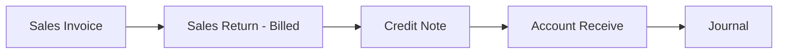
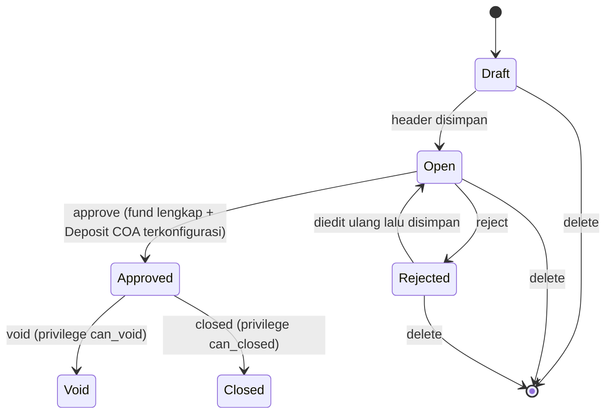
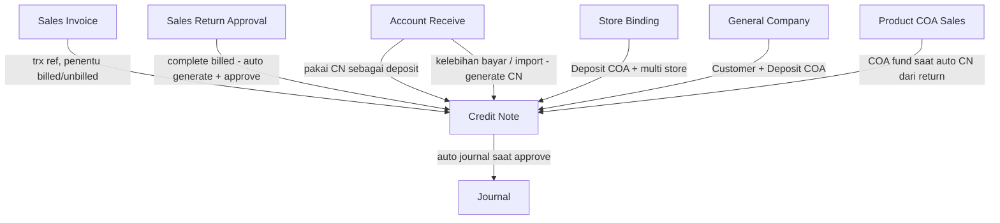

# Credit Note — Source of Truth

## 1. Ringkasan Eksekutif

Credit Note (CN) adalah dokumen akuntansi yang mencatat kredit atau kelebihan nilai kepada customer, yang kemudian bisa dipakai sebagai deposit saat customer melakukan pembayaran lewat Account Receive. Secara teknis CN bukan tabel terpisah — CN adalah spesialisasi dari entitas Payment (dibedakan lewat kolom type), mirip dengan Debit Note dan Customer Payment yang satu keluarga. CN bisa terbit lewat 3 jalur: dibuat manual oleh Finance, auto-generate saat Sales Return untuk invoice yang sudah dibayar (billed) di-complete, atau auto-generate dari proses import Account Receive yang mengandung kelebihan bayar. Audience utama menu ini: tim Finance/Accounting Receivable.



## 2. Prasyarat

| Prerequisite | Sumber | Catatan |
|---|---|---|
| Customer (General Company atau Store/Platform) sudah aktif dan setting COA-nya lengkap | Master General Company / Master Store | COA customer's Deposit wajib terisi — tanpa ini CN tidak bisa di-approve |
| Cash/Bank account aktif untuk currency yang akan dipakai | Master Cash Bank Account | Wajib untuk create CN manual — jika tidak ada, create ditolak |
| Currency aktif (kalau CN pakai foreign currency) dan primary currency company sudah di-set | Master Currency, Company Setting | Tanpa primary currency, proses import CN gagal |
| Fiscal period aktif untuk tanggal transaksi CN | Fiscal Period Setting | Berlaku untuk create, edit tanggal, maupun approve |
| Khusus CN auto dari Sales Return: Sales Invoice terkait sudah berstatus billed (sudah pernah dibayar sebagian/seluruhnya) dan Sales COA produk sudah dikonfigurasi | Sales Invoice, Product COA Group | Jika Sales COA belum diisi, proses Complete Sales Return gagal generate CN |

## 3. Siklus Status



| Status | Kondisi Transisi | Editable? | Tombol yang Muncul |
|---|---|---|---|
| Draft | Header baru dibuat, belum ada aksi lanjutan | Ya (header + fund) | Save, Delete |
| Open | Header tersimpan, siap diisi Receiving Destination dan diajukan approve | Ya (header + fund, kecuali field kritikal jika fund sudah ada) | Save, Delete, Approve, Reject (jika eligible) |
| Approved | Sudah di-approve, jurnal sudah terbit otomatis | Tidak (header dan fund read-only) | Void, Closed (sesuai privilege) |
| Rejected | Ditolak saat approval | Ya (header + fund) | Save, Delete, Approve ulang |
| Void | Dibatalkan setelah approved | Tidak | — |
| Closed | Ditutup manual setelah approved | Tidak | — |

Field kritikal (Customer, Currency, Exchange Rate, Transaction Date) terkunci untuk diedit begitu sudah ada baris Receiving Destination — harus clear semua detail dulu sebelum field ini bisa diubah.

## 4. Datalist

### 4.1 Kolom Datalist

| # | Kolom | Visible Default | Sumber Data | Keterangan |
|---|---|---|---|---|
| 1 | ID | Tidak | Internal identifier CN | — |
| 2 | Trx Date | Tidak | Tanggal transaksi CN | Kolom pendukung sort/filter backend, tampilan utama digabung di kolom Trx Code \| Trx Date |
| 3 | Trx Code \| Trx Date | Ya | Nomor transaksi CN dan tanggal transaksi | Kode CN berprefix CN, auto-generate jika dikosongkan saat create |
| 4 | Customer | Ya | Nama customer — General Company (is_customer) atau Store (Platform) | Dikelompokkan sebagai General vs Platform |
| 5 | Trx Ref | Ya | Nomor transaksi asal jika CN terbit dari transaksi lain (Sales Invoice untuk CN dari Sales Return, atau Account Receive untuk CN dari adjustment) | Kosong jika CN dibuat manual |
| 6 | Curr | Ya | Currency transaksi CN | — |
| 7 | Rate | Ya | Exchange rate transaksi CN | — |
| 8 | Total Amount | Ya | Total dari seluruh baris Receiving Destination (fund) | Lihat perhitungan di Bagian 6.1 |
| 9 | Paid | Ya | Total nilai CN yang sudah terpakai sebagai deposit di transaksi Account Receive yang sudah approved | Lihat Bagian 6.1 |
| 10 | Outstanding | Ya | Total Amount dikurangi Paid | Lihat Bagian 6.1 |
| 11 | Trx Status | Ya | Status transaksi CN | Nilai: Draft, Open, Approved, Rejected, Void, Closed (lihat GAP-CN-03) |
| 12 | Journal Code \| Journal Date | Ya | Nomor referensi dan tanggal Journal hasil approve CN | Kosong selama CN belum approved |
| 13 | Data Owner | Tidak | Company pemilik data | — |
| 14 | Created by \| Created at | Ya | User pembuat dan waktu pembuatan CN | — |
| 15 | Action | Ya | Show/Edit, Approve (dan Reject dalam modal yang sama), Delete, Print | Tombol tampil sesuai privilege dan status (lihat Bagian 3) |

### 4.2 Fitur Datalist

| Fitur | Keterangan |
|---|---|
| Global Search | Pencarian umum di datalist. `[VERIFY: CODEBASE]` field exact yang ter-cover (kemungkinan Trx Code, Customer, Description) |
| Advanced Filter | `[VERIFY: CODEBASE]` field apa saja yang bisa difilter (kemungkinan Trx Status, Customer, Currency, rentang tanggal) |
| Button Create | Redirect ke halaman create CN. Setelah create sukses, sistem redirect otomatis ke halaman edit (pola: isi header dulu, baru isi detail) |
| Auto Save Transaction (Create) | Create bisa mengambil default value terakhir (customer, currency, rate) lalu auto-submit sebagai header baru, mempercepat pembuatan CN berikutnya berdasarkan CN tersimpan terakhir |
| Show Deleted Data | Toggle untuk menampilkan data yang sudah soft-deleted bersama data aktif |
| Column Show/Hide | Tersedia untuk kustomisasi kolom yang tampil |
| Export | Mendukung export advanced dengan dan tanpa detail. `[VERIFY: CODEBASE]` daftar kolom exact tiap mode export |
| Import | Upload file Excel/CSV untuk create CN massal — lihat Bagian 6.5 untuk detail lengkap |

### 4.3 Import — Tab Import History & Error Log

| Tab | Kolom / Elemen | Keterangan |
|---|---|---|
| Import History | Global Search | Pencarian riwayat import |
| Import History | Column Show/Hide | — |
| Import History | Button Import | Untuk download template dan upload file import |
| Import History | Action | Aksi per baris riwayat import |
| Import History | File Name | Nama file yang diupload |
| Import History | Imported by \| Imported at | User dan waktu import |
| Import History | Status | Status proses import (processing / success / failed) |
| Import History | Total Failed Row | Jumlah baris gagal |
| Import History | Total Success Row | Jumlah baris berhasil |
| View Error Log | Row Number | Nomor baris di file Excel yang gagal diimport |
| View Error Log | Message | Alasan kegagalan baris tersebut |

## 5. Form & Field

### 5.1 Section Basic Information

| Field | Wajib? | Default | Sumber Opsi | Validasi | Catatan |
|---|---|---|---|---|---|
| Transaction Code | Tidak | Kosong (auto-generate berprefix CN jika kosong saat create) | — | Jika diisi manual: unique di seluruh transaksi Payment termasuk yang soft-deleted, maksimal 50 karakter | Tidak bisa diubah lagi setelah tersimpan (disabled di edit) |
| Transaction Date | Ya | Waktu saat ini | — | Wajib masuk fiscal period aktif; di form tidak boleh melebihi waktu saat ini, minimal mundur sekitar 6 bulan | — |
| Exchange Rate | Ya | 1 | — | Wajib lebih dari 0 | — |
| Transaction Currency | Ya | IDR (currency lokal/primer) | Master Currency aktif | Currency harus aktif dan tidak soft-deleted; company wajib punya Cash/Bank aktif untuk currency ini | — |
| Store | Tidak | Kosong | Master Store berstatus aktif | Bisa multi-select | Dipakai untuk keperluan reporting agar transaksi bisa difilter per store tertentu |
| Customer | Ya | — | Master General Company (is_customer, seluruh setting COA lengkap termasuk Deposit COA) atau Store (Platform, dengan Deposit COA store) | Company/Store harus berstatus aktif dan lengkap setting COA-nya | Dikelompokkan sebagai General (Company) vs Platform (Store) di pilihan |
| Reference Doc | Tidak | Kosong | — | Free text | Otomatis terisi jika CN terbit dari transaksi lain (Sales Return atau Account Receive) |
| Description | Tidak | Kosong | — | Maksimal 150 karakter | — |
| Select files to upload | Tidak | Kosong | — | Validasi ekstensi file mengikuti standar upload attachment OlshopERP | Untuk melampirkan data pendukung transaksi |

### 5.2 Section Receiving Destination

| Elemen | Keterangan |
|---|---|
| Field select cash/bank | Membuka modal berisi list Master Cash/Bank Account yang aktif |
| Kolom modal — Type | Menampilkan tipe akun: Cash atau Bank |
| Kolom modal — Label | Nama label dari master cash/bank |
| Kolom modal — Bank Name \| Acc Number | Muncul khusus untuk tipe Bank |
| Kolom modal — Balance | Saldo real-time akun, dihitung dari akumulasi journal approved yang menggunakan akun cash/bank ini |
| Tombol Use | Memasukkan akun terpilih ke baris detail Receiving Destination, lalu user input amount |
| Bulk Use | Bisa memilih banyak rekening sekaligus; baris yang masuk lewat bulk di-seed amount 0 dan wajib diisi manual sebelum approve (lihat GAP-CN-02) |
| Tabel detail fund | Kolom: GL Account, Bank Account/Name, Currency, Swift, Amount (inline edit), Memo |
| Footer — Total Funds | Total keseluruhan amount fund |
| Footer — Remaining | Total outstanding dari CN (lihat Bagian 6.3) |
| Setelah approved | Kolom Amount dan Memo menjadi read-only |

Validasi utama Receiving Destination:

| # | Kondisi | Behavior |
|---|---|---|
| 1 | Header sudah tidak editable (bukan status Draft/Open) | Tidak bisa tambah/ubah fund |
| 2 | Amount fund | Wajib lebih dari 0, kecuali baris hasil bulk use Cash/Bank yang boleh seed 0 sementara |
| 3 | Currency cash/bank | Harus sama dengan currency header CN |
| 4 | COA fund dalam 1 CN | Tidak boleh duplikat |

### 5.3 Section Detail Related Transaction

Menampilkan transaksi lain yang menyebabkan CN ini terbit, atau yang memakai CN ini sebagai deposit — read-only, tidak bisa diedit dari section ini.

| Kolom | Isi |
|---|---|
| Trx. Date | Tanggal transaksi terkait (misal Account Receive yang memakai CN) |
| Trx. Code | Kode transaksi terkait |
| Description | Deskripsi transaksi terkait |
| Amount | Nilai amount yang terkait dengan CN ini pada transaksi tersebut |

## 6. How It Works

### 6.1 Total Amount, Paid, dan Outstanding di Datalist

```
total_amount = SUM(seluruh baris Receiving Destination / fund)
paid         = SUM(nilai deposit CN yang dipakai di Account Receive berstatus Approved)
outstanding  = total_amount - paid
```

Contoh: CN dengan Total Amount Rp 5.000.000 sudah dipakai sebagai deposit di 1 Account Receive approved senilai Rp 2.000.000. Maka Paid = Rp 2.000.000 dan Outstanding = Rp 3.000.000.

### 6.2 Grand Total Credit Note

Setiap kali baris Receiving Destination ditambah, diubah, atau dihapus, sistem menghitung ulang:

```
grand_total = SUM(amount seluruh baris Receiving Destination)
```

### 6.3 Remaining Funds (Saldo CN yang Masih Bisa Dipakai)

```
basis           = grand_total (jika lebih dari 0, jika tidak pakai total fund)
remaining_funds = basis - nilai_dipakai_draft_open_AR - nilai_dipakai_approved_AR
```

Saat CN dipilih sebagai sumber deposit di Account Receive, sistem memvalidasi:

```
remaining_funds dikurangi amount_yang_diminta harus lebih dari sama dengan 0
amount_yang_diminta harus kurang dari sama dengan grand_total
```

Contoh: CN grand_total Rp 10.000.000, sudah dipakai di 1 AR draft senilai Rp 3.000.000. Remaining Funds = Rp 7.000.000. Jika user mencoba memakai CN ini di AR baru senilai Rp 8.000.000, sistem menolak karena melebihi remaining funds.

### 6.4 Amount Fund untuk Currency Asing

```
primary currency: amount            = fund_amount
foreign currency: amount            = fund_amount dikali exchange_rate
                   amount_foreign    = fund_amount
```

### 6.5 Import Credit Note

Template terdiri dari 8 kolom (urutan A sampai H): Trx Code (opsional), Trx Date (wajib), Customer Code (wajib), Store (opsional, maksimal 5, dipisah koma atau titik koma), Description (opsional, maksimal 150 karakter), GL Acc/COA (wajib), Amount (wajib, minimal 1), Memo (opsional, maksimal 150 karakter).

Strategi validasi bersifat all-or-nothing di tahap pembacaan file: jika ada satu saja baris error, seluruh proses import dibatalkan dan tidak ada CN yang terbentuk. Setelah lolos validasi, sistem membuat CN per grup Trx Code dengan status Open (bukan langsung approved), currency mengikuti primary currency, dan rate 1. Baris dengan Trx Code yang sama wajib konsisten nilainya untuk kolom tanggal, customer, description, dan store. Maksimal 100 baris fund per 1 header CN. Import hanya mendukung customer tipe General (Company) — customer tipe Platform (Store) dibuat lewat form create manual, bukan lewat import.

### 6.6 Auto-Generate Credit Note dari Sales Return (Billed)

Trigger: proses Complete/approve Sales Return untuk invoice yang sudah pernah dibayar sebagian atau seluruhnya.

Per baris detail return, nilai CN dihitung:

```
credit_note_amount = harga setelah diskon setelah PPN dikali total quantity return
```

Nilai ini dikelompokkan per Sales Invoice dan per Sales COA produk, lalu digenerate menjadi 1 CN per invoice dengan baris fund sebanyak jumlah Sales COA berbeda yang terlibat. CN yang terbit dari jalur ini otomatis berstatus Approved (langsung dengan jurnal), bukan Open seperti hasil import atau create manual.

Contoh: Sales Invoice senilai Rp 1.000.000 (sudah lunas), customer mengembalikan barang senilai Rp 200.000 dengan 1 Sales COA. Maka CN otomatis terbit sebesar Rp 200.000, langsung berstatus Approved, dengan Trx Ref merujuk ke Sales Invoice tersebut.

### 6.7 Auto Journal saat Approve

Setelah CN di-approve, sistem membentuk jurnal otomatis:

| Sisi | COA | Nilai |
|---|---|---|
| Debit | COA tiap baris fund (Cash/Bank untuk CN manual, atau Sales COA untuk CN auto dari return) | Amount fund |
| Kredit | Customer's Deposit COA (dari Company atau dari Store) | Total debit |

Khusus CN yang terbit dari Sales Return tipe Billed pada platform tertentu, posisi debit dan kredit ditukar (invert) untuk menyesuaikan arah jurnal retur billed.

### 6.8 Pemakaian Credit Note di Account Receive

Saat CN dipilih sebagai sumber dana di Customer Payment (Account Receive):

1. Nilai penggunaan dicatat sebagai deposit dengan referensi ke CN tersebut.
2. Selama Account Receive masih draft/open, nilai ini masuk hitungan "sedang dipakai belum final" — mengurangi remaining funds tapi belum permanen.
3. Setelah Account Receive di-approve, nilai berpindah menjadi "sudah terpakai final" — permanen mengurangi remaining funds CN.
4. Baris pemakaian ini yang muncul di Section Detail Related Transaction pada CN.

## 7. Validasi

### 7.1 Import

| # | Kondisi | Behavior | Error Message |
|---|---|---|---|
| 1 | File tidak diupload | Ditolak | File wajib diupload |
| 2 | Ekstensi bukan xlsx/xls/csv | Ditolak | Format file tidak sesuai |
| 3 | Import lain sedang berjalan untuk company yang sama | Ditolak | Please wait, other import is being process |
| 4 | Header template tidak sesuai | Ditolak seluruh file | The file format doesn't match the system template |
| 5 | File hanya berisi header tanpa baris data | Ditolak | File is empty |
| 6 | Primary currency company belum diset | Ditolak | Primary currency is not set |
| 7 | Trx Code diisi tapi sudah terpakai | Baris ditolak | Trx code already registered |
| 8 | Trx Date kosong, format salah, atau tanggal masa depan | Baris ditolak | Trx Date is required / Invalid format date / cannot be in the future |
| 9 | Customer Code kosong atau tidak ditemukan | Baris ditolak | Customer Code is required / Customer not found |
| 10 | Customer Code ditemukan tapi berdasarkan nama, bukan kode | Baris ditolak | Please insert using code customer |
| 11 | Customer berstatus inactive | Baris ditolak | Customer is inactive |
| 12 | COA customer belum lengkap ter-mapping | Baris ditolak | Incomplete COA setting for customer |
| 13 | Store duplikat atau lebih dari 5 | Baris ditolak | Duplicate store names / Max 5 store names |
| 14 | Store tidak terdaftar, sudah dihapus, atau inactive | Baris ditolak | Store is not registered / Store is deleted / Store is inactive |
| 15 | Store COA (coa_id, deposit_coa_id, cash_bank_account_id) belum lengkap | Baris ditolak | COA setting is incomplete |
| 16 | Description melebihi 150 karakter | Baris ditolak | Description must be at most 150 characters |
| 17 | GL Acc (COA) kosong, tidak ditemukan, atau tidak terdaftar di Master Cash/Bank | Baris ditolak | GL Acc (COA) is required / COA code not found / not registered in Master Cash/Bank |
| 18 | Amount kosong, bukan angka, atau kurang dari 1 | Baris ditolak | Amount is required / must be a number / must be at least 1 |
| 19 | Memo melebihi 150 karakter | Baris ditolak | Memo must be at most 150 characters |
| 20 | COA fund duplikat dalam 1 header (Trx Code sama) | Baris ditolak | Duplicate COA code in the same header |
| 21 | Baris dengan Trx Code sama tapi data header tidak konsisten | Baris ditolak | ...must be consistent for the same Trx Code |
| 22 | Lebih dari 100 baris fund dalam 1 header | Baris ditolak | exceeds the limit of 100 |

Strategi: seluruh validasi di atas bersifat all-or-nothing — satu error di mana pun membatalkan seluruh proses import untuk file tersebut.

### 7.2 Create Header

| # | Kondisi | Behavior | Error Message |
|---|---|---|---|
| 1 | Company tidak punya Cash/Bank aktif untuk currency yang dipilih | Ditolak | Cannot create transaction. Please set up a cash/bank account for this currency first |
| 2 | Transaction Code diisi manual tapi sudah dipakai transaksi Payment lain | Ditolak | The code has already been transacted in another form |
| 3 | Tanggal transaksi di luar fiscal period aktif | Ditolak | Pesan fiscal period standar |
| 4 | Currency tidak ditemukan atau sudah dihapus | Ditolak | Currency not found / removed from the master currency |
| 5 | Exchange Rate kurang dari sama dengan 0 | Ditolak | Exchange Rate must be greater than 0 |
| 6 | Customer (actor) kosong | Ditolak | The customer field is required |

### 7.3 Edit Header dan Receiving Destination

| # | Kondisi | Behavior | Error Message |
|---|---|---|---|
| 1 | Status CN sudah bukan Draft/Open | Ditolak | Already approved, you can't modify |
| 2 | Field kritikal (Customer, Currency, Exchange Rate, Transaction Date) diubah padahal sudah ada baris fund | Ditolak | Cannot edit Header when detail data exists. Please clear all details first |
| 3 | Company tidak punya Cash/Bank aktif untuk currency baru | Ditolak | Cannot update, set up a cash/bank account |
| 4 | Amount fund kurang dari sama dengan 0 (kecuali seed awal bulk use) | Ditolak | Amount must be greater than 0 |
| 5 | Currency cash/bank tidak sama dengan currency header CN | Ditolak | Currency does not match |
| 6 | COA fund duplikat dalam CN yang sama | Ditolak | Duplicate Cash/Bank |

### 7.4 Delete

| # | Kondisi | Behavior |
|---|---|---|
| 1 | Status CN Draft, Open, atau Rejected | Boleh dihapus |
| 2 | Status CN selain di atas (Approved, Void, Closed) | Tidak bisa dihapus |
| 3 | Baris fund pada header yang masih editable | Boleh dihapus |

### 7.5 Approve / Reject

| # | Kondisi | Behavior | Error Message |
|---|---|---|---|
| 1 | Status CN sudah bukan Open | Ditolak | Already Approved, You Can't Modify |
| 2 | Sedang ada proses approve lain berjalan untuk CN ini (lock sekitar 30 detik) | Ditolak sementara | Approval process is in progress |
| 3 | Sedang ada proses import receive terkait yang berjalan | Ditolak sementara | Updating process is in progress |
| 4 | Tanggal transaksi CN di luar fiscal period aktif | Ditolak | Pesan fiscal period standar |
| 5 | Tidak ada baris Receiving Destination sama sekali | Ditolak | Payment doesn't have any fund source/destination data |
| 6 | Ada baris fund dengan amount kurang dari sama dengan 0 | Ditolak | All amount must be greater than 0 |
| 7 | Customer's Deposit COA (Company atau Store) belum dikonfigurasi | Ditolak | Please configure Customer's Deposit COA |

Tidak ada pengecekan balance detail-vs-source seperti di Account Receive — untuk CN cukup fund lines valid dan Deposit COA terkonfigurasi.

## 8. Relasi Menu Lain



| Menu | Peran dalam Relasi |
|---|---|
| Sales Invoice | Sering menjadi transaction reference CN; penentu apakah return bersifat billed (menghasilkan CN) atau unbilled (tidak) |
| Sales Return Approval | Titik Complete/Approve Finance yang men-trigger auto-generate dan auto-approve CN untuk kasus billed |
| Account Receive | Konsumen utama saldo CN sebagai sumber deposit; juga bisa menjadi sumber generate CN baru dari kelebihan bayar/import |
| Journal | Setiap CN approved menghasilkan jurnal otomatis; datalist CN menampilkan link ke journal terkait |
| Store Binding | Menyediakan Deposit COA dan opsi multi-store untuk customer tipe Platform |
| General Company | Menyediakan data customer tipe General beserta Deposit COA-nya |
| Product COA Sales | Menyediakan COA fund saat CN terbit otomatis dari Sales Return |

## 9. Gap Registry

| ID | Deskripsi | Dampak | Status |
|---|---|---|---|
| GAP-CN-01 | Requirement mentah menyebutkan aksi Print di kolom Action datalist, namun tidak ditemukan spesifikasi format/template printout untuk Credit Note di manapun (analisa codebase maupun requirement) | QA tidak bisa menyusun test case untuk fitur Print tanpa spesifikasi format; perlu konfirmasi apakah fitur ini sudah ada atau baru direncanakan | Open |
| GAP-CN-02 | Bulk Cash/Bank pada Receiving Destination men-seed amount menjadi 0 (balance check dilewati) dan mengandalkan user mengedit manual sebelum approve, tanpa requirement eksplisit soal warning/reminder di UI | Risiko user berulang kali gagal approve karena lupa mengisi amount, tanpa guidance yang jelas di layar | Open |
| GAP-CN-03 | Requirement mentah dari user hanya menyebut 3 nilai Trx Status (Draft, Open, Reject/Approved), sedangkan hasil analisa codebase menunjukkan CN juga memiliki status Void dan Closed mengikuti siklus Payment | Perlu keputusan apakah kedua status tambahan ini juga wajib tampil di kolom dan filter Trx Status pada datalist versi requirement final | Open |
| GAP-CN-04 | Validasi penghapusan Credit Note yang sudah pernah dipakai/direferensikan sebagai deposit di Account Receive disebut "ada validasi khusus" tanpa rule dan pesan error yang terdokumentasi jelas | Risiko data balance rusak (remaining funds tidak konsisten) jika validasi ini tidak benar-benar mem-block di semua kondisi | Open |

## 10. FAQ

**Q: Kenapa Credit Note saya tidak bisa di-approve padahal sudah ada baris Receiving Destination?**
A: Kemungkinan besar Customer's Deposit COA belum diisi di setting customer (Company atau Store) yang dipakai. Deposit COA ini wajib ada sebelum CN bisa di-approve.

**Q: Kenapa amount di baris hasil bulk add cash/bank menampilkan 0?**
A: Bulk add memang sengaja mengisi amount 0 dulu — kamu wajib edit manual amount masing-masing baris sebelum mencoba approve.

**Q: Apa bedanya Credit Note yang dibuat manual dengan yang muncul otomatis?**
A: CN manual dibuat langsung oleh Finance dan berstatus Open (perlu approve manual). CN dari Sales Return billed langsung otomatis approved beserta jurnalnya. CN dari import Account Receive mengikuti hasil proses import terkait.

**Q: Kenapa customer tertentu tidak muncul di pilihan Customer saat create CN?**
A: Customer harus berstatus aktif dan seluruh setting COA-nya (termasuk Deposit COA) sudah lengkap. Kalau ada yang kurang, customer itu tidak akan muncul di pilihan.

**Q: Apa arti kolom Paid dan Outstanding di datalist?**
A: Paid adalah total nilai CN yang sudah benar-benar terpakai di Account Receive yang sudah approved. Outstanding adalah sisa Total Amount CN dikurangi Paid — inilah sisa saldo yang masih bisa dipakai.

**Q: Kenapa saya tidak bisa mengubah Customer atau Currency di CN yang sedang saya edit?**
A: Field ini terkunci begitu sudah ada baris Receiving Destination. Hapus dulu semua baris fund kalau memang perlu ganti customer atau currency.

**Q: Kenapa Credit Note saya tidak bisa dihapus?**
A: Delete hanya bisa dilakukan selama status masih Draft, Open, atau Rejected. Setelah Approved, Void, atau Closed, CN tidak bisa dihapus lagi.

## 11. Changelog

| Tanggal | Versi | Perubahan |
|---|---|---|
| 17 Juli 2026 | 1.0 | Draft awal source-of-truth Credit Note, disusun dari requirement mentah user dan analisa codebase (backend `olshoperp` + frontend `olshoperp-frontend`) |

---

## 12. Knowledge Base Hints (untuk operator)

**Istilah teknis ke padanan awam:**

| Istilah Teknis | Padanan Awam |
|---|---|
| grand_total | Total Amount Credit Note |
| remaining_funds | Sisa saldo CN yang masih bisa dipakai |
| prepared_to_use_amount | Nilai CN yang sedang dipakai di transaksi lain tapi belum final |
| processed_to_use_amount | Nilai CN yang sudah benar-benar terpakai (transaksi lain sudah approved) |
| Customer's Deposit COA | Akun akuntansi tempat saldo kredit customer dicatat |
| actor_reference (Customer) | Pemilik/penerima Credit Note — bisa berupa Company atau Store |
| invert_journal | Jurnal yang posisi debit-kreditnya ditukar untuk kasus tertentu (return billed platform) |
| type General vs Platform | General = customer perusahaan biasa; Platform = customer berupa toko/store di marketplace |
| Trx Ref | Nomor transaksi asal yang menyebabkan CN ini terbit |

**Skenario troubleshooting:**

| Gejala | Kemungkinan Penyebab | Solusi |
|---|---|---|
| Approve gagal terus, tidak ada pesan jelas kenapa | Deposit COA customer belum diisi | Cek dan lengkapi setting COA customer terlebih dulu |
| Amount di tabel fund tetap 0 walau sudah pilih rekening lewat bulk | Bulk use memang seed 0 by design | Edit manual tiap baris amount sebelum approve |
| Tidak bisa ubah tanggal transaksi di CN yang sedang diedit | Sudah ada baris fund tersimpan | Hapus dulu semua baris Receiving Destination |
| Import gagal semua padahal cuma 1 baris yang salah | Sistem import bersifat all-or-nothing | Perbaiki baris yang error di Excel, upload ulang seluruh file |
| Customer tidak muncul di pilihan saat create CN | Customer belum aktif atau COA belum lengkap | Lengkapi setting customer di Master General Company/Store |

**Field yang tidak relevan untuk operator (skip di KB):**
ID (internal identifier), Trx Date sebagai kolom hidden terpisah (hanya untuk sort/filter backend), Data Owner (company context internal).

---

## 13. Technical Hints (untuk developer)

**Area codebase yang perlu didokumentasikan:**
- Entity CreditNote (spesialisasi dari entity Payment, dibedakan lewat kolom type)
- Scope khusus yang memfilter data Payment menjadi Credit Note saja
- Controller utama Credit Note beserta controller shared Payment yang di-delegate
- Controller detail fund Credit Note dan controller shared detail fund Payment
- Helper/service proses jurnal otomatis saat approve (creditNoteAutoJournal)
- Helper/service auto-generate CN dari proses Sales Return
- Job auto-generate CN dari proses import Account Receive
- Class import Credit Note beserta log history dan log error per baris
- Komponen frontend: DataList, Form shell, Header (Basic Information), Destination (Receiving Destination), Related Transaction, Approval dialog/eligibility

**Invariants:**
- total_amount (list) sama dengan grand_total (fund) sama dengan jumlah seluruh baris Receiving Destination
- outstanding sama dengan total_amount dikurangi paid
- remaining_funds sama dengan grand_total dikurangi nilai_dipakai_draft_open dikurangi nilai_dipakai_approved, dan hasilnya harus lebih dari sama dengan 0
- Approve hanya boleh terjadi jika minimal 1 baris fund ada dan seluruh amount fund lebih dari 0
- Deposit COA (Company atau Store) wajib tidak kosong sebelum jurnal approve terbentuk
- Field kritikal header (Customer, Currency, Exchange Rate, Transaction Date) tidak boleh berubah selama masih ada baris fund tersimpan

**Failure modes:**
- Approve gagal karena Deposit COA kosong → tidak ada jurnal parsial yang terbentuk, seluruh proses approve dibatalkan (rollback)
- Import dengan satu baris error → seluruh file dibatalkan, tidak ada CN yang terbentuk sama sekali (all-or-nothing)
- Dua user mencoba approve CN yang sama bersamaan → dicegah lewat lock sementara sekitar 30 detik, percobaan kedua ditolak dengan pesan proses sedang berjalan
- Approve dicoba saat proses import receive terkait masih berjalan → ditolak sementara sampai proses tersebut selesai

**Data lifecycle lintas dokumen:**
- Sales Invoice menyimpan penanda nilai yang sudah disiapkan dan yang sudah diproses menjadi Credit Note (prepared/processed to amount credit note) — nilai ini bergerak saat Sales Return billed men-generate CN
- Credit Note sendiri menyimpan penanda nilai yang sedang dipakai (belum final) dan yang sudah terpakai final di Account Receive — bergerak sesuai status Account Receive terkait berubah dari draft/open menjadi approved

---

## 14. Referensi Struktur untuk Cursor

```
Section 1-11 → material utama untuk requirement.md
Section 5, 6, 7, 10 → adaptasi ke knowledge-base.md dengan tone awam (lihat Section 12 KB Hints)
Section 13 Technical Hints → seed untuk technical.md, dilengkapi Cursor dari codebase
Frontmatter YAML di atas → copy ke 3 file utama, sinkronkan version + last_updated
Golden reference tone & struktur: docs/qa-docs/accounting-supplier-invoice/
```
