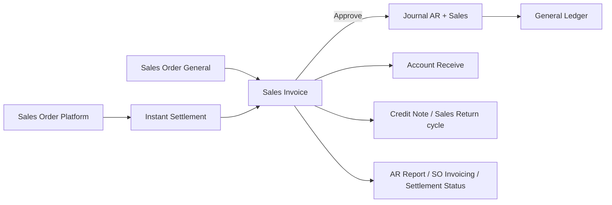
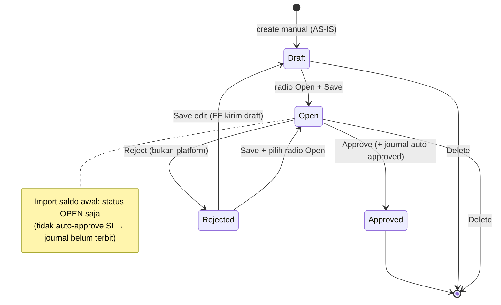
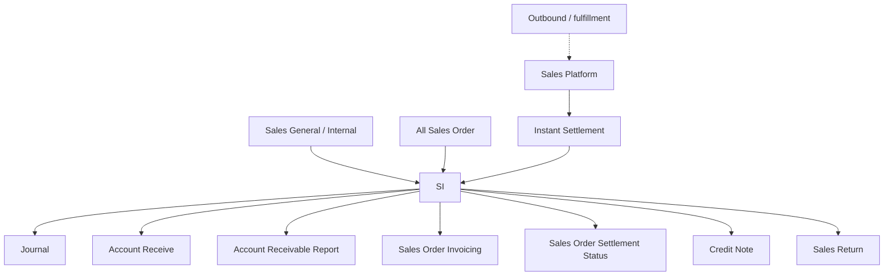

# Sales Invoice — Source of Truth

## 1. Ringkasan Eksekutif

**Sales Invoice (SI)** adalah dokumen Accounting untuk **menagih pelanggan** dari Sales Order (General / Internal) atau dari **Instant Settlement** (platform). Prefix kode **SI**. Setelah **Approved**, sistem menaikkan qty SO yang sudah di-invoice, membentuk **journal** piutang + penjualan (+ VAT / other cost / other discount), lalu SI masuk outstanding **Account Receive**.

Manual create hanya untuk **customer General** (dari Sales Order General approved). SI platform biasanya **auto-approved** dari Instant Settlement dan **show-only** (tidak reject / delete dari UI normal).



## 2. Prasyarat

| Prerequisite | Sumber | Catatan |
|--------------|--------|---------|
| Privilege Sales Invoice (view/create/update/delete/approval) | Gate | Policy `CustomerInvoice` · menu_link `accounting/customer-invoice` |
| Fiscal period **active** untuk Transaction Date | Fiscal Period | Blok store / update date / approve / auto-save |
| Primary currency company ter-set (biasanya IDR) | Currency / Company | Rate dipaksa **1** jika currency = primary |
| Customer General: Company `recognize as customer`, AR COA lengkap, ada SO General **Approved/Processed** outstanding | General Company + SO | Opsi Customer di create manual |
| Customer Platform / Store: AR COA di Store | Store | SI dari Instant Settlement; create manual **tidak** untuk platform order |
| Product COA Group **Sales** + Sales VAT Settings (tax sales COA) | Product / Tax | Wajib agar journal approve sukses |
| Master Other Cost / Other Discount **active** | Omni master | Opsional di header SI |
| Import: SO type **General** saja, status Approved/Processed, belum pernah di-invoice (non-void) | ETM-14976 | Platform order ditolak |

## 3. Siklus Status



| Status | Arti | Editable? | Action baris (privilege-aware) |
|--------|------|-----------|--------------------------------|
| **draft** | Header tersimpan; belum siap approve | Ya | Edit, Delete, Print. Approve/Reject **tidak** |
| **open** | Siap approve (syarat minimal untuk approval) | Ya | Edit, Delete, Print, Approve, Reject |
| **approved** | Terkunci; journal terbentuk (auto-approved); outstanding AR | Tidak (show) | Show, Print — tanpa Delete / Approve / Reject |
| **rejected** | Ditolak. **Save edit** → status jadi **draft** (FE set radio ke draft). Tidak terbit journal | Ya | Edit, Delete, Print |
| **void** / **closed** / **processed** / **complete** | Ada di badge datalist | Khusus | Platform / settlement / lifecycle lanjut — lihat §6 |

**Platform SI:** reject & delete diblokir pesan *cannot be rejected/deleted because it is from the platform*.

**GAP-SI-01:** Requirement user: create new **langsung Open**. Codebase create (FE tidak kirim `transaction_status`) → backend default **draft**. Lihat Gap Registry.

## 4. Datalist

**Route:** `/accounting/customer-invoice` · Staging: https://staging.olshoperp.com/accounting/customer-invoice  
**Create:** `/accounting/customer-invoice/create`

### 4.1 Kolom (visible default)

| # | Kolom UI | Visible default | Sumber / hitung |
|---|----------|-----------------|-----------------|
| — | TRX. DATE (sort helper) | **false** | `transaction_date` untuk sort |
| 1 | **Trx. Code / Trx.Date** | **true** | Kode SI + tanggal; link edit |
| 2 | **CUSTOMER** | true | Nama customer (Company) atau store |
| 3 | **Your Ref.** | true | `customer_reference_document` |
| 4 | **TRX. REF.** | true | Referensi transaksi (SO / settlement text + URL) |
| 5 | **Instant Settlement** | **false** | Link/kode settlement jika SI dari Instant Settlement |
| 6 | **PLATFORM ORDER** | true | Platform order ID terkait |
| 7 | **CURR.** | true | Kode currency header |
| 8 | **EXCHANGE** | true | `exchange_rate` |
| 9 | **Total Product** | true | Total produk after discount **including VAT** (tooltip FE) |
| 10 | **TOTAL OTHER COST** | true | Sum Other Cost header |
| 11 | **TOTAL OTHER DISCOUNT** | true | Sum Other Discount header |
| 12 | **TOTAL** | **false** | Grand total before VAT |
| 13 | **Net Sales** | true | Grand total after VAT (= piutang kotor sebelum alokasi) |
| 14 | **TRX. STATUS** | true | Badge status |
| 15 | **Description** | **false** | Deskripsi header |
| 16 | **Created by / Created at** | true (kolom standar datatable) | Audit create |
| 17 | **Action** | true | §4.3 |

SearchBuilder kolom tambahan: Instant Settlement, Description, owner company, created by/at (index di FE `seachBuilderColumn`).

### 4.2 Toolbar

| Fitur | Keterangan |
|-------|------------|
| Global Search | Pencarian datatable (pola DataTablesV3) |
| Advanced Filter | SearchBuilder multi-kondisi; tipe: string / num / moment date; operator equals/contains sesuai `target_equals` / `target_contains` |
| **Create** | Ke `/create` — auto-save dari last saved (§6.1) |
| Show deleted | Soft-deleted SI |
| Column show/hide | Ya — default visible §4.1 |
| Export advanced | **Without detail** = header saja · **With detail** = hingga baris produk/SKU · Active page — job async |
| Import | Template 3 kolom + upload XLSX · progress · import log/history — §6.5 · [ETM-14976](https://erpintegration.atlassian.net/browse/ETM-14976) |

### 4.3 Action per baris

| Action | Muncul jika |
|--------|-------------|
| Edit | Belum approved (draft/open/rejected) |
| Show | Sudah approved (atau view-only platform) |
| Delete | Belum approved **dan** bukan platform SI |
| Print | Semua status |
| Approve / Reject | Status **open** (+ privilege approval); Reject diblokir untuk platform |

## 5. Form & Field

### 5.1 Basic Information

| Field | Required | Default / behavior | Catatan |
|-------|----------|--------------------|---------|
| Transaction Code | Auto | Prefix **SI** | Nullable manual max 50; unik jika diisi |
| Transaction Date | Ya | **NOW** | Validasi fiscal period; gagal → auto-save gagal |
| Due Date | Tidak | = Transaction Date jika kosong; editable | **Tanpa** validasi fiscal |
| Transaction Currency | Ya | Primary (IDR) | Dari last saved jika auto-save |
| Exchange Rate | Ya | **1**; disabled jika primary | Tidak boleh kosong/0; primary harus 1 (*Invalid rate*) |
| Customer | Ya (manual) | Dari last saved jika ada | Hanya General Company as customer + AR COA + SO outstanding. Platform: terisi otomatis dari store, show-only |
| Current Account Receivable COA | Disabled | Auto dari customer/store | General → Company **Account Receivable COA**; Store → Store AR COA |
| Customer Reference Document (Your Ref) | Tidak | null | Referensi bebas untuk customer |
| Term and Condition | Tidak | null | Max 2000 |
| Description | Tidak | null | Max 150 |
| Transaction Status | Draft/Open | **AS-IS create = draft** | Radio Draft/Open di form; approve butuh Open |
| Attachment | Tidak | — | Validasi ekstensi file |

Setelah ada **detail**, terkunci: Customer, Currency, Rate, Transaction Date, Due Date (harus clear detail dulu untuk ubah).

### 5.2 Sales Invoice Detail (Item Configuration)

| Elemen | Behavior |
|--------|----------|
| Select Product | SKU dari SO detail **Approved/Processed** yang masih outstanding invoice |
| Outstanding Sales Order | Modal list outstanding; filter by SO number internal (**bukan** platform order code) |
| Bundle | Yang tampil = **header bundle** saja (bukan child BOM di outstanding) |
| Partial invoice | **Per SKU / line:** 1 SO bisa multi SI; Use mengambil **seluruh remaining qty** line itu. UI with-SO: qty **disabled** (tidak edit partial qty). Contoh user: 2 SKU × 10 pcs → boleh invoice SKU-A full 10 dulu, SKU-B di SI berikutnya |
| Invoice Progress | Prepared = qty di SI draft/open lain; Processed = qty di SI **approved** |

**Outstanding — Detail view (kolom):** SO Code/Date · Product SKU/Name · SO Qty · Unit · Unit Price (harga input user / as-is SO, bukan “before VAT” di UI) · Discount · VAT · Total Price · Invoice Progress · (hidden: Product Name only, Category, Store, SO Description, Total Price IDR, Already Prepared).

**Outstanding — Group view (kolom):** TRX. DATE (hidden) · TRX. CODE · SO CUSTOMER · Store Name (hidden) · DESCRIPTION · TRX. REFF. — POV per Sales Order yang masih ada SKU belum penuh di-invoice; aksi create-group menambah semua outstanding line SO ke SI.

**Detail SI (setelah Use) — ringkas:** SO Code/Date · SKU/Name · Bundle · QTY · Unit · PRICE (editable; tippy: nilai dipakai journal revenue) · Discount · VAT cols · totals · SO exchange/totals (sebagian hidden).

### 5.3 Additional Cost / Additional Discount

| | Additional Cost | Additional Discount |
|--|-----------------|---------------------|
| Master source | Other Cost **active** | Other Discount **active** |
| Fields | Cost + Price + Description → Save ke table | Sama pola |
| COA di table | Dari master; **tetap editable** | Dari master; editable |
| Masuk Net Sales | Ya | Ya |
| Masuk basis PPN produk | **Tidak** | **Tidak** |

### 5.4 Totals (Summary)

| Label UI | Arti |
|----------|------|
| Total Products | Akumulasi unit price before VAT × qty (semua detail) |
| Disc Products | Akumulasi discount per item |
| Total VAT | Akumulasi VAT detail |
| Total Other Cost | Sum Additional Cost (di luar PPN produk) |
| Total Other Discount | Sum Additional Discount (di luar PPN produk) |
| **Net Sales** | Total Products − Disc Products + Total VAT + Other Cost − Other Discount |

### 5.5 Approval & Audit

- **Approval:** log multi-level + eligibility matrix (privilege).
- **Audit Log:** setiap perubahan end-user tercatat.

## 6. How It Works

### 6.1 Auto-save create

1. User klik Create → `/create`.
2. FE panggil default values: **customer_id, currency_id, exchange_rate** dari SI terakhir yang tersimpan.
3. Set Transaction Date = NOW; Due Date kosong (BE isi = trx date); lalu **submit** create.
4. Jika belum pernah ada last saved / field required masih kosong / fiscal period invalid → auto-save gagal; user isi manual dulu.
5. Sukses → redirect ke `/edit/{id}`.

### 6.2 Manual General — happy path

1. Header tersimpan (AS-IS **draft**).
2. Pilih Outstanding SO (detail atau group) → baris masuk SI; `prepared_to_invoice_quantity` SO naik.
3. Opsional Other Cost / Discount.
4. Set status **Open** + Save (jika masih draft).
5. **Approve** → validasi fiscal, minimal 1 detail, qty prepared cukup, AR COA & Sales COA & Tax COA.
6. `processed_to_invoice_quantity` naik; `prepared` turun; journal auto **Approved**; muncul di GL dengan tanggal = tanggal SI.
7. Bayar di **Account Receive**.

### 6.3 Journal on Approve (aturan COA)

| Sisi | COA | Amount |
|------|-----|--------|
| Debit (biasanya) | **Account Receivable** — Company (general) atau Store (platform) | Net = sum kredit − other discount |
| Credit | **Sales** dari Product COA Group per SKU | Amount **before VAT** (local) |
| Credit | **VAT/PPN** dari master Tax (Sales VAT Settings / sales COA tax) | Nilai VAT |
| Credit | Other Cost COA | Amount other cost |
| Debit | Other Discount COA | Amount other discount |

Journal description: *Auto-Journal from {SI code}* + refer SO / platform order / customer.  
`autoApprove = true` pada approve normal → journal langsung **approved**.

### 6.4 Platform / Instant Settlement

- SI dibuat sistem dari settlement; sering auto-approved.
- Manual create dari datalist **tidak** untuk order platform.
- Reject/Delete platform diblokir.
- Kolom Instant Settlement di datalist (default hidden).

### 6.5 Import (saldo awal) — ETM-14976 + kode

**Template (3 kolom):** Transaction Date · Order Number · Platform Order ID  
Contoh file user: `Template Import Sales Invoice (1).xlsx`.

| Rule | Behavior AS-IS |
|------|----------------|
| File | FE filter **.XLSX**; BE validate extensions xlsx/xls/csv |
| Header mismatch | *The file format doesn't match the system template.* |
| Date required | Format DD-MM-YYYY (juga terima numeric Excel / yyyy-mm-dd); empty → error |
| Order Number **atau** Platform Order ID | Wajib **salah satu**; keduanya kosong / keduanya terisi → error |
| Duplikat dalam file | Ditolak |
| SO harus ada, owned company, Approved/Processed | Else error spesifik |
| Hanya **Sales Order General** | Platform: *Sales Order is owned by Sales Platform. Only internal orders are allowed.* (komentar QA: kadang tampil *Sales Order not found*) |
| Belum pernah di-invoice (ref non-void) | *already been invoiced* |
| Trx date ≥ SO date | Else error |
| 1 row = 1 SI | Semua outstanding line SO di-Use |
| Status setelah import | **OPEN** (berhenti di sini — **tidak** auto-approve SI) |
| Journal dari import | **Intent locked (Yemima):** journal **belum terbit** dari proses import; journal baru terbit saat SI di-**Approve** manual. Catatan kode: job masih memanggil `customerInvoiceAutoJournal(..., false)` — lihat GAP-SI-02 |
| Partial success | **Tidak** — 1 baris invalid → import failed all + log |
| Limit | ~5.000 baris (uji QA ~2.916) |

### 6.6 Contoh case (dari user)

**Partial per SKU (bukan per qty):**  
SO-001: SKU-A 10 pcs, SKU-B 10 pcs. User buat SI-1 hanya Use SKU-A → qty SI = 10 (tidak bisa 5). SKU-B tetap outstanding untuk SI-2. Prepared/Processed di Invoice Progress mengikuti SI lain.

**Unit Price UI vs before VAT:** User input 10.000 VAT included → kolom Unit Price outstanding tetap 10.000; before VAT disimpan di backend untuk kalkulasi & journal.

**Rejected → edit:** Status rejected; buka form → radio tampil **draft**; Save → tersimpan draft (siap Open lagi).

## 7. Validasi (pesan inti dari kode)

| Kondisi | Behavior / pesan |
|---------|------------------|
| Fiscal period invalid | Blok write/approve (pesan fiscal standard) |
| Customer inactive | *The selected customer is inactive…* |
| Currency missing / deleted | *Currency not found* / *removed from the master currency* |
| Primary rate ≠ 1 | *Invalid rate* |
| Code duplikat | *The code has already been transacted in another form.* |
| Update setelah approved | Tidak boleh (kecuali alur khusus) |
| Ubah customer/currency/date setelah ada detail | *…already has detail data* |
| Approve tanpa detail | ERR_NO_DETAIL_MSG |
| Qty prepared kurang | *Cannot approve invoice. SKU … has insufficient invoicable quantity.* |
| AR COA belum set | *Please Configure Company/Store "Account Receivable COA" in: {name}* |
| Sales COA produk kosong | *Please Configure "Sales COA" for this Product: {sku}* |
| Tax sales COA kosong | *Please Configure "Sales COA" for Tax Sales Order* |
| Reject platform | *This invoice data cannot be rejected because it is from the platform* |
| Delete platform | *cannot be deleted because it is from the platform* |
| Import header salah | Template mismatch |
| Import SO platform | *Only internal orders are allowed* |

## 8. Relasi Menu Lain



| Menu | Relasi |
|------|--------|
| Sales Platform / General / All SO | Sumber order & outstanding qty |
| Outbound | Hulu fulfillment order (konteks shipping sebelum settle/invoice platform) |
| Instant Settlement | Generate SI platform + Difference Settlement-SI |
| Account Receive | Alokasi bayar ke SI approved |
| Credit Note / Sales Return | Koreksi / retur siklus AR pasca SI |
| Account Receivable (report) | Laporan piutang dari SI |
| Sales Order Invoicing | Progress invoicing SO |
| Sales Order Settlement Status | Status settle vs invoice platform |
| Journal / GL / P&L / BS | Konsumen journal SI |
| Fiscal Period / Currency / Product COA / Tax / Other Cost-Discount | Master pendukung |

## 9. Gap Registry

| ID | Deskripsi | Type | Dampak | Status |
|----|-----------|------|--------|--------|
| GAP-SI-01 | **Requirement:** create new default status **Open**. **Codebase:** FE create tidak kirim `transaction_status` → BE default **draft** (`CustomerInvoiceController@store`, `Form.vue` create). | Contradiction | User harus klik Open sebelum Approve | **Pending** (biarkan di pending items) |
| GAP-SI-02 | **Intent locked (Yemima 2026-08-24):** Import SI → status **Open** saja; **tidak** auto-approve → **journal belum terbit** dari import; journal terbit saat Approve SI. **Codebase:** `CustomerInvoiceImportJob` masih memanggil `JournalProcess::customerInvoiceAutoJournal($si, false, 'Initial Balance')` (membuat journal status Open, tanpa auto-approve). Jika “belum terbit” = **nol journal sama sekali** sampai Approve SI → ini Contradiction (bug/TO-BE hapus call). Jika “belum terbit” = journal boleh ada tapi **belum Approved / belum ke GL approved** → AS-IS cocok intent. | Contradiction / Clarify residual | Import vs Journal/GL | **Intent locked**; residual kode Open journal — **Pending confirm Yemima** (lihat pertanyaan di bawah) |
| GAP-SI-03 | Upload BE allow csv/xls; FE accept terutama xlsx. Pesan FE vs *File format is not supported.* | Minor | UX import | Open |
| GAP-SI-04 | Docs QA folder `accounting-customer-invoice` masih **draft**; sync setelah SOT di-acc | Missing Doc sync | Split 5-file | Open |
| GAP-SI-05 | String error currency di satu path update masih menyebut “purchase order” (analisis SI-02) | Bug candidate | Pesan user membingungkan | Open |

## 10. FAQ

**Q: Kenapa tidak bisa Approve dari Draft?**  
A: Approval butuh status minimal **Open**.

**Q: Boleh invoice sebagian qty satu SKU?**  
A: Dari Outstanding Use — **tidak**; qty line diambil full remaining. Partial antar SI = pilih SKU berbeda / sisa line lain.

**Q: Platform order bisa di-import?**  
A: Tidak. Hanya Sales Order General/internal.

**Q: Setelah Approve, journal sudah approved?**  
A: Ya (approve normal). Import: SI berhenti di Open; journal **belum terbit** dari import (intent) — baru setelah Approve SI.

**Q: Customer manual dari mana?**  
A: General Company as customer + AR COA + ada SO general outstanding — bukan store platform.

## 11. Changelog

| Date | Changes |
|------|---------|
| 2026-08-24 | SOT v1.0 — raw Yemima + analisis AS-IS + ETM-14976 (desc+comments) + template import + verifikasi FE/BE |
| 2026-08-24 | Lock GAP-SI-02 intent: import → Open only, journal belum terbit; GAP-SI-01 tetap Pending |

## 12. Knowledge Base Hints

| Istilah teknis | Bahasa awam |
|----------------|-------------|
| prepared_to_invoice_quantity | Qty sudah masuk SI belum approved |
| processed_to_invoice_quantity | Qty sudah di SI approved |
| Net Sales | Total tagihan invoice (setelah VAT & other cost/disc) |
| Instant Settlement | Upload settle marketplace yang otomatis bikin SI |
| Auto-save | Create otomatis isi dari invoice terakhir |

**Troubleshooting singkat:** Approve gagal COA → cek AR Company/Store + Sales COA produk + Tax sales COA. Outstanding kosong → SO belum approved atau sudah full prepared+processed. Import gagal semua → cek log; satu baris rusak menggagalkan batch.

**Skip di KB awam:** path class, detail SearchBuilder index, batch job internals.

## 13. Technical Hints

| Area | Path / nama real |
|------|------------------|
| FE pages | `olshoperp-frontend/src/pages/Accounting/AccountReceivable/CustomerInvoice/**` |
| Pinia | `src/stores/project/SalesInvoices/` |
| Controller | `Modules/Accounting/Http/Controllers/CustomerInvoiceController.php` · `CustomerInvoiceDetailItemController.php` |
| Entity | `Modules/Accounting/Entities/CustomerInvoice.php` (+ detail items, taxes, others, discounts) |
| Journal | `App\Helpers\Accounting\JournalProcess::customerInvoiceAutoJournal` |
| Import | `Modules/Accounting/Import/CustomerInvoiceImport.php` · `Jobs/CustomerInvoiceImportJob.php` |
| Export | `Modules/Accounting/Jobs/CustomerInvoiceExportJob.php` |
| Policy | `CustomerInvoicePolicy` |
| Routes API | `accounting/customer-invoice*` · outstanding `customer-invoice-detail/...` |
| Docs | `docs/qa-docs/accounting-customer-invoice/` · Jira [ETM-14976](https://erpintegration.atlassian.net/browse/ETM-14976) |

**Invariants:** 1 SI line Use dari SO = remaining invoicable qty; platform SI tidak reject/delete; approve naikkan processed qty + journal; AR COA dari store jika `store_id`, else customer company.

**Failure modes:** fiscal closed; COA missing; insufficient prepared qty; import all-or-nothing; store mismatch antar line dalam satu SI.

**Lifecycle:** SO → SI (prepared) → Approve (processed + journal) → Account Receive → optional Credit Note / Sales Return.

## 14. Referensi Struktur untuk Proses Split

```
Section 1-11 → material utama untuk requirement.md
Section 5, 6, 7, 10 → adaptasi ke knowledge-base.md dengan tone awam (lihat Section 12)
Section 13 Technical Hints → seed untuk technical.md, sudah pakai path/nama real
Frontmatter YAML di atas → copy ke 3 file utama (+ user-guide.md kalau gate review/final), sinkronkan version + last_updated
Golden reference tone & struktur: docs/qa-docs/accounting-supplier-invoice/
```
