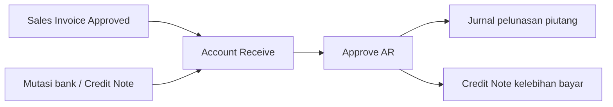
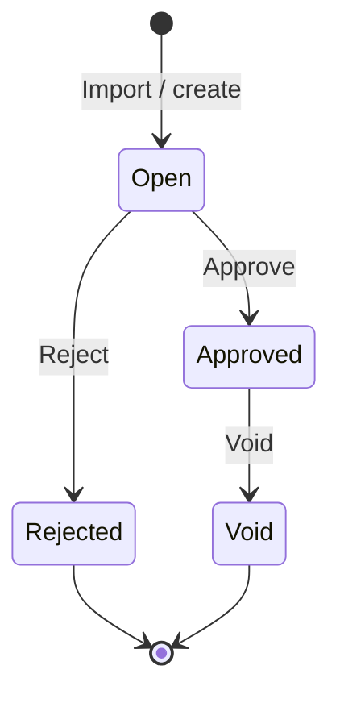
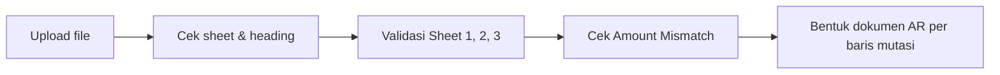
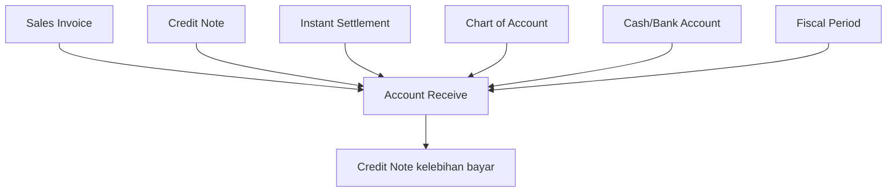

# Account Receive — Source of Truth

Sumber raw: `ETM-Account-Receive-Req.md` v3.0 (April 2026) — "Import Account Receive (AR) Multi-Sheet Relational". Seluruh klaim AS-IS di bawah sudah diverifikasi ke source code; selisih raw vs kode dicatat di Section 9.

## 1. Ringkasan Eksekutif

**Account Receive** mencatat penerimaan pembayaran dari customer dan mengalokasikannya ke Sales Invoice yang masih outstanding. Satu dokumen AR bisa melunasi banyak invoice sekaligus.

Menu ini punya **tiga jalur pembuatan dokumen**: input manual per dokumen, **Import multi-sheet** (satu file Excel menghasilkan banyak dokumen AR sekaligus), dan generate otomatis dari Approve Instant Settlement. Dokumen dari jalur mana pun lahir dengan status Open dan tetap perlu Approve manual sebelum jurnal terbentuk.



## 2. Prasyarat

| Prasyarat | Sumber | Catatan |
|---|---|---|
| Sales Invoice sudah Approved / Processed | Sales Invoice | Invoice Draft, Open, Rejected, atau Void ditolak saat import |
| Invoice masih punya outstanding | Sales Invoice | Outstanding nol berarti tidak bisa dibayar lagi |
| COA Cash/Bank aktif & terhubung ke Cash/Bank Account | Chart of Account + Cash/Bank Account | COA tanpa data bank dianggap tidak valid |
| Credit Note Approved (jika bayar pakai CN) | Credit Note | Perlu saldo outstanding yang cukup |
| Fiscal period terbuka pada tanggal transaksi | Fiscal Period | Divalidasi per baris mutasi saat import |
| Customer's Deposit COA terkonfigurasi | General Company / Store Binding | Wajib untuk pembayaran via CN dan untuk auto-generate CN |
| Currency transaksi sama dengan primary currency | General Setting | Selain itu import ditolak |

## 3. Siklus Status



| Status | Arti | Dampak ke outstanding invoice |
|---|---|---|
| Open | Dokumen sudah ada, menunggu review Finance | Menambah nilai prepared — outstanding invoice ikut berkurang walau belum Approved |
| Approved | Sudah disetujui, jurnal terbentuk | Pindah dari prepared ke processed |
| Rejected | Ditolak approver | Alokasi dilepas |
| Void | Dibatalkan setelah Approved | Alokasi dilepas |

Hasil import selalu masuk sebagai **Open** — memberi ruang Finance memeriksa sebelum Approve.

## 4. Datalist

Kolom datalist AR: kode dokumen, tanggal transaksi, customer, deskripsi, grand total, currency, status transaksi, dan kolom aksi. Datalist menyediakan Export, riwayat Import, serta panel **Import Log** untuk menampilkan error hasil screening file.

## 5. Form & Field — Template Import

Template diunduh dari menu (tombol download template) dan berisi **3 sheet**. Sheet Bank Mutation dan Detail Account Receive **wajib ada dan tidak boleh kosong**; sheet Adjustment opsional.

### 5.1 Sheet "Bank Mutation"

Satu baris = satu dokumen AR yang akan dibentuk.

| Kolom | Wajib | Aturan |
|---|---|---|
| Date | Ya | Tanggal transaksi. Divalidasi terhadap fiscal period; jam disimpan 23:59:59 |
| COA Bank Account | Ya | Kode COA Cash/Bank aktif **atau** nomor Credit Note. Tipe dideteksi otomatis |
| Amount | Ya | Angka positif. Wajib sama dengan akumulasi Sheet 2 + Sheet 3 untuk baris yang sama |
| Description | Tidak | Kosong berarti sistem membuat deskripsi otomatis |

### 5.2 Sheet "Detail Account Receive"

Satu baris = satu Sales Invoice yang dilunasi.

| Kolom | Wajib | Aturan |
|---|---|---|
| Sales Invoice No | Ya | Nomor SI terdaftar, status Approved/Processed, currency primary |
| Invoice Paid Amount | Ya | Angka. Tidak boleh melebihi outstanding invoice |
| Cash Bank Identification Row | Ya | Nomor baris Excel fisik di sheet Bank Mutation |

### 5.3 Sheet "Adjustment"

Satu baris = satu selisih antara dana masuk dan nilai invoice.

| Kolom | Wajib | Aturan |
|---|---|---|
| Account Code | Ya | Kode COA class Expense, Revenue, atau Other Revenue & Expenses — **atau** teks `CREDIT NOTE` |
| Debit | Salah satu | Tidak boleh diisi bersamaan dengan Credit |
| Credit | Salah satu | Tidak boleh diisi bersamaan dengan Debit |
| Description | Tidak | Kosong berarti deskripsi baris jurnal dibuat otomatis |
| Cash Bank Identification Row | Ya | Sama seperti Sheet 2 |

**Identification Row** adalah nomor baris Excel fisik di sheet Bank Mutation — bukan nomor urut data. Inilah pengikat yang menentukan invoice dan adjustment mana milik mutasi bank mana.

## 6. How It Works

### 6.1 Alur import

Import berjalan asynchronous lewat antrian, bertahap per sheet, dan baru menulis dokumen setelah seluruh file bersih.



Prinsip yang berlaku: **All-or-Nothing** (satu baris bermasalah membatalkan seluruh file), **screening dulu baru proses**, dan seluruh error dikumpulkan sekaligus supaya user tidak perlu upload berulang untuk menemukan error berikutnya.

### 6.2 Satu baris mutasi = satu dokumen AR

Pemisahan dokumen mengikuti baris mutasi, bukan kombinasi bank dan tanggal. Dua baris dengan bank dan tanggal yang sama tetap menghasilkan dua dokumen AR terpisah.

**Contoh** — Sheet 1 berisi baris 5 (BCA-001, 500.000, "Pelunasan Toko A"), baris 6 (BCA-001, 400.000, deskripsi kosong), baris 7 (Mandiri-002, 1.000.000, "Transfer Bulk"). Sheet 2 mengaitkan SI-001 ke baris 5; SI-002 dan SI-003 ke baris 6; SI-004 dan SI-005 ke baris 7. Hasilnya 3 dokumen AR berstatus Open: AR pertama melunasi SI-001 dengan deskripsi dari user, AR kedua melunasi SI-002 dan SI-003 dengan deskripsi otomatis, AR ketiga melunasi SI-004 dan SI-005.

Deskripsi otomatis berbentuk "Payment for {daftar nomor invoice}". Jika daftar nomor melebihi 120 karakter, deskripsi diringkas jadi "Payment for {jumlah} invoices".

### 6.3 Dua sumber dana: Cash/Bank atau Credit Note

Kolom COA Bank Account menerima dua jenis input dan sistem mendeteksi sendiri tipenya: cocok dengan COA Cash/Bank aktif berarti pembayaran tunai/transfer, cocok dengan nomor Credit Note berarti pembayaran memakai deposit customer. Jika satu input cocok dengan keduanya, file ditolak karena ambigu.

Pembayaran via Credit Note menuntut CN sudah Approved, saldo outstanding CN mencukupi, tanggal pembayaran tidak lebih awal dari tanggal CN, currency CN primary, dan customer invoice sama dengan pemilik CN.

### 6.4 Adjustment — kelebihan dan kekurangan bayar

Sheet Adjustment menampung selisih antara dana yang masuk dan nilai invoice yang dilunasi.

**Overpayment jadi Credit Note.** Dana masuk 550.000 untuk SI-001 senilai 500.000. Sheet 3 diisi Account Code `CREDIT NOTE`, kolom Credit 50.000. Sistem membentuk AR pelunasan SI-001 plus Credit Note baru senilai 50.000 atas nama customer invoice tersebut.

**Overpayment ke akun pendapatan.** Sama seperti di atas, tapi Account Code diisi kode COA pendapatan — kelebihan langsung diakui ke akun itu tanpa membentuk CN.

**Underpayment.** Dana masuk 493.500 sedangkan SI-001 senilai 500.000. Sheet 3 diisi kode COA Expense dengan Debit 6.500. Jurnal mencatat Debit bank 493.500, Debit akun expense 6.500, Credit piutang 500.000 — pelunasan piutang tetap dicatat penuh sesuai nilai invoice.

Nilai `grand_total` dokumen AR dihitung dari amount mutasi dikurangi nilai adjustment bertipe Credit Note.

### 6.5 Matching amount

Amount di sheet Bank Mutation harus sama dengan akumulasi baris terkait di sheet Detail **ditambah** nilai adjustment di sheet Adjustment (Debit dihitung negatif, Credit positif). Ketimpangan dilaporkan lengkap dengan nomor sheet dan baris yang timpang.

### 6.6 Outstanding check dengan akumulasi

Outstanding invoice dihitung sebagai nilai grand total setelah VAT dikurangi jumlah prepared dan processed. Jika satu invoice muncul di beberapa baris dalam satu file, seluruh nilai bayarnya diakumulasikan lebih dulu sebelum dibandingkan ke outstanding — mencegah kelebihan bayar lolos karena dicek baris per baris. Pesan error menyebut adanya dokumen AR Draft/Open yang masih menggantung bila memang ada.

### 6.7 Satu proses import per waktu

Hanya boleh ada satu proses import AR berjalan. Upload kedua ditolak dengan pemberitahuan bahwa import sedang diproses sesi lain.

### 6.8 Relasi Instant Settlement

Saat user Approve batch Instant Settlement, sistem membentuk satu dokumen AR per settlement upload yang mengalokasikan pembayaran ke invoice hasil generate. Invoice yang sudah punya AR manual dilewati supaya tidak dobel. Store wajib punya Cash/Bank Receiving sebelum Approve settlement. AR manual tidak ikut terhapus saat settlement di-Reject, dan justru memblokir Delete settlement bila terhubung ke invoice hasil upload.

## 7. Validasi

Format pesan: `Row {baris} at Sheet {nomor sheet}: {Kolom} {pesan}`. Nomor sheet mengikuti urutan sheet fisik di file.

### 7.1 Sheet Bank Mutation

| Kondisi | Pesan |
|---|---|
| Kolom wajib kosong | `Row X at Sheet 1: Date cannot be empty` (idem Amount, COA Bank Account) |
| Amount bukan angka | `Row X at Sheet 1: Amount must be a numeric value` |
| Amount nol atau negatif | `Row X at Sheet 1: Amount must be a positive numeric value` |
| Kode tidak cocok COA maupun CN | `Row X at Sheet 1: COA Bank Account {kode} is invalid` |
| Kode mengandung karakter tersembunyi | `Row X at Sheet 1: COA Bank Account {kode} contains invalid character` |
| Cocok COA sekaligus CN | `Row X at Sheet 1: COA Bank Account ambiguity detected: Input matches both a Bank COA and a Credit Note` |
| COA atau bank-nya nonaktif | `Row X at Sheet 1: COA Bank Account {kode} is inactive, Please reactivate it first` |
| Currency bukan primary | `Row X at Sheet 1: Multi-currency import not supported. Please use manual settlement.` |
| CN belum Approved | `Row X at Sheet 1: Credit Note {kode} is not approved` |
| Saldo CN kurang | `Row X at Sheet 1: Insufficient balance for Credit Note {kode}. Current Outstanding: {nilai}` |
| Tanggal bayar lebih awal dari tanggal CN | `Row X at Sheet 1: Payment date (…) cannot be earlier than Credit Note date (…) for {kode}` |
| Fiscal period tertutup | Pesan diteruskan apa adanya dari validasi fiscal period |
| Deposit COA customer belum diatur | `Row X at Sheet 1: Please configure company "Customer's Deposit COA" in {nama}` (varian store: `Please configure store …`) |

### 7.2 Sheet Detail Account Receive

| Kondisi | Pesan |
|---|---|
| Sheet kosong | `Sheet 2 (Detail) is empty. Each bank mutation must have at least one invoice detail.` |
| Kolom wajib kosong | `Row X at Sheet 2: Sales Invoice No cannot be empty` (idem Invoice Paid Amount, Cash Bank Identification Row) |
| Invoice tidak ditemukan | `Row X at Sheet 2: Sales Invoice No {kode} not found. Please use System Invoice Number.` |
| Invoice belum Approved | `Row X at Sheet 2: Sales Invoice {kode} is not approved` |
| Invoice sudah Void | `Row X at Sheet 2: Sales Invoice {kode} has already been voided` |
| Invoice currency bukan primary | `Row X at Sheet 2: Multi-currency import not supported. Please use manual settlement.` |
| Nilai bayar melebihi outstanding | `Row X at Sheet 2: Paid amount exceeds the current outstanding for {kode}` — ditambah `(Reason: There is pending DRAFT/OPEN AR documents for {nilai})` bila ada |
| Nilai bayar melebihi outstanding CN | `Row X at Sheet 2: Paid Amount is greater than Credit Note Outstanding.` |
| Identification Row tidak ada di Sheet 1 | `Row X at Sheet 2: Identification Row {N} does not exist or refers to an empty row in Sheet 1` |
| Invoice beda customer dalam satu mutasi | `Row X at Sheet 2: unable to use invoices from different customers in a single bank mutation.` |
| Campur invoice sales platform dan sales order | `Row X at Sheet 2: unable to use invoices from sales platform and sales order in a single bank mutation.` |
| Customer invoice bukan pemilik CN | `Row X at Sheet 2: Invoice {kode} belongs to a different customer than Credit Note {kode CN}.` |
| Tanggal bayar lebih awal dari tanggal invoice | `Row X at Sheet 1: Payment date (…) cannot be earlier than Sales Invoice date (…) for {kode}` — dilaporkan pada baris mutasi |

### 7.3 Sheet Adjustment

| Kondisi | Pesan |
|---|---|
| Debit dan Credit terisi bersamaan | `Row X at Sheet 3: Cannot have both Debit and Credit values. Please fill only one.` |
| Debit dan Credit dua-duanya kosong | `Row X at Sheet 3: Credit or Debit cannot be empty` |
| Account Code kosong | `Row X at Sheet 3: Account Code cannot be empty` |
| COA tidak ditemukan | `Row X at Sheet 3: Account Code {kode} is invalid` |
| Class COA tidak diizinkan | `Row X at Sheet 3: Account Code {kode} is not allowed. Only Expense, Revenue or Other Revenue & Expenses COAs are permitted.` — varian pesan menambahkan `or "CREDIT NOTE"` saat nilai berada di posisi credit |
| COA nonaktif | `Row X at Sheet 3: Account Code {kode} is inactive.` |
| COA punya anak | `Row X at Sheet 3: Account Code {kode} is not allowed because it is a parent COA.` |
| `CREDIT NOTE` diisi di kolom Debit | `Row X at Sheet 3: Credit Note amount must be on Credit column.` |
| `CREDIT NOTE` tanpa detail invoice | `Row X at Sheet 3: Unable to generate Credit Note without any Receive detail.` |
| Identification Row tidak ada | `Row X at Sheet 3: Identification Row {N} does not exist or refers to an empty row in Sheet 1` |

### 7.4 Validasi tingkat file

| Kondisi | Pesan |
|---|---|
| Bukan file XLSX | `Uploaded file must be using XLSX format` |
| Struktur bukan template resmi | `Invalid file structure. Please use the official Excel template provided by the system.` |
| Sheet wajib hilang | `Template Error: Required sheet {nama} is not found. Please use the original template.` |
| Sheet wajib kosong | `Template Error: Required sheet {nama} is empty.` |
| Amount tidak cocok | `Amount Mismatch: Total at Sheet 1 Row X ({nilai}) does not match total in Sheet 2 and Sheet 3 ({nilai}).` |
| Import lain sedang berjalan | `Import Transaction for Account Receive is currently being processed by another session.` |

## 8. Relasi Menu Lain



| Menu | Relasi |
|---|---|
| Sales Invoice | Sumber piutang yang dilunasi; outstanding-nya jadi batas nilai bayar |
| Credit Note | Bisa jadi sumber dana pembayaran, sekaligus bisa terbentuk dari kelebihan bayar |
| Instant Settlement | Approve settlement membentuk dokumen AR otomatis |
| Chart of Account | Sumber COA bank dan COA adjustment beserta aturan class-nya |
| Cash/Bank Account | COA bank wajib terhubung ke data bank yang aktif |
| Fiscal Period | Menentukan tanggal transaksi boleh dipakai atau tidak |

## 9. Gap Registry

| ID | Deskripsi | Type | Dampak | Status |
|---|---|---|---|---|
| GAP-AR-01 | Nama kolom template. Requirement: "Payment Source", "Identification Row", "Identification Bank Mutation Row", dan kolom "Currency" di Sheet 1. Codebase: heading resmi "COA Bank Account", "Cash Bank Identification Row" di Sheet 2 dan 3, dan tidak ada kolom Currency — currency diturunkan dari COA/CN. | Contradiction | Test case dan panduan user yang memakai nama kolom raw akan gagal di template asli | Pending Decision — Yemima |
| GAP-AR-02 | Waktu pembentukan Credit Note. Requirement: CN ter-generate setelah Approve AR. Codebase: CN dibuat saat proses import selesai, langsung berstatus Open dan tertaut ke dokumen AR. | Contradiction | Expected result TC overpayment berbeda total | Pending Decision — Yemima |
| GAP-AR-03 | Jam pada tanggal transaksi. Requirement: jam otomatis 00:00:00. Codebase: tanggal disimpan dengan jam 23:59:59. | Contradiction | Berpengaruh ke batas fiscal period dan urutan dokumen di tanggal yang sama | Pending Decision — Yemima |
| GAP-AR-04 | Matching amount. Requirement: hanya membandingkan akumulasi Sheet 2 dengan Amount Sheet 1. Codebase: adjustment Sheet 3 ikut dihitung (Debit negatif, Credit positif). | Contradiction | File dengan adjustment akan dinilai timpang bila mengikuti rumus raw | Pending Decision — Yemima |
| GAP-AR-05 | Class COA adjustment. Requirement: hanya Expense dan Pendapatan. Codebase: Expense, Revenue, dan Other Revenue & Expenses; COA induk dan COA nonaktif juga ditolak. | Contradiction | Batas uji negatif berbeda | Pending Decision — Yemima |
| GAP-AR-06 | Pesan error. Sebagian besar pesan di requirement tidak sama persis dengan pesan di kode (lihat Section 7). | Contradiction | TC yang mengassert string raw akan fail | Pending Decision — Yemima |
| GAP-AR-07 | Cache key penguncian import di controller Account Receive memakai penanda `ap`, dan tiga pesan penolakannya berbunyi "Import Transaction for Account Payment" walau berada di alur Account Receive. | Missing Behavior | Import AR dan AP berpotensi saling mengunci; pesan ke user menyebut menu yang salah | Open |
| GAP-AR-08 | Requirement Section 7 (Smart Settlement Adjustment, Failed Ship, Hard Delete Protection) sebenarnya menjelaskan perilaku menu Instant Settlement, bukan menu ini. | Unverified | Berisiko dobel dokumentasi dan salah rumah fakta | Open |
| GAP-AR-09 | Alur manual (create dokumen AR, insert Sales Invoice lewat modal Available, bulk approve) belum punya sumber requirement tertulis, padahal sudah punya 9 test case aktif. | Missing Behavior | 9 TC berdiri tanpa acuan requirement | Open |

## 10. FAQ

**Kenapa dua baris dengan bank dan tanggal sama jadi dua dokumen AR?** Karena pemisahan dokumen mengikuti baris mutasi bank, bukan kombinasi bank dan tanggal.

**Kenapa satu error kecil membatalkan seluruh file?** Prinsip All-or-Nothing dipakai supaya tidak ada file yang masuk separuh dan menyisakan pelunasan menggantung.

**Kolom deskripsi boleh dikosongkan?** Boleh. Sistem akan mengisi "Payment for" diikuti daftar nomor invoice, atau jumlah invoice bila daftarnya terlalu panjang.

**Kenapa invoice yang kelihatan belum dibayar ditolak karena melebihi outstanding?** Kemungkinan ada dokumen AR lain berstatus Draft atau Open yang sudah memesan sebagian nilainya. Pesan error menyebut nilai yang tertahan itu.

**Bisa bayar pakai deposit customer?** Bisa. Isi nomor Credit Note di kolom COA Bank Account, dengan syarat CN sudah Approved dan saldonya cukup.

## 11. Changelog

| Version | Date | Author | Changes |
|---|---|---|---|
| 1.0 | 2026-08-31 | QA - Yemima | SOT awal dari raw requirement v3.0 April 2026 + verifikasi codebase |

## 12. Knowledge Base Hints

Kamus istilah teknis ke bahasa awam:

| Teknis | Awam |
|---|---|
| Identification Row | nomor baris Excel di sheet pertama yang jadi penanda pengikat |
| prepared / processed amount | nilai yang sudah dipesan dokumen AR yang belum disetujui / yang sudah disetujui |
| polymorphic detection | sistem mengenali sendiri apakah yang diisi kode bank atau nomor Credit Note |
| primary currency | mata uang utama perusahaan |
| parent COA | akun yang masih punya sub-akun di bawahnya |

Troubleshooting yang perlu masuk KB tanpa menyebut kode GAP: file ditolak seluruhnya karena satu baris, angka tidak cocok antar sheet, invoice ditolak karena masih ada AR menggantung, upload ditolak karena ada import lain berjalan, kode bank ditolak karena nonaktif atau tertukar dengan nomor CN.

Field yang boleh dilewati di KB: nama tabel dan nama job.

## 13. Technical Hints

**Backend**

| Berkas | Peran |
|---|---|
| `Modules/Accounting/Http/Controllers/CustomerPaymentController.php` | Endpoint import, download template, progress, log, history; validasi sheet dan heading |
| `Modules/Accounting/Exports/AccountReceiveTemplateExport.php` | Definisi tiga sheet dan konstanta nama sheet |
| `Modules/Accounting/Exports/AccountReceiveBankMutationTemplateSheet.php` | Heading wajib Sheet 1 |
| `Modules/Accounting/Exports/AccountReceiveDetailTemplateSheet.php` | Heading wajib Sheet 2 |
| `Modules/Accounting/Exports/AccountReceiveAdjustmentTemplateSheet.php` | Heading wajib Sheet 3 |
| `Modules/Accounting/Import/ReceiveValidateBankMutationSheet.php` | Validasi Sheet 1 |
| `Modules/Accounting/Import/ReceiveValidateDetailSheet.php` | Validasi Sheet 2 |
| `Modules/Accounting/Import/ReceiveValidateAdjustmentSheet.php` | Validasi Sheet 3 |
| `Modules/Accounting/Jobs/ImportReceiveValidateBankMutationJob.php` | Rantai job validasi tahap 1 |
| `Modules/Accounting/Jobs/ImportReceiveValidateDetailJob.php` | Rantai job validasi tahap 2 |
| `Modules/Accounting/Jobs/ImportReceiveValidateAdjustmentJob.php` | Rantai job validasi tahap 3 |
| `Modules/Accounting/Jobs/ImportReceiveFinalValidationJob.php` | Cek Amount Mismatch, tentukan sukses atau gagal |
| `Modules/Accounting/Jobs/ReceiveImportPerMutationJob.php` | Membentuk dokumen AR, detail, adjustment, dan Credit Note |
| `Modules/Accounting/Entities/CustomerPayment.php` | Model dokumen AR |
| `Modules/Accounting/Entities/CustomerInvoice.php` | Sumber outstanding (`invoice_remaining_after_vat`) |
| `Modules/Accounting/Import/CustomerPaymentImport.php` | Jalur import lama satu sheet, menambah detail ke dokumen AR yang sudah ada |

**Frontend**

| Berkas | Peran |
|---|---|
| `olshoperp-frontend/src/pages/Accounting/AccountReceivable/Receive/DataList.vue` | Datalist, export, riwayat import |
| `olshoperp-frontend/src/pages/Accounting/AccountReceivable/Receive/ImportLog.vue` | Panel error hasil screening |
| `olshoperp-frontend/src/pages/Accounting/AccountReceivable/Receive/Form.vue` | Form dokumen AR |
| `olshoperp-frontend/src/pages/Accounting/AccountReceivable/Receive/Adjustment.vue` | Baris adjustment |
| `olshoperp-frontend/src/pages/Accounting/AccountReceivable/Receive/AvailableData.vue` | Modal Available Sales Invoice |

**API**

| Method | Path |
|---|---|
| POST | `accounting/customer-payment/import` |
| GET | `accounting/customer-payment/import/template` |
| GET | `accounting/customer-payment/import/progress` |
| GET | `accounting/customer-payment/import-log` |
| GET | `accounting/customer-payment/import-history` |
| GET | `accounting/customer-payment/import-history-detail/{historyId}` |

**Tabel kunci:** `accounting_customer_payments`, `accounting_customer_payment_details`, `import_receive_temps` (staging antar sheet, memegang kolom `row`, `identifier`, `detail_amount`), `import_receive_logs`, `payment_import_histories`.

**Invariants**

- Untuk tiap baris mutasi: `amount == detail_amount` (akumulasi detail Sheet 2 ditambah adjustment Sheet 3) sebelum dokumen dibentuk.
- Untuk tiap invoice: `prepared_to_payment_amount + processed_to_payment_amount <= grand_total_after_vat`.
- Dokumen AR hasil import selalu lahir dengan status Open.
- `grand_total` dokumen AR sama dengan amount mutasi dikurangi total adjustment bertipe Credit Note.

**Failure modes**

- Error apa pun pada tahap validasi menghentikan seluruh import; tidak ada dokumen yang tertulis sebagian.
- Exception saat validasi akhir dicatat sebagai "Something went wrong: …" dan menandai riwayat import gagal.
- Penguncian proses memakai kombinasi cache lock dan penanda proses berjalan; lihat GAP-AR-07.
- Berkas upload dihapus setelah tahap validasi akhir.

## 14. Referensi Struktur untuk Proses Split

```
Section 1-11 → material utama untuk requirement.md
Section 5, 6, 7, 10 → adaptasi ke knowledge-base.md dengan tone awam (lihat Section 12)
Section 13 Technical Hints → seed untuk technical.md, sudah pakai path/nama real
Frontmatter YAML di atas → copy ke 3 file utama (+ user-guide.md kalau gate review/final), sinkronkan version + last_updated
Golden reference tone & struktur: docs/qa-docs/accounting-supplier-invoice/
```
