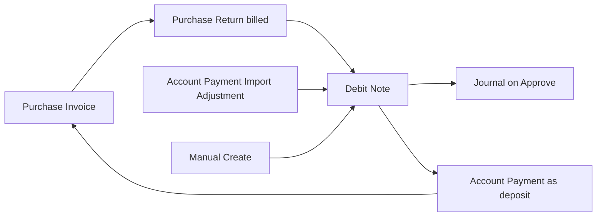
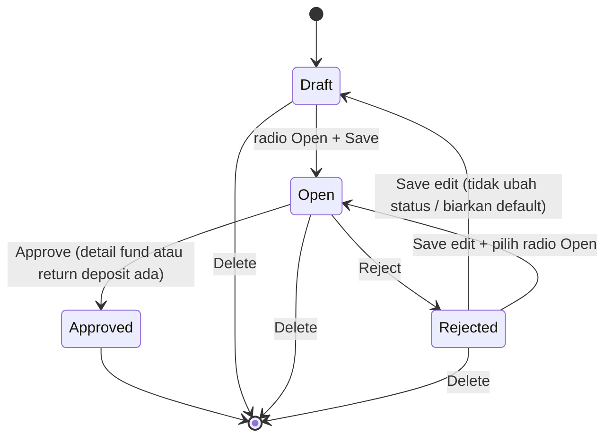
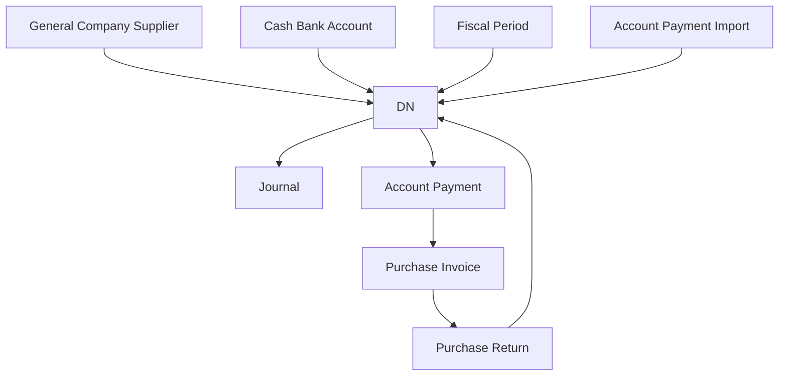

# Debit Note — Source of Truth

## 1. Ringkasan Eksekutif

**Debit Note (DN)** adalah dokumen Accounting yang mencatat klaim/deposit ke **supplier** (nilai yang supplier “berutang” ke perusahaan), lalu dipakai sebagai **Payment Source** di **Account Payment** untuk memotong hutang tanpa/kurangi kas keluar. Secara teknis DN adalah subtype Payment (`type = Debit Note`, prefix kode `DN`).

Tiga jalur asal: (1) **Manual** di menu Debit Note + Payment Source Cash/Bank; (2) **auto dari Purchase Return** (return billed ke PI); (3) **auto dari Import Account Payment** sheet Adjustment berisi `DEBIT NOTE`. Audience: Finance / Account Payable.



## 2. Prasyarat

| Prerequisite | Sumber | Catatan |
|--------------|--------|---------|
| Supplier aktif di General Company (`is_supplier = 1`) + setup COA supplier lengkap (tag is_supplier) | General Company | Select2 DN **hanya** General Company — bukan Store/Platform |
| Minimal satu Cash/Bank aktif dengan currency sama currency DN | Cash Bank Account | Wajib sebelum create/update header manual |
| Currency aktif; primary currency company ter-set | Currency / Company | Rate dipaksa 1 jika primary (IDR) |
| Fiscal period terbuka untuk tanggal transaksi | Fiscal Period | Blok create / update tanggal / approve jika di luar periode |
| Deposit to Supplier COA (manual) / Deposit of Purchase Return + Inventory COA produk (PR) | Company Accounting / Product COA | Wajib saat approve agar journal sukses |
| Privilege menu Debit Note (view/create/update/delete/approval) | Gate | Policy Debit Note |

## 3. Siklus Status



| Status | Arti | Editable? | Tombol baris (privilege-aware) |
|--------|------|-----------|--------------------------------|
| **draft** | Header tersimpan, belum siap approve | Ya | Edit, Delete, Print; Approve/Reject **tidak** (hanya Open) |
| **open** | Siap approve | Ya | Edit, Delete, Print, Approve/Reject |
| **approved** | Terkunci; journal terbentuk; bisa dipakai di AP | Tidak (show) | Show, Print — **tanpa** Delete/Approve |
| **rejected** | Ditolak approval | Ya | Edit, Delete, Print. **Save edit:** jika user **tidak** ubah status (hanya edit field lain) → **draft**; jika user pilih radio **Open** lalu Save → **open** (GAP-DN-01 locked) |

**Void / Closed:** belum didefinisikan end user untuk Debit Note (kebutuhan bisnis belum ada) — **skip** di SOT ini (GAP-DN-05).

Field kritikal (Supplier, Currency, Rate, Date) terkunci jika sudah ada baris fund/deposit — clear detail dulu untuk ubah.

## 4. Datalist

**Route:** `/accounting/debit-note` · API list scoped `type = Debit Note`, order tanggal desc.

### 4.1 Kolom

| # | Kolom UI | Visible default | Sumber / hitung |
|---|----------|-----------------|-----------------|
| — | (sort helper) Trx Date | **false** | Timestamp dari `transaction_date` untuk sort |
| 1 | **Trx Code \| Trx Date** | **true** | Kode DN + tanggal; link ke edit. Jika ref Purchase Return, tanggal tampilan bisa dari dokumen ref |
| 2 | **Supplier** | true | Nama General Company supplier (`actor` Company). Display defensive Store name jika legacy actor Store |
| 3 | **Description** | true | Deskripsi (excerpt + tooltip full) |
| 4 | **Trx Ref** | true | `transaction_reference_text` + URL (PR / AP / `-`) — klikable ke dokumen sumber |
| 5 | **Curr** | true | Kode currency header |
| 6 | **Rate** | true | `exchange_rate` |
| 7 | **Total Amount** | true | Manual: sum Payment Source funds (foreign-aware). PR: `grand_total` |
| 8 | **Paid** | true | Sum pemakaian DN di Account Payment **approved** (deposit details) |
| 9 | **Outstanding** | true | Total − Paid (foreign-aware) |
| 10 | **Trx Status** | true | Badge `transaction_status` |
| 11 | **Journal** | true | Kode journal setelah approve, atau `-` |
| 12 | **Created by \| Created at** | true (kolom standar datatable) | User + waktu create |
| 13 | **Action** | true | Lihat §4.3 |

### 4.2 Fitur toolbar

| Fitur | Keterangan |
|-------|------------|
| Global Search | Search datalist (kode, supplier, deskripsi, dll. via builder) |
| Advanced Filter | SearchBuilder / filter kolom (index builder di store) |
| **Create** | Ke `/accounting/debit-note/create` — lihat §6.2 auto-save last DN |
| Show deleted | Soft-deleted rows |
| Columns show/hide | Ya |
| Export advanced | **Without Details** · **With Details** · **Active Page** — §4.4 |
| Bulk delete | Ya — validasi sama delete baris (hanya draft/open/rejected) |
| Bulk approve | Ya — validasi sama approve baris (open + eligible + detail lengkap) |
| Multi select checkbox | Ya |

### 4.3 Action per baris

| Tombol | Muncul jika |
|--------|-------------|
| **Edit** | Belum approved (`can_update`) |
| **Show** | Approved (read-only) — atau tidak punya update |
| **Print** | **Selalu** (semua status), privilege print |
| **Delete** | Belum approved (draft / open / rejected) |
| **Approve / Reject** | Status **open** + `can_approve` (modal bersama) |

### 4.4 Export — jenis & kolom

| Mode | Fungsi | Kolom Excel (header baris 2) |
|------|--------|------------------------------|
| **Without Details** (Export All / Active Page tanpa detail) | Satu baris per DN | Trx. Code · Trx. Date · Supplier · Description · Trx. Ref · Curr. · Rate · Total Amount · Paid · Outstanding · Trx. Status · Journal · Created By · Created At |
| **With Details** | Satu baris per **Payment Source (fund)**; header DN diulang per baris fund | Semua kolom Without Details **plus** Gl Account · Gl Name · Bank Account · Bank Name · Swift Code · Amount (nilai baris fund), lalu Total Amount · Paid · Outstanding · … |
| **Active Page** | Subset halaman datalist aktif | Pola Without Details (satu baris/DN) untuk id di halaman |

DN dari Purchase Return tanpa baris fund: export With Details bisa menghasilkan **0 baris detail** (atau DN tidak muncul) karena transform hanya iterasi `payment_detail_funds` — **GAP-DN-02 (bug)**; fix arah: sertakan return deposit di With Details.

## 5. Form & Field

### 5.1 Section Basic Information

| Field | Required | Default / aturan |
|-------|----------|------------------|
| **Transaction Code** | Unique; kosong = auto `DN…` | Disabled setelah create |
| **Transaction Date** | Ya | Default now. Min ≈ now−6 bulan, max now. Harus lolos **fiscal period**. Generate dari AP Import: tanggal ≈ tanggal AP (+ offset detik di kode). Generate dari PR: now saat generate |
| **Supplier** | Ya | Select2: General Company `company_type = general`, `is_supplier = 1`, `status = 1`, punya companyAccounting, **COA tag supplier lengkap**. **Bukan** Store/Platform. Dari AP Import / PR: copy supplier dari dokumen sumber (Company) |
| **Reference Doc** | Tidak | Hanya UI jika source **Default**: free text `document_reference` max 150. AP Import mengisi dengan kode AP |
| **Transaction Reference** | — | UI disabled jika source **Purchase Return** (tampil kode PR). Kolom datalist Trx Ref juga dari `transaction_reference_*` (AP/PR). Hyperlink ke edit dokumen sumber |
| **Transaction Currency** | Ya | Default primary (IDR). AP Import / PR: copy dari dokumen sumber. Harus ada Cash/Bank currency match |
| **Exchange Rate** | Ya, > 0 | Default 1; IDR dipaksa 1 + disabled. AP Import / PR: copy dari sumber |
| **Description** | Tidak | Max 150. Format auto: lihat §6.3 |
| **Attachment** | Tidak | `FormAttachment`: upload file (validasi ekstensi standar attachment Payment); `file_attachment` / `file_attachment_ids`; editable hanya jika `can_update`; tetap tampil read-only saat approved |

### 5.2 Section Payment Source (hanya source Default / manual & AP-import fund)

Muncul di edit jika `source_type` Default.

| Elemen | Keterangan |
|--------|------------|
| Select Cash/Bank | Modal list akun **active**, currency = currency header DN, menampilkan balance tersedia |
| GL Account | Info COA kas/bank terpilih (read-only) |
| Bank Account \| Bank Name | Hanya jika tipe **bank**; tipe **cash** tidak menampilkan nomor/nama bank |
| Currency | Currency akun (selaras header) |
| Swift Code | Dari master kas/bank |
| Amount | Nominal baris; edit via action/modal; > 0 |
| Validasi balance | Saat **add / bulk-use / update amount**: cek remaining balance kas/bank (available − reserved). Pesan contoh: insufficient / exceeds remaining. **Mengurangi** remaining balance kontekstual saat commit fund (prepared). **Menambah** balance kas (efek journal) **tidak** realtime di master — baru setelah **approve** transaksi terkait |
| Approve DN | Validasi balance tambahan di approval DN: jika belum ada di kode, **biarkan AS-IS**; yang wajib adalah validasi saat add Payment Source |

### 5.3 Section Purchase Return Detail (source PR)

Read-only baris return deposit (produk/qty/nilai dari PI). Total = `grand_total`. Tidak ada Payment Source Cash/Bank.

### 5.4 Approval Log & Audit Log

| Section | Isi |
|---------|-----|
| Approval | Log siapa/kapan approve/reject + eligibility |
| Audit Log | Jejak perubahan header/detail/attachment |

Sticky: radio **Draft / Open**, Save All, Approve (jika eligible).

## 6. How It Works

### 6.1 Hitung Total / Paid / Outstanding

- **Total (manual):** Σ fund amount (atau amount_foreign jika foreign).  
- **Total (PR):** `grand_total`.  
- **Paid:** Σ deposit usage di AP berstatus approved.  
- **Outstanding:** Total − Paid.

### 6.2 Create + auto-save last transaction

1. User klik Create → `/accounting/debit-note/create`.  
2. Ambil default values last DN (supplier, currency, rate).  
3. Jika ada last DN: prefill + `transaction_date = now` → **langsung POST create** → redirect edit.  
4. Jika validasi gagal (contoh **fiscal period** belum ada / tanggal di luar periode, currency/bank prasyarat, dll.): **auto-save gagal**, tetap di create, **notif jelas di field** terkait — tidak redirect.  
5. Jika belum pernah ada DN: tidak auto-create; user isi + Save & Next.

### 6.3 Generate dari luar menu

**A. Purchase Return (billed)**  
- Trigger: approve outbound return dengan link PI detail.  
- DN status awal **open**; supplier/currency/rate dari PI; description `Auto generated from Purchase Return {code}`; trx ref → PR.  
- Detail: return deposits (bukan cash/bank).  
- User approve DN manual (auto-approve service disabled).

**B. Account Payment Import — Adjustment `DEBIT NOTE`**  
- Membuat DN baru: supplier/currency/rate dari header AP; tanggal ≈ tanggal AP; `document_reference` = kode AP; `transaction_reference` → AP (hyperlink).  
- Description: isi cell import **atau** `Auto generated from {AP code}, via Import on Row {n} at Sheet {Adjustment}`.  
- Fund: COA **Deposit to Supplier** (atau COA dari import), amount dari baris adjustment.  
- Status awal **open**.

### 6.4 Approve journal (ringkas)

- Manual: Dr Deposit to Supplier · Cr Cash/Bank fund COA.  
- PR: Dr Deposit of Purchase Return · Cr Inventory COA produk.  
- Setelah approve: DN eligible sebagai deposit di Account Payment (same supplier, same currency, DN date sebelum AP date, remaining > 0).

### 6.5 Contoh kasus

| # | Situasi | Hasil |
|---|---------|--------|
| 1 | Create, ada last DN, fiscal period OK | Header auto-create → edit |
| 2 | Create, ada last DN, fiscal period tidak ada | Auto-save gagal + notif di tanggal/field terkait |
| 3 | Manual DN: tambah Cash/Bank amount > remaining | Error insufficient / exceeds remaining |
| 4 | Import AP Adjustment `DEBIT NOTE` | DN open + fund deposit + trx ref AP |
| 5 | Reject DN lalu Save edit **tanpa** ubah status (edit field lain saja) | Status → **draft** |
| 5b | Reject DN lalu Save edit + pilih radio **Open** | Status → **open** (bisa approve ulang langsung) |
| 6 | DN approved | Hanya show + print; dipakai di AP |

## 7. Validasi

| Kondisi | Behavior / pesan (arah AS-IS) |
|---------|-------------------------------|
| Tanggal di luar fiscal period | Blok create/update/approve — error fiscal |
| Supplier kosong / tidak eligible COA | Blok |
| Currency tanpa Cash/Bank match | Blok create/update |
| Rate ≤ 0 | Blok |
| Approve tanpa fund dan tanpa return deposit | Blok — detail wajib |
| Amount fund ≤ 0 | Blok |
| Duplicate COA fund | Blok |
| Amount > remaining cash/bank | `Entered amount exceeds…` / `Insufficient balance…` / daftar label akun |
| Delete saat approved | Blok |
| Approve saat bukan open / tidak eligible | Blok |

## 8. Relasi Menu Lain



| Menu | Relasi |
|------|--------|
| Purchase Return / Purchase Invoice | Sumber DN PR |
| Account Payment | Konsumen DN approved; Import spawn DN |
| Journal | Hasil approve |
| General Company / Cash Bank / Currency / Fiscal Period | Master prasyarat |
| Credit Note | Mirror AR-side (bukan scope DN) |

## 9. Gap Registry

| ID | Deskripsi | Type | Dampak | Status |
|----|-----------|------|--------|--------|
| GAP-DN-01 | **Reject → Save edit:** status tetap `rejected` sampai user Save. Jika user **tidak** ubah status (hanya edit field lain) → jadi **`draft`**. Jika user pilih radio **Open** lalu Save → jadi **`open`**. | Confirmed rule (end user) | Alur approval ulang | **Resolved** — rule locked (§3, §6.5) |
| GAP-DN-02 | **Bug:** Export **With Details** hanya loop **Payment Source (cash/bank fund)**. DN dari **Purchase Return** punya **Return Deposit**, bukan fund — DN PR bisa **tidak muncul / tanpa baris detail** di Excel With Details | **Bug** / Missing Behavior | Export Excel incomplete untuk DN asal PR | Open — bug; for now tetap di gap (fix: sertakan return deposit di With Details) |
| GAP-DN-03 | Index/export masih ada cabang `actor_reference_class = Store`, padahal create select2 **hanya** General Company supplier. **Catatan untuk Dev:** jangan perluas / jangan dokumentasikan Store sebagai supplier DN — buat ambigu. Create & select2 = Company supplier only; cabang Store di list/export treat as legacy defensive, bukan fitur | Unverified | Ambigu requirement vs UI | Open — note for Dev (clarify, jangan ambigu) |
| GAP-DN-04 | Validasi remaining balance kas/bank di **approve** DN: jika belum ada di kode, biarkan. Yang wajib sudah ada saat **add Payment Source**. Bukan blocker khusus saat ini | Unverified | Approval path | Open — non-blocker; keep as gap only |
| GAP-DN-05 | Status **void** dan **closed** ada di keluarga Payment, tetapi **belum didefinisikan end user** untuk Debit Note — kebutuhan bisnis requirement belum jelas. SOT **skip** Void/Close di action & siklus sampai ada keputusan bisnis | Missing Behavior (by design deferred) | Tombol Void/Close | Open — deferred: menunggu definisi bisnis dari end user |

## 10. FAQ

**Q: Kenapa Create langsung ke edit?**  
A: Auto-create dari last DN (supplier/currency/rate) supaya cepat. Kalau validasi gagal, tetap di create + notif.

**Q: Supplier dari Store marketplace?**  
A: Tidak. DN pembelian: supplier = General Company recognize as supplier (+ COA lengkap).

**Q: Bedanya Reference Doc vs Trx Ref?**  
A: Reference Doc = teks bebas (Default). Trx Ref = link sistem ke PR/AP (datalist + PR form).

**Q: Kapan DN bisa potong hutang?**  
A: Setelah **approved**, dipakai di Account Payment sebagai Debit Note source.

**Q: Reject lalu apa?**  
A: Status **rejected**. Saat Save edit: jika status tidak diubah → **draft**; jika user pilih **Open** → **open** (bisa approve ulang).

## 11. Changelog

| Version | Date | Changes |
|---------|------|---------|
| 1.0 | 2026-08-12 | Initial SOT dari requirement Yemima + analisa codebase Debit Note + verifikasi select2/export/AP import/fund balance |
| 1.0b | 2026-08-12 | Clarify Gap Registry DN-01…05 (reject→draft, export PR, Store note for Dev, balance approve non-blocker, void/closed deferred for end-user) |
| 1.0c | 2026-08-12 | Lock GAP-DN-01 reject→Save (draft default / open jika dipilih); GAP-DN-02 ditandai bug export With Details DN-PR |

## 12. Knowledge Base Hints

| Istilah teknis | Awam |
|----------------|------|
| Debit Note | Klaim/deposit ke supplier untuk potong bayar hutang |
| Payment Source | Baris kas/bank yang mendanai DN manual |
| Return Deposit | Baris nilai DN dari barang retur ke PI |
| Outstanding | Sisa DN belum dipakai di Account Payment |
| Auto-save last trx | Create mengisi dari DN terakhir lalu simpan header otomatis |
| Remaining balance | Sisa saldo kas/bank yang masih bisa dipakai |

**Troubleshooting singkat**

| Gejala | Arah cek |
|--------|----------|
| Create gagal auto-save | Fiscal period, currency/bank, error field |
| Tidak bisa approve | Status harus open; isi fund atau return deposit; COA deposit |
| Cash/Bank tidak muncul | Currency header vs akun; status active; balance |
| Tidak bisa potong di AP | DN belum approved / beda supplier/currency / outstanding 0 |

**Skip di KB:** path class, job export internal, morph class names.

## 13. Technical Hints

| Area | Path / nama real |
|------|------------------|
| FE list/form | `olshoperp-frontend/src/pages/Accounting/DebitNote/*` · store `stores/project/DebitNote` |
| API | `accounting/debit-note` · `default-values` · detail-fund · return-deposits · export-* · print · approve |
| BE | `DebitNoteController`, `DebitNote` + Payment, `DebitNoteService`, `DebitNoteDetailFundController` → `PaymentDetailFundController` |
| Export | `DebitNoteExportJob` → `DebitNoteExportAll2` (without details); `DebitNoteDetailExportJob` → `DebitNoteWhithDetailExportAll` |
| AP import DN | `SupplierPaymentImportPerMutationJob::createDebitNote` |
| Supplier select2 | `DebitNoteController@select2Supplier` → `GeneralCompanyController@select2Supplier` |
| Journal | `JournalProcess::debitNoteAutoJournal` |

**Invariants**

1. `type = Debit Note`; kode unik prefix DN.  
2. Select2 supplier = General + is_supplier + COA tag lengkap.  
3. Manual/AP-import detail = funds; PR detail = return_deposits.  
4. Approve butuh minimal satu jenis detail.  
5. Fund currency = header currency; amount > 0; no duplicate COA.  
6. Add/update fund cek remaining cash/bank.  
7. Paid hanya dari AP approved.  
8. Soft delete header hanya draft/open/rejected.

**Failure modes**

- Fiscal / COA missing → 422 field or message.  
- Insufficient fund balance → error string insufficient/exceeds.  
- Approve tanpa detail → error.  
- Delete approved → ERR approved.  
- Auto-create create page gagal → stay create + `error_form`.

**Lifecycle**

`accounting_payments` ← funds / return_deposits ← AP `payment_detail_deposits` ← journal morph.

## 14. Referensi Struktur untuk Proses Split

```
Section 1-11 → material utama untuk requirement.md
Section 5, 6, 7, 10 → adaptasi ke knowledge-base.md dengan tone awam (lihat Section 12)
Section 13 Technical Hints → seed untuk technical.md, sudah pakai path/nama real
Frontmatter YAML di atas → copy ke 3 file utama (+ user-guide.md kalau gate review/final), sinkronkan version + last_updated
Golden reference tone & struktur: docs/qa-docs/accounting-supplier-invoice/
```
