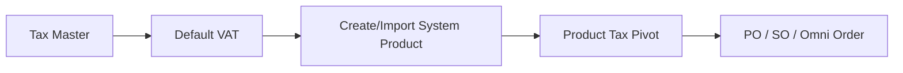
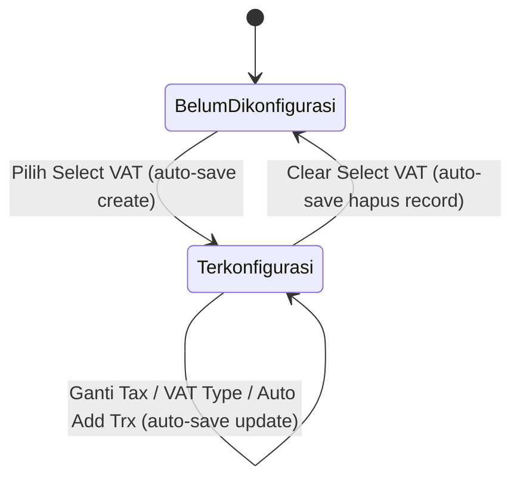
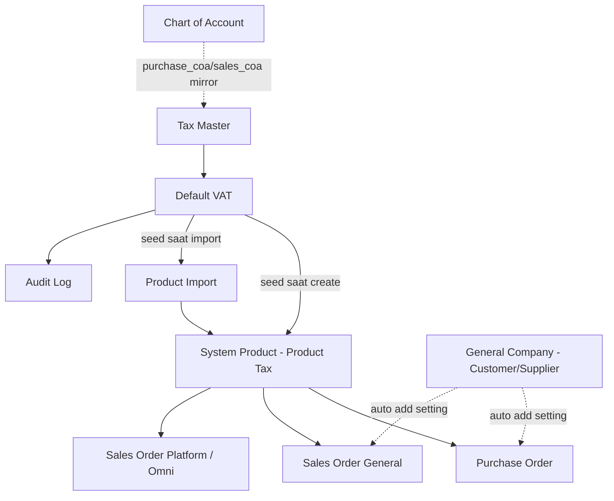

# Default VAT — Source of Truth

## 1. Ringkasan Eksekutif

Default VAT adalah master Accounting untuk menetapkan konfigurasi VAT default Purchase dan Sales per company, dengan merujuk ke satu baris master Tax untuk masing-masing type. Konfigurasi ini dipakai sebagai template: saat System Product baru dibuat atau diimpor, sistem otomatis mengisi baris Product Tax purchase dan sales produk itu dari Default VAT, tanpa user perlu input manual satu per satu. Audience utama tim Finance/Accounting yang mengelola setup pajak default perusahaan. Menu ini bukan alat hitung PPN transaksi secara langsung, dan tidak memengaruhi produk yang sudah ada sebelumnya.



## 2. Prasyarat

| Prasyarat | Sumber | Catatan |
|---|---|---|
| Master Tax berstatus Active | Menu Tax | Hanya Tax aktif yang muncul di pilihan Select VAT; Tax yang soft-deleted atau inactive akan direject saat disimpan sebagai Default VAT |
| Tax punya Purchase COA / Sales COA terisi | Menu Tax | Default VAT hanya menampilkan (mirror) COA dari Tax, tidak mengedit COA sendiri di sini |

## 3. Siklus Status

Default VAT bukan transaksi berjenjang approval. Per type (Purchase/Sales), statusnya berputar antara "Belum Dikonfigurasi" dan "Terkonfigurasi", dan setiap perubahan langsung tersimpan (auto-save) tanpa tombol Save terpisah.



| Status | Kondisi Transisi | Editable? | Tombol yang Muncul |
|---|---|---|---|
| Belum Dikonfigurasi | Default saat pertama kali dibuka dan belum pernah ada Tax terpilih, atau setelah Select VAT di-clear | Field mirror disabled, sidenav Purchase/Sales unchecked | Tidak ada — tidak ada tombol Save/Cancel eksplisit |
| Terkonfigurasi | Setelah user memilih Tax di Select VAT | VAT Type dan Auto Add Trx bisa diubah; field mirror tetap disabled | Tidak ada — semua perubahan auto-save |

## 4. Datalist

Menu ini bukan datalist atau listing page. Halaman langsung menampilkan form konfigurasi dua accordion (Purchase VAT, Sales VAT) dengan sidenav kanan berisi checklist Purchase/Sales dan Audit Log. Tidak ada pagination, filter, atau export, karena secara desain hanya ada maksimal satu konfigurasi bermakna per type per company.

## 5. Form & Field

### 5.1 Accordion "Purchase VAT"

| Field | Wajib? | Default | Sumber Opsi | Validasi | Catatan |
|---|---|---|---|---|---|
| Select VAT | Wajib secara UX untuk mengisi konfigurasi (backend menerima kosong) | NULL | Master Tax status Active, type Purchase | Reject jika Tax soft-deleted atau inactive | Clear (kosongkan) akan menghapus seluruh record Default VAT type purchase |
| VAT Type | Ya (radio Include/Exclude) | Include, mengikuti default include dari Tax yang dipilih | — | — | Disabled sebelum Tax dipilih |
| Auto Add Trx | Ya | YES | — | Boolean | Disabled sebelum Tax dipilih |
| Code | — | Mirror dari Tax | Master Tax | View only, disabled | Menampilkan kode VAT |
| Name | — | Mirror dari Tax | Master Tax | View only, disabled | Menampilkan nama VAT |
| Tariff (%) | — | Mirror dari Tax | Master Tax | View only, disabled | Menampilkan informasi tarif |
| Coefficient 11/12 | — | Mirror dari Tax | Master Tax | View only, disabled | — |
| Purchase COA | — | Mirror dari Tax (`purchase_coa_id`) | Master Tax, COA class Activa | View only, disabled | Select2 COA (`position=Activa`) disiapkan di backend tapi field UI disabled — user tidak memilih COA manual di sini |
| Description | — | Mirror dari Tax | Master Tax | View only, disabled | — |

### 5.2 Accordion "Sales VAT"

Struktur field identik dengan Purchase VAT (scope berganti ke type Sales), kecuali baris COA:

| Field | Wajib? | Default | Sumber Opsi | Validasi | Catatan |
|---|---|---|---|---|---|
| Select VAT | Wajib secara UX | NULL | Master Tax status Active, type Sales | Reject jika Tax soft-deleted atau inactive | Clear akan menghapus seluruh record Default VAT type sales |
| VAT Type | Ya (radio Include/Exclude) | Include, mengikuti default include dari Tax yang dipilih | — | — | Disabled sebelum Tax dipilih |
| Auto Add Trx | Ya | YES | — | Boolean | Disabled sebelum Tax dipilih |
| Code, Name, Tariff (%), Coefficient 11/12, Description | — | Mirror dari Tax | Master Tax | View only, disabled | Sama seperti Purchase VAT |
| **Sales COA** | — | Mirror dari Tax (`sales_coa_id`) | Master Tax, COA class Passiva | View only, disabled | Select2 COA (`position=Passiva`) disiapkan di backend tapi field UI disabled |

> Catatan koreksi: field COA di accordion Sales VAT adalah **Sales COA** (bukan Purchase COA) — dikonfirmasi dari codebase yang memakai `sales_coa_id` untuk section ini.

## 6. How It Works

### 6.1 Auto-save per perubahan

Tidak ada tombol Save global. Setiap kali user mengganti Select VAT, VAT Type, atau Auto Add Trx, sistem langsung mengirim create (kalau belum ada record) atau update (kalau sudah ada) ke belakang layar, lalu menampilkan toast sukses.

### 6.2 Seed ke System Product baru

Saat System Product baru dibuat lewat form create atau lewat proses import, sistem mengecek Default VAT company itu untuk type purchase dan sales:

```
FOR type IN [sales, purchase]:
  IF Default VAT type ada:
    buat Product Tax baru:
      tax = Default VAT.tax
      included = Default VAT.VAT Type
      auto_add_transaction = Default VAT.Auto Add Trx
```

Kalau Default VAT untuk type tertentu kosong, produk baru tidak mendapat baris Product Tax otomatis untuk type itu — user harus tambah manual di menu Product.

### 6.3 Tidak memengaruhi produk existing

Mengubah, mengganti, atau meng-clear Default VAT hanya berlaku untuk produk baru yang dibuat setelahnya. Produk yang sudah ada tidak ikut ter-update Product Tax-nya — nilai `included` dan `auto_add_transaction` yang sudah ter-seed sebelumnya bersifat snapshot, bukan referensi live ke Default VAT.

### 6.4 Bukan sumber tax runtime untuk transaksi

PO, Sales Order, dan Omni order mengambil tax dari Product Tax pivot milik produk (bukan membaca ulang Default VAT saat transaksi dibuat). Variant produk yang punya parent mengikuti pivot milik parent-nya; kalau kosong, hasilnya null. Kesimpulannya, Default VAT berfungsi sebagai template seed ke Product, bukan sebagai sumber tax global untuk order yang produknya tidak punya Product Tax.

### 6.5 Clear Select VAT menghapus konfigurasi

Meng-clear Select VAT (set kosong) bukan sekadar mengosongkan tampilan — backend menghapus seluruh record Default VAT untuk type yang bersangkutan. Sidenav Purchase/Sales pada type itu kembali unchecked.

## 7. Validasi

### 7.1 Simpan / Auto-save (berlaku sama untuk Purchase VAT dan Sales VAT)

| # | Kondisi | Behavior | Error Message |
|---|---|---|---|
| 1 | Select VAT dikosongkan (tax_id null) saat save | Backend menghapus seluruh record Default VAT untuk type terkait, bukan menyimpan tax_id kosong | — (sukses, hasil akhir DELETED) |
| 2 | Tax yang dipilih berstatus soft-deleted | Ditolak | "Selected VAT already deleted" |
| 3 | Tax yang dipilih berstatus inactive | Ditolak | "Selected VAT is inactive" |
| 4 | Tax valid dan aktif | Create/update sukses, `is_all_company` dipaksa 0 | — |

### 7.2 Batasan yang tidak divalidasi sistem (perlu diketahui QA)

| # | Yang tidak dicek | Implikasi |
|---|---|---|
| 1 | COA wajib terisi di Tax terkait | Default VAT tetap bisa tersimpan meski Tax sumbernya belum punya COA lengkap |
| 2 | Hanya satu row per type per company (unique constraint) | Lihat GAP-DV-01 |
| 3 | VAT Type / Auto Add Trx wajib diisi | Tidak ada rule wajib eksplisit di level request |

### 7.3 Validasi di menu terkait

| Menu | Kapan Dicek | Behavior |
|---|---|---|
| Tax | Load pilihan Select VAT | Hanya Tax active yang muncul di daftar |
| System Product (create) | Setelah produk baru tersimpan | Seed Product Tax dari Default VAT yang ada; duplicate product+tax+type akan gagal dengan pesan konfigurasi tax sudah ada |
| Product Import | Setelah baris produk tersimpan | Sama seperti create, seed dari Default VAT |
| Purchase Order / Sales Order / Omni | Saat baris tax dibentuk di transaksi | Baca Product Tax pivot produk, bukan Default VAT langsung |

## 8. Relasi Menu Lain



| Menu | Peran dalam Relasi |
|---|---|
| Tax | Sumber utama tax_id, code, name, tariff, coefficient, COA, dan default include — Default VAT hanya mirror, tidak mengedit master Tax |
| Chart of Account | Tidak langsung — COA tampil di Default VAT lewat mirror dari Tax, read-only |
| System Product | Downstream utama — Default VAT di-seed jadi Product Tax saat produk baru dibuat |
| Product Import | Downstream — sama seperti create, seed Product Tax setelah baris produk tersimpan dari import |
| Product Tax (config di Product) | Hasil seed; user bisa ubah/hapus/tambah manual setelahnya, perubahan ini tidak sync balik ke Default VAT |
| Purchase Order (+ import) | Downstream tidak langsung — baca Product Tax pivot produk, bukan Default VAT langsung |
| Sales Order General / Omni (Shopee, Lazada, TikTok, bind job) | Downstream tidak langsung — sama, baca Product Tax pivot, filter Auto Add Trx |
| Customer/Supplier (General Company) | Paralel — auto add setting di General Company bisa override kapan tax produk di-attach ke SO/PO |
| Audit Log | Sama menu — riwayat create/update/delete Default VAT |

## 9. Gap Registry

| ID | Deskripsi | Dampak | Status |
|---|---|---|---|
| GAP-DV-01 | Tidak ada unique constraint database pada kombinasi company dan type (purchase/sales) | POST berulang tanpa clear terlebih dahulu bisa membuat lebih dari satu record Default VAT untuk type yang sama; FE hanya mengambil yang terbaru, record lama jadi data tidak terpakai yang tetap ada di database | Open |
| GAP-DV-02 | Ada kode di Omni dan Sales Order bundle yang mengecek apakah hasil pengambilan tax produk adalah instance Default VAT sebagai fallback runtime, tapi pengambilan tax produk tidak pernah mengembalikan instance Default VAT sehingga cabang kode itu tidak pernah ter-trigger | Dead code / tech debt; berpotensi menyesatkan developer yang mengira Default VAT jadi fallback tax runtime saat produk tidak punya Product Tax, padahal tidak ada fallback semacam itu di AS-IS | Open |
| GAP-DV-03 | UI tidak ada pesan atau edukasi yang menjelaskan bahwa perubahan Default VAT hanya berlaku untuk produk baru, tidak memengaruhi produk existing | Risiko user salah asumsi setelah ganti Default VAT, mengira semua produk existing ikut ter-update taxnya | Open |
| GAP-DV-04 | Backend menghapus Default VAT berdasarkan kombinasi company dan type saat Select VAT dikosongkan; kalau parameter type tidak dikirim konsisten dari FE saat clear, berisiko record type lain ikut terhapus | Potensi Default VAT type yang tidak dimaksud user ikut terhapus | Open |

## 10. FAQ

**Q: Kalau aku ganti Default VAT, apakah produk yang sudah ada ikut berubah taxnya?**
A: Tidak. Default VAT cuma jadi template saat produk baru dibuat atau diimpor. Produk yang sudah ada, taxnya tetap seperti sebelumnya sampai kamu ubah manual di menu Product.

**Q: Kalau aku kosongkan (clear) Select VAT, apa yang terjadi?**
A: Konfigurasi Default VAT untuk type itu (Purchase atau Sales) langsung terhapus dari sistem, bukan cuma dikosongkan tampilannya. Produk baru berikutnya tidak akan dapat baris tax otomatis untuk type itu sampai kamu isi lagi.

**Q: Kenapa field Code, Name, Tariff, COA, Description tidak bisa aku edit di sini?**
A: Karena field-field itu cuma cerminan dari master Tax yang kamu pilih. Kalau mau ubah nilai aslinya, harus lewat menu Tax.

**Q: Apakah Default VAT dipakai langsung untuk menghitung PPN di Purchase Order / Sales Order?**
A: Tidak langsung. Transaksi PO/SO/Omni baca tax dari produk (Product Tax), bukan dari Default VAT saat itu juga. Default VAT cuma berperan sebagai template saat produk pertama kali dibuat.

**Q: Boleh nggak ada lebih dari satu konfigurasi Purchase VAT dalam satu company?**
A: Secara desain seharusnya cuma satu per type, tapi sistem belum punya penguncian ketat di level database (lihat GAP-DV-01), jadi secara teori bisa ada duplikat kalau ada request berulang tanpa clear di antaranya.

## 11. Changelog

| Tanggal | Versi | Perubahan |
|---|---|---|
| 2026-08-05 | 1.0 | Baseline awal dari raw requirement Yemima dan AS-IS analysis codebase. Dikonfirmasi field ke-8 accordion Sales VAT adalah Sales COA, koreksi dari raw notes yang sebelumnya tertulis Purchase COA. |

## 12. Knowledge Base Hints (untuk operator)

**Istilah teknis → padanan awam:**

| Istilah Teknis | Padanan Awam |
|---|---|
| Mirror / view only field | Field bawaan yang cuma ikut nilai dari Tax yang dipilih, tidak bisa diubah langsung di sini |
| Auto Add Trx | Pengaturan supaya baris pajak otomatis nempel ke transaksi produk itu |
| Seed / seeding | Proses otomatis isi baris pajak produk baru dari Default VAT |
| Product Tax pivot | Konfigurasi pajak yang menempel di masing-masing produk — ini yang sebenarnya dipakai transaksi |
| Include / Exclude | Cara hitung: harga sudah termasuk pajak (Include) atau pajak ditambahkan di luar harga (Exclude) |
| Company scope | Konfigurasi ini berlaku per perusahaan, tidak global lintas company |

**Skenario troubleshooting:**
- Produk baru tidak punya baris pajak otomatis — cek apakah Default VAT untuk type (Purchase/Sales) yang relevan sudah diisi.
- Ganti Default VAT tapi produk lama tidak berubah — memang begitu by design, Default VAT cuma berlaku untuk produk baru.
- Tidak bisa pilih Tax tertentu di Select VAT — kemungkinan Tax itu sudah dinonaktifkan atau dihapus di menu Tax.

**Field yang tidak relevan operator (skip di KB):** `is_all_company` (dipaksa 0 di backend, tidak ada kontrol UI), `coa_id` pada request backend (di UI muncul sebagai Purchase COA/Sales COA mirror), nama tabel dan field snapshot internal lainnya.

## 13. Technical Hints (untuk developer)

**Area codebase yang perlu didokumentasikan Cursor:** controller CRUD Default VAT (store/update/audit/select2 child untuk Tax dan COA), FormRequest Default VAT, model Default VAT, policy Default VAT, komponen frontend Index dan Form Purchase/Sales VAT, hook seed tax saat create System Product, hook seed tax saat Product Import, method pengambilan tax produk (`getSalesTaxes`/`getPurchaseTaxes`), entity Product Tax pivot, service consumer di Purchase Order/Sales Order General/Omni yang membaca pivot ini.

**Invariants:**
- Setiap record Default VAT yang tersimpan pasti punya `tax_id` yang valid (bukan soft-deleted, status active) — begitu `tax_id` kosong, record dihapus, bukan disimpan dengan `tax_id` null.
- Seed Product Tax saat create/import produk hanya jalan kalau ada record Default VAT untuk type yang sesuai; kalau kosong, tidak ada seed sama sekali untuk type itu.
- `included` dan `auto_add_transaction` pada Product Tax hasil seed harus sama persis dengan VAT Type dan Auto Add Trx di Default VAT pada saat produk dibuat — snapshot at creation time, bukan live reference.

**Failure modes:**
- Tax yang jadi rujukan Default VAT dinonaktifkan atau dihapus setelah jadi default — record Default VAT lama tetap ada, tapi update berikutnya dengan `tax_id` yang sama akan gagal. `[VERIFY: CODEBASE]` behavior exact kalau `tax_id` tidak diubah tapi field lain (VAT Type/Auto Add Trx) diupdate saat Tax sudah invalid.
- Request create berturut-turut tanpa clear di antaranya — berpotensi lebih dari satu record Default VAT per type (lihat GAP-DV-01), FE mengambil `latest()` sehingga record lama jadi orphan.
- Seed Product Tax kena duplicate check (produk + tax + type sudah ada). `[VERIFY: CODEBASE]` apakah seed silently skip atau throw error yang mengganggu proses create produk.

**Data lifecycle lintas dokumen:**
- `tax_id`, `include`, `auto_add_transaction` di Default VAT dibaca sekali saat create/import produk, lalu disalin jadi Product Tax pivot milik produk itu. Sesudahnya dua data ini independen — tidak ada sync balik dari Product Tax ke Default VAT ataupun sebaliknya.

## 14. Referensi Struktur untuk Cursor

```
Section 1-11 → material utama untuk requirement.md
Section 5, 6, 7, 10 → adaptasi ke knowledge-base.md dengan tone awam (lihat Section 12 KB Hints)
Section 13 Technical Hints → seed untuk technical.md, dilengkapi Cursor dari codebase
Frontmatter YAML di atas → copy ke 3 file utama, sinkronkan version + last_updated
Golden reference tone & struktur: docs/qa-docs/accounting-supplier-invoice/
```
