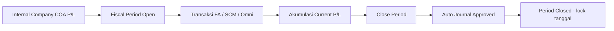
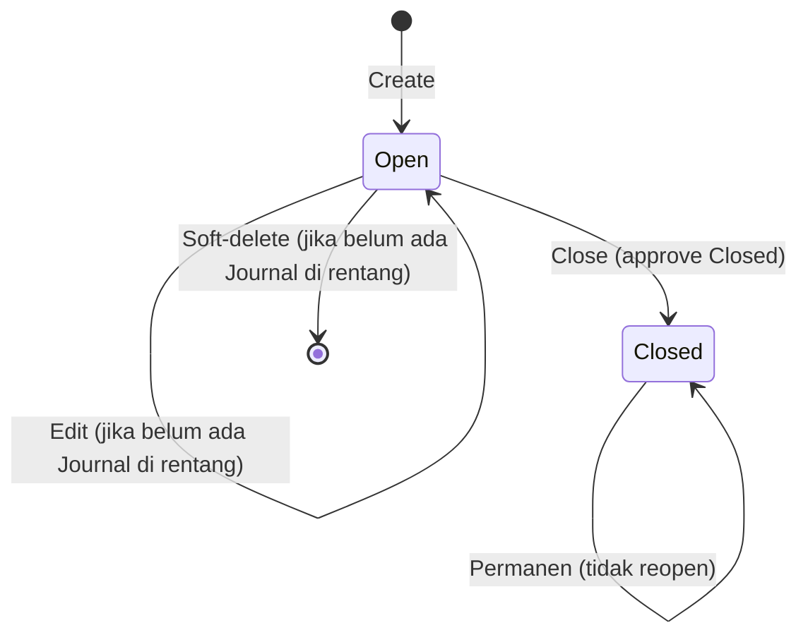
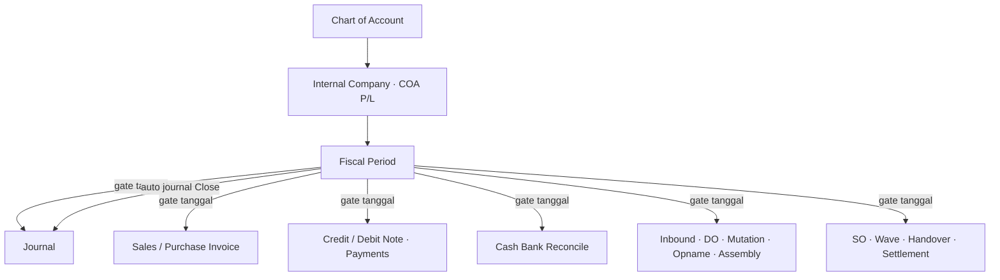

# Fiscal Period — Source of Truth

**Modul:** Finance & Accounting / FA Master  
**Prefix gap:** `FP`  
**UI route:** `/accounting/fiscal-period` ([staging](https://staging.olshoperp.com/accounting/fiscal-period))  
**Audience SOT:** QA/PM/BA (bahan split ke requirement / KB / technical)

> AS-IS mengikuti behavior codebase. Konflik vs raw requirement Yemima dicatat di §9 Gap Registry (`Pending Decision — Yemima`). Section lain mengikuti perilaku yang berjalan di sistem.

---

## 1. Ringkasan Eksekutif

Fiscal Period adalah master rentang tanggal akuntansi (period start sampai period end) per company. Status **Open** memungkinkan create/ubah transaksi yang melibatkan pembukuan pada tanggal di dalam rentang; status **Closed** mengunci tanggal tersebut secara permanen (tidak bisa di-undo) dan memblokir transaksi tambahan di tanggal itu lewat gate global di seluruh modul transactional (Accounting, Supply Chain, Omni). Saat Close, sistem membuat jurnal penutup otomatis (auto-approved) yang memindahkan saldo agregat Current Profit/Loss ke Retained Profit/Loss, lalu men-nol-kan saldo period.



---

## 2. Prasyarat

| Prasyarat | Sumber | Catatan |
|-----------|--------|---------|
| COA **Current Profit/Loss** terisi | Internal / General Company (Accounting Setting) | Wajib sebelum create period dan sebelum close |
| COA **Retained Profit/Loss** terisi | Internal / General Company (Accounting Setting) | Sama; jika salah satu kosong → create/close ditolak |
| Privilege menu Fiscal Period | Gate Role | create / update / delete / approval (Close) |
| Company context login | Token Sanctum | `owned_by` period = company user yang login |

Tanpa minimal satu Fiscal Period yang mencakup tanggal transaksi dan berstatus Open, hampir semua write transactional ditolak oleh gate global (lihat §6.4).

---

## 3. Siklus Status



| Status | Kondisi masuk | Editable? | Tombol di datalist |
|--------|---------------|-----------|-------------------|
| **Open** | Setelah create; default | Ya (name, dates, description) — kecuali sudah ada Journal bertanggal di dalam rentang | Edit, Close, Delete |
| **Closed** | Setelah Close sukses | Tidak | Hanya Show/navigasi; Edit / Delete / Close disembunyikan |

**Catatan Close berurutan (AS-IS):** sistem menolak Close jika masih ada period **Open** lain dengan `period_end` lebih awal dari period yang mau ditutup. Pesan: `Cannot close this fiscal period because there are earlier open periods. <br> Please close all previous open periods first.`

**Reopen:** tidak ada path AS-IS.

---

## 4. Datalist

Fitur DataTablesV3 (sama pola menu master lain):

| Fitur | Ada? | Catatan |
|-------|------|---------|
| Global search | Ya | Filter keyword di datatable |
| Create | Ya | Ke `/accounting/fiscal-period/create` |
| Show deleted | Ya | Soft-deleted rows |
| Column show/hide | Ya | `filter_column` |
| Export | Ya | Default export DataTables |
| Bulk delete | Ya | Checkbox multi-select |

### Kolom

| Kolom | Visible default | Sumber | Keterangan |
|-------|-----------------|--------|------------|
| ID | Tidak | `id` | Auto-inject DataTables |
| Name | Ya | `name` | Judul period |
| Period | Ya | `date_formatted` | Format `DD-Mmm-YYYY - DD-Mmm-YYYY` (contoh `01-Jul-2026 - 31-Jul-2026`) |
| Description | Ya | `description` | Dari form create/edit |
| Status | Ya | `transaction_status` | Badge **Open** / **Closed** |
| Active | Ya | `status_formatted` | Kolom Active standar DataTables (`status` = 1 setelah create) |
| Created By / Created At | Ya | `created_by_formatted` | Standar DataTables |
| Data Owner | Tidak | `owner_company_formatted` | Company pemilik (`owned_by`) |
| Action | Ya | `action` | Edit / Close / Delete (lihat §3); Closed → action ubah disembunyikan |

---

## 5. Form & Field

Halaman create / edit: section **Fiscal Period**.

| Field | Wajib? | Default | Sumber opsi | Validasi | Catatan |
|-------|--------|---------|-------------|----------|---------|
| Name | Ya | — | Freetext | required, max 50 | Contoh placeholder: Closing period juni juli 2023 |
| Start Date | Ya | — | Date picker | required, date | Learn more panel di FE |
| End Date | Ya | — | Date picker | required, date | Learn more panel di FE |
| Description | Tidak | — | Freetext | nullable, max 150 | — |

**Audit Log:** tersedia di edit (slideover).

**Tidak editable setelah Closed** (UI + `can_update` / status Closed).

**Edit diblokir backend** jika ada Journal company bertanggal di dalam rentang period (pesan memakai kata *delete* — lihat GAP-FP-02).

---

## 6. How It Works

### 6.1 Create Fiscal Period

1. User isi Name, Start, End, Description opsional.
2. Sistem cek COA Current Profit/Loss dan Retained Profit/Loss di Accounting Setting company.
3. Sistem cek overlap tanggal dengan period lain (non-deleted, owned_by company yang sama). Overlap jika start atau end jatuh di dalam period lain, atau period baru menelan period lain.
4. Sukses: `transaction_status = Open`, `status = 1`, owner = company login.

Contoh overlap ditolak: sudah ada 1–10 Jul 2026; create 9–31 Jul 2026 → gagal (`The selected date is already in use.`).

### 6.2 Edit Fiscal Period

Hanya period Open. Jika ada Journal di rentang → ditolak. Jika overlap dengan period lain (exclude self) → ditolak. Update sukses tetap memaksa status Open.

### 6.3 Delete Fiscal Period

Soft-delete. Ditolak jika ada Journal company bertanggal di dalam rentang period (pesan: `Cannot delete fiscal period data because there are existing transactions within this period's date range.`).

UI tidak menampilkan Delete untuk period Closed.

**Scope cek “transaksi” AS-IS = Journal saja** (bukan seluruh dokumen SCM/Omni). Lihat GAP-FP-01.

### 6.4 Gate global tanggal transaksi

Setiap create/update/approve transactional yang memakai helper gate tanggal:

| # | Kondisi | Pesan |
|---|---------|-------|
| 1 | Company tidak ketemu | `Company not found.` |
| 2 | Company punya 0 fiscal period | `To create any transaction in OlshopERP, an active fiscal period must exist.` |
| 3 | Format tanggal invalid | `Invalid transaction date format.` |
| 4 | Tanggal lebih tua dari 6 bulan ke belakang dari hari ini | `Transaction date must be within the past 6 months.` |
| 5 | Tanggal di period Open | Lolos |
| 6 | Tanggal di period Closed | `Fiscal period {date} is already closed.` |
| 7 | Tanggal tidak masuk period mana pun | `Date must be in an active fiscal period.` |

Aturan 6 bulan berlaku di **semua** pemanggil gate, bukan hanya UI Fiscal Period.

### 6.5 Close Period (irreversible)

1. Privilege approval.
2. Payload approval status = Closed (description max 150).
3. Cek COA P/L configured.
4. Cek tidak ada Open period dengan end lebih awal.
5. Dalam satu DB transaction:
   - Generate Journal (Open dulu) tanggal = end of day `period_end`, primary currency, rate 1, description auto-system.
   - Detail jurnal dari nilai `current_profit_loss` period **saat close**:
     - Jika nilai **kurang dari 0**: Credit Current P/L, Debit Retained P/L (amount abs).
     - Selain itu (termasuk 0 / positif): Debit Current P/L, Credit Retained P/L (amount abs).
   - Auto-approve Journal.
   - Set `current_profit_loss` period = 0.
   - Set fiscal period status = Closed.
6. Success message closed document.

**Tidak bisa undo / reopen.**

Raw requirement menyebutkan selalu Debit Current + Credit Retained; AS-IS bergantung tanda saldo — GAP-FP-03.

### 6.6 Urutan validasi vs Cash Bank Reconcile

Pada create Cash Bank Reconcile: sistem memanggil gate Fiscal Period untuk start dan end period **sebelum** cek overlap antar dokumen CBR. Jadi fiscal period dibaca lebih dulu; create CBR gagal jika tanggal di luar Open period / closed / tidak ada period.

Period lock khusus CBR setelah Approve (GAP di menu CBR) adalah concern terpisah — bukan pengganti gate Fiscal Period.

Pada approve Journal: gate Fiscal Period dijalankan sebelum cek lock Cash Bank Reconcile.

---

## 7. Validasi

### 7.1 Di menu Fiscal Period

| ID | Kondisi | Behavior | Error message |
|----|---------|----------|---------------|
| V-01 | Name kosong / lebih dari 50 | Reject | Laravel validation |
| V-02 | Start / End kosong atau bukan date | Reject | Laravel validation |
| V-03 | Description lebih dari 150 | Reject | Laravel validation |
| V-04 | COA Current P/L atau Retained P/L belum di-set | Reject create/close | `Please configure your Profit/Loss COA accounts in Accounting Settings first.` |
| V-05 | Rentang tanggal overlap period lain (non-deleted, same company) | Reject create/update | `The selected date is already in use.` (+ field `date`) |
| V-06 | Update/delete saat ada Journal di rentang | Reject | `Cannot delete fiscal period data because there are existing transactions within this period's date range.` |
| V-07 | Close saat masih ada Open period dengan end lebih awal | Reject | `Cannot close this fiscal period because there are earlier open periods. <br> Please close all previous open periods first.` |
| V-08 | Close saat `can_closed` false | Reject | `This fiscal perios and it's properties already closed, you can't modify this data anymore.` (typo *perios* di kode — GAP-FP-04) |
| V-09 | Close sukses | Status Closed + auto journal | `The document has been successfully closed.` |

### 7.2 Gate konsumen (ringkas)

Lihat tabel §6.4 — pesan harus dikutip persis saat QA regression di menu lain.

---

## 8. Relasi Menu Lain



| Menu | Peran dalam relasi |
|------|-------------------|
| Internal / General Company | Prasyarat COA Current P/L & Retained P/L |
| Chart of Account | COA yang di-mapping ke setting di atas |
| Journal | Konsumen gate tanggal; penerima auto-journal Close |
| Sales Invoice / Purchase Invoice / Credit Note / Debit Note / Payments / Sales Return / Purchase Return / Instant Settlement / Inbound Value Adjustment | Konsumen gate tanggal |
| Cash Bank Reconcile | Create cek fiscal dulu; lock CBR sendiri terpisah (lihat docs CBR) |
| Trial Balance / Balance Sheet / GL | Baca saldo; Current P/L sering terkait period |
| Purchase Inbound / Delivery Order / Stock Mutation / Stock Opname / Failed Ship / Assembly / Manual Picking | Konsumen gate tanggal SCM |
| Sales Order / Unassign Wave / Skip Wave / Handover / Settlement jobs | Konsumen gate tanggal Omni |
| Purchase Invoice / Journal (qa-docs) | Menyebut Fiscal Period sebagai prasyarat tanggal aktif |

---

## 9. Gap Registry

| ID | Deskripsi | Type | Dampak | Status |
|----|-----------|------|--------|--------|
| GAP-FP-01 | Requirement: delete diblokir jika ada **transaksi** apa pun di tanggal period. Codebase: cek hanya **Journal** (`transaction_date` di rentang); dokumen SCM/Omni tanpa journal tidak memblokir delete. | Contradiction | Period bisa terhapus meski ada transaksi operasional non-journal di rentang | Pending Decision — Yemima |
| GAP-FP-02 | Pesan block update memakai copy *Cannot delete fiscal period…* (sama dengan delete). | Unverified / UX | Confusing saat edit gagal | Open |
| GAP-FP-03 | Requirement: Close selalu Debit Current P/L, Credit Retained P/L dari ending balance. Codebase: jika `current_profit_loss` kurang dari 0 maka **Credit** Current / **Debit** Retained; selain itu Debit Current / Credit Retained. | Contradiction | Dokumentasi jurnal penutup harus jelas untuk QA | Pending Decision — Yemima |
| GAP-FP-04 | Typo message: `fiscal perios`. | Unverified | Copy error ke user | Open |
| GAP-FP-05 | FE Learn more mendeskripsikan closing klasik (close revenue, expense, income summary, dividends). Codebase hanya transfer agregat Current P/L ↔ Retained P/L. | Contradiction | Ekspektasi user vs behavior | Pending Decision — Yemima |
| GAP-FP-06 | `can_closed` untuk Fiscal Period true selama user punya privilege approval — **tidak** mengecek sudah Closed. UI menyembunyikan tombol; API ulang Close berpotensi generate journal lagi (amount 0). | Missing Behavior | Hardening API | Open |
| GAP-FP-07 | Tidak ada validasi eksplisit `period_start` tidak boleh setelah `period_end` di create/update Fiscal Period. | Missing Behavior | Period terbalik mungkin tersimpan | Open |
| GAP-FP-08 | Docs QA folder menu masih draft/pending; SOT ini bahan split. | — | Tracking proses dokumentasi | Closed — 5-file review 2026-08-07 |

---

## 10. FAQ

**Q: Kenapa transaksi saya ditolak padahal sudah create fiscal period?**  
A: Tanggal transaksi harus jatuh di period berstatus Open, tidak lebih tua dari 6 bulan ke belakang, dan COA P/L sudah di-set. Cek juga apakah period untuk tanggal itu sudah Closed.

**Q: Bisa buka lagi period yang sudah Closed?**  
A: Tidak. Close bersifat final.

**Q: Kenapa tidak bisa Close Juli padahal Juni masih Open?**  
A: Sistem mewajibkan menutup period Open yang berakhir lebih dulu terlebih dahulu.

**Q: Kenapa tidak bisa hapus period?**  
A: Biasanya karena sudah ada Journal di tanggal dalam rentang itu. Pesan sistem menjelaskan ada existing transactions in date range.

**Q: Apa bedanya Fiscal Period dengan period di Cash Bank Reconcile?**  
A: Fiscal Period mengunci tanggal transaksi di hampir seluruh OlshopERP. Period CBR adalah rentang rekonsiliasi per akun bank — create CBR tetap harus lolos gate Fiscal Period dulu.

**Q: Apa yang terjadi ke laba rugi saat Close?**  
A: Sistem memindahkan saldo Current Profit/Loss period ke Retained Profit/Loss lewat jurnal otomatis yang langsung approved, lalu saldo Current P/L period di-nol-kan.

---

## 11. Changelog

| Tanggal | Versi | Perubahan |
|---------|-------|-----------|
| 2026-08-07 | 1.0 | Draft awal SOT dari raw requirement Yemima + verifikasi codebase (controller, helper gate, FE DataList/Form, CBR create order) |

---

## 12. Knowledge Base Hints (untuk operator)

### Istilah teknis → padanan awam

| Teknis | Awam |
|--------|------|
| Fiscal Period Open | Periode pembukuan masih terbuka — transaksi boleh |
| Fiscal Period Closed | Periode terkunci permanen — tidak boleh transaksi baru di tanggal itu |
| Current Profit/Loss | Akun laba/rugi berjalan di setting Internal Company |
| Retained Profit/Loss | Akun laba ditahan di setting Internal Company |
| Auto journal Close | Jurnal otomatis saat tutup periode (langsung approved) |
| Gate tanggal / validate fiscal | Cek sistem: tanggal transaksi harus di periode Open |
| Overlap date | Rentang tanggal bentrok dengan periode lain |
| Soft-delete | Hapus dari tampilan aktif, masih bisa Show deleted |

### Troubleshooting

| Gejala | Penyebab umum | Solusi |
|--------|---------------|--------|
| Tidak bisa create period | COA P/L belum di-set | Isi Current & Retained Profit/Loss di Internal Company |
| Error date already in use | Bentrok rentang | Ubah start/end agar tidak overlap |
| Tidak bisa Close | Masih ada period Open lebih awal | Close period sebelumnya dulu |
| Transaksi ditolak fiscal closed | Tanggal di period Closed | Pakai tanggal di period Open; Closed tidak bisa dibuka |
| Transaksi ditolak 6 months | Tanggal terlalu lama | Geser tanggal ke dalam 6 bulan terakhir (dan tetap di Open period) |
| Tidak bisa delete period | Sudah ada journal di rentang | Jangan hapus; biarkan / Closed saja |

### Field skip di KB

- `current_profit_loss` (internal akumulasi)
- `can_closed` / privilege cache
- Detail signed Debit/Credit (kecuali Yemima putuskan copy awam setelah GAP-FP-03)

---

## 13. Technical Hints (untuk developer)

### Area codebase relevan

| Layer | Path / simbol |
|-------|----------------|
| Controller | `Modules/Accounting/Http/Controllers/FiscalPeriodController.php` (`index`, `store`, `update`, `destroy`, `approve`, `autoGenerateJournal`, `show`) |
| Entity | `Modules/Accounting/Entities/FiscalPeriod.php` · table `accounting_fiscal_periods` |
| Policy | `Modules/Accounting/Policies/FiscalPeriodPolicy.php` |
| Routes | `Modules/Accounting/Routes/api.php` — resource `fiscal-period` + `POST fiscal-period/{id}/approve` |
| Gate global | `validate_fiscal_period()` di `app/Helpers/MainHelper.php` |
| can_closed | `App\MainModel::canClosed` (cabang khusus `instanceof FiscalPeriod`) |
| COA resolve | `Company::coa_company_name('Current Profit/Loss' \| 'Retained Profit/Loss')` |
| FE | `olshoperp-frontend/src/pages/Accounting/master/FiscalPeriod/DataList.vue`, `Form.vue` |
| CBR create order | `CashBankReconciliationController` — `validate_fiscal_period` sebelum overlap CBR |
| Journal approve order | `JournalController` — fiscal lalu `validate_cash_bank_reconcile_lock` |

### Invariants

- Tidak ada dua period non-deleted same company dengan rentang tanggal yang overlap.
- Tanggal transaksi write lolos gate hanya jika berada di period Open dan tidak lebih tua dari 6 bulan.
- Setelah Close sukses: `transaction_status = closed` dan `current_profit_loss = 0`.
- Auto-journal Close: tepat 2 baris detail; Σ Debit = Σ Credit = abs(`current_profit_loss` sebelum reset).
- Closed period tidak bisa reopen (tidak ada API reopen).

### Failure modes

- Create/close tanpa COA P/L → error, no write.
- Overlap → error, no write.
- Close dengan earlier Open → error sebelum journal.
- `autoGenerateJournal` + `approve` FiscalPeriod dalam satu `DB::beginTransaction` — gagal di tengah → rollback transaction controller (pastikan JournalController approve tidak commit terpisah yang merusak atomicity — review saat harden).
- Delete/update dengan journal conflict → error, data tetap.
- Soft-delete period tidak menghapus journal historis.

### Data lifecycle lintas dokumen

| Event | Efek field / dokumen |
|-------|----------------------|
| Create FP | `transaction_status=open`, `status=1`, `owned_by=company` |
| Transaksi journal di rentang | Memblokir update/delete FP; mengisi konteks P/L period (proses terpisah) |
| Close FP | Journal auto approved; `current_profit_loss→0`; FP `closed` |
| Gate di menu lain | Tolak write jika tanggal di closed / di luar period / lebih dari 6 bulan |

---

## 14. Referensi Struktur untuk Proses Split

```
Section 1-11 → material utama untuk requirement.md
Section 5, 6, 7, 10 → adaptasi ke knowledge-base.md dengan tone awam (lihat Section 12)
Section 13 Technical Hints → seed untuk technical.md, sudah pakai path/nama real
Frontmatter YAML di atas → copy ke 3 file utama (+ user-guide.md kalau gate review/final), sinkronkan version + last_updated
Golden reference tone & struktur: docs/qa-docs/accounting-supplier-invoice/
```
