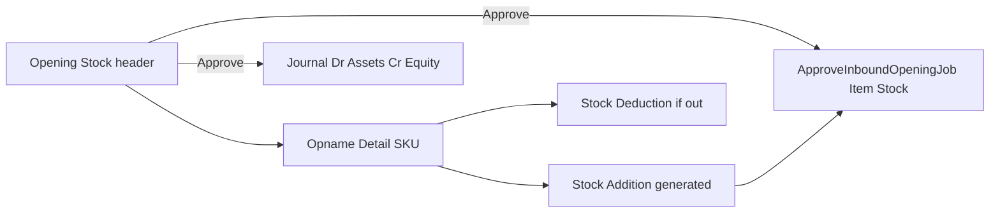
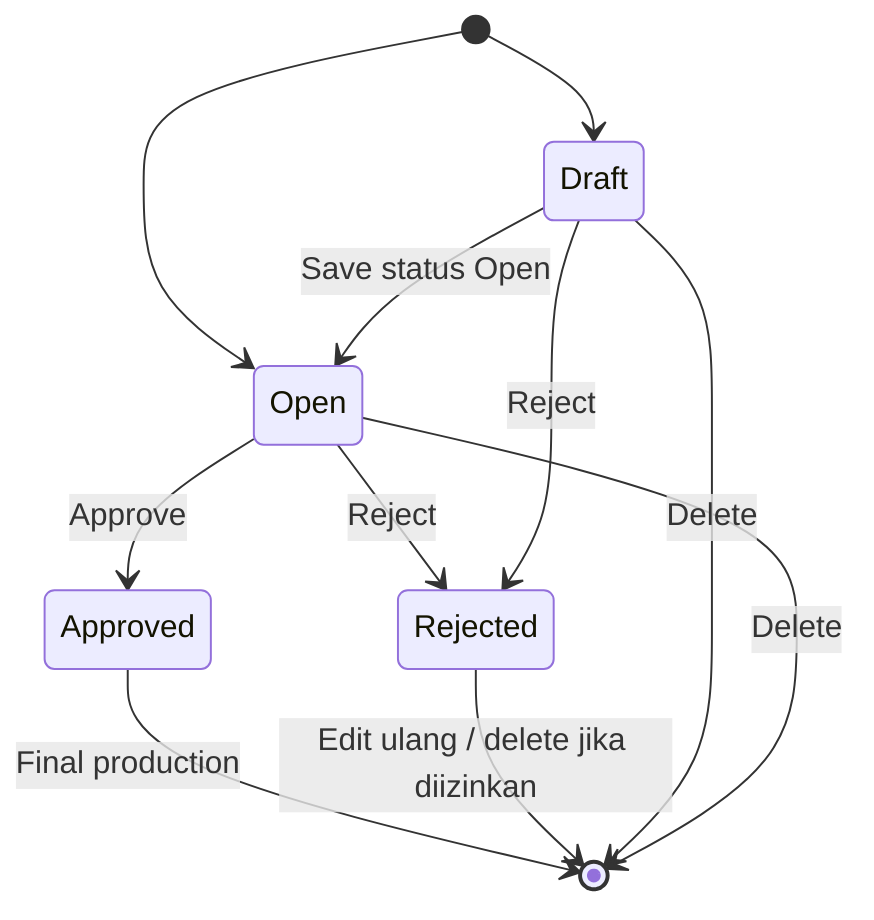
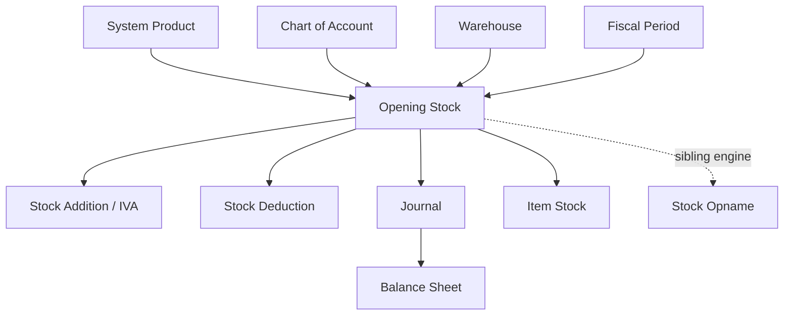

# Opening Stock — Source of Truth

## 1. Ringkasan Eksekutif

**Opening Stock** mencatat **saldo awal persediaan & stock** saat mulai inventory accounting: qty + unit price per SKU/lokasi, lalu setelah approve menghasilkan **Stock Addition (± Deduction)**, **Item Stock** (async job), dan **satu jurnal opening**. Engine AS-IS = reuse **Stock Opname** dengan flag `is_opening_stock` (header tanpa Building Origin, wajib `OpeningStockCoa`, kode prefix **`OS`**).

Route produksi: `/accounting/opening-stock` (FA). **Standalone** — tidak punya sumber Stock Opname / Sales Return (keputusan OI). **Approved = final** (tidak reverse/cancel di production). Audience: Finance (create + approve di menu yang sama AS-IS).



## 2. Prasyarat

| Prerequisite | Sumber | Catatan |
|--------------|--------|---------|
| COA leaf class **Assets** (Debit) & **Equity** (Credit) | Chart of Account | Select2 child Assets / Equity — wajib di header AS-IS |
| Fiscal period terbuka untuk Trx Date | Fiscal Period | Gate create / update / approve |
| System Product Active, type Single/Variant (bukan Service / Parent Bundle / Random) | System Product | Detail SKU |
| Unit stock / alternate aktif di product | Master Unit | Default primary unit |
| Warehouse Active, level rack terkecil (`space type level` ≥ 20), non-virtual | Warehouse Structure | Location per detail; tanpa Building Origin di header |
| Privilege Opening Stock (view/create/update/delete/approval) | Gate `accounting/opening-stock` | Entity `OpeningStock` |
| Product COA Group (inventory) | Product COA | Dipakai path Addition standar; **jurnal opening AS-IS tidak** Debit per Product COA (GAP-OS-01) |

## 3. Siklus Status



| Status | Editable? | Tombol / efek |
|--------|-----------|---------------|
| **draft** / **open** | Ya (`can_update`) | Edit, Delete, Approve/Reject; Item Stock Status = `-` |
| **approved** | Tidak | Show; Item Stock Status progress/check; journal + generated Addition/Deduction; **final** (unapprove hanya local/dev) |
| **rejected** | Ya (pola opname) | Edit ulang / delete sesuai privilege |
| Soft-deleted | — | Show deleted di datalist |

## 4. Datalist

**Route:** `/accounting/opening-stock` · Komponen shared Stock Opname (`menu="openingStock"`).

### 4.1 Fitur toolbar

| Fitur | Ada? |
|-------|------|
| Global Search | Ya (DataTables) |
| Advanced Filter / Search Builder | Ya |
| Create | Ya → `/accounting/opening-stock/create` |
| Show deleted | Ya |
| Column show/hide | Ya |
| Export | Ya — With / Without Details (async, menu label `Opening Stock`) |
| Bulk delete / bulk approve | Ya |
| Multi select | Ya |

### 4.2 Kolom datatable

| Kolom UI | Visible default | Sumber / relasi |
|----------|-----------------|-----------------|
| TRX. DATE (sort helper) | **false** | `transaction_date` untuk sort/filter |
| **Trx Code \| Trx Date** | **true** | `code` + tanggal; link edit. Prefix **`OS`**. Relasi: header `scm_stock_mutations` |
| PRODUCT | **false** | Ringkas produk detail (search/export helper) |
| Building Origin | — | **Tidak ada** di Opening Stock (hanya Stock Opname biasa) |
| **Description** | true | Deskripsi header |
| **Qty** | true | Agregasi qty detail |
| **Trx Status** | true | Badge status; unapprove hook jika env non-prod |
| **Item Stock Status** | true (**hanya** Opening Stock) | Indikator generate Item Stock selesai setelah approve (job async — ribuan SKU). Draft/Open = `-`; Approved = icon + tooltip progress count inbound detail vs Item Stock |
| **Generated Trx** | true | Link/kode **Stock Addition** (± Deduction) yang di-auto dari detail; tooltip: child trx + journal masing-masing |
| GL Trx | — | Kolom FA Stock Opname Approval — **tidak** di-splice untuk `openingStock` |
| **Created by \| Created at** | true (default columns) | User + waktu create |
| **Updated by \| Updated at** | true (default) | User + waktu update |
| **Action** | true | Edit / Delete / Approve sesuai `can_*` |

Filter list BE: `is_opname=1` + `warehouse_origin IS NULL` + `whereHas(openingStockCoa)`.

## 5. Form & Field

### 5.1 Basic Information (Create / Edit)

| Field | Required | Aturan AS-IS | Catatan vs requirement |
|-------|----------|--------------|------------------------|
| Transaction Code | Auto | `generateCode(…, 'OS')` → `OS-` + hex timestamp; editable sampai belum approved | Locked ikut AS-IS (GAP-OS-05 resolved) |
| Transaction Date | Ya | + fiscal period | — |
| **Opening Balance COA Debit** | Ya | Select2 **Assets** leaf only | Req AC2 hanya 1 field Equity credit + Debit Product COA per SKU (GAP-OS-01) |
| **Opening Balance COA Credit** | Ya | Select2 **Equity** leaf only | Selaras intent credit Equity |
| Description | Tidak | max 150 | — |
| Attachment | Tidak | Extensi file standar | — |
| Building Origin / Location Destination header | **Tidak ada** | `warehouse_origin` di-force null | Selaras AC4 / T12 |

Default COA: dari Opening Stock terakhir (`getDefaultValues`). Tippy: Debit = Assets; Credit = Equity (GAP-OS-02 fixed).

### 5.2 Opening Stock Detail

| Field / kolom | Editable? | Arti |
|---------------|-----------|------|
| Select Product / System Product SKU \| Name | Add | Active Single & Variant; tolak Service & random |
| **Unit Price** | Inline edit | Default null → diisi user; **whole numbers**; tampil di menu Opening Stock (FA) — `menu !== 'scm'` |
| **Availability** | Read | Stok realtime SKU di lokasi terkait |
| **Transaction Stock** | Read | Snapshot availability saat baris di-insert (`origin_available`) |
| **Expected Stock** | Inline | Qty expected user; `adjustment = expected − transaction stock` |
| **Adjustment Qty** | Read | Expected − stock capture; +in / −out → generate Addition / Deduction |
| **Unit** | Ya | Default primary; boleh alternate unit aktif product |
| **Location** | Ya | WH rack Active; **tanpa** batasan struktur header (origin null → select2 semua eligible) |
| Generated Trx (detail) | Visible false | Ref child Addition/Deduction |

**Import detail:** template pola Stock Opname / Addition (Product ID opsional, SKU, Qty, Unit, Location, Expired optional). Opening Stock: **skip** batas max row opname 500; **skip** `validatProductInTransaction` (SKU boleh meski ada Addition open).

## 6. How It Works

### 6.1 Konsep vs Stock Addition / Stock Opname

| Aspek | Stock Addition | Opening Stock (AS-IS) | Requirement (TO-BE intent) |
|-------|----------------|----------------------|----------------------------|
| Base engine | Addition | **Stock Opname** + flag opening | “Base Stock Addition” — framing beda (GAP-OS-03) |
| Max detail | ~100–500 | **Skip** max 500 di path opening | Unlimited (ribuan) — selaras arah AS-IS |
| Kredit jurnal | Inventory Adjustment product setting | **1 Equity COA** header | Equity COA |
| Debit jurnal | Product inventory COA | **1 Assets COA** header | Product COA Group **per SKU** (GAP-OS-01) |
| Open Addition block | Ya | **Skip** | Skip (AC3) |
| Location header | Destination di header | Tidak | Tidak |
| Relasi sumber | Bisa Opname / Sales Return | **Standalone** (OI locked) | Standalone |

### 6.2 Adjustment & generated child

1. User isi Expected Stock → Adjustment Qty = Expected − Transaction Stock.  
2. Adjustment **+** → generate **Stock Addition** (ref Opening Stock detail).  
3. Adjustment **−** → generate **Stock Deduction**.  
4. Stock ID / Item Stock dibuat **setelah Approve** via job (`ApproveInboundOpeningJob`) — karena bisa ribuan baris.

### 6.3 Approve (AC6 AS-IS)

1. Validasi: ada detail; WH destination terisi & Active; fiscal period; qty match child docs; unit price whole; bukan Service.  
2. Approve tiap Addition (opening) → dispatch job Item Stock (**tanpa** `stockInboundAutoJournal` standar).  
3. Hitung `OpeningStockCoa.total_debit/credit` = Σ (unit price × qty base) detail **in**.  
4. `openingStockAutoJournal`: **Dr** COA Debit Assets, **Cr** COA Credit Equity (satu pasangan untuk seluruh transaksi); journal auto-approved; date = Trx Date OS.  
5. Pesan: *Opening stock has been generated in background.*  
6. Reject → status Rejected, tanpa journal.

### 6.4 Location rules (AC4)

| Rule | AS-IS |
|------|--------|
| Hanya di detail | Ya |
| Level rack terkecil Active | Select2 `space type level ≥ 20`, `status=1`, `is_virtual=0` |
| Bebas struktur (tanpa Building Origin) | Ya — origin null → tidak filter child-of-building |
| Owner ID = company transaksi | WH biasanya scoped company; pesan error exact *"This warehouse belongs to a different company…"* **belum diverifikasi sebagai string tetap** (GAP-OS-06) |

### 6.5 Contoh kasus (requirement + AS-IS)

| # | Situasi | Expected |
|---|---------|----------|
| T01 | 500+ row SKU | Insert OK — max 500 opname **di-skip** untuk opening |
| T02 | SKU masih punya Addition Open | Boleh insert (skip validasi open addition) |
| T03 | Location 2 struktur WH, 1 owner | Boleh |
| T04 | Location beda owner/company | Tolak (cek pesan GAP-OS-06) |
| T05 | COA Credit hanya Equity | Dropdown Equity only |
| T06 | Approve 3 SKU | 3 Item Stock (job) + **1 journal** Dr/Cr COA header (bukan 3 Debit Product COA — GAP-OS-01) |
| T07/T08 | SCM hide COA & Unit Price vs FA show | **AS-IS:** hanya menu FA Opening Stock; COA & Unit Price tampil. Tidak ada menu SCM Opening Stock terpisah (GAP-OS-04) |
| T09 | Import 1000 row | Path opening skip max 500 |
| T10 | Import WH beda owner | Row error |
| T11 | Trx Code | Prefix `OS-` + hex timestamp (AS-IS) |
| T12 | Header tanpa Location Destination | Ya |

**OI locked:** standalone only; Approved = final.

## 7. Validasi

| Kondisi | Behavior / pesan (arah) |
|---------|-------------------------|
| Trx Date di luar fiscal | Blok create/update/approve |
| COA Debit/Credit kosong (opening) | requiredIf opening |
| Product Service / random | Ditolak |
| Qty / unit price desimal | Blok (whole numbers) |
| Duplikat product + same WH destination | *Product has been added…* |
| Approve tanpa detail / WH null / WH inactive | Blok |
| Qty child Addition/Deduction mismatch | *failed to generate addition or deduction* |
| Sudah approved | *can't modify* |
| Concurrent approve | Cache — tunggu |
| Export kosong | *data not found* |

## 8. Relasi Menu Lain



| Menu | Relasi |
|------|--------|
| Stock Opname / Stock Opname Approval | Engine & UI shared; data filter beda |
| Stock Addition / Inbound Value Adjustment | Child generated; path opening skip journal inbound standar |
| Stock Deduction | Child jika adjustment out |
| Journal | Auto opening journal |
| Item Stock / Stock Monitoring | Hasil job post-approve |
| Balance Sheet | Naik Assets & Equity setelah journal |
| Chart of Account / Fiscal Period / Warehouse / System Product | Master prasyarat |

**Bukan sumber:** Sales Return / Stock Opname sebagai parent dokumen Opening Stock (standalone).

## 9. Gap Registry

| ID | Deskripsi | Type | Dampak | Status |
|----|-----------|------|--------|--------|
| GAP-OS-01 | **Jurnal Debit:** AS-IS `openingStockAutoJournal` **selalu** pakai `OpeningStockCoa.coa_debit_id` + `coa_credit_id` (1 pasangan header). FE+BE **wajibkan** Debit Assets + Credit Equity saat create/update — **tidak ada** cabang “Debit kosong → Product COA per SKU”. Hipotesis user (fallback per SKU jika Debit kosong) **belum ditemukan di kode**. Requirement AC2 tetap = Debit Product COA per SKU + Credit Equity saja → masih beda AS-IS | Contradiction / Unverified | Format journal & field header | Pending Decision — Yemima (pertahankan AS-IS 2 COA header, atau ubah ke Product COA per SKU?) |
| GAP-OS-02 | Tippy Debit/Credit sempat tertukar — **fixed**: Debit tippy = Assets; Credit tippy = Equity | Bug | Confuse user | **Resolved** — FE FormComponen tippy corrected |
| GAP-OS-03 | Requirement framing “base Stock Addition”; AS-IS implementasi **Stock Opname** + generate Addition/Deduction | Contradiction (docs) | Scope QA / regression | Resolved for SOT — document AS-IS engine Opname |
| GAP-OS-04 | Requirement sempat sebut menu SCM + dual hide COA (T07/T08). **Clarified:** menu produksi = FA [`/accounting/opening-stock`](https://staging.olshoperp.com/accounting/opening-stock); “relasi SCM” = Generated Trx ke Stock Addition/Deduction (bukan menu Opening Stock terpisah di SCM) | Confirmed clarification | Sidebar / T07–T08 | **Resolved** — satu menu FA; T07/T08 out of scope AS-IS |
| GAP-OS-05 | Format code: ikut AS-IS `generateCode(..., 'OS')` → `OS-` + hex unix timestamp (`generateSimpleCode`). Contoh requirement `OS-20240501` **tidak** dipakai | Confirmed (follow codebase) | Identifikasi dokumen | **Resolved** — document AS-IS only |
| GAP-OS-06 | Pesan error WH beda company exact string requirement belum dipastikan di path Opening Stock select2 | Unverified | T04/T10 | Open — verify staging |
| GAP-OS-07 | Performa UI ribuan row (pagination / virtualized) — wajib dipertimbangkan; AS-IS detail PrimeVue bisa berat | High Risk / Missing Behavior | UX timeout | Open — note for Dev |
| GAP-OS-08 | `OpeningStockController::validate_max_details` masih `max_child` 100 tetapi **tidak terlihat dipanggil**; path store detail opening skip 500 — monitor regress | Unverified | Kapasitas | Open — keep watch |
| GAP-OS-09 | Pesan error update WH/date masih menyebut “stock opname” | Bug / UX | Copy | Open |
| GAP-OS-10 | OI: standalone + Approved final | Confirmed | Lifecycle | **Resolved** — locked §1 / §3 / §6 |

## 10. FAQ

**Q: Bedanya dengan Stock Opname?**  
A: Opname rutin butuh Building Origin, kode `SP`, tanpa COA opening. Opening Stock = saldo awal, tanpa origin, wajib COA Assets/Equity, kode `OS`, Item Stock Status di list.

**Q: Kenapa ada Stock Addition setelah Opening Stock?**  
A: Engine generate child Addition/Deduction dari Adjustment Qty; Stock ID dibuat dari situ (plus job khusus opening).

**Q: Bisa ribuan SKU?**  
A: Ya — path opening melewati batas max detail opname. Tetap waspadai performa UI/job (GAP-OS-07).

**Q: Bisa cancel setelah Approved?**  
A: Tidak di production — final. Unapprove hanya environment local/development.

**Q: Ada menu Opening Stock di SCM?**  
A: Tidak. Menu resmi FA: `/accounting/opening-stock`. Yang terlihat di SCM = dokumen **Stock Addition / Deduction** hasil generate (Generated Trx), bukan menu Opening Stock terpisah.

**Q: Kalau COA Debit dikosongkan, apakah Debit jurnal pakai COA inventory per SKU?**  
A: Di kode saat ini **tidak**. Debit & Credit header **wajib** diisi; jurnal opening memakai kedua COA itu. Tidak ada fallback Product COA Group di `openingStockAutoJournal`.

## 11. Changelog

| Version | Date | Changes |
|---------|------|---------|
| 1.0 | 2026-08-13 | Initial SOT: AS-IS Opening Stock (Opname engine) + requirement Addition-like ACs; OI standalone/final locked; Gap jurnal COA & menu SCM |
| 1.0b | 2026-08-13 | Clarify OS-01 (no SKU COA fallback), OS-04 resolved (FA menu only; SCM = generated child), explain OS-02 tippy / OS-05 code format |
| 1.0c | 2026-08-13 | Fix tippy Debit/Credit (OS-02); lock Trx Code format to generateSimpleCode AS-IS (OS-05) |

## 12. Knowledge Base Hints

### Kamus

| Istilah | Awam |
|---------|------|
| Opening Stock | Input stok & nilai awal gudang + jurnal modal/equity |
| Expected Stock | Qty yang diinginkan setelah opening |
| Adjustment Qty | Selisih expected vs stok yang tercatat saat baris dibuat |
| Transaction Stock | Snapshot stok saat insert baris (bukan realtime) |
| Availability | Stok realtime sekarang |
| Item Stock Status | Apakah generate Stock ID dari job sudah selesai |
| Generated Trx | Dokumen Addition/Deduction turunan |
| Opening Balance COA Debit/Credit | Akun Debit Assets & Credit Equity di jurnal opening |

### Troubleshooting

| Gejala | Cek |
|--------|-----|
| Tidak bisa approve | Detail kosong? Location kosong? Fiscal period? Unit price desimal? |
| Item Stock Status lama loading | Job queue Horizon; jumlah detail besar |
| Angka journal salah | Total = Σ price × qty **in**; cek COA header |
| SKU ditolak padahal Opening Stock | Pastikan bukan Service/random; cek duplikat SKU+lokasi |
| Tidak ada Building Origin | By design Opening Stock |

### Skip di KB

Path class, cache approve key, namespace import, tippy HTML.

## 13. Technical Hints

### File map

| Layer | Path / nama |
|-------|-------------|
| FE shell | `olshoperp-frontend/src/pages/Accounting/OpeningStock/{DataList,Form}.vue` |
| FE shared | `…/SCM/StockOpname/{DataListComponen,FormComponen,DatalistDetail}.vue` (`menu=openingStock`) |
| Controller | `OpeningStockController`, `OpeningStockDetailController` → Stock Opname engine |
| Engine | `StockOpnameController` / `StockOpnameDetailController` (`is_opening_stock`) |
| Entity | `OpeningStock` extends `StockMutation`; `OpeningStockCoa` |
| Journal | `JournalProcess::openingStockAutoJournal` |
| Item stock | `ApproveInboundOpeningJob` via `ItemStockMutation::approveInbound` |
| Policy | `OpeningStockPolicy` |
| Export | `OpeningStockExportJob`, `OpeningStockExport` |
| Import | `OpeningStockImport` / Stock Opname detail import `menu=openingStock` |

### Invariants

1. List: opname + `warehouse_origin` null + has `OpeningStockCoa`.  
2. Code identifier `OS`.  
3. Approve opening: skip max detail pada Addition approve; skip open-addition product validation.  
4. Journal opening = satu Dr Assets + satu Cr Equity dari `OpeningStockCoa` totals.  
5. Approved final di production.  
6. Standalone — tidak require parent Opname/Sales Return.

### Failure modes

| Mode | Sumber |
|------|--------|
| ValidationException fiscal / COA / WH / qty | Controllers |
| Failed generate addition/deduction | Approve mismatch |
| Background job lag | Item Stock Status |
| Tippy misleading | FE FormComponen |

### Data lifecycle

Create OS header → detail → auto Addition/Deduction (draft/open) → Approve OS → approve child Addition (job Item Stock) + opening journal Approved → stok & neraca terisi.

## 14. Referensi Struktur untuk Proses Split

```
Section 1-11 → material utama untuk requirement.md
Section 5, 6, 7, 10 → adaptasi ke knowledge-base.md dengan tone awam (lihat Section 12)
Section 13 Technical Hints → seed untuk technical.md, sudah pakai path/nama real
Frontmatter YAML di atas → copy ke 3 file utama (+ user-guide.md kalau gate review/final), sinkronkan version + last_updated
Golden reference tone & struktur: docs/qa-docs/accounting-supplier-invoice/
```
