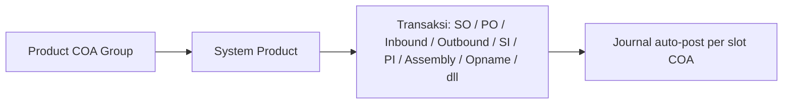
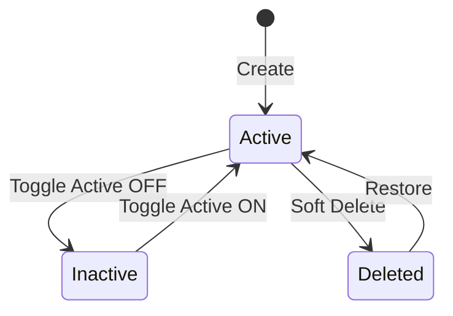
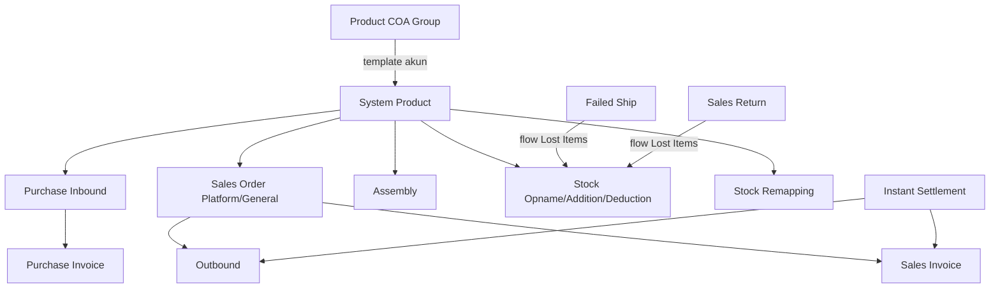

# Product COA Group — Source of Truth

## 1. Ringkasan Eksekutif

Product COA Group adalah menu master yang berfungsi sebagai template mapping akun (COA) per tipe produk system product — Purchased Item, Manufactured Item, Service, dan Fix Asset. Setiap group menyimpan sejumlah slot Transaction COA (Sales, Inventory, COGS, Work In Progress, dan lain-lain) yang masing-masing diikat ke satu akun Chart of Account (leaf). Saat System Product di-assign ke sebuah Product COA Group, konfigurasi akun ini disalin jadi identitas akun produk tersebut, lalu dipakai otomatis oleh sistem untuk membentuk jurnal setiap kali produk itu diproses di transaksi seperti Sales Order, Sales Invoice, Purchase Order, Purchase Inbound, Outbound, Stock Opname, Assembly, Stock Addition, Stock Deduction, Failed Ship, Sales Return, dan Purchase Return. Audience utama: tim Finance/Accounting yang menyiapkan setup akun sebelum modul transaksional bisa dipakai.



## 2. Prasyarat

| Prasyarat | Sumber | Catatan |
|---|---|---|
| Chart of Account leaf per class terkait (Revenue, Expense/COGS, Assets, Liabilities, Equity, Passiva) | Master Chart of Account | Wajib leaf (bukan parent), tidak boleh COA yang di-set sebagai Default Current Profit/Loss company |
| System Product | Master System Product | Assign group dilakukan di menu System Product, bukan di form Product COA Group. Untuk SKU type PARENT, identitas Product COA Group disimpan di level variant/header SKU dan berlaku sama untuk semua variant di bawahnya — bukan dipilih per variant satu-satu |
| Company Accounting / General Company (Supplier) — akun hutang (AP) | Master Company Accounting / General Company | Jadi lawan akun Unbilled Goods saat Purchase Invoice approve; sumber akun hutang ini BUKAN dari Product COA Group, tapi dari config masing-masing Supplier |
| Master Tax | Menu Tax | Dipakai bersamaan untuk PPN Masukan/Keluaran; Product COA Group tidak menyimpan akun pajak sama sekali |

## 3. Siklus Status

Product COA Group adalah master data — tidak ada alur approval seperti transaksi. Siklusnya berputar di status Active/Inactive dan soft-delete, dengan constraint tambahan khusus untuk group yang berstatus Default.



| Status | Kondisi Transisi | Editable? | Catatan |
|---|---|---|---|
| Active | Default saat Create | Ya | Bisa di-assign ke System Product, bisa dijadikan Default |
| Inactive | Toggle Active OFF manual | Ya, tapi tidak bisa dipakai di assignment System Product baru | Ditolak kalau group ini sedang berstatus Default — lihat Section 7 |
| Deleted (soft) | Delete diklik, syarat: tidak dipakai Product aktif dan bukan Default | Tidak — form read-only | Restore mengembalikan ke Active |

Catatan tambahan: setiap kali form Edit disimpan, sistem menjalankan job asynchronous untuk re-sync ulang identitas akun ke semua System Product yang terikat ke group tersebut — form Edit menampilkan banner peringatan soal ini. Ubah Type dari/ke Fix Asset bisa ditolak kalau group sudah dipakai di Sales Order (lihat Section 7).

## 4. Datalist

**Fitur:**

| Fitur | Perilaku |
|---|---|
| Global Search | Cari lintas kolom datatable |
| Button Create | Menuju halaman Create |
| Show Deleted Data | Toggle untuk menampilkan data yang sudah soft-delete |
| Column Show & Hide | Ya, filter kolom yang ditampilkan |
| Export | Ada, tapi basic only — hanya export data yang sedang tampil di halaman datalist (sesuai filter/kolom aktif saat itu). Belum ada custom export builder (pilih kolom/kriteria khusus di luar tampilan datalist) |
| Bulk Delete | Ya, via multi-checkbox pada datatable |

**Datatable:**

| Kolom | Keterangan |
|---|---|
| Code | Kode Product COA Group |
| Name | Nama Product COA Group |
| Type | Purchased Item / Manufactured Item / Service / Fix Asset |
| Default | Badge penanda group ini Default System Product atau bukan |
| Active | Status aktif/nonaktif |
| Created By \| Created At | Gabungan atas-bawah |
| Action | Delete, Show/Edit |

## 5. Form & Field

### 5.1 Basic Information (semua Type)

| Field | Wajib? | Default | Sumber Opsi | Catatan |
|---|---|---|---|---|
| Code | Ya | — | Freetext | Unique per company |
| Name | Ya | — | Freetext | — |
| Type | Ya | — | Purchased Item / Manufactured Item / Service / Fix Asset | Menentukan daftar slot COA Binding yang muncul (lihat 5.2), sekaligus jadi identitas nature produk yang memakai group ini |
| Description | Tidak | — | Freetext | Opsional, catatan tambahan |
| Set as Default System Product | Tidak | OFF | Switch | Kalau ON, group ini otomatis terpilih di field Product COA Group saat create System Product baru, supaya operator tidak perlu pilih manual. `[VERIFY: CODEBASE]` apakah Default ini scope per Type (4 default berbeda per Type) atau 1 default tunggal lintas semua Type |
| Active | Tidak | ON | Switch | Default tidak boleh berstatus Inactive — lihat Section 7 |

### 5.2 COA Binding — Daftar Slot per Type

Semua slot COA hanya bisa diisi COA leaf (bukan parent) dan tidak boleh COA yang sudah di-set sebagai Default Current Profit/Loss company. Filter class per slot ditandai di kolom terakhir.

| Slot | Purchased | Manufactured | Service | Fix Asset | Filter Class COA |
|---|---|---|---|---|---|
| Sales | Wajib | Wajib | Wajib | — | Revenue, Other Revenue & Expense, Equity |
| Sales Return | Wajib | Wajib | Wajib | — | Revenue, Other Revenue & Expense, Equity |
| COGS | Wajib | Wajib | Wajib | — | Expense, COGS |
| Inventory | Wajib | Wajib | — | — | Assets |
| Operational Expense | Wajib | Wajib | Wajib | — | Expense, COGS (Purchased/Manufactured) — Expense, Equity (Service) |
| Inventory Adjustment | Wajib | Wajib | — | — | Expense, Equity |
| Return Inventory | Wajib | Wajib | — | — | Expense, Assets |
| Unbilled Goods | Wajib | Wajib | Wajib | Wajib | Assets, Liabilities |
| Return Expense | Opsional | Opsional | — | — | Expense, COGS |
| Work In Progress | Wajib | Wajib | — | — | Assets |
| Assets | — | — | — | Wajib | Assets |
| Depreciation | — | — | — | Wajib | Passiva |
| Depreciation Accumulation | — | — | — | Wajib | Passiva |
| Profit on Asset Disposal | — | — | — | Wajib | Revenue |

Catatan: ada satu slot tambahan bernama **Purchase Return** yang terdaftar di master daftar slot sistem, tapi disembunyikan dari form Create/Edit Product COA Group untuk semua Type — lihat GAP-PCG-01 di Section 9.

Behavior perilaku journal tiap slot dijelaskan lengkap per slot di Section 6, bukan di tabel ini (supaya tidak duplikasi fakta).

## 6. How It Works

### 6.1 Sales — Kredit di Sales Invoice

Saat SKU masuk ke Sales Invoice dan diapprove, slot Sales terbit sebagai jurnal Kredit penjualan. Value yang dipakai adalah DPP (harga jual sebelum PPN) dari baris SI tersebut.

Kalau setting Tax di SKU tersebut punya Coefficient ON (tarif kertas 12%, efektif dipungut 11%), maka:

- DPP basis 12% adalah yang **ditampilkan** di UI level transaksional (Sales Invoice).
- DPP basis 11% (effective_rate) adalah yang **dipakai sebagai value journal Sales COA yang sebenarnya** — kalau journal ikut angka DPP basis 12%, jurnal jadi tidak balance.

Behavior ini berlaku untuk Sales Invoice maupun Purchase Invoice. Catatan: penjelasan ini melengkapi/mengoreksi tax-source-of-truth.md Bagian 6.1 yang sebelumnya menyatakan DPP basis 12% adalah yang "dipakai" tanpa membedakan konteks tampilan UI versus value journal riil — lihat GAP-PCG-02.

### 6.2 Sales Return — belum ditemukan pemakaian aktif

Slot ini wajib diisi di form, tapi berdasar analisis codebase belum ditemukan pemakaian aktual di `JournalProcess`. Journal sisi invoice dari transaksi Sales Return sendiri memakai slot **Sales** (bukan slot bernama "Sales Return" ini). `[VERIFY: CODEBASE]` — pastikan apakah slot ini benar-benar belum terpakai atau ada pemakaian yang belum tercakup analisis.

### 6.3 COGS — Debit saat Outbound refer Sales Order

Terbit Debit saat Outbound (refer dari Sales Order Platform maupun General/internal) diapprove. Lawan kreditnya adalah Inventory (atau Return Inventory kalau Outbound tersebut terkait Sales Return — lihat 6.7).

### 6.4 Inventory — dipakai di banyak titik, arah beda-beda

| Transaksi | Posisi |
|---|---|
| Purchase Inbound approve (SKU dari proses PO ke Inbound) | Debit |
| Outbound Others approve | Kredit |
| Outbound refer dari Order approve | Kredit |
| Outbound refer dari Assembly (komponen keluar) approve | Kredit |
| Assembly Inbound (barang jadi masuk, refer dari Assembly) approve | Debit |

### 6.5 Operational Expense — Debit di Outbound Others

Terbit Debit saat Outbound Others (non-SO, non-Assembly) diapprove, lawan kreditnya Inventory (lihat 6.4) — mencatat barang keluar sebagai biaya operasional.

### 6.6 Inventory Adjustment — Stock Opname, Stock Deduction, Stock Addition

Dipakai untuk transaksi Stock Opname dan Stock Deduction: saat approve, journal terbit dengan Inventory Adjustment di posisi Debit dan Inventory di posisi Kredit (barang keluar dari proses adjustment). Untuk Stock Addition (barang masuk), arah journal secara logis terbalik (Debit Inventory, Kredit Inventory Adjustment) — `[VERIFY: CODEBASE]` karena arah ini belum dikonfirmasi eksplisit, hanya diturunkan dari pola Opname/Deduction.

### 6.7 Return Inventory — Outbound terkait Sales Return

Dipakai sebagai kredit inventory khusus untuk Outbound yang terkait Sales Return, menggantikan slot Inventory reguler di baris tersebut. Lawan debitnya tetap COGS (lihat 6.3).

### 6.8 Unbilled Goods — Purchase Inbound, dibalik di Purchase Invoice

Dipakai untuk proses penagihan ke supplier sebelum ada tagihan resmi:

- Saat Purchase Inbound diapprove: Kredit Unbilled Goods (sebagai pengganti akun hutang selama belum ada tagihan supplier).
- Saat Purchase Invoice (tagihan resmi dari supplier) diapprove: journal Unbilled Goods ini dibalik — Debit Unbilled Goods, Kredit akun Hutang. Akun Hutang di sini diambil dari config masing-masing Supplier (General Company), bukan dari Product COA Group.

### 6.9 Return Expense — Failed Ship & Sales Return flow Lost Items (opsional di form, wajib di praktik)

Field ini opsional saat Create Product COA Group (tidak ada tanda wajib, bisa dikosongkan). Tapi dipakai untuk proses transaksi Failed Ship dan Sales Return: kalau ada barang yang diproses dari kedua menu tersebut dan masuk sebagai flow **Lost Items**, sistem generate Stock Deduction otomatis dengan journal:

- Debit: Return Expense (dari Product COA Group SKU terkait)
- Kredit: Inventory (dari Product COA Group SKU terkait)

Kalau Return Expense belum diisi di SKU terkait, approve Failed Ship/Sales Return untuk flow Lost Items akan **diblok** dengan notifikasi bahwa Return Expense COA belum dikonfigurasi. Lihat GAP-PCG-05 soal risiko field ini ke-skip karena sifatnya opsional di form ini sendiri.

### 6.10 Work In Progress — Assembly

Dipakai untuk proses Assembly. Saat Assembly diapprove, sistem generate 3 sub-transaksi:

1. Transfer internal — tidak terbit journal.
2. Outbound (barang komponen diproses) — Debit Work In Progress, Kredit Inventory.
3. Purchase Inbound (barang jadi selesai) — Debit Inventory, Kredit Work In Progress.

### 6.11 Fix Asset — Assets, Unbilled Goods, dan slot yang belum aktif dipakai

Untuk SKU Type Fix Asset, saat Purchase Inbound diapprove: Debit Assets, Kredit Unbilled Goods. Pola reversal ke Purchase Invoice (Debit Unbilled Goods, Kredit Hutang, sama seperti 6.8) belum dikonfirmasi eksplisit untuk Type ini — `[VERIFY: CODEBASE]`.

Slot Depreciation, Depreciation Accumulation, dan Profit on Asset Disposal ada di master binding form, tapi belum ditemukan pemakaian aktual di `JournalProcess` — menu Fix Asset sendiri masih belum selesai dikembangkan (baru sampai tahap pengakuan asset masuk lewat Inbound; kebutuhan detail depresiasi belum dibahas end user). Lihat GAP-PCG-04.

### 6.12 Purchase Return — belum ada slot dedicated

Purchase Return disebut sebagai salah satu transaksi yang memakai setup menu ini, tapi tidak ada slot dedicated yang terbuka di form (lihat catatan Section 5.2). `[VERIFY: CODEBASE]` apakah journal Purchase Return saat ini reverse dari slot Inventory dan Unbilled Goods yang sudah ada, atau memang belum diimplementasikan sama sekali. Lihat GAP-PCG-01.

## 7. Validasi

### 7.1 Header

| # | Rule | Behavior |
|---|---|---|
| 1 | Code, Name | Wajib, unique per company |
| 2 | Default + Inactive | Default Product COA Group tidak boleh berstatus Inactive |
| 3 | Clear default terakhir | Minimal 1 Product COA Group Default harus tetap aktif — tidak boleh dihapus/di-nonaktifkan kalau jadi satu-satunya Default tersisa |
| 4 | Ubah Type ke/dari Fix Asset | Ditolak kalau group sudah dipakai di Sales Order |

### 7.2 COA Binding

| # | Rule | Behavior |
|---|---|---|
| 1 | Slot wajib kosong (kecuali Return Expense) | Ditolak, error per field + ringkasan jumlah error lain |
| 2 | COA tidak ditemukan / inactive | Ditolak |
| 3 | COA = Default Current Profit/Loss company | Ditolak |
| 4 | COA sudah dipakai di Cash/Bank Account | Belum dicek — lihat GAP-PCG-CB-01 |

### 7.3 Delete

| # | Guard | Behavior |
|---|---|---|
| 1 | Group sudah dipakai Product | Delete ditolak |
| 2 | Group adalah Default | Delete ditolak |

### 7.4 Efek ke Transaksi Lain

| # | Kondisi | Behavior |
|---|---|---|
| 1 | Slot wajib kosong di Product COA Group SKU terkait | Approve transaksi terkait (SI, OB, Inbound, PI, Assembly, dsb) gagal dengan pesan spesifik per slot — lihat Section 8 |
| 2 | Return Expense kosong, SKU diproses lewat flow Lost Items (Failed Ship/Sales Return) | Approve diblok meski Return Expense optional di form ini sendiri |
| 3 | Type Service/Fix Asset dipakai di Stock Opname/Addition/Deduction/Remapping | Diblok — kedua Type ini tidak punya Inventory + Inventory Adjustment |

## 8. Relasi Menu Lain



| Menu | Peran |
|---|---|
| System Product | Tempat assign Product COA Group ke SKU (bukan di form ini) |
| Sales Invoice | Baca slot Sales saat approve |
| Outbound | Baca slot COGS/Inventory/Operational Expense/Return Inventory/Work In Progress tergantung jenis Outbound |
| Purchase Inbound | Baca slot Inventory/Operational Expense/Assets, dan Unbilled Goods |
| Purchase Invoice | Baca slot Unbilled Goods (dibalik ke Hutang) |
| Assembly | Baca slot Work In Progress + Inventory, wajib lengkap di Finished Good dan semua komponen BoM |
| Stock Opname / Addition / Deduction | Baca slot Inventory + Inventory Adjustment; Type Service/Fix Asset diblok |
| Stock Remapping | Filter eligibilitas hanya Type Purchased Item dan Manufactured Item |
| Instant Settlement | Retry journal SI/OB memakai mapping Product COA Group terkini, bukan snapshot saat gagal |
| Failed Ship | Flow Lost Items baca slot Return Expense + Inventory |
| Sales Return | Flow Lost Items baca slot Return Expense + Inventory; sisi invoice baca slot Sales |
| Tax | Batas tanggung jawab terpisah — Tax simpan akun PPN, Product COA Group simpan akun produk |
| Company Accounting / General Company | Sumber akun Hutang (AP) sebagai lawan Unbilled Goods, bukan dari menu ini |

## 9. Gap Registry

| ID | Deskripsi | Dampak | Status |
|---|---|---|---|
| GAP-PCG-01 | Requirement bisnis menyebut Purchase Return sebagai transaksi yang pakai setup menu ini, tapi slot dedicated "Purchase Return" disembunyikan dari form UI untuk semua Type | Journal Purchase Return tidak jelas sumbernya — reverse dari slot existing atau belum diimplementasikan | Open |
| GAP-PCG-02 | Value journal slot Sales (dan konteks serupa di Purchase Invoice) memakai DPP basis effective rate 11% saat Tax coefficient ON, sementara tax-source-of-truth.md Bagian 6.1 menyatakan DPP basis 12% yang "dipakai" tanpa membedakan konteks UI display vs value journal riil | Risiko dokumentasi tax-source-of-truth.md dibaca keliru oleh Cursor/dev untuk implementasi journal | Open — perlu sinkronisasi ke tax-source-of-truth.md |
| GAP-PCG-03 (GAP-PCG-CB-01) | COA yang sudah dipakai di Cash/Bank Account masih bisa dipilih di slot Product COA Group manapun — exclusion belum live | Risiko COA yang seharusnya khusus kas/bank ke-mapping juga sebagai akun produk | In Progress — improvement card sudah dibuat, menunggu implementasi dev |
| GAP-PCG-04 | Slot Depreciation, Depreciation Accumulation, Profit on Asset Disposal ada di form tapi belum ditemukan pemakaian di JournalProcess — menu Fix Asset belum selesai dikembangkan | Field tidak berefek apa pun ke journal saat ini | Deferred — menunggu kebutuhan end user Fix Asset selesai dibahas |
| GAP-PCG-05 | Return Expense bersifat opsional di form Product COA Group, tapi jadi wajib secara praktik begitu SKU diproses lewat flow Lost Items (Failed Ship/Sales Return) — risiko field ke-skip saat Create karena tidak ada tanda wajib | Approve Failed Ship/Sales Return bisa gagal belakangan tanpa peringatan dini saat setup Product COA Group | Open |

## 10. FAQ

**Q: Kenapa aku nggak bisa pilih Product yang mau dipakai group ini langsung dari form Product COA Group?**
A: Binding ke Product cuma bisa dilakukan dari menu System Product, bukan dari form ini.

**Q: Kenapa transaksi SI/PI/Outbound aku gagal approve dengan pesan "Please Configure ... COA for this Product"?**
A: Cek Product COA Group yang di-assign ke SKU tersebut — slot yang disebut di pesan error masih kosong.

**Q: Aku kosongin Return Expense waktu Create, kenapa belakangan approve Failed Ship aku gagal?**
A: Return Expense memang boleh kosong di form Product COA Group, tapi begitu SKU itu diproses lewat flow Lost Items di Failed Ship atau Sales Return, field ini jadi wajib. Isi dulu Return Expense di SKU terkait.

**Q: Aku edit Product COA Group yang udah dipakai banyak produk, apa efeknya?**
A: Semua produk yang terikat ke group itu otomatis di-sync ulang lewat proses background — bisa ada delay tergantung jumlah produk.

**Q: Export di menu ini kok cuma keluar data yang lagi tampil di layar?**
A: Export di sini basic, cuma ambil data sesuai tampilan datalist saat itu — belum ada custom export builder.

**Q: Product COA Group Type Service/Fix Asset kok nggak bisa dipakai di Stock Opname/Deduction?**
A: Karena kedua Type itu memang tidak punya slot Inventory dan Inventory Adjustment.

## 11. Changelog

| Tanggal | Versi | Perubahan |
|---|---|---|
| 2026-08-05 | 1.0 | Baseline awal dari analisis AS-IS codebase + klarifikasi QA Lead. Klarifikasi: Export basic ada (bukan tidak ada sama sekali); value journal Sales COA pakai DPP basis 11% meski UI tampilkan basis 12% (berlaku SI dan PI, perlu sinkron ke tax-source-of-truth.md — GAP-PCG-02); Purchase Return belum punya slot dedicated (GAP-PCG-01). |

## 12. Knowledge Base Hints (untuk operator)

**Istilah teknis → padanan awam:**

| Istilah Teknis | Padanan Awam |
|---|---|
| Product COA Group | Setelan akun otomatis per jenis produk |
| Slot Transaction COA | Kolom akun yang harus diisi sesuai jenis produk |
| DPP | Harga barang sebelum pajak |
| Coefficient 11/12 | Mode hitung khusus: tarif kertas 12%, pajak yang benar-benar dipungut dan dijurnal 11% |
| Unbilled Goods | Utang sementara ke supplier sebelum ada tagihan resmi |
| Work In Progress (WIP) | Nilai barang yang sedang dalam proses produksi (belum jadi barang jadi) |
| Return Expense | Akun biaya khusus untuk mencatat barang hilang dari proses retur |
| COA leaf | Akun paling detail/paling bawah, bukan akun kelompok besar (parent) |
| Default Current Profit/Loss | Akun laba rugi berjalan perusahaan, tidak boleh dipakai sebagai akun produk |

**Skenario troubleshooting:**
- Approve transaksi apa pun gagal dengan pesan "Configure ... COA" → cek Product COA Group SKU terkait, lengkapi slot yang disebut di pesan.
- Approve Failed Ship/Sales Return gagal khusus soal Return Expense → isi Return Expense di SKU terkait meski field itu terlihat opsional saat Create.
- Tidak bisa Delete Product COA Group → cek apakah masih dipakai Product atau berstatus Default.
- Tidak bisa set Inactive → cek apakah group ini sedang jadi Default.

**Field yang tidak relevan operator (skip di KB):** `is_all_company` (flag internal, selalu 0 saat create), nama job propagate internal, nama tabel database.

## 13. Technical Hints (untuk developer)

**Area codebase yang perlu didokumentasikan Cursor:** controller CRUD Product COA Group (termasuk endpoint select2 per slot dan audit log), model ProductCoaGroup dan ProductCoaGroupDetail, master TransactionCoaList (nama slot termasuk slot Purchase Return yang hidden), resolver `Product::product_coa_name()`, model ProductAccounting (copy per produk hasil sync), job propagate re-sync saat edit group, service posting journal (semua auto-journal per transaksi), komponen frontend DataList dan Form Product COA Group, komponen assign group di form System Product.

**Invariants:**
- Setiap slot wajib (selain Return Expense) harus terisi sebelum group bisa dipakai transaksi tanpa block.
- Setiap COA yang dipilih harus leaf dan bukan COA yang di-set sebagai Default Current Profit/Loss company.
- `product_coa_group_id` di System Product PARENT selalu mengikuti nilai yang di-set di level variant/header SKU — konsisten 1 group untuk semua variant dalam 1 parent.
- Default Product COA Group tidak boleh berstatus Inactive; minimal 1 Default harus tetap aktif per company (atau per Type — lihat VERIFY di 5.1).
- Sum Debit = Sum Kredit di setiap journal entry yang dibentuk dari slot manapun, termasuk journal Sales COA yang wajib pakai DPP effective_rate 11% (bukan 12%) supaya balance saat Tax coefficient ON.

**Failure modes:**
- Approve transaksi gagal dengan pesan "Please Configure ... COA for this Product" kalau slot terkait di Product COA Group SKU kosong — transaksi tertahan sampai mapping dilengkapi, tidak ada partial-journal.
- Approve Failed Ship/Sales Return flow Lost Items gagal spesifik kalau Return Expense kosong meski field ini optional di form Create.
- Edit Group yang propagate ke banyak Product via job async bisa delay — potensi race condition kalau transaksi diapprove di tengah proses sync belum selesai. `[VERIFY: CODEBASE]`
- Ubah Type ke/dari Fix Asset ditolak kalau group sudah dipakai di Sales Order — transaksi existing tidak retroactive re-journal.

**Data lifecycle lintas dokumen:**
- `product_coa_group_id` di System Product disalin ke ProductAccounting (snapshot per SKU), lalu dipakai `JournalProcess` lewat `product_coa_name(slot)` saat approve transaksi manapun. Edit Group tidak langsung mengubah journal historis, cuma re-sync ProductAccounting untuk transaksi berikutnya.
- Instant Settlement retry memakai mapping Product COA Group terkini (bukan snapshot saat gagal pertama) — perbaikan mapping setelah gagal otomatis kepakai di retry berikutnya.

## 14. Referensi Struktur untuk Cursor

```
Section 1-11 → material utama untuk requirement.md
Section 5, 6, 7, 10 → adaptasi ke knowledge-base.md dengan tone awam (lihat Section 12 KB Hints)
Section 13 Technical Hints → seed untuk technical.md, dilengkapi Cursor dari codebase
Frontmatter YAML di atas → copy ke 3 file utama, sinkronkan version + last_updated
Golden reference tone & struktur: docs/qa-docs/accounting-supplier-invoice/
```
