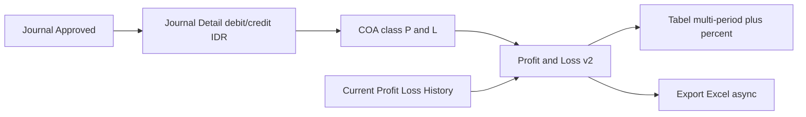
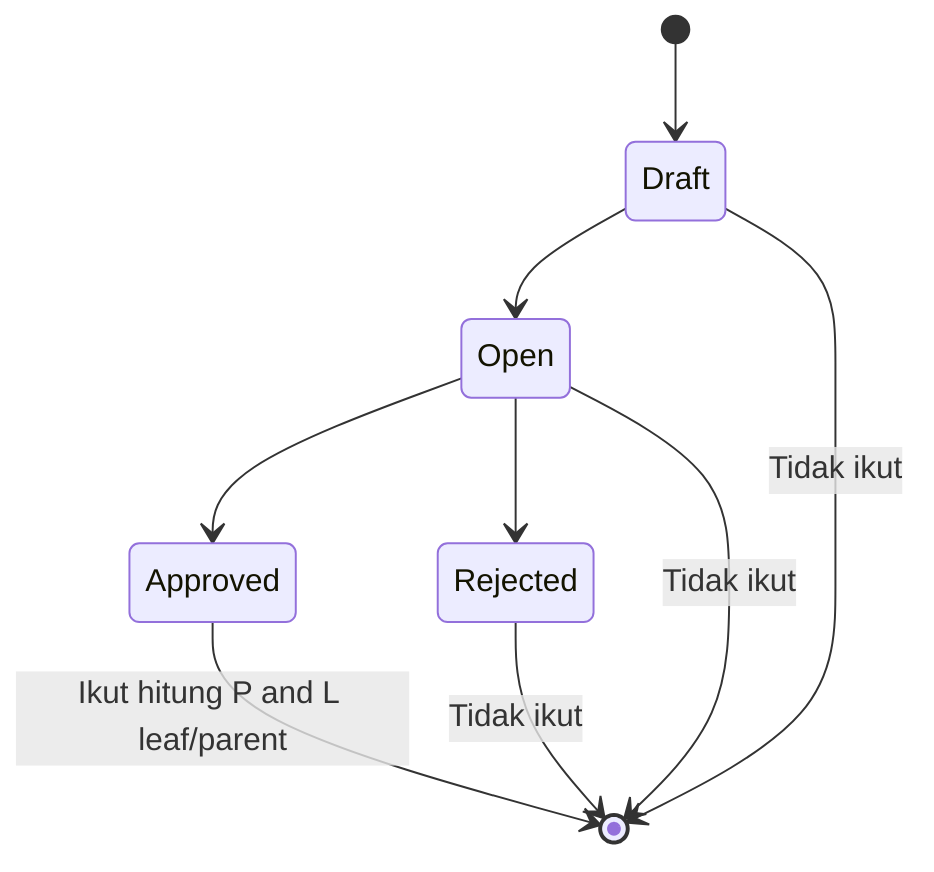
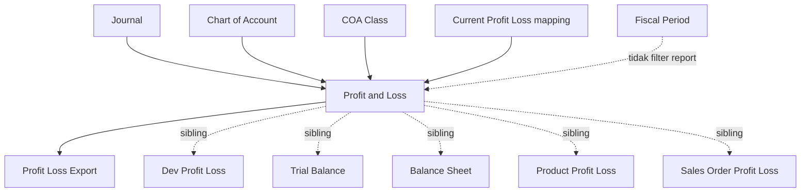

# Profit & Loss — Source of Truth

## 1. Ringkasan Eksekutif

**Profit & Loss (P&L)** adalah laporan Income Statement perusahaan di modul Accounting: menampilkan saldo **in-period** Chart of Account class Revenue, Other Revenue & Expenses, Cost Of Goods Sold, dan Expense dari **journal Approved**, dalam primary currency (IDR). Menu **read-only** — filter periode → tabel multi-kolom → opsional bandingkan hingga 11 periode sebelumnya → export Excel async.

**AS-IS staging sudah punya multi-period comparison** (Compared Period 0–11). Requirement Yemima memperluas UX mengarah format Mekari (filter tambahan, urutan, tag, template, “Terakhir diperbarui”, mitigasi performa) — banyak poin masih **Pending Decision**. Bukan menu ini: Dev Profit & Loss (`/profit-loss-v1`), Product P&L, Sales Order P&L.



## 2. Prasyarat

| Prerequisite | Sumber | Catatan |
|--------------|--------|---------|
| COA aktif dengan class Revenue / Other Revenue & Expenses / COGS / Expense | Chart of Account | Hanya 4 class ini yang muncul di P&L produksi |
| Hierarki parent–child COA (COA Tree) benar | COA Tree | Parent = agregasi descendant; indent + bold |
| Mapping Current Profit/Loss (company accounting) | Internal / General Company | Baris COA Current P/L pakai path history khusus |
| Journal sudah Approved di rentang tanggal | Journal (+ SI, PI, Payment, Outbound, Settlement, dll.) | Draft/Open/Rejected tidak ikut path normal |
| Privilege menu Profit & Loss (`viewAny`) | Gate | Export & log export cek policy; `indexV2` tanpa authorize eksplisit (GAP) |
| Primary currency company (IDR) | Company / Currency | Amount tampil IDR; FX sudah di nilai journal detail |

## 3. Siklus Status

Menu **tidak punya status dokumen sendiri**. Yang menentukan angka masuk laporan adalah status **Journal** sumber.



| Status Journal | Leaf / parent COA biasa | COA Current Profit/Loss (history) |
|----------------|-------------------------|-----------------------------------|
| **Approved** | Ya | Ikut jika ada di history (tanpa filter status di query history — GAP-PL-03) |
| Draft / Open / Rejected | Tidak | Query history **tidak** filter Approved — risiko ikut jika history ter-create (GAP-PL-03) |

## 4. Datalist (tabel laporan)

**Route UI:** `/accounting/profit-loss` · **API:** `GET …/profit-loss/v2?from=&to=&periods=`  
Tabel baru muncul setelah **Apply** (tanpa Apply pertama, kolom kosong / table belum mount).

### 4.1 Kolom tetap

| Kolom | Visible default | Keterangan |
|-------|-----------------|------------|
| COA (id) | false | Search Builder |
| **Code** | true | Kode COA + indent `&emsp;` per level; parent **bold** |
| **Name** | true | Nama akun; parent **bold** |
| COA Class / Class Name | false | Search Builder; row-group by `coa_class_name` |

### 4.2 Kolom dinamis (per periode)

Untuk `i = 0 … periods` (param `periods` = jumlah **pembanding**; total kolom balance = `periods + 1`, max 12):

| Kolom | Muncul | Isi |
|-------|--------|-----|
| `balance-{dd-MM-yyyy}_{dd-MM-yyyy}` | Selalu | Amount IDR per COA di range itu |
| `difference-{…}` | Hanya jika `i < periods` | % vs periode sebelumnya (kolom sebelah kanan / lebih lama) |

Header balance punya **tooltip** (AS-IS & selaras AC5):

> Amount based on approved journals from {start} to {end}. Foreign currency values converted to IDR using the exchange rate recorded at the time of each transaction.

### 4.3 Row group & footer

- Group by **COA class name** (urutan class: Revenue → Other Revenue & Expenses → Cost Of Goods Sold → Expense).
- Footer `"{Class} Total"`: sum **hanya leaf** (`children_exists` = false) — hindari double-count parent.

### 4.4 Toolbar / filter (AS-IS)

| Kontrol | AS-IS |
|---------|--------|
| Period (tanggal awal–akhir) | Default = **bulan berjalan** |
| Preset tanggal | **1 week / 2 weeks / 3 weeks / 1 month** (dari start bulan berjalan) — bukan “Bulan Lalu / Kuartal” (GAP-PL-01) |
| Compared Period | **None (0) … 11 periods** |
| Apply / Refresh | Apply rebuild URL + reload; Refresh = redraw |
| Search Builder | Filter COA / Class (hanya 4 class P&L) |
| Export All | Async — log + progress |

**TO-BE (requirement, belum di AS-IS):** Filter Lainnya — Bandingkan dengan, Bandingkan periode, Urutan Naik/Turun, Grup berdasarkan tag, Include all/Either, Tampilkan akun, Template, Terakhir diperbarui → Gap Registry OI.

### 4.5 Action

Tidak ada edit/approve/delete baris. Hanya **Apply/Refresh**, **Export**, Search Builder.

## 5. Form & Field (filter — bukan transaksi)

Tidak ada create/edit dokumen. Field relevan = filter report.

### 5.1 Filter utama (AS-IS + TO-BE)

| Field | AS-IS | Requirement (TO-BE) |
|-------|-------|---------------------|
| Tanggal awal / akhir | Ya — date range | Ya |
| Periode (shortcut) | Preset 1–3 week, 1 month | Dropdown Bulan Lalu / Bulan Ini / Kuartal / … — **list & logic pending** (OI-01) |

### 5.2 Filter Lainnya (mayoritas TO-BE)

| Field | AS-IS | Requirement | Status |
|-------|-------|-------------|--------|
| Bandingkan dengan (None, Period 1–11) | Setara **Compared Period** tunggal | Field ini | Ada konsep; label/UX pending |
| Bandingkan periode (N Periode Sebelumnya) | — | Harus konsisten dengan di atas | **OI-02** redundant? |
| Urutan Naik / Turun | Kolom: selected kiri → lama kanan | Naik = terlama kiri; Turun = terbaru kiri | **OI-03** |
| Grup berdasarkan tag | Tidak ada | Filter store/channel | **OI-09 / OI-10** |
| Include all / Either | Tidak ada | Radio | **OI-04** |
| Tampilkan akun | Selalu breakdown | Checkbox summary vs akun | **OI-05** |
| Template | Tidak ada | Tombol Template | **OI-08** |
| Terakhir diperbarui | Tidak ada | Timestamp | **OI-07** |

## 6. How It Works

### 6.1 Multi-period — interval (AC1)

**Locked requirement (non-whole-month):**

1. Kolom 1 = selected period (`from`–`to`).
2. `durasi = (end − start) + 1` hari (inklusif).
3. Setiap kolom tambahan mundur **durasi** hari; **tanpa overlap, tanpa gap**.
4. Maks **12** kolom (1 selected + 11).
5. Jumlah tambahan = Compared Period / “Bandingkan dengan”.

**Contoh requirement (45 hari):** selected **1 Apr 2026 – 15 Mei 2026** → kolom 2 **15 Feb – 31 Mar 2026**, kolom 3 **1 Jan – 14 Feb 2026**, … sampai 12 kolom.

**AS-IS cabang khusus whole-month:** jika `from` = start of month **dan** `to` = end of month yang sama → mundur pakai **kalender bulan** (`subMonth` + start/end of month), **bukan** window hari tetap. Ini **beda** dari contoh AC1 yang selalu fixed-duration (GAP-PL-02).

**AS-IS mismatch FE vs BE duration (non-month):** FE memakai `diffDays + 1`; BE memakai Carbon `diffInDays` (tanpa +1). Header kolom FE bisa tidak cocok key balance BE (GAP-PL-04).

### 6.2 Sumber angka (AC5 / AC7)

| Path | Rumus |
|------|--------|
| Leaf COA biasa | `Σ debit − Σ credit` journal detail, `DATE(transaction_date)` dalam range, status **Approved** |
| Parent COA | Agregasi debit/credit seluruh descendant, Approved |
| Current Profit/Loss COA | Sum dari **CurrentProfitLossHistory** join journal + detail (owned_by company) — **tanpa** filter Approved di query |

Nilai dipakai kolom `debit` / `credit` (bukan `*_foreign`) → sudah IDR/primary dari kurs **transaksional** saat journal — **tidak** ada kurs rata-rata / penutup / recalculation (selaras AC7).

### 6.3 Persentase (AC6)

**Formula requirement:** `((Kolom N − Kolom N+1) / |Kolom N+1|) × 100%`  
N = kolom lebih baru; N+1 = periode sebelumnya.

| Kondisi | Expected (requirement) | AS-IS ekstra |
|---------|------------------------|--------------|
| N > N+1 | % positif; **tidak merah** | FE: hijau jika % > 0 |
| N < N+1 | % negatif; **merah** | FE: merah jika % < 0 |
| N = N+1 (0%) | **Tidak ditampilkan** | Ya — 0 tidak ditampil angka |
| Kolom terakhir (paling lama) | Tanpa % | Ya |
| Compared = None | 1 kolom, tanpa % | Ya |
| prev = 0, current ≠ 0 | Formula undefined | AS-IS khusus: **+100 / −100** |

**OI-06 pending:** apakah warna mempertimbangkan nature akun (beban turun = “baik”/hijau)? AS-IS: warna murni dari tanda % numerik, bukan class.

### 6.4 Sign tampilan

Produksi memakai **raw debit − credit** (tidak flip seperti Dev P&L). Akun Revenue yang normal credit sering tampil **negatif**; total class mengikuti tanda itu (GAP-PL-05 vs ekspektasi “Pendapatan positif / Laba Kotor / Laba Bersih” di AC4).

### 6.5 Struktur baris (AC4 vs AS-IS)

| Requirement (Mekari-like) | AS-IS |
|---------------------------|--------|
| Section Pendapatan → akun → Total; HPP; **Laba Kotor**; Beban; …; **Laba/Rugi Bersih** | 4 **row-group class** + footer class total |
| Baris computed Gross/Net Profit | **Tidak ada** baris Laba Kotor / Laba Bersih terpisah (GAP-PL-06) |

### 6.6 Tag / store (AC8 — partial)

Requirement: filter tag menyaring journal ber-context **Sales Invoice / Outbound**. AS-IS: **belum ada** filter tag di P&L v2. Tag input location + treatment journal tanpa SI/OB → OI-09 / OI-10.

### 6.7 Export

1. POST export dengan `from`, `to`, `periods` (+ filter URL bila ada).
2. Batch 4 chunk (satu per class) → combine Excel.
3. Empty → error *"There is no data to export"*.
4. Privilege `viewAny` ProfitLoss.

### 6.8 Performa (AC11)

Tidak ada batasan max range. 12 kolom × ~365 hari ≈ hingga ~12 tahun data dalam 1 request → **High Risk**. Mitigasi MVP wajib dipilih (OI-11): max 3 tahun / background job / lazy load per kolom.

### 6.9 Contoh kasus (dari requirement — wajib ikut saat split)

| # | Situasi | Expected |
|---|---------|----------|
| T01 | 1 Apr–15 Mei 2026 (45 hari), 11 periode tambahan | 12 kolom × 45 hari, no overlap/gap |
| T02 | 1 bulan (31 hari), 3 tambahan | 4 kolom × 31 hari mundur (kecuali AS-IS whole-month = calendar months — GAP-PL-02) |
| T03 | Journal USD rate 16.000 | Amount IDR = nilai journal × rate tersimpan |
| T04 | Kolom1 8jt, Kolom2 6jt | +33,3% tidak merah |
| T05 | Kolom1 5jt, Kolom2 6jt | −16,7% merah |
| T06 | Kolom1 = Kolom2 | % tidak tampil |
| T07 | Kolom terakhir | Tanpa % |
| T08 | Journal Draft/Open di periode | Tidak dihitung (leaf/parent) |
| T09 | Bandingkan None | 1 kolom, tanpa % |
| T10 | Hover amount | Tooltip periode + basis kalkulasi |

## 7. Validasi

| Kondisi | Behavior |
|---------|----------|
| `from` / `to` / `periods` kosong atau format salah | Validasi API: required; `from`/`to` `date_format:d-m-Y`; `periods` numeric |
| Period belum Apply | Tabel belum load |
| Export query kosong | *"There is no data to export"* |
| Periods di luar 0–11 di UI | UI membatasi opsi 0–11; API numeric tanpa max eksplisit |
| Range sangat panjang | Tidak diblok — risiko timeout (OI-11) |

## 8. Relasi Menu Lain



| Menu | Relasi |
|------|--------|
| Journal | Sumber angka Approved |
| Chart of Account / COA Class | Baris & section |
| Trial Balance / Balance Sheet / GL | Sibling report; scope class beda |
| Dev - Profit & Loss | Legacy 2-panel + kartu; tanpa multi-period/export |
| Product / SO Profit Loss | Dimensi SKU/SO, bukan statement COA |
| Fiscal Period | Tidak memfilter P&L; mempengaruhi posting tanggal |
| Company mapping Current/Retained P/L | Special path Current P/L |

## 9. Gap Registry

| ID | Deskripsi | Type | Dampak | Status |
|----|-----------|------|--------|--------|
| GAP-PL-01 | **OI-01:** List lengkap opsi dropdown Periode + logic (Bulan Lalu/Ini/Kuartal vs preset AS-IS 1–3 week / 1 month) | Missing Behavior / Pending Decision | Filter utama UX | Pending Decision — Yemima / end user |
| GAP-PL-02 | **Contradiction period shift:** Requirement = selalu fixed `durasi` hari tanpa gap. Codebase: jika selected = **whole calendar month**, mundur pakai **subMonth** (panjang bulan beda), bukan window hari tetap | Contradiction | T02 vs behavior bulan penuh | Pending Decision — Yemima |
| GAP-PL-03 | Current Profit/Loss via history **tanpa** filter journal Approved (beda leaf/parent). Requirement: hanya Approved | Contradiction | Akurasi baris Current P/L | Pending Decision — Yemima (fix vs accept AS-IS) |
| GAP-PL-04 | **Bug risk:** FE `diffDays+1` vs BE `diffInDays` untuk non-month → range kolom / key header bisa mismatch | Bug / Unverified edge | Angka kolom pembanding | Open — verify staging + align FE/BE ke formula AC1 |
| GAP-PL-05 | Sign raw debit−credit → Revenue sering negatif; Dev P&L flip. Requirement AC4 mengarah tampilan “normal” Pendapatan/Laba | Contradiction / UX | Baca laporan end user | Pending Decision — Yemima |
| GAP-PL-06 | Tidak ada baris computed **Laba Kotor / Laba Bersih** — hanya total per class | Missing Behavior | AC4 struktur Mekari | Pending Decision — Yemima (MVP scope?) |
| GAP-PL-07 | **OI-02:** Relasi “Bandingkan dengan” vs “Bandingkan periode” — redundant atau saling melengkapi? AS-IS 1 field Compared Period | Pending Decision | Filter Lainnya | Pending Decision — Yemima |
| GAP-PL-08 | **OI-03:** Makna konkret Urutan Naik vs Turun (reorder kolom) | Missing Behavior | UX kolom | Pending Decision — Yemima |
| GAP-PL-09 | **OI-04:** Include all vs Either | Missing Behavior | Tampilan akun lintas periode | Pending Decision — Yemima |
| GAP-PL-10 | **OI-05:** Tampilkan akun unchecked → hanya subtotal/total section? | Missing Behavior | Density tabel | Pending Decision — Yemima |
| GAP-PL-11 | **OI-06:** Warna % mempertimbangkan nature akun (beban turun = hijau)? AS-IS: warna dari tanda % saja | Pending Decision | Interpretasi performance | Pending Decision — Yemima |
| GAP-PL-12 | **OI-07:** Basis “Terakhir diperbarui” (journal / refresh / data change) | Missing Behavior | Trust freshness | Pending Decision — Yemima |
| GAP-PL-13 | **OI-08:** Fungsi Template (preset filter / layout / export) | Missing Behavior | Tombol Template | Pending Decision — Yemima |
| GAP-PL-14 | **OI-09 / OI-10:** Tag — input di mana? Journal non-SI/OB ikut atau exclude saat filter tag aktif? | Missing Behavior / High | Akurasi P&L by store | Pending Decision — Yemima |
| GAP-PL-15 | **OI-11:** Mitigasi performa MVP (max 3 tahun / job / lazy load) — wajib pilih | High Risk / Missing Behavior | Timeout 12×365 | Pending Decision — Yemima + Dev |
| GAP-PL-16 | `indexV2` tanpa `authorize('viewAny', ProfitLoss)` eksplisit (export sudah ada) | Unverified / Hardening | Privilege bypass risk? | Open — note for Dev |
| GAP-PL-17 | Framing requirement “belum mendukung multi-period” vs **AS-IS sudah** Compared Period 0–11 + % + tooltip FX | Contradiction (docs framing) | Scope “New Feature” vs enhance | Resolved for SOT — treat as **enhance existing v2** |

## 10. FAQ

**Q: Apa bedanya dengan Dev Profit & Loss?**  
A: Produksi = multi-period + export + 1 tabel. Dev = kartu summary + 2 tabel + All Time, tanpa compare/export.

**Q: Kenapa angka Revenue negatif?**  
A: Laporan memakai debit minus credit mentah. Credit-normal (pendapatan) jadi negatif. Beda dari Dev yang di-flip — tunggu keputusan GAP-PL-05.

**Q: Hanya journal Approved?**  
A: Untuk akun biasa: ya. Untuk baris Current Profit/Loss: path history AS-IS belum filter Approved (GAP-PL-03).

**Q: Kurs USD pakai apa?**  
A: Kurs yang diinput saat transaksi journal — tidak dihitung ulang di P&L.

**Q: Berapa kolom maksimal?**  
A: 12 (1 selected + 11 compare).

**Q: Filter store/tag sudah ada?**  
A: Belum di P&L produksi — tunggu konfirmasi OI-09/10.

## 11. Changelog

| Version | Date | Changes |
|---------|------|---------|
| 1.0 | 2026-08-12 | Initial SOT: AS-IS P&L v2 + requirement multi-period Mekari-like; Gap Registry OI-01…11 + contradiction period/sign/Current P/L |

## 12. Knowledge Base Hints

### Kamus

| Istilah teknis | Bahasa awam |
|----------------|-------------|
| In-period balance | Saldo transaksi dalam rentang tanggal filter |
| Compared Period | Berapa periode ke belakang yang ditampilkan berdampingan |
| Leaf COA | Akun paling bawah (bukan induk) |
| Primary currency / IDR | Mata uang utama perusahaan di laporan |
| Current Profit/Loss COA | Akun khusus laba rugi berjalan (bukan dari journal COA biasa) |
| Whole-month path | Kalau filter pas 1 bulan kalender penuh, bandingkan per bulan (bukan per jumlah hari sama) |

### Troubleshooting (tanpa GAP-ID)

| Gejala | Cek |
|--------|-----|
| Tabel kosong / tidak muncul | Sudah klik Apply? Period terisi? |
| Angka 0 padahal ada transaksi | Journal status Approved? Tanggal di dalam range? COA class termasuk 4 class P&L? |
| Export gagal | Pesan “no data”? Privilege view? Job queue jalan? |
| Kolom periode “aneh” untuk range bukan full month | Bandingkan tanggal header FE vs angka; laporkan ke Dev jika beda 1 hari |
| Butuh P&L per toko/SKU | Bukan menu ini — cek Sales Order / Product Profit Loss (sampai tag P&L dikonfirmasi) |

### Skip di KB

Path class, cache key balance, FIELD() order SQL, detail job chunk export.

## 13. Technical Hints

### File map (real)

| Layer | Path / nama |
|-------|-------------|
| Routes | `Modules/Accounting/Routes/api.php` — `profit-loss/v2`, `profit-loss/v2/exports*` |
| Controller | `ProfitLossController@indexV2`, `getBalance` |
| Export API | `ProfitLossExportController` |
| Jobs | `ProfitLossExportChunkJob`, `ProfitLossExportCombineJob` |
| Export | `Modules/Accounting/Exports/ProfitLossExport.php` |
| Entity | `ProfitLoss`, `ProfitLossExportFile`, `CurrentProfitLossHistory` |
| Policy | `ProfitLossPolicy` (`menu_link` = `accounting/profit-loss`) |
| Helper | `app/Helpers/Accounting/JournalReport.php` — `getInPeriodBalance*`, `getInPeriodProfitLoss` |
| FE | `olshoperp-frontend/src/pages/Accounting/Report/ProfitLoss/**` — `DataList.vue`, `PeriodFilter.vue`, `TableByPeriod.vue`, `ExportLog.vue` |
| Menu seeder | `AccountingMenuSeeder` → `accounting/profit-loss` |
| Privilege entity | `Modules\Accounting\Entities\ProfitLoss` |

### Invariants

1. Hanya COA class: Revenue, Other Revenue & Expenses, Cost Of Goods Sold, Expense.
2. Leaf/parent balance: journal `transaction_status = Approved`; nilai dari `debit`/`credit` (IDR).
3. `periods` = jumlah pembanding; kolom balance = `periods + 1` (max UI 12).
4. Row-group total = sum leaf only.
5. Export privilege = `viewAny` ProfitLoss; empty → *"There is no data to export"*.
6. Tidak menulis journal / tidak mengubah saldo.

### Failure modes

| Mode | Sumber |
|------|--------|
| ValidationException from/to/periods | `indexV2` validate |
| Export no data | Controllers/jobs export |
| Timeout / slow request | Banyak periode × banyak COA × query balance per cell (no range cap) |
| Kolom FE kosong vs BE | Key `balance-{from}_{to}` mismatch FE/BE duration |

### Data lifecycle

Journal Approved (dari SI/PI/Payment/Outbound/…) → Journal Detail → agregasi P&L on read → optional ExportFile async. Tidak ada state machine di entity ProfitLoss (marker policy).

## 14. Referensi Struktur untuk Proses Split

```
Section 1-11 → material utama untuk requirement.md
Section 5, 6, 7, 10 → adaptasi ke knowledge-base.md dengan tone awam (lihat Section 12)
Section 13 Technical Hints → seed untuk technical.md, sudah pakai path/nama real
Frontmatter YAML di atas → copy ke 3 file utama (+ user-guide.md kalau gate review/final), sinkronkan version + last_updated
Golden reference tone & struktur: docs/qa-docs/accounting-supplier-invoice/
```
