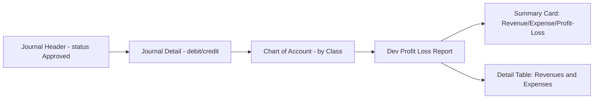
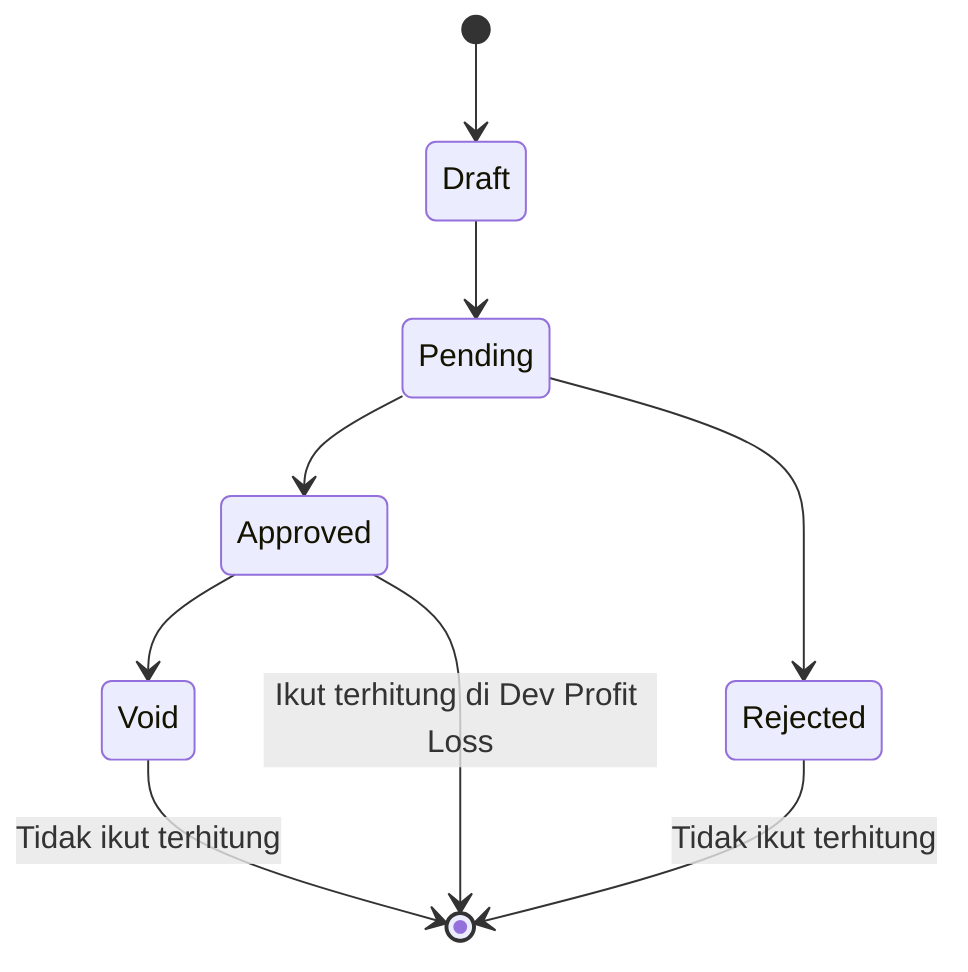
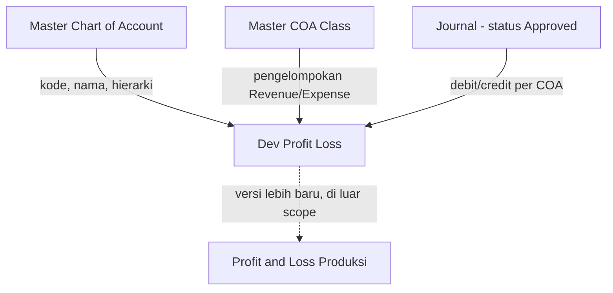

# Dev - Profit & Loss — Source of Truth

## 1. Ringkasan Eksekutif

Dev - Profit & Loss adalah menu report legacy di modul Accounting yang menampilkan laporan laba rugi (Income Statement) berdasarkan saldo Chart of Account (COA) class Revenue dan Expense dari transaksi Journal yang sudah berstatus Approved. Menu ini dipakai tim Finance/Accounting untuk melihat ringkasan Total Revenues, Total Expenses, dan Current Profit/Loss dalam satu periode tertentu, lengkap dengan detail per akun COA dalam struktur parent-child. Berbeda dengan Profit & Loss versi produksi, menu ini hanya menampilkan satu rentang periode tanpa fitur export.



---

## 2. Prasyarat

| Prasyarat | Sumber | Catatan |
|---|---|---|
| Master Chart of Account (COA) sudah disetup dengan Class yang benar | Master COA | Setiap COA harus terhubung ke salah satu Class: Revenue, Other Revenue & Expenses, Expense, atau Cost of Goods Sold agar bisa masuk ke section yang tepat |
| Struktur parent-child COA sudah benar | Master COA | Agregasi saldo parent bergantung penuh ke struktur hierarki ini |
| Transaksi Journal sudah dibuat dan di-approve | Journal (Accounting) | Hanya journal berstatus Approved yang ikut terhitung; Draft, Pending, Void, atau Rejected tidak ikut dihitung |

---

## 3. Siklus Status

Menu ini bersifat report murni (read-only) — tidak punya siklus status sendiri seperti transaksi pada umumnya. Yang menentukan apakah sebuah baris data journal ikut terhitung di report ini adalah status dari Journal sumbernya.



| Status Journal | Ikut Terhitung? | Catatan |
|---|---|---|
| Draft / Pending | Tidak | Belum final, belum masuk saldo |
| Approved | Ya | Satu-satunya status yang dihitung ke summary card dan detail table |
| Rejected | Tidak | Dianggap batal |
| Void | Tidak | `[VERIFY: CODEBASE]` — pastikan journal Void memang otomatis ter-eksklusi lewat filter status Approved, bukan butuh filter tambahan terpisah |

---

## 4. Datalist

Report ini menampilkan 2 datalist yang berjalan berdampingan (side-by-side): Revenues dan Expenses.

### 4.1 Kolom Datalist Revenues & Expenses

| Kolom | Visible Default | Sumber Data | Keterangan |
|---|---|---|---|
| CODE | Ya | Kode COA | Mengikuti indentasi hierarki |
| NAME | Ya | Nama COA | Baris parent ditampilkan bold |
| In-Period Balance | Ya | Akumulasi debit/credit journal dalam rentang Period yang dipilih | Kalau Period kosong, kolom ini memakai basis All Time — lihat Bagian 6.4 |
| All Time Balance | Ya | Akumulasi debit/credit journal sepanjang masa (tanpa batas rentang tanggal) | Selalu terhitung terlepas Period diisi atau tidak |

### 4.2 Karakteristik Datalist

| Aspek | Detail |
|---|---|
| Search/filter kolom | Tidak ada |
| Export | Tidak ada |
| Jumlah baris per load | Sampai dengan 1000 baris per tabel |
| Struktur | Tree/hierarki — parent bisa expand/collapse ke child |
| Pemisahan data | Tabel Revenues pakai data class Revenue + Other Revenue & Expenses; tabel Expenses pakai data class Expense + Cost Of Goods Sold |

---

## 5. Form & Field

Menu ini tidak punya form create/edit — hanya form filter untuk menentukan periode laporan.

### 5.1 Field Period

| Field | Wajib? | Default | Sumber Opsi | Catatan |
|---|---|---|---|---|
| Period (date range) | Tidak — boleh dikosongkan (nullable) | Kosong | Date range picker | Kalau kosong, report memakai basis All Time Balance (lihat Bagian 6.4) |

### 5.2 Tombol Apply

| Field | Catatan |
|---|---|
| Apply | Memicu kalkulasi ulang summary card dan detail table berdasarkan Period yang diisi (atau All Time kalau Period kosong) |

`[VERIFY: CODEBASE]` — AS-IS codebase punya 2 tombol terpisah: Apply (aktif kalau Period diganti) dan Refresh (aktif kalau Period sama, untuk reload data). Belum ada keputusan final apakah requirement ini tetap mempertahankan 2 tombol terpisah atau disederhanakan jadi 1 tombol Apply saja — lihat Gap Registry GAP-DPL-02.

---

## 6. How It Works

### 6.1 Summary Card

Tiga kartu ringkasan muncul di bagian atas halaman:

| Kartu | Formula |
|---|---|
| Total Revenues | Akumulasi absolut saldo seluruh COA class Revenue dan Other Revenue & Expenses |
| Total Expenses | Akumulasi absolut saldo seluruh COA class Expense dan Cost Of Goods Sold |
| Current Profit/Loss | Total Revenues dikurangi Total Expenses |

Contoh: Total Revenues Rp 50.000.000, Total Expenses Rp 35.000.000, maka Current Profit/Loss Rp 15.000.000.

### 6.2 Struktur Detail COA — Parent/Child

- Section Revenues menampilkan struktur COA parent-child dari class Revenue dan Other Revenue & Expenses.
- Section Expenses menampilkan struktur COA parent-child dari class Expense dan Cost Of Goods Sold.
- Nilai amount hanya muncul di baris child (leaf). Baris parent murni akumulasi dari seluruh child di bawahnya, tanpa perhitungan sign/posisi ulang di level parent.

### 6.3 Aturan Posisi (Sign Rule) di Level Child

Setiap COA class punya posisi normal:

| Class | Posisi Normal (Bertambah) |
|---|---|
| Revenue / Other Revenue & Expenses | Kredit |
| Expense / Cost Of Goods Sold | Debit |

Kalau sebuah COA di section Revenue ternyata posisi transaksinya dominan di Debit (kebalikan dari posisi normalnya), nilai yang tampil di report dianggap faktor pengurang dan ditampilkan minus. Konsep yang sama berlaku di section Expense — kalau posisi transaksinya dominan Kredit, nilai tampil minus.

Contoh: COA "Pendapatan Jasa" (class Revenue) di suatu periode punya total Kredit Rp 10.000.000 dan Debit Rp 2.000.000. Karena posisi Kredit lebih besar (sesuai posisi normal Revenue), nilai ditampilkan sebagai penambah bersih Rp 8.000.000. Di periode lain, "Pendapatan Jasa" punya Debit Rp 5.000.000 dan Kredit Rp 1.000.000 — dominan Debit, kebalikan posisi normal Revenue — sehingga nilai ini ditampilkan sebagai minus Rp 4.000.000.

`[VERIFY: CODEBASE]` — pastikan arah sign formula di implementasi (raw balance dan flip sign berdasarkan posisi) menghasilkan output yang konsisten dengan aturan bisnis di atas untuk kasus posisi normal maupun kasus kebalikan. Ada indikasi formula AS-IS berpotensi terbalik arah, perlu dicek langsung dengan data riil sebelum dianggap final.

### 6.4 Basis Data — In-Period vs All Time

- Field Period bersifat opsional (boleh kosong/null).
- Period kosong: summary card dan detail table memakai basis All Time Balance (akumulasi sepanjang masa, tanpa batas rentang tanggal).
- Period diisi lalu klik Apply: summary card dan detail table memakai basis In-Period Balance, dihitung dari akumulasi journal dalam rentang tanggal yang dipilih saja.
- Kolom All Time Balance di detail table tetap tampil dan tetap terhitung, terlepas Period diisi atau tidak.

Catatan: ini berbeda dari versi AS-IS lama yang defaultnya memakai rentang hari ini saat Period kosong, bukan All Time — lihat Gap Registry GAP-DPL-01.

### 6.5 Drill-Down

Tidak ada modal terpisah untuk melihat detail journal entry mentah. Mekanisme drill-down yang tersedia adalah struktur hierarki parent-child COA itu sendiri — user expand parent untuk melihat rincian saldo tiap child COA di bawahnya.

---

## 7. Validasi

| # | Kondisi | Behavior | Error Message |
|---|---|---|---|
| 1 | Journal berstatus selain Approved | Tidak ikut dihitung ke summary card maupun detail table | - |
| 2 | Period kosong | Report memakai basis All Time Balance | - |
| 3 | Period diisi | Report memakai basis In-Period Balance sesuai rentang yang dipilih, dihitung ulang saat klik Apply | - |
| 4 | COA tanpa Class yang valid | `[VERIFY: CODEBASE]` — apakah otomatis dikecualikan dari kedua section | - |
| 5 | COA parent tanpa child | `[VERIFY: CODEBASE]` — apakah tetap tampil dengan saldo 0, atau disembunyikan | - |

---

## 8. Relasi Menu Lain

| Menu | Peran dalam Relasi |
|---|---|
| Master Chart of Account (COA) | Sumber struktur akun (kode, nama, hierarki parent-child) di detail table |
| Master Chart of Account Class | Sumber pengelompokan Revenue/Other Revenue & Expenses/Expense/Cost Of Goods Sold, menentukan COA masuk ke section mana |
| Journal (Accounting) | Sumber data debit/credit yang diakumulasi jadi In-Period Balance dan All Time Balance |
| Profit & Loss (produksi) | Versi lebih baru dari laporan yang sama, dengan multi-period dan export — di luar scope dokumen ini |



---

## 9. Gap Registry

| ID | Deskripsi | Dampak | Status |
|---|---|---|---|
| GAP-DPL-01 | Default behavior saat Period kosong berubah dari AS-IS lama (default rentang hari ini) menjadi requirement baru (default All Time Balance) | Development perlu update logic default filter periode | Open |
| GAP-DPL-02 | Belum ada keputusan final apakah tombol Apply dan Refresh tetap dipertahankan terpisah (seperti AS-IS) atau disederhanakan jadi 1 tombol Apply | Mempengaruhi UI dan test case interaksi tombol | Open |

---

## 10. FAQ

**Q: Kenapa saldo yang tampil di baris COA revenue saya kok minus?**
A: Karena posisi transaksi journal untuk COA tersebut dalam periode itu dominan Debit — kebalikan dari posisi normal Revenue (Kredit). Sistem menganggap ini faktor pengurang.

**Q: Kenapa saya nggak isi Period tapi datanya tetap keluar?**
A: Kalau Period dikosongkan, report menampilkan basis All Time Balance — akumulasi seluruh journal approved sepanjang masa, bukan kosong.

**Q: Kenapa amount cuma muncul di baris child, parent-nya kosong/beda?**
A: Baris parent memang didesain hanya menampilkan akumulasi dari semua child di bawahnya, bukan saldo langsung dari transaksi journal ke COA parent itu sendiri.

**Q: Bisa lihat detail journal entry di balik satu angka COA?**
A: Saat ini belum ada modal detail journal — drill-down yang tersedia hanya sebatas expand struktur parent-child COA.

---

## 11. Changelog

| Tanggal | Versi | Perubahan |
|---|---|---|
| 2026-07-17 | 1.0 | Draft awal source-of-truth, disusun dari requirement mentah Yemima + analisis codebase AS-IS |

---

## 12. Knowledge Base Hints (untuk operator)

**Istilah teknis ke padanan awam:**

| Istilah Teknis | Padanan Awam |
|---|---|
| In-Period Balance | Saldo sesuai tanggal yang dipilih |
| All Time Balance | Saldo total dari awal sampai sekarang |
| Posisi Debit/Kredit COA | Arah normal suatu akun bertambah nilainya |
| Journal Approved | Transaksi akuntansi yang sudah final/disetujui |
| Parent/Child COA | Akun induk dan akun rincian di bawahnya |

**Skenario troubleshooting:**

- Gejala: angka Total Revenues dan detail per akun tidak sama dengan laporan lain. Penyebab: report ini hanya menghitung journal berstatus Approved — journal Draft/Pending tidak ikut. Solusi: cek status journal terkait, pastikan sudah Approved.
- Gejala: nilai muncul minus padahal seharusnya pendapatan/beban positif. Penyebab: posisi debit/kredit transaksi journal untuk akun tersebut berlawanan dengan posisi normalnya. Solusi: cek jurnal koreksi/retur yang mungkin membalik posisi normal akun.

**Field yang di-skip di KB:** tidak ada field internal reference id di menu ini yang perlu disembunyikan dari operator — seluruh kolom yang tampil relevan untuk end user.

---

## 13. Technical Hints (untuk developer)

**Area codebase yang perlu didokumentasikan:**
- Controller/endpoint untuk summary card (income/expense/return)
- Controller/endpoint untuk datalist per class (revenue/expense)
- Helper kalkulasi saldo (in-period balance class, in-period balance dengan posisi, in-period balance parent)
- Entity dan Policy untuk privilege menu ini
- Frontend page single-page (tanpa tab, tanpa export)

**Invariants:**
- `Total Revenues = Σ abs(saldo semua COA class Revenue + Other Revenue & Expenses)`
- `Total Expenses = Σ abs(saldo semua COA class Expense + Cost Of Goods Sold)`
- `Current Profit/Loss = Total Revenues − Total Expenses`
- `Saldo COA parent = Σ saldo seluruh child COA di bawahnya` (tanpa re-apply sign rule di level parent)
- Journal yang diikutkan ke kalkulasi harus selalu berstatus Approved

**Failure modes:**
- COA tanpa Class yang valid — behavior exclude/include perlu konsisten di summary card maupun detail table (lihat Validasi #4)
- Struktur parent-child COA yang broken/circular — berpotensi infinite loop di rekursi agregasi parent, perlu guard eksplisit
- Request dengan Period null — pastikan backend fallback ke rentang 1970-01-01 sampai 2999-12-31 (All Time), bukan error atau default lain (lihat GAP-DPL-01)

**Data lifecycle lintas dokumen:**
- Tidak ada flag/state yang bergerak ke transaksi lain dari menu ini — sifatnya read-only aggregator dari Journal + Chart of Account, tidak menulis data balik ke sumber manapun.

---

## 14. Referensi Struktur untuk Cursor

```
Section 1-11 → material utama untuk requirement.md
Section 5, 6, 7, 10 → adaptasi ke knowledge-base.md dengan tone awam (lihat Section 12 KB Hints)
Section 13 Technical Hints → seed untuk technical.md, dilengkapi Cursor dari codebase
Frontmatter YAML di atas → copy ke 3 file utama, sinkronkan version + last_updated
Golden reference tone & struktur: docs/qa-docs/accounting-supplier-invoice/
```
