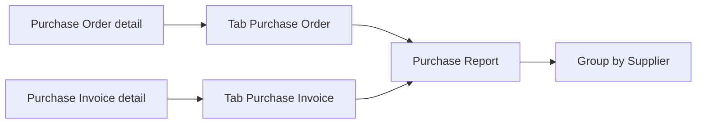
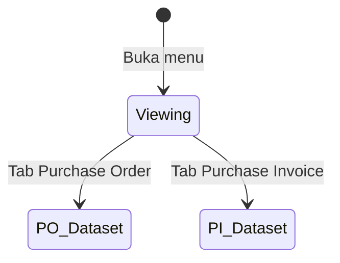
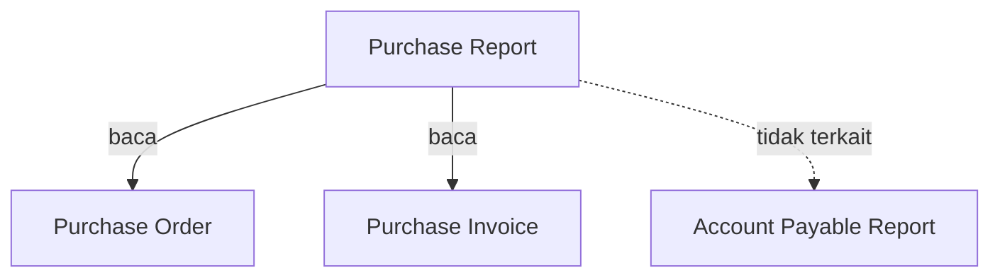

# Purchase Report — Source of Truth (AS-IS)

**Satu menu, dua sumber data (POV).** Switch Type di UI mengikuti implementasi sekarang (tab), bukan radio blank dari draft card lama.

**Jira SoT (hanya ini):** [ETM-15673](https://erpintegration.atlassian.net/browse/ETM-15673) · [ETM-15674](https://erpintegration.atlassian.net/browse/ETM-15674)  
**Route:** `/accounting/purchase-report`  
**API:** `GET accounting/purchase-report?select_menu=purchase_order|purchase_invoice`

---

## 1. Ringkasan Eksekutif

Purchase Report adalah laporan **read-only** pembelian **per baris SKU**, digroup per **Supplier**, di modul Accounting → Report. Satu menu menampilkan **salah satu** dari dua dataset:

| Tab / POV | Param API `select_menu` | Sumber baris |
|-----------|-------------------------|--------------|
| **Purchase Order** | `purchase_order` | Detail PO (+ header) |
| **Purchase Invoice** | `purchase_invoice` | Detail PI / Supplier Invoice (+ header) |

PO dan PI **tidak** dicampur dalam satu response. **Tidak** ada join PO↔PI. **Tidak** terkait Account Payable Report.



---

## 2. Prasyarat

| Prasyarat | Sumber | Catatan |
|-----------|--------|---------|
| Privilege viewAny Purchase Report | Gate / policy | `PurchaseReportPolicy` |
| Data PO (untuk tab PO) | Menu Purchase Order | With PR + Without PR; semua status |
| Data PI (untuk tab PI) | Menu Purchase Invoice (`supplier-invoice`) | Semua status |
| Company scope | Token `company_id` | Filter `owned_by` |

---

## 3. Siklus Status

Report **tidak punya status dokumen sendiri** (bukan transaksi create/approve).

Status yang tampil = **status sumber** (`transaction_status` PO atau PI) — **semua** nilai ikut (tidak difilter di query).



---

## 4. Datalist (AS-IS UI)

### 4.1 Shell Type (ikuti kode — bukan “blank sampai Type”)

- Satu halaman dengan **dua tab**: **Purchase Order** | **Purchase Invoice**.
- Tab pertama (PO) aktif default → dataset PO langsung load (bukan grid kosong menunggu pilihan radio).
- Ganti tab = ganti komponen datalist + `select_menu` (dataset terpisah, state filter/export per tab).

### 4.2 Default filter tanggal (AS-IS FE)

Saat belum ada SearchBuilder tersimpan: Advanced Filter **Trx. Date between** = **awal bulan berjalan → akhir bulan berjalan** (`dayjs().startOf('month')` … `endOf('month')`).

> Card ETM-15673/15674 menyebut default **last 30 days** — **belum** cocok dengan FE. Lihat **GAP-PURREP-01**.

### 4.3 Grouping & Total Tagihan

- Row group DataTables: `supplier_formatted_grouping` (nama supplier + nominal di kanan header group).
- Nominal di header group = **jumlah Total Price line** untuk supplier itu dalam query terfilter + rentang tanggal (sum `price_after_disc_vat`, fallback `price_before_disc_vat`).
- Kolom **Total Tagihan** per baris = nilai line (bukan running Excel klasik di tiap row). Lihat **GAP-PURREP-02**.

### 4.4 Kolom (FE)

| Kolom UI | Catatan |
|----------|---------|
| ID. Trx | Default id detail |
| TRX. DATE | `dd-mm-yyyy HH:mm:ss` |
| Type Transaction | `Purchase Order` / `Purchase Invoice` |
| TRX. CODE / TRX. DATE | Hyperlink: PO → `/supplychain/purchase-order/edit/{id}`; PI → `/accounting/supplier-invoice/edit/{id}` |
| System Product SKU / Name | Link ke product; copy SKU |
| Description | PO: header desc; PI: line desc |
| Qty / Unit | PO `order_quantity`; PI `invoice_quantity` |
| DPP / VAT / Currency | Ada; beberapa default hide (`noVis`) |
| Unit Price | Before discount before VAT (line) |
| Total Price | Line product — tanpa Other Cost/Disc header |
| Total Tagihan | Line amount (lihat §4.3) |
| Trx. Status | Status dokumen sumber |

Supplier kolom raw sering **hidden** (group key).

### 4.5 Search / Filter / Export

- Global search + Advanced Filter (SearchBuilder) + Columns show/hide.
- Export All (async job/batch) + This Page; progress & file list **per** `select_menu` (PO vs PI terpisah).
- Filter Type di dalam tab tidak mengubah tab lain.

---

## 5. Form & Field

Tidak ada form create/edit — **report only**.

---

## 6. How It Works

### 6.1 POV Purchase Order (ETM-15673)

1. User buka tab **Purchase Order**.
2. API `select_menu=purchase_order` query **PurchaseOrderDetail** join PO + product + supplier + currency + unit.
3. Include **With PR** dan **Without PR** (tidak ada filter tipe PR).
4. **Semua** `transaction_status` PO.
5. Currency **as-is** (tidak convert paksa ke IDR).
6. Total Price line dari field harga line PO; **tidak** join tabel Other Cost / Other Discount.
7. Tidak join ke Purchase Invoice / AP Report.
8. Hyperlink Trx. Code ke edit PO.

**Contoh case (dari card):** Type = Purchase Order, Supplier LUKAS, beberapa baris SKU → group header LUKAS + total supplier; kode `PO-…` hyperlink; tidak ada baris PI.

### 6.2 POV Purchase Invoice (ETM-15674)

1. User buka tab **Purchase Invoice**.
2. API `select_menu=purchase_invoice` query **SupplierInvoiceDetailItem** join SI + product + …
3. **Semua** status PI.
4. Currency as-is; Total Price = line invoice (qty × harga line); exclude Other Cost/Disc.
5. Mapping Qty/Unit/DPP/VAT/Unit Price/Description dari detail PI.
6. Tidak join ke PO / AP Report; tidak ada kolom linkage PI→PO.
7. Hyperlink Trx. Code ke edit Purchase Invoice (supplier-invoice).

**Contoh case (Excel card):** running ilustrasi Total Price baris TROLIK* → akumulasi konsep Excel; di UI AS-IS akumulasi supplier tampak di **header group**.

### 6.3 Isolasi dataset

Satu request API = satu `select_menu`. Campur PO+PI dalam satu grid **out of scope** / tidak didukung.

---

## 7. Validasi

| Kondisi | Behavior AS-IS |
|---------|----------------|
| Tanpa privilege | Authorize `viewAny` gagal |
| Soft-deleted header/detail | Dikecualikan (`deleted_at` null) |
| Company lain | Tidak tampil (`owned_by`) |
| Date filter kosong di request | Helper `resolveStartEndDate` + kriteria SearchBuilder dari FE |

Tidak ada pesan “Type required” di API — Type diwakili tab + `select_menu` (default BE: `purchase_order` jika param hilang).

---

## 8. Relasi Menu Lain



| Menu | Relasi |
|------|--------|
| Purchase Order | Sumber tab PO |
| Purchase Invoice | Sumber tab PI |
| System Product | Link SKU |
| Account Payable Report | **Tidak** terkait |

---

## 9. Gap Registry

| ID | Deskripsi | Type | Dampak | Status |
|----|-----------|------|--------|--------|
| GAP-PURREP-01 | Card 15673/15674: default date **last 30 days**. FE: default **bulan kalender berjalan**. | Contradiction | Expected QA vs staging | Open — ikut **kode** di docs AS-IS; card sebagai intent |
| GAP-PURREP-02 | Card: Total Tagihan **running** per row (Excel). Kode: kolom = line amount; **sum supplier** di header group. | Contradiction | Cara baca Total Tagihan | Open — dokumentasikan AS-IS kode |
| GAP-PURREP-03 | Summary Total Tagihan kanan atas vs global search (temuan QA) | Missing / bug | Di luar scope SOT per instruksi | **Diabaikan** di SOT |

---

## 10. FAQ

**Q: Kenapa ada dua tab?**  
A: Satu menu, dua sumber — PO atau PI — biar tidak tercampur.

**Q: PO With PR dan Without PR ikut?**  
A: Ya, keduanya (tab PO).

**Q: Semua status ikut?**  
A: Ya, tidak difilter status di query.

**Q: Total Price beda dengan grand total dokumen?**  
A: Other Cost / Other Discount sengaja tidak masuk hitungan line report ini.

**Q: Ini laporan utang AP?**  
A: Bukan — itu Account Payable Report.

---

## 11. Changelog

| Version | Date | Changes |
|---------|------|---------|
| 1.0 | 2026-08-31 | AS-IS dari ETM-15673/15674 + verifikasi FE/BE; shell = dual tab |

---

## 12. Knowledge Base Hints

| Istilah | Bahasa awam |
|---------|-------------|
| POV / `select_menu` | Tab yang dipilih: PO atau PI |
| Total Tagihan (header group) | Jumlah tagihan line di supplier itu (filter aktif) |
| Other Cost/Disc | Biaya/diskon tambahan di dokumen — tidak masuk Total Price report |
| Soft delete | Transaksi terhapus tidak muncul |

**Troubleshooting:** salah dataset → ganti tab; data sepi → cek filter tanggal (default bulan ini); cari PI di tab PO → pindah tab.

**Skip di KB:** path class, SQL.

---

## 13. Technical Hints

| Layer | Path |
|-------|------|
| FE shell | `olshoperp-frontend/src/pages/Accounting/Report/PurchaseReport/Datalist.vue` |
| FE PO | `…/DataListByPo.vue` (`select_menu=purchase_order`) |
| FE PI | `…/DataListByPi.vue` (`select_menu=purchase_invoice`) |
| BE | `Modules/Accounting/Http/Controllers/PurchaseReportController.php` |
| Export | `PurchaseReportExport.php`, `PurchaseReportExportJob.php`, `PurchaseReportExportFile` |
| Routes | `Modules/Accounting/Routes/api.php` — `purchase-report`, `export-excel`, `export-progress`, `export-file` |
| Policy | `Modules/Accounting/Policies/PurchaseReportPolicy.php` |

**Invariants**

| ID | Invariant |
|----|-----------|
| INV-01 | Satu response = satu `select_menu` (tidak mix PO+PI) |
| INV-02 | Tidak join PO↔PI untuk kolom display |
| INV-03 | Currency as-is |
| INV-04 | Soft-deleted header/detail excluded |
| INV-05 | Line totals dari detail product; bukan Other Cost/Disc tables |

**Failure modes:** authorize fail; export batch queue failure → status file export.

---

## 14. Referensi Struktur untuk Proses Split

```
Section 1-11 → material utama untuk requirement.md
Section 5, 6, 7, 10 → adaptasi ke knowledge-base.md dengan tone awam (lihat Section 12)
Section 13 Technical Hints → seed untuk technical.md, sudah pakai path/nama real
Frontmatter YAML di atas → copy ke 3 file utama (+ user-guide.md), sinkronkan version + last_updated
Golden reference tone & struktur: docs/qa-docs/accounting-supplier-invoice/
```
