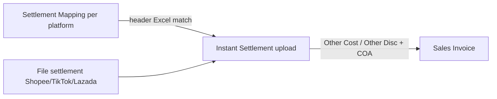
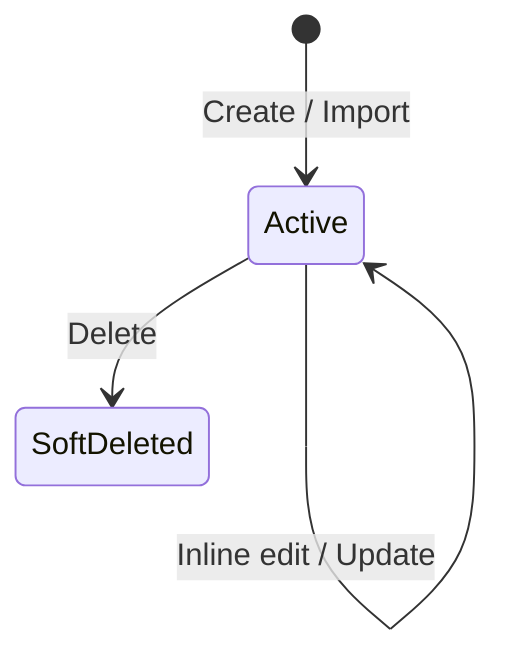
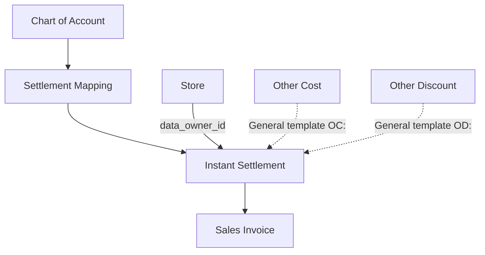

# Settlement Mapping — Source of Truth

**Route UI:** `/accounting/settlement-mapping` (contoh Merdian: https://merdian.olshoperp.com/accounting/settlement-mapping)  
**Jira terkait:** [ETM-11147](https://erpintegration.atlassian.net/browse/ETM-11147) (Value Type × tanda angka) · [ETM-11150](https://erpintegration.atlassian.net/browse/ETM-11150) (private ownership — **AS-IS sudah private**)  
**Hilir:** Instant Settlement (`accounting-settlement-upload`)

---

## 1. Ringkasan Eksekutif

**Settlement Mapping** adalah master per **platform marketplace** (accordion) untuk memetakan **judul kolom** pada file Excel/CSV settlement ke **Internal Label**, **COA**, dan **Value Type** (Plus / Minus). Saat Instant Settlement mengunggah file, sistem mencocokkan header kolom ke mapping milik **data owner** company store, lalu membentuk baris **Other Cost** / **Other Discount** pada Sales Invoice yang digenerate.

Tanpa mapping yang cocok, Instant Settlement tetap bisa jalan untuk **nilai produk** menurut rules Instant Settlement; adjustment penambah/pengurang dari kolom fee platform **tidak** masuk SI.



---

## 2. Prasyarat

| Prasyarat | Sumber | Catatan |
|-----------|--------|---------|
| Privilege menu Settlement Mapping | Gate / policy | Create, update, delete, viewAny |
| Platform master | Omni Platform | Accordion UI: **Shopee, TikTok, Lazada** saja |
| COA child aktif | Chart of Account | Dipilih via Choose COA; scope company |
| Instant Settlement | Menu Settlement Upload | Konsumen mapping saat parse file |
| Company login | Sanctum token | Mapping **private** per `owned_by` — company lain tidak memakai |

---

## 3. Siklus Status

Master data tanpa state machine approve. Record **Active** selama belum dihapus; hapus = **soft delete** (MainModel SoftDeletes). Soft-deleted tidak ikut query Instant Settlement.



| Status | Editable? | Dipakai Instant Settlement? |
|--------|-----------|------------------------------|
| Active (belum deleted) | Ya | Ya, jika platform + owned_by cocok |
| SoftDeleted | Tidak (tidak tampil datalist default) | Tidak |

**Ownership (ETM-11150 — AS-IS):** `is_all_company = 0`; tidak ada duplikasi multi-company dari Store. Satu company set mapping sendiri.

---

## 4. Datalist / Layout

Halaman = **multi accordion** dikelompokkan per platform (Shopee, TikTok, Lazada). Isi tiap accordion sama.

### 4.1 Form tambah (atas tabel)

| Kontrol | Field API | Wajib |
|---------|-----------|-------|
| Internal Label | `label` | Ya |
| Choose COA | `coa_id` | Ya |
| Source Column | `excel_column_name` | Ya |
| Value Type | `type` (`positive` / `negative`) | Ya — UI label **Plus** / **Minus** |
| Tombol add | POST store | — |

### 4.2 Tabel detail

| Kolom UI | Field | Catatan |
|----------|-------|---------|
| Internal Label | `label` | Inline edit |
| COA | `coa_id` | Inline edit via CoaSelect |
| Source Column | `excel_column_name` | Inline edit; tippy: judul kolom / fee name Lazada |
| Value Type | `type` | Plus / Minus; inline |
| Created By | `created_by_formatted` | Read-only |
| Updated By | `updated_by_formatted` | Read-only |
| Data Owner | `owner_company_formatted` | Company pemilik |
| Action | Delete | Soft delete |

### 4.3 Audit Log

Section audit: before/after perubahan (Internal Label, Source Column, value_type, COA, platform, owner). Endpoint audit datatable by model Settlement Mapping.

### 4.4 Import / Export

| Fitur | Perilaku AS-IS |
|-------|----------------|
| Download template | Header: Internal Label, COA Code, COA Name, Source Column, Value Type, Platform; Value Type contoh `plus`/`minus`; Platform `shopee`/`tiktok`/`lazada` |
| Upload Excel | Batch import; log error per row; satu import jalan — tunggu selesai |
| Export | Excel/CSV mapping company |
| Import log | Row number + message |

---

## 5. Form & Field

| Field | Wajib | Aturan |
|-------|-------|--------|
| Internal Label | Ya | Bebas teks; **boleh sama** dalam satu atau beda platform |
| Source Column | Ya | Teks judul kolom Excel; **unik per platform** (dalam company) — duplikat ditolak |
| Value Type | Ya | DB: `positive` (Plus) \| `negative` (Minus) |
| COA | Ya | Harus ada di master; UI select2 **child** COA (dengan company). Import: aktif, milik company / all-company, **bukan parent**, class ∈ Expense, Other Revenue & Expenses, Cost Of Goods Sold, Revenue |
| Platform | Ya (dari accordion) | Shopee / TikTok Shop / Lazada |
| owned_by | Auto | Company user yang create/import |
| is_all_company | Auto | Selalu `0` (private) |

**Inline edit:** field `label`, `excel_column_name`, `type`, `coa_id` — value tidak boleh kosong.

---

## 6. How It Works

### 6.1 Matching kolom Instant Settlement (marketplace file)

1. Load mapping: `platform_id` = platform upload **dan** `owned_by` = `store.data_owner_id`.
2. Parse header file: cell di-`trim`; **important columns** (order id, date, total, type Shopee) di-match **case-insensitive** (`strtolower`).
3. Kolom fee/mapping: match ke `excel_column_name` dengan **`has(original_cell)` setelah trim saja** — **case-sensitive exact** terhadap nilai tersimpan. Kolom yang tidak ada di mapping **diabaikan** (bukan error).
4. Kolom important (Order ID, Date, Total, …) **hardcode** di konstanta entity — **bukan** lewat Settlement Mapping.

### 6.2 Value Type × tanda angka (ETM-11147)

Untuk setiap kolom termapping, `amount` dari cell:

| Value Type (DB) | Angka Excel | Hasil di SI |
|-----------------|-------------|-------------|
| Plus (`positive`) | ≥ 0 | **Other Cost** |
| Plus (`positive`) | &lt; 0 | **Other Discount** |
| Minus (`negative`) | ≥ 0 | **Other Discount** |
| Minus (`negative`) | &lt; 0 | **Other Cost** |

Jumlah yang ditulis ke baris cost/disc = **abs(amount)**. Deskripsi baris = Internal Label; COA = `coa_id` mapping.

**Amount 0** (atau string kosong setelah trim): **skip** — tidak buat cost/disc.

### 6.3 Contoh kasus

**Addition / Plus — judul kolom X**

- Excel `5000` → Cost 5.000  
- Excel `-3000` → Disc 3.000  

**Deduction / Minus — judul kolom Y**

- Excel `8000` → Disc 8.000  
- Excel `-2000` → Cost 2.000  

### 6.4 Tidak ada mapping / kolom tidak ketemu

- Tidak ada baris mapping untuk platform+owner → Instant Settlement tidak menambahkan other cost/disc dari kolom fee; tetap proses produk (+ rules Instant Settlement).
- Mapping ada tapi judul kolom file tidak exact-match → kolom itu di-skip (sama seperti tidak termapping).

### 6.5 Efek ubah / hapus mapping

- Perubahan / hapus **hanya** berlaku upload Instant Settlement **berikutnya**.
- SI yang sudah tergenerate **tidak** berubah.
- Soft delete: record tidak lagi diload ke `mapped_headers`.

### 6.6 Platform UI vs Others

Accordion menu: **Shopee, TikTok, Lazada**. Platform **Other/General** Instant Settlement memakai pola kolom `OC:` / `OD:` dari master Other Cost/Discount — **bukan** baris Settlement Mapping di accordion ini.

---

## 7. Validasi

| ID | Kondisi | Behavior / pesan (AS-IS) |
|----|---------|---------------------------|
| V-SM-01 | Label / Source Column / Platform / Type / COA kosong (store) | `Internal Label is missing` / `Source Column is missing` / … / `COA is missing` |
| V-SM-02 | Duplikat Source Column + platform (company) | `Unable to create duplicate {column} for {platform}` |
| V-SM-03 | COA id tidak ketemu | `Unable to find COA` |
| V-SM-04 | Platform id tidak ketemu | `Unable to find Platform ID {id}` |
| V-SM-05 | Inline value kosong | `The inputted value cannot be empty` |
| V-SM-06 | Import Value Type bukan plus/minus | `Value Type must be either "plus" or "minus".` |
| V-SM-07 | Import Platform bukan shopee/tiktok/lazada | `Platform must be one of: shopee, tiktok, lazada.` |
| V-SM-08 | Import COA inactive / parent / class tidak diizinkan / beda company | Pesan per baris di import log |
| V-SM-09 | Import lain masih jalan | `Please wait, other import is being process` |

---

## 8. Relasi Menu Lain



| Menu | Relasi |
|------|--------|
| Instant Settlement | Baca mapping saat parse file marketplace |
| Sales Invoice | Terima other costs/discounts hasil mapping |
| Chart of Account | Akun pada setiap baris mapping |
| Store | `data_owner_id` menentukan owned_by mapping yang dipakai |
| Other Cost / Other Discount | Dipakai jalur **General** (`OC:`/`OD:`), bukan accordion SM |

---

## 9. Gap Registry

| ID | Deskripsi | Type | Dampak | Status |
|----|-----------|------|--------|--------|
| GAP-SM-01 | Create/inline UI hanya cek COA exists (+ company scope model); Import enforce class/child/active. Requirement: ikut codebase. | Unverified | Mapping bisa tersimpan via UI dengan COA yang ditolak import | Open — dokumentasikan beda jalur |
| GAP-SM-02 | Match Source Column **case-sensitive**; important columns case-insensitive. User bilang exact match — sesuai kode. | Resolved | Operator harus salin judul kolom persis | Resolved |
| GAP-SM-03 | Tippy FE Value Type masih tulis Addition/Deduction; opsi UI Plus/Minus; audit format Addition/Deduction | Unverified | Label inkonsisten di tippy vs select | Open — prefer Plus/Minus di docs UI |
| GAP-SM-04 | ETM-11150 RE-OPEN di Jira; Yemima konfirmasi ownership sudah private | Resolved | — | Resolved (AS-IS private) |

---

## 10. FAQ

**Q: Kenapa fee di Excel tidak masuk SI?**  
A: Cek Source Column exact (termasuk huruf besar/kecil), platform accordion benar, dan Data Owner = company owner store yang di-upload. Amount 0 di-skip.

**Q: Ubah mapping, SI lama berubah?**  
A: Tidak. Hanya Instant Settlement berikutnya.

**Q: Plus vs Minus?**  
A: Plus = cenderung Cost jika angka positif; Minus = cenderung Disc jika angka positif. Tanda negatif di Excel membalik (lihat §6.2).

**Q: Company lain bisa pakai mapping saya?**  
A: Tidak — private per company (ETM-11150).

---

## 11. Changelog

| Date | Version | Changes |
|------|---------|---------|
| 2026-10-09 | 1.0 | SOT dari penjelasan Yemima + verifikasi BE/FE; ETM-11147/11150; 3 platform accordion |

---

## 12. Knowledge Base Hints

| Istilah teknis | Bahasa awam |
|----------------|-------------|
| Source Column | Judul kolom di file settlement marketplace |
| Internal Label | Nama biaya/diskon versi internal perusahaan |
| Value Type Plus/Minus | Cara baca angka Excel jadi penambah atau pengurang |
| Soft delete | Hapus dari daftar; SI lama tetap |
| Data Owner | Company pemilik baris mapping |

Troubleshooting: mapping tidak kepakai → cek exact judul kolom, company owner store, soft-delete, amount 0.

---

## 13. Technical Hints

| Area | Lokasi / catatan |
|------|------------------|
| FE | `olshoperp-frontend/src/pages/Accounting/Settlement/Mapping/` — `DataList.vue`, `PlatformTable.vue`, `MappingTable.vue` |
| BE CRUD | `SettlementMappingController` — store/inline/update/delete/export/import/audit |
| Entity | `SettlementMapping` → `accounting_settlement_mappings`; SoftDeletes via MainModel |
| Parse settlement | `SettlementSheet` — `mapped_headers` keyBy `excel_column_name`; match `$original_cell` |
| Apply amounts | `ImportSettlementJob` — skip `amount == 0`; positive/negative × sign → costs/discounts |
| Important columns | Konstanta `DATE_COLUMNS`, `ORDER_ID_COLUMNS`, `TOTAL_COLUMNS`, `TYPES_COLUMNS` di entity |
| Import mapping | `SettlementMappingImport` — plus/minus, platform shopee/tiktok/lazada, validasi COA ketat |
| Policy | `SettlementMappingPolicy` |

**Invariants**

- Unik `(excel_column_name, platform_id)` dalam company (`owned_by`).
- `is_all_company = 0`.
- Instant Settlement load mapping by `platform_id` + `store.data_owner_id`.

**Failure modes:** Duplikat source column; import batch bentrok; header Instant Settlement missing important columns → gagal upload (bukan karena SM).

**Lifecycle:** Soft delete tidak mengubah SI historis; baris cost/disc SI menyimpan COA + description label saat generate.

---

## 14. Referensi Struktur untuk Proses Split

```
Section 1-11 → material utama untuk requirement.md
Section 5, 6, 7, 10 → adaptasi ke knowledge-base.md dengan tone awam (lihat Section 12)
Section 13 Technical Hints → seed untuk technical.md, sudah pakai path/nama real
Frontmatter YAML di atas → copy ke 3 file utama (+ user-guide.md kalau gate review/final), sinkronkan version + last_updated
Golden reference tone & struktur: docs/qa-docs/accounting-supplier-invoice/
```
