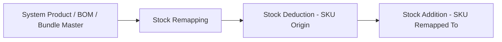
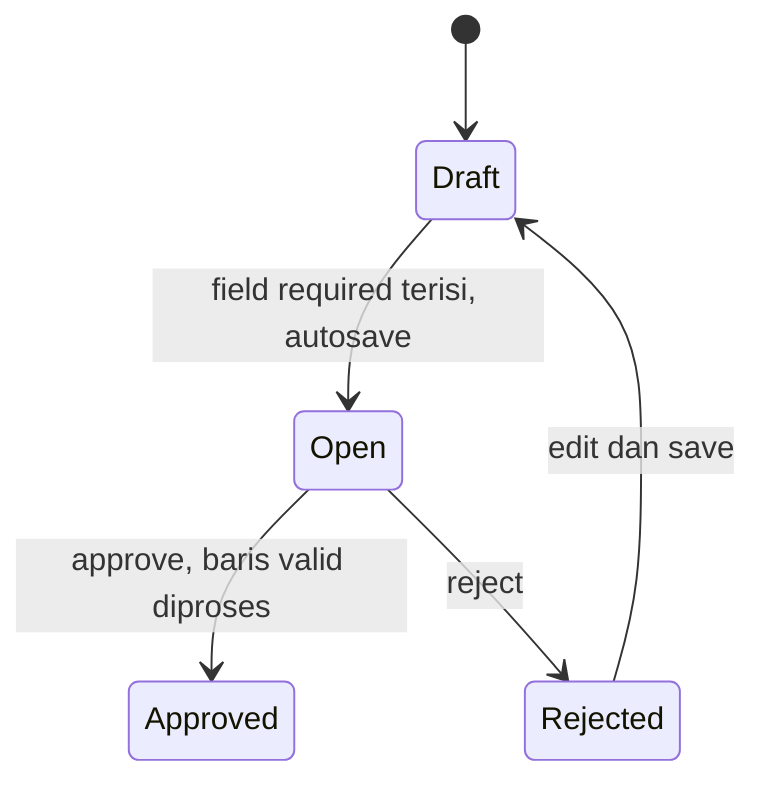
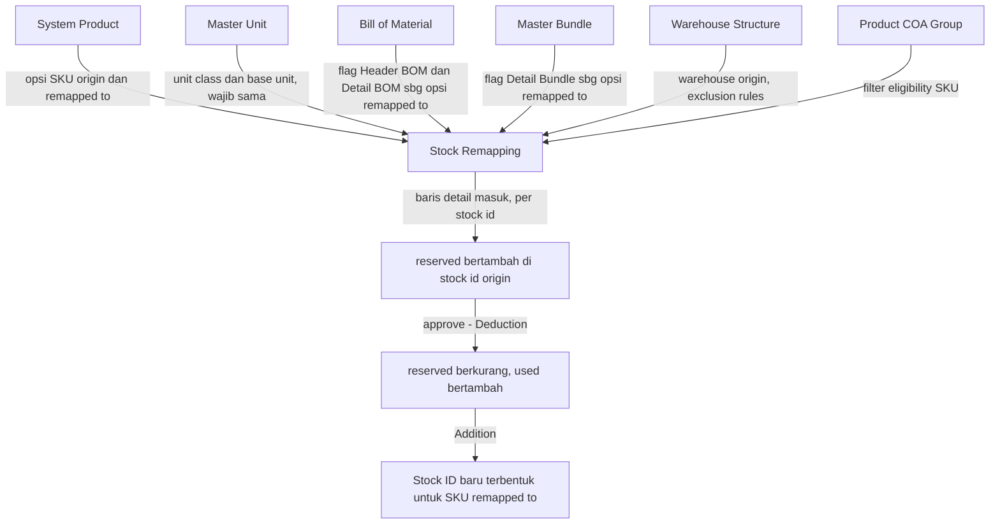

# Stock Remapping — Source of Truth (v2.0)

> **Catatan untuk Cursor / Developer:** Dokumen ini adalah **update besar** dari versi 1.1 (nama lama "Stock Conversion"). Perubahan utama ada di eligibilitas dan cara pemilihan SKU Remapped To, cara pemilihan SKU Origin (kini berbasis Stock ID, bukan agregat), serta cara sistem menghandle Unit dan Unit Price. Section yang **tidak disebut berubah** artinya carry over apa adanya dari v1.1. Item bertanda `[VERIFY: CODEBASE]` wajib dicek ke codebase sebelum implementasi final — jangan diasumsikan benar.

---

## 1. Ringkasan Eksekutif

Stock Remapping (prefix `RM-`) adalah transaksi untuk meremap identitas stok dari 1 SKU (SKU Origin) ke SKU lain (SKU Remapped To) tanpa perlu membuat Stock Deduction dan Stock Addition manual secara terpisah. Audience utama: tim Warehouse/Inventory yang menyortir barang impor SKU acak menjadi variant sesungguhnya.

**Perubahan inti versi 2.0:** scope SKU Remapped To yang sebelumnya dibatasi ketat hanya sesama Variant dalam 1 parent yang sama dengan Origin, sekarang dibuka untuk SKU tipe Single, SKU yang berperan sebagai Detail BOM, Header BOM, atau Detail Bundle — selama Unit Class-nya identik dengan SKU Origin. Perubahan ini berdampak ke cara sistem menghandle Unit (kini wajib Base Unit, read-only) dan cara user memilih SKU Origin (kini berbasis Stock ID spesifik, bukan agregat FIFO seperti sebelumnya).



---

## 2. Prasyarat

| Prasyarat | Sumber | Catatan |
|---|---|---|
| System Product Active (Single / Variant) | Master System Product | Sumber SKU Origin dan Remapped To |
| Unit Class dan Base Unit per SKU | Master Unit | Base Unit adalah unit terkecil yang ter-flag di 1 Unit Class. Wajib identik antara Origin dan Remapped To |
| Flag Header BOM / Detail BOM | Master Bill of Material | Sumber eligibilitas kategori baru Remapped To |
| Flag Detail Bundle | Master Bundle | Sumber eligibilitas kategori baru Remapped To |
| Warehouse Origin Active | Master Warehouse Structure | Exclusion rules sama dengan Stock Deduction dan Outbound. `[VERIFY: CODEBASE]` daftar exact exclusion |
| Product COA Group | Master Product COA Group | Filter hanya Purchased Item dan Manufactured Item — lihat GAP-RM-02 untuk kategori baru |
| Stock ID tersedia untuk SKU Origin | Stock Ledger | Availability dipecah per Stock ID, jadi basis pemilihan (bukan agregat FIFO seperti v1.1) |

### 2.1 Eligibilitas SKU — Tabel Terpisah Origin vs Remapped To

**SKU Origin (tidak berubah dari v1.1):**

| Kriteria | Keterangan |
|---|---|
| Type Product | Hanya Variant (dalam struktur parent-variant) |
| Status | Active |
| Product COA Group | Hanya Purchased Item dan Manufactured Item (Service, Asset diblok) |
| Flag Random | Diblok |
| Cara pilih | v2.0: dipilih per **Stock ID spesifik** via modal Available Product (Single Use dan Bulk Use) — bukan lagi agregat semua stock id SKU tersebut |

> Origin memang tidak pernah punya validasi "1 parent" karena Origin hanya memilih 1 SKU tunggal — bukan relasi antar 2 SKU. Contoh ilustrasi ada di Bagian 6.1.

**SKU Remapped To (berubah signifikan di v2.0):**

| Kategori Eligible | Keterangan |
|---|---|
| (a) Variant dalam parent yang sama dengan Origin | Rule lama v1.1 — tetap salah satu opsi valid |
| (b) SKU tipe Single | Baru — tidak perlu 1 parent dengan Origin |
| (c) SKU ter-flag sebagai Detail BOM | Baru — SKU jadi komponen suatu Bill of Material |
| (d) SKU ter-flag sebagai Header BOM | Baru — SKU jadi finished good hasil Assembly |
| (e) SKU ter-flag sebagai Detail Bundle | Baru — SKU jadi komponen suatu Bundle |

| Kriteria umum yang tetap berlaku ke semua kategori | Keterangan |
|---|---|
| Status | Active |
| Flag Random | Diblok |
| Self-remap | Tidak boleh sama persis dengan SKU Origin |
| Unit Class | **Wajib identik** dengan Unit Class SKU Origin — mismatch = block total (lihat Bagian 7) |
| Duplicate antar baris | **Sekarang DIBOLEHKAN** — Remapped To yang sama boleh dipakai di lebih dari 1 baris dalam 1 transaksi (rule lama dihapus) |
| Bundle Header (bukan Detail Bundle) | Tidak disebutkan eligible — asumsi tetap diblok, lihat GAP-RM-01 |
| Product COA Group | Asumsi tetap hanya Purchased Item / Manufactured Item — lihat GAP-RM-02 untuk kategori baru |

---

## 3. Siklus Status

Tidak ada perubahan siklus status di versi ini — carry over dari v1.1.



| Status | Kondisi Transisi | Editable? | Tombol |
|---|---|---|---|
| Draft | Warehouse Origin belum terisi | Ya | Save |
| Open | Field required terisi, autosave berjalan | Ya | Save, Approve, Reject |
| Approved | Semua/sebagian baris lolos validasi saat Approve | Tidak | — |
| Rejected | User klik Reject | Ya setelah edit | Save (kembali ke Draft) |

---

## 4. Datalist

Tidak ada perubahan kolom datalist di versi ini — carry over dari v1.1.

| # | Kolom | Keterangan |
|---|---|---|
| 1 | Trx Code, Trx Date | Kode `RM-` dan tanggal transaksi |
| 2 | Building Origin | Warehouse yang dipilih |
| 3 | Qty, Total Amount | Akumulasi qty dan total (unit price kali qty) detail |
| 4 | Trx Status | Draft / Open / Approved / Rejected |
| 5 | Created By, Created At, Updated By, Updated At | — |

Fitur datalist (Advanced Filter, Show Deleted Data, Column Show/Hide, Export, Audit Log, Section Approval) mengikuti standar OlshopERP — carry over dari v1.1.

---

## 5. Form dan Field

### 5.1 Basic Information

Tidak berubah dari v1.1 — Transaction Code (autofill `RM-`), Transaction Date (autofill now), Warehouse Origin (required, exclusion rules sama dengan Stock Deduction dan Outbound), Trx Ref (opsional), Description (opsional). Autosave mengikuti pola Purchase Inbound.

### 5.2 Remapping Detail (berubah signifikan di v2.0)

| # | Field | Wajib? | Editable? | Sumber Opsi | Keterangan v2.0 |
|---|---|---|---|---|---|
| 1 | SKU Origin (Stock ID) | Required | Ya, via modal Available Product (Single Use dan Bulk Use) | Stock Ledger, dipecah per Stock ID | Bukan lagi agregat FIFO. User pilih baris spesifik per Stock ID. Stock ID yang sama boleh dipilih di lebih dari 1 baris selama kumulatif qty tidak melebihi availability Stock ID tersebut |
| 2 | Remapped To | Required | Ya | Lihat Bagian 2.1 | Boleh duplicate antar baris. Boleh lintas parent asal Unit Class sama dengan Origin |
| 3 | Identification Icon | — | Read-only, kolom tanpa judul, posisi setelah kolom Remapped To | Auto-generated | Muncul hanya jika Remapped To TIDAK dalam parent yang sama dengan Origin. Lihat Bagian 6.4 untuk tooltip |
| 4 | Unit | — | **Tidak** — read-only | Base Unit dari Master Unit SKU Origin | Selalu Base Unit. User tidak bisa lagi pilih Primary atau Alternate Unit |
| 5 | Availability | — | — | Stock Ledger, per Stock ID, dalam Primary Unit | Info stok Stock ID yang dipilih |
| 6 | Avl. Base Unit | — | — | Availability dikali conversion rate Primary ke Base Unit | Batas maksimum qty yang bisa diinput (dalam Base Unit) |
| 7 | Qty | Required | Ya | — | Wajib diinput dalam Base Unit. Tidak boleh melebihi Avl. Base Unit dari Stock ID yang dipilih |
| 8 | Unit Price | — | **Tidak** | Stock ID SKU Origin yang dipilih | Fixed 1 banding 1 dari Stock ID tersebut — tidak ada lagi blended/average FIFO |
| 9 | Description | Opsional | Ya | — | Freetext, tidak berubah |

---

## 6. How It Works

### 6.1 Kenapa "1 Parent" Tidak Pernah Berlaku di SKU Origin

```
Parent: SKU-PENSIL (tidak bisa ditransaksikan, type-nya Parent)
  Variant: SKU-PENSIL-biru
  Variant: SKU-PENSIL-hijau
  Variant: SKU-PENSIL-kuning

SKU Origin diisi SKU-PENSIL-biru:
  -> Origin cuma pilih 1 SKU, tidak ada relasi "1 parent" di sisi ini
  -> Rule v1.1: opsi Remapped To yang muncul HANYA SKU-PENSIL-hijau
     dan SKU-PENSIL-kuning (sesama variant, parent sama)
```

**v2.0:** opsi Remapped To sekarang tetap menampilkan SKU-PENSIL-hijau dan SKU-PENSIL-kuning, ditambah SKU Single lain, SKU Detail BOM, SKU Header BOM, dan SKU Detail Bundle mana pun — selama Unit Class-nya sama dengan SKU-PENSIL-biru.

### 6.2 Stock ID-based Selection Menggantikan Agregat FIFO

**Kondisi as-is (v1.1) — bermasalah:**

```
SKURemapping-003-Acak punya 2 Stock ID:
  Stock ID 529671, qty 5,  price/each 15.000, IN 30 Jul 2026 11:20
  Stock ID 529670, qty 10, price/each 24.000, IN 30 Jul 2026 11:00

User input qty 1 di form -> unit price tampil 24.000 (ambil dari FIFO,
Stock ID yang lebih dulu masuk yaitu 529670)

User ubah qty jadi 15 -> unit price BERUBAH jadi 21.000
(akumulasi (5 x 15.000) + (10 x 24.000) = 315.000, dibagi 15)
```

Masalahnya: unit price berubah-ubah tergantung qty yang diinput, dan Stock Addition SKU Remapped To jadi mewarisi nilai blended yang tidak konsisten dengan Stock ID aslinya.

**Logic baru (v2.0):**

```
Modal Available Product untuk SKURemapping-003-Acak menampilkan 2 baris terpisah:
  Row A: Stock ID 529670, Availability 10, Unit Price 24.000
  Row B: Stock ID 529671, Availability 5,  Unit Price 15.000

User WAJIB pilih salah satu Stock ID sebagai baris detail.
Tidak ada lagi metode FIFO otomatis untuk input manual.
Unit Price mengikuti Stock ID yang dipilih apa adanya -> Stock Addition
SKU Remapped To otomatis konsisten 1 banding 1 dengan Stock ID origin.
```

### 6.3 Unit Wajib Base Unit dan Kolom "Avl. Base Unit"

```
SKURemapping-004:
  Primary Unit = BOX
  Base Unit    = PCS (1 BOX = 10 PCS)
  Stock IN     = 100 BOX

Kolom Availability   : 100   (ditampilkan dalam Primary Unit, seperti biasa)
Kolom Avl. Base Unit : 1.000 (100 x 10, konversi ke Base Unit)

User yang mau remap semua 100 BOX WAJIB input Qty = 1.000 (dalam Base Unit),
bukan 100.
```

Alasan pemaksaan Base Unit: 1 Unit Class yang sama pasti punya 1 Base Unit yang sama, sehingga qty antara Origin dan Remapped To selalu bisa dibandingkan apple-to-apple meskipun kedua SKU punya Primary Unit yang berbeda. Level reporting (Stock Report, Product Profit Loss, dll) tetap mengonversi balik ke Primary Unit masing-masing SKU seperti biasa.

### 6.4 Identification Icon — Warning Lintas Parent

Muncul di kolom tanpa judul setelah kolom Remapped To, hanya jika SKU Remapped To yang dipilih bukan variant dari parent yang sama dengan SKU Origin.

**Rekomendasi tooltip (EN):**
> "This SKU does not belong to the same parent product as SKU Origin. Please confirm this remap is intentional before approving."

Ini murni informasi, tidak memblokir input — berbeda dengan validasi Unit Class di Bagian 7 yang sifatnya block total.

### 6.5 Import — Sistem Otomatis Split per Stock ID (FIFO)

Template import **tidak berubah kolomnya** — user tetap input SKU Origin (code) dan Qty seperti v1.1, bukan Stock ID.

```
File import: SKUPENSIL-acak | SKUPENSIL-pink | Qty 15

Stock Ledger SKUPENSIL-acak:
  Stock ID 529670, qty 10, IN 30 Jul 2026 11:00 (lebih dulu masuk)
  Stock ID 529671, qty 5,  IN 30 Jul 2026 11:20

Sistem otomatis pecah 1 baris import ini menjadi 2 baris detail transaksi
Stock Remapping berdasarkan urutan FIFO (Stock ID paling lama dipakai duluan):
  Detail Row 1: Stock ID 529670, qty 10
  Detail Row 2: Stock ID 529671, qty 5
```

Qty di file import tetap dalam Base Unit (mengikuti rule Bagian 6.3).

### 6.6 Duplicate Remapped To Antar Baris — Sekarang Diperbolehkan

```
Baris 1: Origin (Stock ID A) -> Remapped To SKU-X, qty 100
Baris 2: Origin (Stock ID B) -> Remapped To SKU-X, qty 50

v1.1: Baris 2 DITOLAK (SKU-X sudah dipakai di baris 1)
v2.0: Baris 2 DIIZINKAN -> hasil akhir 2 Stock Addition terpisah untuk SKU-X
```

---

## 7. Validasi

| # | Kondisi | Behavior | Error Message (rekomendasi EN) |
|---|---|---|---|
| 1 | SKU Origin sama persis dengan Remapped To | Ditolak | SKU Origin and Remapped To cannot be the same. |
| 2 | SKU inactive (Origin atau Remapped To) | Ditolak | SKU [code] is inactive and cannot be used. |
| 3 | SKU tipe Random | Ditolak | Random SKU cannot be used in Stock Remapping. |
| 4 | Product COA Group Service atau Asset | Ditolak | SKU [code] with Product COA Group type "[type]" is not allowed. Only Purchased Item and Manufactured Item are supported. |
| 5 | **Unit Class Remapped To berbeda dengan Unit Class Origin** | **Block total** — reject saat inline edit, saat import, dan digate ulang saat Approve | The selected SKU has a different unit class ([class name]) from SKU Origin ([origin class name]). Please select a SKU with the same unit class as SKU Origin. |
| 6 | Remapped To dipakai di lebih dari 1 baris dalam transaksi yang sama | **Diizinkan** — bukan lagi error, ini sudah bukan validasi valid di v2.0 | — |
| 7 | Remapped To bukan dari parent yang sama dengan Origin | **Tidak lagi ditolak** — hanya memicu Identification Icon (Bagian 6.4), tetap bisa disimpan dan diapprove | — (informasi, bukan error) |
| 8 | Qty input tidak dalam Base Unit / melebihi Avl. Base Unit Stock ID yang dipilih | Ditolak | Quantity exceeds available stock for this Stock ID. Available: [Avl. Base Unit] [base unit code]. |
| 9 | Stock ID sudah habis quota-nya (dipakai kumulatif di baris lain dengan Stock ID yang sama) | Ditolak | Insufficient stock for this Stock ID. Adjust quantity or select a different Stock ID. |

Validasi Bagian 6.1 v1.1 lainnya (SKU tidak ditemukan, qty kosong/negatif, format file salah) tetap berlaku tanpa perubahan untuk proses import.

---

## 8. Relasi Menu Lain



| Menu | Peran |
|---|---|
| System Product | Sumber SKU Origin (Variant only) dan Remapped To (Variant/Single/BOM/Bundle) |
| Master Unit | Sumber Unit Class dan Base Unit — wajib identik antara Origin dan Remapped To |
| Bill of Material | Sumber flag Header BOM dan Detail BOM untuk eligibilitas Remapped To |
| Master Bundle | Sumber flag Detail Bundle untuk eligibilitas Remapped To |
| Stock Deduction / Stock Addition | Auto-generate saat approve, sekarang mengacu ke Stock ID spesifik, bukan agregat |
| Master Warehouse Structure | Sumber opsi Warehouse Origin |
| Product COA Group | Filter eligibilitas SKU |

---

## 9. Gap Registry

| ID | Deskripsi | Dampak | Status |
|---|---|---|---|
| GAP-RM-01 | Bundle Header (bukan Detail Bundle) tidak disebutkan sebagai kategori eligible Remapped To — asumsi tetap diblok konsisten dengan menu lain (Assembly memblok Bundle sebagai Header BOM). Perlu konfirmasi Mas Yendy | Jika ternyata Bundle Header seharusnya eligible, perlu tambahan kategori di Bagian 2.1 dan validasi Bagian 7 | Open |
| GAP-RM-02 | Restriction Product COA Group (hanya Purchased Item dan Manufactured Item, blokir Service dan Asset) diasumsikan tetap berlaku untuk seluruh kategori baru Remapped To (Single, Detail BOM, Header BOM, Detail Bundle). Belum dikonfirmasi eksplisit | Jika ada kategori baru yang seharusnya dikecualikan dari restriction ini, validasi Bagian 7 #4 perlu disesuaikan | Open |
| GAP-RM-03 | Interaksi rule "Stock ID sudah pernah dipakai di baris lain" (Bagian 7 #9) terhadap edge case v1.1 lama (baris dihapus setelah reserved bertambah, transaksi dihapus setelah stok di-reserve) — perlu re-verifikasi apakah behavior release reserved sekarang bekerja per Stock ID, bukan per SKU | Salah implementasi bisa menyebabkan reserved macet di Stock ID tertentu | Open |

---

## 10. FAQ

**Q: Kenapa sekarang opsi Remapped To saya bisa muncul SKU dari produk lain, bukan cuma variant satu parent?**
A: Mulai v2.0, Remapped To dibuka untuk SKU Single, komponen BOM, hasil Assembly (Header BOM), dan komponen Bundle — selama satuan pengukuran dasarnya (Unit Class) sama dengan SKU Origin.

**Q: Kenapa saya tidak bisa lagi memilih Unit secara bebas di form?**
A: Karena Remapped To sekarang bisa dari produk yang Primary Unit-nya berbeda dengan Origin, sistem mengunci input ke Base Unit supaya qty selalu bisa dibandingkan secara konsisten.

**Q: Kenapa muncul icon warning di baris tertentu?**
A: Icon itu muncul saat SKU Remapped To yang kamu pilih bukan dari parent product yang sama dengan SKU Origin. Ini cuma pengingat, bukan larangan — kamu tetap bisa lanjutkan kalau memang disengaja.

**Q: Kenapa saat saya pilih SKU Origin muncul beberapa baris dengan angka yang mirip tapi beda harga?**
A: Itu breakdown per Stock ID (batch barang masuk). Sekarang kamu pilih langsung batch mana yang mau dipakai, bukan lagi dihitung otomatis rata-rata dari semua batch.

**Q: Kalau saya import file dan qty saya melebihi 1 batch stok, apa yang terjadi?**
A: Sistem otomatis membagi baris kamu jadi beberapa baris detail berdasarkan urutan barang masuk paling lama (FIFO) — kamu tidak perlu isi Stock ID manual di file import.

---

## 11. Changelog

| Tanggal | Versi | Perubahan |
|---|---|---|
| 5 Juli 2026 | 1.0 | Dokumen awal dengan nama "Stock Conversion" |
| 5 Juli 2026 | 1.1 | Rename ke "Stock Remapping". Unit Price non-editable, validasi SKU diperluas, stock ID lifecycle, retensi file import |
| 30 Juli 2026 | 2.0 | **Improvement besar:** (1) Remapped To boleh duplicate antar baris; (2) Remapped To dibuka lintas parent — eligible untuk Single, Detail BOM, Header BOM, Detail Bundle, dengan syarat Unit Class sama dengan Origin (block total jika beda); (3) SKU Origin kini dipilih per Stock ID spesifik (bukan agregat FIFO), Unit Price mengikuti Stock ID 1 banding 1; (4) Unit di detail baris jadi read-only, wajib Base Unit; kolom baru "Avl. Base Unit"; (5) kolom Identification Icon (warning non-blocking) untuk Remapped To lintas parent; (6) Import tetap berbasis SKU code, sistem auto-split ke beberapa baris detail per Stock ID via FIFO |

---

## 12. Knowledge Base Hints (untuk operator)

**Istilah teknis ke padanan awam:**

| Istilah Teknis | Padanan Awam |
|---|---|
| Unit Class | Kelompok satuan pengukuran (misal: satuan berat, satuan hitung) |
| Base Unit | Satuan terkecil/dasar dari suatu kelompok satuan |
| Stock ID | Batch barang masuk (kelompok stok berdasarkan waktu dan harga masuk) |
| FIFO split | Sistem otomatis memakai batch barang yang paling lama masuk duluan |
| Parent / 1 parenthesis | Grup varian dari 1 produk induk yang sama |
| Detail BOM / Header BOM | Bahan baku / barang jadi dalam resep produksi |
| Detail Bundle | Barang yang jadi isi paket/bundel |

**Skenario troubleshooting:**

| Gejala | Penyebab | Solusi |
|---|---|---|
| Opsi Remapped To tidak muncul sama sekali | SKU tujuan beda Unit Class dengan SKU Origin, atau statusnya inactive/random | Cek Unit Class dan status SKU tujuan di Master System Product |
| Tidak bisa approve, muncul error unit class | SKU Remapped To yang dipilih ternyata beda satuan dasar dengan Origin | Ganti SKU Remapped To atau ganti Origin yang Unit Class-nya sesuai |
| Qty ditolak padahal menurut saya stok cukup | Input qty masih pakai Primary Unit, padahal sistem minta Base Unit | Cek kolom "Avl. Base Unit" untuk batas maksimum qty yang benar |

**Field yang tidak relevan untuk operator:** Stock ID internal reference, mekanisme perhitungan FIFO split di balik layar saat import.

---

## 13. Technical Hints (untuk developer)

**Area codebase yang perlu didokumentasikan:**
- Modal Available Product (Single Use dan Bulk Use) — logic breakdown per Stock ID
- Import handler Stock Remapping — logic auto-split FIFO per SKU Origin
- Lookup Unit Class dan Base Unit dari Master Unit
- Lookup flag Header BOM / Detail BOM dari Bill of Material
- Lookup flag Detail Bundle dari Master Bundle
- Approval gate — re-validasi Unit Class sebagai defense-in-depth

**Invariants:**
- `unit_class(SKU Origin) == unit_class(SKU Remapped To)` — mutlak, gagal maka baris ditolak di semua entry point (manual, import, approval)
- `Avl. Base Unit = Availability (primary unit) x conversion_rate(primary -> base)`
- `Σ qty baris dengan Stock ID X <= available qty Stock ID X` (bukan lagi per SKU code, tapi per Stock ID)
- Import: `Σ qty hasil split per Stock ID == qty yang diminta di file import`, urutan split mengikuti Stock ID paling lama masuk duluan

**Failure modes:**
- Import minta qty yang melebihi total availability semua Stock ID SKU Origin — behavior trim mengikuti rule v1.1 Bagian 6.3, sekarang dihitung di level Stock ID
- Race condition 2 user memilih Stock ID yang sama secara bersamaan di baris berbeda — perlu lock/re-check availability saat submit
- Approval gate menemukan Unit Class mismatch yang lolos di client-side (data lama atau bug) — baris ditolak, transaksi tidak full-approve, mengikuti behavior "sebagian gagal" v1.1 Bagian 8.1

**Data lifecycle lintas dokumen:**
- Stock ID lifecycle tetap: reserved (saat baris ditambahkan) menjadi used (saat Deduction approved) menjadi Stock ID baru terbentuk (saat Addition), sekarang granularitasnya per Stock ID spesifik bukan per SKU code
- Import: 1 baris file bisa menghasilkan lebih dari 1 baris detail transaksi (1-to-many) akibat FIFO split

---

## 14. Referensi Struktur untuk Cursor

```
Section 1-11 → material utama untuk requirement.md
Section 5, 6, 7, 10 → adaptasi ke knowledge-base.md dengan tone awam (lihat Section 12 KB Hints)
Section 13 Technical Hints → seed untuk technical.md, dilengkapi Cursor dari codebase
Frontmatter YAML di atas → copy ke 3 file utama, sinkronkan version + last_updated
Golden reference tone & struktur: docs/qa-docs/accounting-supplier-invoice/
```

---

*OlshopERP Internal Documentation — Stock Remapping Source of Truth — v2.0 — 30 Juli 2026*
*Dokumen ini mengandung Gap Registry (Bagian 9) dan tag `[VERIFY: CODEBASE]` yang wajib diselesaikan sebelum implementasi final.*
