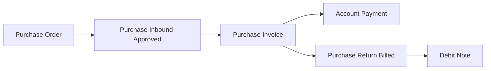
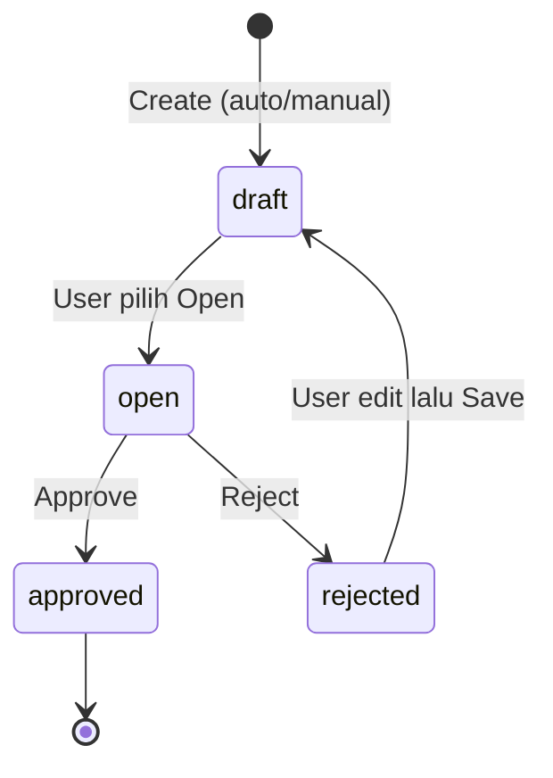
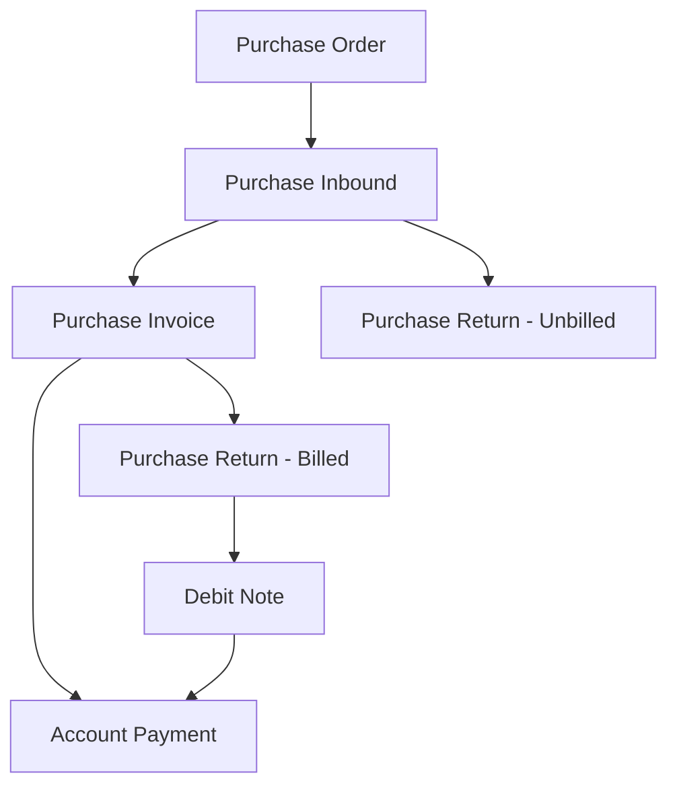

# Purchase Invoice — Source of Truth

## 1. Ringkasan Eksekutif

Purchase Invoice (PI) adalah dokumen pengakuan **Account Payable** ke supplier atas barang yang sudah diterima (Purchase Inbound approved). Value transaksi PI bersumber utama dari Purchase Order, tapi eligible to invoice hanya barang yang sudah punya Purchase Inbound approved. PI menjadi trigger pengakuan PPN Masukan dan biaya/diskon tambahan dari PO, lalu menjadi dasar pelunasan di Account Payment. Audience utama: Finance/AP.



---

## 2. Prasyarat

| Prasyarat | Sumber | Catatan |
|---|---|---|
| Purchase Order (approved) | Menu Purchase Order | Sumber SKU, harga, tax, additional cost/disc |
| Purchase Inbound (approved) | Menu Purchase Inbound | SKU eligible to invoice hanya dari inbound yang sudah approved (barang datang) |
| Supplier | Master General Company | Dropdown supplier di header di-filter dari supplier yang punya referensi inbound status apapun (termasuk draft) — lihat catatan quirk di Section 12 |
| Product COA (Unbilled Goods, Tax, AP) | Product COA Group / General Company Setting | Wajib lengkap sebelum approve; kalau kosong, approve gagal |

---

## 3. Siklus Status



| Status | Kondisi Transisi | Editable? | Tombol yang Muncul |
|---|---|---|---|
| **Draft** | Default saat create; juga hasil dari Rejected yang di-edit lalu Save | Ya | Save & Next / Save All, Delete |
| **Open** | User pilih manual, syarat minimum agar bisa Approve | Ya | Save All, Approve, Reject, Delete |
| **Rejected** | Approver klik Reject saat status Open | Ya — begitu user edit lalu Save, status otomatis balik ke Draft | Save All, Delete |
| **Approved** | Approver klik Approve; jurnal terbit | Tidak | Print, Show only |

Catatan penting: **tidak ada status Void, Processed, atau Closed** pada implementasi saat ini. Siklus transaksi berhenti di Approved. Detail lihat Section 9.1 Pending Items.

---

## 4. Datalist

| Kolom | Visible Default | Sumber Data | Keterangan |
|---|---|---|---|
| ID | False | Internal | — |
| Trx Date | False | Header | — |
| Trx Code \| Trx Date | True | Header | Kode auto prefix `PI-` |
| Due Date | True | Header | Manual, lihat Section 9.1 |
| Supplier | True | Header | — |
| Supplier's Ref | True | Header | Referensi faktur/dokumen supplier |
| Desc | True | Header | — |
| Trx Ref | True | Detail (agregat) | Nomor Purchase Inbound yang direferensikan; kalau multi, dipisah koma; clickable, redirect ke halaman show Purchase Inbound (kalau user tidak punya akses, redirect ke halaman unauthorized/not found) |
| Local Curr | False | Header | Currency primary company |
| Curr | True | Header | Currency PI |
| Exchange | True | Header | — |
| Net Purchase Invoice | True | Perhitungan (Section 6) | — |
| Trx Status | True | Header | Draft / Open / Rejected / Approved |
| Data Owner | False | Internal | — |
| Created by \| Created at | True | Audit | — |
| Action | True | — | Edit/Show, Approve/Reject, Delete (lihat aturan di bawah) |

**Fitur datalist:** Global Search, Advanced Filter, Show Deleted Data, Column Show/Hide, Advanced Export (with detail / without detail — keduanya mengikuti data yang sudah di-filter user).

**Action rules:**
- Edit/Show: Edit selama unapproved; hanya Show kalau sudah Approved.
- Approve/Reject: hanya muncul kalau status Open.
- Delete: hanya muncul kalau unapproved.

**Button Create — UX auto-save flow:**
- Transaction Date default now; Currency default primary; Exchange Rate default 1 (disabled kalau currency primary, enabled kalau foreign, tetap default 1).
- Supplier auto-fill dari transaksi PI terakhir yang disimpan user. Kalau user belum pernah punya transaksi PI sama sekali, proses autosave gagal dan user wajib isi field wajib (termasuk Supplier) secara manual dulu.

---

## 5. Form & Field

### 5.1 Basic Information

| Field | Wajib? | Default | Sumber Opsi | Validasi/Catatan |
|---|---|---|---|---|
| Transaction Code | Ya | Auto | System, prefix `PI-` | Unique per company |
| Transaction Date | Ya | Now | — | — |
| Due Date | Tidak | Null | — | Manual, belum auto dari termin pembayaran supplier (Section 9.1) |
| Currency | Ya | Primary/local | Master Currency | — |
| Exchange Rate | Ya | 1 | — | Disabled kalau currency primary; enabled + editable kalau foreign |
| Supplier | Ya | — | Master General Company (recognized as supplier, punya referensi inbound status apapun) | Lihat quirk Section 12 |
| Supplier's Reference | Tidak | Null | — | — |
| Description | Tidak | Null | — | — |
| Term and Condition | Tidak | Null | — | — |
| Attachment | Tidak | — | — | Upload dokumen pendukung internal (mis. invoice fisik supplier) |

**Validasi:** Basic Information tidak bisa diedit kalau transaksi sudah punya detail item.

### 5.2 Purchase Invoice Detail

Diisi via modal **Inbound Transaction**, menampilkan SKU dari Purchase Order yang sudah Purchase Inbound approved.

**Kolom modal:** ID, Inbound Code, PO Code | PO Date, Product Category, SKU, Parent Product (semua di atas hidden default), System Product SKU | Name, PO Qty, Inbound Qty, Inbound Desc (hidden), Unit Price, Currency (hidden), Exchange Rate (hidden), Disc (hidden), DPP, VAT, Total Price, **Invoice Status** (Prepared / Processed), **Return Status** (Prepared / Processed), Received By | Received Date, Action.

**Aksi insert:**
- **Single Use**: klik baris → modal input Quantity to Invoice (default = seluruh outstanding qty, editable, tidak boleh melebihi outstanding).
- **Bulk Use**: centang banyak baris → insert massal, qty default = seluruh outstanding qty per baris.
- Kalau outstanding qty baris sudah 0 tapi masih ada nilai di kolom Prepared (invoice atau return), Action berubah jadi teks **"Already Prepared"**. Baris hilang total dari modal begitu semuanya masuk Processed.

**Formula outstanding:**
```
Outstanding Qty to Invoice = Inbound Qty
  − (Invoice Prepared Qty + Invoice Processed Qty)
  − (Return Prepared Qty + Return Processed Qty)
```
Perhitungan validasi selalu di base unit; tampilan mengikuti primary unit. Konversi antar unit (contoh 1 Box = 10 Pieces) tidak mengubah hasil validasi qty.

**Kolom detail grid setelah insert:** ID, Created At, Inbound Code, Name, Product Category (hidden default), PO Code | PO Date, SKU | Name, Qty, Unit, Unit Price, Discount, DPP, VAT, PO Currency (hidden), PO Exchange Rate (hidden), PO Total, Invoice Unit Price (hidden), Invoice Total Before Tax (hidden), **Invoice Total**, **Exchange Gain**, Description (hidden), Data Owner (hidden), Action (delete saja).

### 5.3 Additional Cost & Additional Discount

| Field | Wajib? | Default | Sumber Opsi | Catatan |
|---|---|---|---|---|
| Select Cost/Disc | Ya | — | Master Other Cost/Disc (active) ATAU Other Cost/Disc yang di-state pada PO | Kalau dari PO, otomatis tampil nomor PO-nya |
| Nominal | Ya | Dari master/PO | — | Disabled/non-editable kalau sumbernya PO |
| Description | Tidak | — | — | — |

**Perilaku insert dari PO:** begitu SKU dari suatu PO di-insert ke detail PI, **seluruh** Other Cost/Discount PO tersebut otomatis ter-select masuk ke datatable Additional Cost/Disc secara default. User yang manual remove baris yang tidak ingin ditagih sekarang (partial invoicing per baris cost, bukan cuma per SKU).

**Tabel setelah insert:** Cost/Disc Name, **COA** (editable selama unapproved; opsi dari Master COA yang leaf/bukan parent dan status active, **tanpa** batasan class — user harus hati-hati karena berdampak langsung ke jurnal), PO Ref (tanda "-" kalau bukan dari PO), Description, Amount, **Exchange Diff** (hanya muncul kalau cost/disc dari PO dan currency PO berbeda dari PI).

### 5.4 Totals

| Baris | Sumber |
|---|---|
| Total Products | Σ Invoice Total tiap baris detail |
| Disc Products | Σ discount tiap baris detail |
| Total VAT | Σ VAT tiap baris detail |
| Total Additional Cost | Σ Additional Cost |
| Total Additional Disc | Σ Additional Discount |
| **Net Purchase Invoice** (currency PI) | Total Products − Disc Products + Total VAT + Total Additional Cost − Total Additional Disc |
| Net Purchase Invoice (IDR) | Net Purchase Invoice × Exchange Rate header — statis konversi ke local currency |

Catatan: kalau ada baris dengan pajak coefficient true, nilai DPP yang diakumulasi ke Total Products memakai DPP versi coefficient (lebih kecil dari DPP sebenarnya) — supaya total akhir tetap sesuai efektif tarif PPN yang berlaku (12% dikenakan sebagai 11%). Ini bukan salah hitung.

### 5.5 Approval & Audit Log

Section Approval mencatat log approve (kapan, oleh siapa). Section Audit Log mencatat seluruh perubahan data pada transaksi PI.

---

## 6. How It Works

### 6.1 Partial invoicing per SKU per PO

Contoh: PO-001 (PT ABC), 05 Juli 2026 — SKU001 100 pcs, SKU002 200 pcs. Inbound 10 Juli 2026 hanya SKU001 50 pcs, SKU002 100 pcs. Maka eligible to invoice per 11 Juli 2026: SKU001 max 50 pcs, SKU002 max 100 pcs.

Kalau user bikin PI dengan SKU001 30 pcs, qty ini masuk kolom **Prepared** (karena PI masih belum approved). Begitu PI di-approve, qty berpindah dari Prepared ke **Processed**. Untuk PI berikutnya, SKU001 di PO-001 ini sisa outstanding maksimal tinggal 20 pcs.

### 6.2 Konversi multi-unit

Validasi qty selalu dihitung di base unit meski tampilan pakai unit lain. Contoh: 1 Box = 10 Pieces (pieces = primary & base unit). PO dalam pieces 100, inbound dalam BOX sebanyak 10 (setara 100 pieces). Kalau user input qty to invoice 2 Box, prepared-nya tercatat 20 pieces, dan outstanding tersisa 80 pieces (setara 8 Box).

### 6.3 Currency lock — satu rule, dua mode

Berlaku sama untuk SKU detail maupun Additional Cost/Disc: **tidak boleh ada 2 foreign currency berbeda dalam 1 PI**, local currency selalu boleh nyampur.

| Header PI | Mekanisme |
|---|---|
| Local (IDR) | Boleh insert dari PO/cost local (IDR) bebas. Begitu foreign currency pertama (misal USD) masuk, currency asing lain (misal EUR) langsung ditolak — hanya boleh IDR atau USD selanjutnya. |
| Foreign (misal USD) | Lock statis dari awal sesuai header. Hanya boleh insert dari PO/cost local (IDR) atau yang currency-nya sama persis dengan header (USD). |

### 6.4 Additional Cost/Disc dari PO — partial & auto-select

PO bisa punya beberapa baris Other Cost/Disc dengan nominal berbeda. Ketika SKU dari PO tersebut di-insert ke detail PI, seluruh baris Other Cost/Disc PO otomatis ikut ter-select. User bebas remove baris yang tidak mau ditagih sekarang, sisanya bisa dimasukkan di PI berikutnya — selama masih ada outstanding SKU dari PO/supplier yang sama untuk memicu munculnya opsi tersebut lagi. Lihat risiko terkait di Section 9 (GAP-PI-02).

### 6.5 Jurnal saat Approve

Approve menerbitkan jurnal: Debit Unbilled Goods (membalik jurnal kredit dari Inbound) + Debit Tax COA (kalau ada perhitungan pajak di PO yang di-invoice-kan, COA-nya ikut setting tax pada PO) + Debit Additional Cost (COA sesuai baris) — Kredit Additional Discount (COA sesuai baris) + Kredit Account Payable (total tagihan). Posisi COA pajak di Debit karena menambah nilai utang (Kredit).

Contoh angka: Total Products USD 8.738,74; Disc Products USD 0,00; Total VAT USD 961,26; Total Additional Cost USD 144,50; Total Additional Disc USD 86,00 → Net Purchase Invoice USD 9.758,50 (dikonversi ke IDR 97.585.000 kalau kurs 10.000).

### 6.6 Exchange Gain/Loss

Selisih kurs dihitung dari PO Total (local currency) dikurangi Invoice Total (local currency). Hasil minus = laba kurs (COA Exchange Gain di Kredit); hasil plus = rugi kurs (di Debit). Berlaku di level baris detail dan di level baris Additional Cost/Disc (kalau cost/disc-nya bersumber dari PO dengan currency berbeda).

### 6.7 Return setelah PI Approved

Kalau ada retur setelah PI approved, prosesnya lewat Purchase Return tipe **Billed** — bukan tipe Unbilled. Tipe Billed tidak memotong Account Payable secara langsung, tapi menerbitkan transaksi turunan **Debit Note**, yaitu saldo ke supplier yang bisa dipakai untuk memotong tagihan supplier berikutnya.

---

## 7. Validasi

| # | Kondisi | Behavior |
|---|---|---|
| 1 | Basic Information diedit setelah ada detail | Ditolak — field header locked |
| 2 | Insert SKU/Cost/Disc dengan currency asing kedua yang berbeda dari currency asing pertama di PI ini | Ditolak, error jelas ke user (lihat Section 6.3) |
| 3 | Qty to Invoice melebihi Outstanding Qty | Ditolak |
| 4 | Semua qty inbound sudah full processed di Invoice | Purchase Return tipe Unbilled tidak bisa dipakai atas SKU inbound ini |
| 5 | Semua qty inbound sudah full processed di Return tipe Unbilled | SKU inbound ini tidak bisa lagi diproses di Purchase Invoice |
| 6 | Approve tanpa minimal 1 detail, atau Product COA (Unbilled Goods/Tax/AP) belum lengkap | Approve gagal |
| 7 | Amount Additional Cost/Disc yang sumbernya dari PO | Field non-editable/disabled — secara struktural tidak mungkin over-bill |

---

## 8. Relasi Menu Lain



| Menu | Peran dalam Relasi |
|---|---|
| Purchase Order | Sumber SKU, harga, tax, Additional Cost/Disc |
| Purchase Inbound | Sumber SKU eligible (harus approved); qty Prepared/Processed bridge |
| Account Payment | Downstream pelunasan; PI approved masuk Outstanding Invoice |
| Purchase Return (Billed) | Retur setelah PI approved; hasilkan Debit Note, tidak potong AP langsung |
| Purchase Return (Unbilled) | Mutually exclusive dengan qty yang sudah full invoiced |
| Master Other Cost/Discount | Sumber label & default COA untuk Additional Cost/Disc |
| Chart of Account | Sumber opsi COA override di Additional Cost/Disc |

---

## 9. Gap Registry

| ID | Deskripsi | Dampak | Status |
|---|---|---|---|
| GAP-PI-01 | Print PI dulu memuat template Purchase Order, bukan template PI | Operator tidak bisa cetak dokumen resmi PI | Resolved |
| GAP-PI-02 | Additional Cost/Disc dari PO berpotensi permanen tidak bisa ditagih kalau SKU sumbernya sudah full invoiced/return duluan sebelum semua baris cost dipilih — trigger munculnya opsi ini terikat pada outstanding SKU dari PO yang sama | Sebagian nilai Other Cost/Disc PO bisa "hilang" secara operasional | Open — sudah dikomunikasikan ke end user apa adanya; perlu verifikasi mekanisme detail ke codebase `[VERIFY: CODEBASE]` |
| GAP-PI-03 | Filter Supplier di header (status inbound apapun) tidak konsisten dengan filter SKU eligibility (harus approved) — modal Inbound Transaction jadi kosong 100% kalau user pilih supplier yang inbound-nya masih draft | Membingungkan operator saat pertama pakai | Resolved (Accepted — dikonfirmasi oleh lead tech, tidak akan diperbaiki) |

### 9.1 Pending Items — Belum Diputuskan / Belum Matang

Item di bawah ini **bukan gap teknis dari implementasi yang sudah ada**, melainkan fitur yang secara requirement maupun codebase memang belum matang. User tidak bisa memakai fitur ini sama sekali walau ada sisa pekerjaan di codebase.

| Item | Status Saat Ini |
|---|---|
| **Void** | Belum matang total, baik dari sisi requirement maupun codebase. Siklus status transaksi PI saat ini berhenti di Approved — tidak ada jalur void yang bisa dipakai user. |
| **Due Date otomatis dari Term of Payment Supplier** | Belum berjalan — Due Date saat ini murni manual input. |
| **Status Processed / Closed** | Idealnya ada untuk konsistensi dengan modul lain, dan faktor penentunya terkait relasi ke Account Payment. Saat ini kedua status ini belum ada. |

---

## 10. FAQ

**Q: Kenapa supplier saya tidak muncul di dropdown saat create PI?**
A: Supplier hanya muncul kalau sudah punya referensi transaksi Purchase Inbound (status apapun, termasuk draft).

**Q: Saya sudah pilih supplier tapi modal Inbound Transaction kosong, kenapa?**
A: Supplier bisa muncul di dropdown walau inbound-nya masih draft, tapi SKU baru tampil di modal kalau inbound-nya sudah Approved. Ini perilaku yang sudah dikonfirmasi, bukan bug.

**Q: Kenapa saya tidak bisa pakai 2 mata uang asing berbeda dalam 1 PI?**
A: Aturan sistem — maksimal 1 foreign currency plus local currency per PI, supaya perhitungan selisih kurs tidak kacau.

**Q: Kenapa sebagian Other Cost dari PO saya tidak muncul lagi di PI berikutnya?**
A: Kemungkinan besar karena SKU dari PO tersebut sudah full ke-invoice atau ke-return duluan. Lihat GAP-PI-02.

**Q: Bisa membatalkan (void) PI yang sudah approved?**
A: Belum bisa. Fitur ini belum tersedia. Kalau approve keliru, koordinasikan manual dengan tim terkait.

**Q: PPN dijurnal kapan?**
A: Saat PI di-approve, bukan saat barang diterima (inbound).

**Q: Ada retur setelah PI sudah approved, prosesnya gimana?**
A: Pakai Purchase Return tipe Billed. Hasilnya jadi Debit Note yang bisa dipakai memotong tagihan supplier berikutnya — bukan langsung memotong Account Payable.

**Q: Kenapa angka Total Products di summary kelihatan lebih kecil dari hitungan manual saya?**
A: Kalau ada baris pajak dengan setting coefficient true, DPP yang diakumulasi memang versi coefficient (lebih kecil), supaya total akhir sesuai aturan PPN yang berlaku.

---

## 11. Changelog

| Tanggal | Versi | Perubahan |
|---|---|---|
| 2026-07-11 | 2.2 | Baseline sebelumnya (dinyatakan sebagian tidak akurat — lihat catatan v3.0) |
| 2026-07-15 | 3.0 | Rewrite total hasil klarifikasi end-to-end QA Lead. Void dipindah dari Gap Registry ke Pending Items (sebelumnya salah didokumentasikan sebagai fitur existing dengan gap teknis — ternyata fitur ini memang belum ada/matang sama sekali). Unifikasi rule currency (1 rule, berlaku SKU + Additional Cost/Disc). Tambah detail partial Additional Cost/Disc dari PO + risiko stuck (GAP-PI-02). Update behavior return-setelah-invoice ke tipe Billed + Debit Note. Print PI dikonfirmasi sudah fix. Tambah detail konversi multi-unit dan DPP coefficient-true. |

---

## 12. Knowledge Base Hints (untuk operator)

**Istilah teknis → padanan awam:**

| Istilah Teknis | Padanan Awam |
|---|---|
| Unbilled Goods | Utang sementara ke supplier sebelum ada tagihan resmi |
| DPP | Harga barang sebelum pajak |
| PPN Masukan / VAT In | Pajak dari pembelian yang bisa dikreditkan |
| Prepared (qty) | Qty yang sedang "dipesan" oleh transaksi yang belum final |
| Processed (qty) | Qty yang sudah final/disetujui |
| Outstanding Qty to Invoice | Sisa qty barang yang belum ditagih |
| Exchange Gain/Loss | Untung/rugi karena selisih kurs |
| COA | Kode akun di buku besar |
| Debit Note | Saldo ke supplier yang bisa dipakai memotong tagihan lain |

**Skenario troubleshooting tambahan (di luar FAQ):**
- Approve gagal tanpa pesan jelas → cek dulu apakah Product COA (Unbilled Goods/Tax/AP) sudah lengkap di setting.
- Nominal Additional Cost tidak bisa diubah → wajar kalau sumbernya dari PO, memang locked by design.

**Field yang tidak relevan operator (skip di KB):** ID, Data Owner, Local Curr, PO Currency/Exchange Rate (hidden), Invoice Unit Price, Invoice Total Before Tax — semua ini snapshot/internal reference, cukup dijelaskan sebagai kolom teknis kalau operator tanya spesifik.

---

## 13. Technical Hints (untuk developer)

**Area codebase yang perlu didokumentasikan Cursor:** controller header PI, controller detail item, controller Additional Cost & Additional Discount, service perhitungan harga/grand total, service jurnal approve, service/query outstanding inbound, endpoint select2 COA (filter leaf + active, tanpa filter class), komponen frontend Form + modal Inbound Transaction + grid Other Cost/Discount.

**Invariants:**
- `prepared_to_invoice_qty + processed_to_invoice_qty + prepared_to_return_qty + processed_to_return_qty ≤ qty_inbound_base_unit` per baris inbound detail (update dari versi sebelumnya yang belum menghitung qty return)
- `Σ Debit jurnal = Σ Kredit jurnal` saat approve
- Additional Cost/Disc yang currency-nya foreign tidak boleh berbeda dengan foreign currency lain yang sudah dipakai di PI yang sama
- Amount Additional Cost/Disc immutable kalau sumbernya dari PO; hanya COA dan Description yang editable sebelum approve
- `expense_coa_id` harus leaf (bukan parent), active, dan owned_by sama dengan company PI saat approve

**Failure modes:**
- Approve gagal total (rollback) kalau Product COA belum lengkap atau fiscal period tertutup.
- Additional Cost/Disc dari PO berpotensi tidak pernah muncul lagi kalau SKU sumbernya sudah fully processed duluan di Invoice/Return — perlu test case khusus skenario ini (GAP-PI-02).

**Data lifecycle lintas dokumen:**
- `prepared_to_invoice_qty` / `processed_to_invoice_qty` — bridging Purchase Inbound ke Purchase Invoice.
- Flag prepared/processed pada Other Cost/Disc PO — bridging Purchase Order ke Purchase Invoice.
- `grand_total_after_vat` / `processed_to_payment_amount` — bridging Purchase Invoice ke Account Payment.
- Purchase Return tipe Billed menerbitkan Debit Note — bridging Purchase Return ke Debit Note ke Account Payment.

---

## 14. Referensi Struktur untuk Cursor

```
Section 1-11 → material utama untuk requirement.md
Section 5, 6, 7, 10 → adaptasi ke knowledge-base.md dengan tone awam (lihat Section 12 KB Hints)
Section 13 Technical Hints → seed untuk technical.md, dilengkapi Cursor dari codebase
Frontmatter YAML di atas → copy ke 3 file utama, sinkronkan version + last_updated
Golden reference tone & struktur: docs/qa-docs/accounting-supplier-invoice/
```

**Catatan khusus untuk Cursor:** dokumen 3 file sebelumnya (v2.2) mengandung dokumentasi Void yang **tidak akurat** — jangan dipakai sebagai referensi migrasi. Perlakukan seluruh konten Void di file lama sebagai deprecated.
